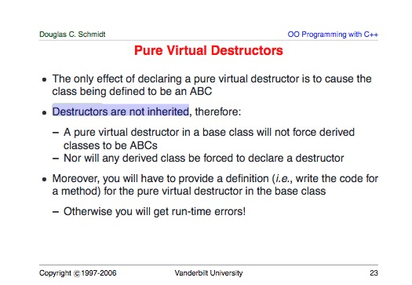
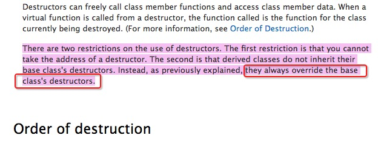

# 物件模式(1)

<article class="post" itemscope="" itemtype="http://schema.org/BlogPosting">

  <header class="post-header">
    <h1 class="post-title" itemprop="name headline">C++ 對象模型</h1>
    
<time datetime="2016-08-07T03:59:00+00:00" itemprop="datePublished">Aug 7, 2016</time>

  </header>

  

    
<em>這是C++語言的一系列文章，內容取自於網易微專業《C++開發工程師（升級版）》。</em>

<em>本文是聽了侯捷老師關於“C++對象模型”的課程以後，總結而成的。</em>
<em>課程中講到了範型編程和麵向對象編程兩種模式，因此本文的主題是 template。</em>
<em>包括類模板、函數模板、成員模板、模板特化和偏特化、可變模板參數、模板嵌套等。</em>

<em>說到面向對象，本文的另一個主題是C++底層的對象模型，包括this指針、虛指針vptr、虛表vtable、虛函數、多態等。</em>

<h2 id="c">第三週：C++對象模型</h2>

<h2 id="part-1class-">Part 1：class 的高級用法</h2>

這一部分，我們介紹一些C++ 類的高級用法：conversion function、non-explicit-one-argument constructor、pointer-like
classes、function-like classes。

<h3 id="conversion-function-">1.1 conversion function (轉換函數)</h3>

轉換函數 可以將對象 默認轉換為另一種類型，方便程序的調用。

其作用與只接收一個參數的構造函數（不使用 explicit修飾符）作用正好相反。關於構造函數的坑參考<a href="http://tipsandtricks.runicsoft.com/Cpp/Explicit.html" title="explicit">這篇文章</a>。
下一個小結講解的就是 non-explicit-one-argument constructor。

廢話少說，先上個例子（注意觀察它的使用方法）：

<pre class="highlight"><code>// Fraction 類
class Fraction {
public:
  Fraction(int num, int den=1): m_numerator(num), m_denominator(den){};
  operator double() const {return (double)m_numerator/m_denominator; };
  private:
    int m_numerator;
    int m_denominator;
};

// main 函數（使用 Fraction 的轉換函數 operator double() const)
int main(int argc, char * argv[]) {
  Fraction f(3, 5);
  double d = 4.0 + f;      // f 調用 operator double() 轉換為一個 double 值 
  std::cout &lt;&lt; "d = " &lt;&lt; d &lt;&lt; std::endl;
}
</code></pre>

編譯器認為必要時，將對象轉換為某種特定的類型。轉換函數的三個特徵：

<ol>
  <li>轉換函數 的聲明中不需要寫返回類型 (因為返回類型和函數名稱相同)</li>
  <li>函數名必須是 operator xxx</li>
  <li>必須使用 const 修飾符，因為轉換函數不會修改 this 指針</li>
</ol>

<h3 id="non-explicit-one-argument-constructor">1.2 non-explicit-one-argument constructor</h3>

non-explicit-one-argument constructor 有下面兩個語法特徵：

<ol>
  <li>這類構造函數只接收一個參數</li>
  <li>沒有使用 explicit 修飾符 （默認 implicit）</li>
</ol>

該函數在編譯器認為需要的時候，將參數類型的變量轉換成該類型的對象。具體看下面代碼：

<pre class="highlight"><code>// Fraction 類
class Fraction {
  public:
    Fraction(int num, int den=1): m_numerator(num), m_denominator(den){};
    Fraction operator+(const Fraction&amp; f) {
      return Fraction(m_denominator * f.m_numerator + m_numerator * f.m_denominator, m_denominator * f.m_denominator); 
    };

    friend ostream&amp; operator &lt;&lt; (ostream&amp; os, const Fraction&amp; f);
  private:
    int m_numerator;
    int m_denominator;
};

ostream&amp; operator&lt;&lt;(ostream&amp; os, const Fraction&amp; f) {
  return os &lt;&lt; f.m_numerator &lt;&lt; "/" &lt;&lt; f.m_denominator;
}

// main 函數（注意變量 d 的類型）
int main(int argc, char * argv[]) {
  Fraction f(3, 5);
  Fraction d =  f + 4;  // here 4 is converted to a Fraction(4, 1), 4+f is not allowed
  std::cout &lt;&lt; "d = " &lt;&lt; d &lt;&lt; std::endl;
}
</code></pre>

使用 explicit 修飾構造函數以後，上面的默認轉換就會失敗。

<h3 id="pointer-like-class-">1.3  pointer-like class (智能指針)</h3>

像指針的類，是指該 class 的對象表現出來像一個指針。這麼做的目的是實現一個比指針更強大的結構。
標準庫內值了一些指針類，如 std::shared_ptr, std::weak_ptr, std::unique_ptr，具體參考<a href="http://www.cplusplus.com/reference/memory/" title="memory">cplusplus</a>

<h4 id="sharedptr-">1.3.1 shared_ptr 智能指針</h4>

實現一個智能指針類，則必須重載 (override) 兩個成員函數： operator*() 和 operator-&gt;()。

shared_ptr 代碼的抽離出來一部分如下：

<pre class="highlight"><code>// shared_ptr 模板類的定義
template &lt;typename T&gt;
class shared_ptr{
public:
  T&amp; operator*() const { // 解引用
    return *px;
  }
  T* operator-&gt;() const { // 取指針，這個方法有點詭異
    return px;
  }
  
  shared_ptr(T *p): px(p) {}
private:
  T* px;
  long* pn;
};

// Foo 類
struct Foo {
  // 省略其它部分，關注 method 
  void method() { //... }
};

// 使用 shared_ptr
int main() {
  shared_ptr&lt;Foo&gt; sp(new Foo);

  Foo f(*sp);  // 使用 解引用 操作符 *
  sp-&gt;method();  // 使用 操作符 -&gt;  ( 等價於 px-&gt;method() )
}
</code></pre>

<em>關於 operator -&gt; ，從語法角度上來說，-&gt; 是可重生的，所以下面 main函數中才可以這樣使用。</em>

很容易發現，除了構造，shared_ptr 在使用上與裸指針幾乎沒有差別，但是不需要手動釋放內存。
當然，仿指針類的能力遠不止於自動釋放內存，還有很多，這裡我們看看標準庫中 std::shared_ptr的附加功能。

std::shared_ptr 不僅提供了有限的垃圾回收特性，還提供了內存擁有權的管理 (ownership)，點擊<a href="http://www.cplusplus.com/reference/memory/shared_ptr/?kw=shared_ptr" title="shared_ptr">這裡查看詳情</a>

<h4 id="iterator-">1.3.2 iterator 迭代器</h4>

pointer-like classes 在迭代器中也有廣泛的應用。
標準庫中所有的容器(std::vector等) 都有迭代器。換句話說，標準庫的迭代器也實現了 operator* 和 operator-&gt; 方法。

每個迭代器對象 指向 一個容器變量，但同時實現了下面幾個方法：

<ol>
  <li>operator==</li>
  <li>operator!=</li>
  <li>operator++</li>
  <li>operator–</li>
</ol>

關於 迭代器中 operator* 和 operator-&gt; 的實現，也相當值得考究：

<pre class="highlight"><code>// 忽略上下文

reference operator*() const {
  return (*node).data;
}

pointer operator-&gt;() const { // 藉助於 operator* 實現
  return &amp;(operator*());
}
</code></pre>

你可以像下面這樣使用這兩個方法：

<pre class="highlight"><code>list&lt;Foo&gt;::iterator ite;

//... 省略一部分代碼...

*ite;   // 獲取 Foo 對象的引用

ite-&gt;method();  
// 意思是 調用 Foo::method()
// 相當於 (*ite).method();
// 相當於 (&amp;(*ite))-&gt;method();

</code></pre>

<h3 id="function-like-classes-">1.4 function-like classes (仿函數)</h3>

<h4 id="section">1.4.1 什麼是仿函數？</h4>

仿函數其實不是函數，是一個類，但是它的行為和函數類似。在實現的層面上，一個類一旦定義了 operator() 方法，就可以稱之為仿函數。

C++標準庫內置了很多<a href="http://www.cplusplus.com/reference/functional/," title="function">仿函數模板</a>。
我們先用 std::less 和 std::less_equal 為例，對仿函數的用法有一個直觀的認識：

<pre class="highlight"><code>// less example (http://www.cplusplus.com/reference/functional/less/)
// compile: g++ -o main main.cpp -lm
#include &lt;iostream&gt;     // std::cout
#include &lt;functional&gt;   // std::less
#include &lt;algorithm&gt;    // std::sort, std::includes

int main () {
  // 自己寫的簡單例子, 表達式 "std::less&lt;int&gt;()" 創建了一個臨時對象  
  int a = 5, b = 4;
  std::cout &lt;&lt; "std::less&lt;int&gt;()(" &lt;&lt; a &lt;&lt; ", " &lt;&lt; b &lt;&lt; "): " &lt;&lt; std::less&lt;int&gt;()(a, b) &lt;&lt; std::endl;
  std::cout &lt;&lt; "std::less&lt;int&gt;()(" &lt;&lt; b &lt;&lt; ", " &lt;&lt; a &lt;&lt; "): " &lt;&lt; std::less&lt;int&gt;()(b, a) &lt;&lt; std::endl;

  std::cout &lt;&lt; "std::less_equal&lt;int&gt;()(" &lt;&lt; a &lt;&lt; ", " &lt;&lt; b &lt;&lt; "): " &lt;&lt; std::less_equal&lt;int&gt;()(a, b) &lt;&lt; std::endl;
  std::cout &lt;&lt; "std::less_equal&lt;int&gt;()(" &lt;&lt; b &lt;&lt; ", " &lt;&lt; a &lt;&lt; "): " &lt;&lt; std::less_equal&lt;int&gt;()(b, a) &lt;&lt; std::endl;
  std::cout &lt;&lt; "std::less_equal&lt;int&gt;()(" &lt;&lt; a &lt;&lt; ", " &lt;&lt; a &lt;&lt; "): " &lt;&lt; std::less_equal&lt;int&gt;()(a, a) &lt;&lt; std::endl;

  // 網站上帶的高級例子
  int foo[]={10,20,5,15,25};
  int bar[]={15,10,20};
  std::sort (foo, foo+5, std::less&lt;int&gt;());  // 5 10 15 20 25
  std::sort (bar, bar+3, std::less&lt;int&gt;());  //   10 15 20
  if (std::includes (foo, foo+5, bar, bar+3, std::less&lt;int&gt;()))
    std::cout &lt;&lt; "foo includes bar.\n";
  return 0;
}
</code></pre>

<h4 id="section-1">1.4.2 仿函數的實現</h4>

仿函數實際上是一個 類 (class)，這個類實現了 operator() 方法。
下面這個是 C++11 中 std::less 的實現：

<pre class="highlight"><code>// C++11 中的實現（侯捷老師講的是 C++98中的實現）
template &lt;class T&gt; struct less {
  bool operator() (const T&amp; x, const T&amp; y) const {return x&lt;y;}
  typedef T first_argument_type;
  typedef T second_argument_type;
  typedef bool result_type;
};
</code></pre>

注意：std::less 是類模板。在課程中，侯捷老師提到了 unary_function 和 binary_function，這兩個類定義了參數類型，C++11中已經不再
使用，而是內置到 std::less 中，具體參考<a href="http://www.cplusplus.com/reference/functional/less/" title="less">這裡</a>

<h4 id="namespace">1.5 命名空間 (namespace)</h4>

命名空間用於 模塊分離和解耦。為了更好地說明一些細節，這裡使用從 <a href="https://msdn.microsoft.com/en-us/library/5cb46ksf.aspx" title="msdn">msdn</a> 摘取一段話：

<code class="highlighter-rouge">A namespace is a declarative region that provides a scope to the identifiers (the names of types, functions, variables, etc) inside it.</code>

<code class="highlighter-rouge">Namespaces are used to organize code into logical groups and to prevent name collisions that can occur especially when your code base includes multiple libraries.</code>

<code class="highlighter-rouge">All identifiers at namespace scope are visible to one another without qualification.</code>

<code class="highlighter-rouge">Identifiers outside the namespace can access the members by using the fully qualified name for each identifier, for example std::vector&lt;std::string&gt; vec;, or else by a using Declaration for a single identifier (using std::string), or a using Directive (C++) for all the identifiers in the namespace (using namespace std;).</code>

<code class="highlighter-rouge">Code in header files should always use the fully qualified namespace name.</code>

<h2 id="part-2--template">Part 2 模板 (template)</h2>

<h3 id="class-template-">2.1 class template (類模板)</h3>

前面幾篇博客對類模板有所涉及，這裡不再贅述。C++標準庫的容器都是類模板的範例，比如：

<ol>
  <li><a href="http://www.cplusplus.com/reference/vector/" title="vector">std::vector</a></li>
  <li><a href="http://www.cplusplus.com/reference/stack/" title="stack">std::stack</a></li>
  <li><a href="http://www.cplusplus.com/reference/stack/" title="array">std::array</a></li>
  <li><a href="http://www.cplusplus.com/reference/map/" title="map">std::map</a></li>
  <li><a href="http://www.cplusplus.com/reference/," title="etc">and so on</a></li>
</ol>

<h3 id="function-template-">2.2 function template (函數模板)</h3>

對於 function template ，前面幾篇博客也都有所涉及。C++標準庫 algorithm 分類下有將近 90 個函數模板，
這裡我列出幾個：

<ol>
  <li><a href="http://www.cplusplus.com/reference/algorithm/min/" title="min">std::min</a></li>
  <li><a href="http://www.cplusplus.com/reference/algorithm/max/" title="max">std::max</a></li>
  <li><a href="http://www.cplusplus.com/reference/algorithm/minmax/" title="minmax">std::minmax</a></li>
  <li><a href="http://www.cplusplus.com/reference/algorithm/sort/" title="sort">std::sort</a></li>
  <li><a href="http://www.cplusplus.com/reference/algorithm/copy/" title="copy">std::copy</a></li>
  <li><a href="http://www.cplusplus.com/reference/algorithm/for_each/" title="for_each">std::for_each</a></li>
  <li><a href="http://www.cplusplus.com/reference/algorithm/" title="algorithm">and so on</a></li>
</ol>

下面我們以 std::for_each 為例，看下如何使用函數模板：

<pre class="highlight"><code>// for_each example (來源：http://www.cplusplus.com/reference/algorithm/for_each/)
#include &lt;iostream&gt;     // std::cout
#include &lt;algorithm&gt;    // std::for_each
#include &lt;vector&gt;       // std::vector

void myfunction (int i) {  // function:
  std::cout &lt;&lt; ' ' &lt;&lt; i;
}

struct myclass {           // function object type:
  void operator() (int i) {std::cout &lt;&lt; ' ' &lt;&lt; i;}
} myobject;

int main () {
  std::vector&lt;int&gt; myvector;
  myvector.push_back(10);
  myvector.push_back(20);
  myvector.push_back(30);

  std::cout &lt;&lt; "myvector contains:";
  for_each (myvector.begin(), myvector.end(), myfunction);
  std::cout &lt;&lt; '\n';

  // or:
  std::cout &lt;&lt; "myvector contains:";
  for_each (myvector.begin(), myvector.end(), myobject);
  std::cout &lt;&lt; '\n';

  return 0;
}
</code></pre>

在這個例子中，注意函數 myfunction 和 仿函數 myobject 的用法，think twice about that。

另外，使用函數模板時，不需要指定特化類型，因為編譯器會根據參數進行自動推導。

<h3 id="member-method-">2.3 Member method (成員模板，默認為成員函數模板)</h3>

從使用者的角度來看，成員模板 比 類模板 具有更大的自由度。由於C++強大的繼承機制，成員模板也有一些使用場景。
這裡以 shared_ptr 為例：

<pre class="highlight"><code>// 定義 類模板 shared_ptr
template &lt;typename _Tp&gt;
class shared_ptr : pubic __shared_ptr&lt;_Tp&gt; {
  //... 省略代碼 ...

  template &lt;typename _Tp1&gt;
  explicit shared_ptr(_Tp1* __p) : __shared_ptr&lt;_TP&gt;(__p) {}

  // ... 省略代碼 ...
};

// 使用 shared_ptr 的模板構造函數
// Derived1 類是 Base1 的子類
int main() {
  Base1 *ptr = new Derived1;  // 向上轉型

  shared_ptr&lt;Base1&gt; sptr(new Derived1);  // 支持向上轉型
}
</code></pre>

這個例子中，成員模板允許 shared_ptr 支持接收子類對象的指針，構造一個父類shared_ptr。

<h3 id="specialization-">2.4 specialization (模板特化)</h3>

模板本身是泛化的，允許用戶在使用時進行特化。所謂“特化”，其實是指 在編譯器的展開。
但是模板的設計有時候不能滿足所有特化類型的要求，比如 std::vector 容納 bool 時會有問題，
所有有了 <code class="highlighter-rouge">std::vector&lt;bool&gt;</code> 的特化版本。

<h4 id="section-2">2.4.1 模板偏特化</h4>

模板偏特化 可以分為兩類：

<ol>
  <li>個數上的“偏”</li>
</ol>

例如 <code class="highlighter-rouge">std::vector&lt;int, typename Alloc=.....&gt;</code> 相對於 <code class="highlighter-rouge">std::vector&lt;typename T, typename Alloc=......&gt;</code>

<ol>
  <li>類型上的“偏” (由對象擴展到 指針類型)</li>
</ol>

這裡直接看一個例子：

<pre class="highlight"><code>// 泛化版本
template &lt;typename T&gt;
class C {
  //... 
};

// 擴展到指針的 特化版本
template &lt;typename T&gt;
class C&lt;T*&gt; {
  //...
};

// 使用 特化版本
int main() {
  C&lt;string&gt; obj1;    // 正常的特化版本
  C&lt;string*&gt; obj2;   // 特化的指針版本
}
</code></pre>

<h4 id="section-3">2.4.2 模板模板參數（模板嵌套)</h4>

模板模板參數是指 一個模板作為另一個模板的參數存在。這樣的設計在使用上更為靈活。這裡直接上一個例子：

<pre class="highlight"><code>// 定義一個類模板，它使用一個模板作為模板參數
template &lt;typename T,
  template &lt;typename T&gt;
  class Container
&gt;
class XCls {
private:
  Container&lt;T&gt; c;
public:
  // ...
};

// 定義Lst
template&lt;typename T&gt;
using Lst = list&lt;T, allocator&lt;T&gt; &gt;;     // 注意： Lst 只有一個模板參數，而 list 有兩個模板參數
// 使用該模板
int main() {
  XCls&lt;string, list&gt; mylist1;   // 合法的定義

//XCls&lt;string, Lst&gt; mylist2;    // 不合法，因為 XCls 的第二個模板參數只接受一個參數（有點繞，think about it）
}
</code></pre>

這個模板的靈活性在於，第二個模板參數，你可以使用 std::list, std::stack, std::vector 
等迭代器的特化版本作為參數，也就是說底層可以接入不同的“內存管理方案”（這個詞相對準確）。

<h2 id="part-3c">Part 3：C++語言層面的相關主題</h2>

<h3 id="c-1">3.1 C++標準庫概論</h3>

這裡用一張圖表示

<h3 id="variadic-templates-c11">3.2 variadic templates：模板的可變參數列表 (C++11)</h3>

模板的可變參數列表與 正常的可變參數列表是一樣的，只是語法上有些特殊。
下面是一個 print 的例子：

<pre class="highlight"><code>// 定義 print 函數
void print() {}

template&lt;typename T, typename... Types&gt;
void print(const T&amp; firstArg, const Types&amp;... args) {
  cout &lt;&lt; firstArg &lt;&lt; endl;
  print(args...);
}

// 使用 print 函數
int main() {
  print(7.5, "hello", bitset&lt;16&gt;(377),42);
}
</code></pre>

另外，對於模板參數，C++ 提供了輔助函數，用來獲取可變參數列表的長度，函數簽名為 <code class="highlighter-rouge">size_type sizeof...(args)</code>。

<h3 id="auto-c11">3.3 auto (C++11)</h3>

auto 允許用戶不聲明變量的類型，而是留給編譯器去推導。它是C++11加入的語法糖，可以減少有效代碼量。

關於 auto，更多細節參考 <a href="https://msdn.microsoft.com/en-us/library/dd293667.aspx" title="msdn">msdn</a>

<h3 id="range-based-for-c11">3.4 range-based for (c++11)</h3>

這是C++11 新增加的語法，可以有效減少代碼量，與 auto 配合使用更佳。考慮到是否需要修改數組的值，決定是否採用引用，看代碼：

<pre class="highlight"><code>vector&lt;double&gt; vec;
for (auto elem: vec) {  // 按值傳遞，不會修改數組的值
  cout &lt;&lt; elem &lt;&lt; endl;  
  elem *= 3;   // 即便這樣寫， 也只是修改了一個副本，不會修改 vec 的值。
}

for (auto&amp; elem: vec){  // 按引用傳遞
  elem *= 3;  // 使用引用會修改數組的值
}
</code></pre>

更多參考 <a href="https://msdn.microsoft.com/en-us/library/jj203382.aspx">msdn上的描述</a>。

<h3 id="reference-">3.5 關於 reference (一些引起誤解的地方)</h3>

<h4 id="reference--1">3.5.1 reference 的特徵</h4>

reference的兩個特徵：

<ol>
  <li>reference類型的變量一旦 代表某個變量，就永遠不能代表另一個變量</li>
  <li>reference類型的變量  大小和地址 與 原對象相同 (即 sizeof 和 operator&amp; 的返回值)</li>
</ol>

下面用侯捷老師PPT上的一段代碼來說明：

<pre class="highlight"><code>int main() {
  int x = 0;
  int* p = &amp;x;
  int&amp; r = x;  // r 代表 x，兩者的值都是 0
  int x2 = 5;

  r = x2;      // 這一行賦值的結果是：x 的值也變成了 5
  int&amp; r2 = r; // r2、r 都代表 x，即值都是 5
}
</code></pre>

上面這個例子中，需要注意：

<ol>
  <li>sizeof(x) == sizeof(r)</li>
  <li>&amp;x == &amp;r</li>
</ol>

<h4 id="section-4">3.5.2 應用場景</h4>

reference 通常用在兩個地方：

<ol>
  <li>參數傳遞 (比較快)</li>
  <li>返回類型</li>
</ol>

<h3 id="section-5">3.6 構造和析構 (時間先後)</h3>

本小節主要講解構造和析構 在繼承和組合體系下的運作機制。

<h4 id="section-6">3.6.1 繼承體系中的構造和析構</h4>

構造：由內而外。內是指Base，外指Derived
析構：由外而內。先析構Derived Class，再析構Base Class 的部分

注意：Base Class 的析構函數必須是 virtual 的，否則會報出 undefined behaviors 的錯誤。
下面這段代碼重現了這個錯誤：

<pre class="highlight"><code>// 這段代碼 來源於 stackoverflow ，但是經過了大量修改
// http://stackoverflow.com/questions/461203/when-to-use-virtual-destructors

#include &lt;iostream&gt;

class Node {
public:
    Node() { std::cout &lt;&lt; "Node()" &lt;&lt; std::endl; }
    ~Node() { std::cout &lt;&lt; "~Node()" &lt;&lt; std::endl; }
};

class Base 
{
public:
    Base() { std::cout &lt;&lt; "Base()" &lt;&lt; std::endl; }
    ~Base() { std::cout &lt;&lt; "~Base()" &lt;&lt; std::endl; }
};

class Derived : public Base
{
public:
    Derived()  { std::cout &lt;&lt; "Derived()"  &lt;&lt; std::endl;  m_pNode = new Node(); }
    ~Derived() { std::cout &lt;&lt; "~Derived()" &lt;&lt; std::endl;  delete m_pNode; }

private:
    Node* m_pNode;
};

int main() {
    // 注意：Base的析構函數設置為 virtual
    Base *b = new Derived();
    // 使用 b
    delete b; // 結果是：調用了 Base的構造函數

    std::cout &lt;&lt; "execute complete" &lt;&lt; std::endl;
}

</code></pre>

上面這段代碼打印結果是：

<pre class="highlight"><code>Base()
Derived()
Node()
~Base() // 為什麼只打印了 這個？？？
execute complete
</code></pre>

注意： 在實際的測試中，代碼沒有報出 undefined behavior 錯誤。但是出現了內存洩漏 m_pNode 的內存沒有被釋放。
關於這段代碼的解釋，我聯想到侯捷老師講到的靜態綁定和動態綁定，網上一張相關的ppt，
點擊<a href="http://www.cs.wustl.edu/~schmidt/PDF/C++-dynamic-binding4.pdf" title="vtable">C++-dynamic-binding</a>查看。

然後，我給 ~Base() 和 ~Derived() 都加上了 virtual (這裡就不再列出代碼)，結果仍然令人疑惑，結果如下：

<pre class="highlight"><code>Base()
Derived()
Node()
~Derived()
~Node()
~Base()    // 為什麼還會打印這個？？？
execute complete
</code></pre>

又查了下文檔，在 msdn的文檔和 C++ dynamic binding.pdf 文檔中，都提到 destructor 是不可繼承的（看下圖）：

～Base() 雖然為 virtual 函數，但其不可繼承（所以總是被override），因此析構的時候，會先調用 ~Derived(), 然後調用 ~Base()。

關於繼承體系下，析構的順序，可以參考 <a href="https://msdn.microsoft.com/en-us/library/6t4fe76c.aspx" title="msdn">msdn</a>。

本文到此為止，謝謝耐心閱讀。

  

</article>