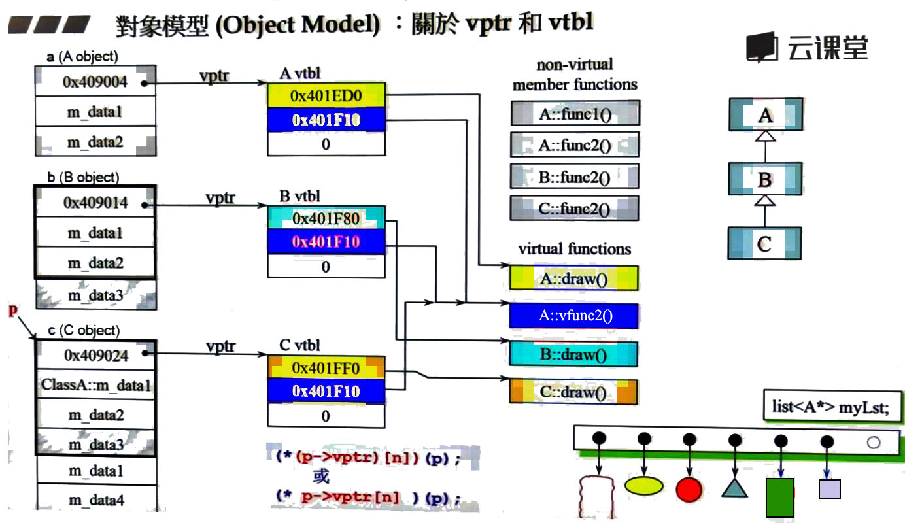
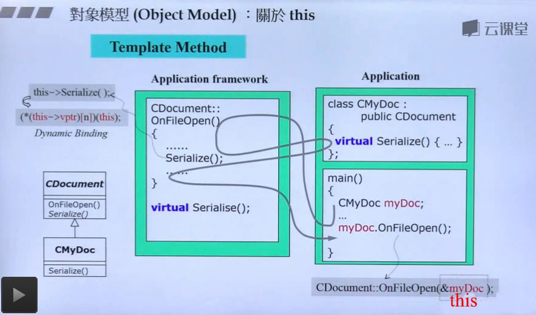

# 物件模式(二)

<article class="post" itemscope="" itemtype="http://schema.org/BlogPosting">

  <header class="post-header">
    <h1 class="post-title" itemprop="name headline">C++ 對象模型(二)</h1>
    
<time datetime="2016-08-10T03:59:00+00:00" itemprop="datePublished">Aug 10, 2016</time>

  </header>

  

    
<em>這是C++語言的一系列文章，內容取自於網易微專業《C++開發工程師（升級版）》。</em>

<em>本文是聽了侯捷老師關於“C++對象模型”的課程以後，總結而成的。</em>
<em>課程中講到了範型編程和麵向對象編程兩種模式，上篇博客中，我們討論了類和模板的一些高級話題。</em>
<em>本文中，我們對繼承體系下的類的構成進行深入討論，相關話題包括this指針、虛指針vptr、虛表vtable、虛函數、多態等。</em>
<em>另外，new 和 delete 的重載是本文的另一個話題。</em>

<h2 id="part-1">Part 1：虛表、虛指針、動態綁定</h2>

這一部分，我們介紹下 繼承體系下，類和對象的存儲形式。

<h3 id="vptr---vtable-">1.1 vptr 虛指針 和 vtable 虛表</h3>

對於虛指針和虛表的定義，這裡引用一段 <a href="https://www.quora.com/What-are-vTable-and-VPTR-in-C++" title="c++">quora</a> 上的一個回覆(這裡我已經翻譯成中文)：
如果一個類存在一個或多個虛函數，編譯器會為這個類的實例 (對象) 創建一個隱藏的成員變量，即虛指針(virtual-pointer)，簡稱 vptr。
vptr 指向一個包含一組函數指針的表，我們稱之為 虛表 (virtual table)，簡稱 vtable。虛表由編譯器創建，虛表中的每一項均是
一個指向對應虛函數的指針。

為了實現動態綁定 (dynamic binding)，編譯器為每一個擁有虛函數的類 (和它的子類) 創建一張虛表。編譯器將虛函數的地址存放到對應
類的虛表中。 當通過基類指針 (或父類指針，Base * pb) 調用虛函數時，編譯器插入一段在虛表中查找虛函數地址和獲取 vptr 的代碼。
所以才能夠調用到”正確”的函數，實現動態綁定。

關於 vptr 和 vtable 的調用，這裡用侯捷老師 PPT 上的一張圖表示：

關於 類 A、B、C 的結構聲明參考下面的代碼 (注意這裡不包含具體實現)：

<pre class="highlight"><code>// 上圖中 類 A、B、C 的聲明
class A {
public:
  virtual void vfunc1();
  virtual void vfunc2();
  void func1();
  void func2();
private:
  int m_data1, m_data2;
}

class B: public A {
public:
  virtual void vfunc1();
  void func2();
private:
  int m_data3;
}

class C: public B {
public:
  virtual void vfunc1();
  void func2();
private:
  int m_data1, m_data4;
}
</code></pre>

<h3 id="this-pointer-template-method">1.2 this pointer (template method)</h3>

在繼承體系中，子類對象調用一個方法時，如果該類本身這個函數，那麼會調用這個函數；如果本身沒有，那麼編譯器會沿著繼承樹向上查找父類中是否有該方法。

侯捷老師PPT中的一張圖很好地體現了這種調用機制：

<h3 id="dynamic-binding-">1.3 dynamic binding 動態綁定</h3>

<h4 id="section">1.3.1 什麼是動態綁定？</h4>

動態綁定是編程語言的一種特性（或機制），它允許程序在運行時決定執行操作的細節，而不是在編譯時就確定。在設計一個軟件時，通常會出現下面兩類情況：

<ol>
  <li>類的接口已經確定，但是還不知道具體怎麼實現</li>
  <li>開發者知道需要什麼算法，但是不知道具體的操作</li>
</ol>

這兩種情況下，開發者都需要延遲決定，延遲到什麼時候呢？延遲到已經有足夠的信息去做一個正確的決策。此時如果能不修改原先的實現，我們的目標就達到了。

動態綁定正是為了滿足這些需求而存在，結果就是更靈活和可伸縮的軟件架構。比如在軟件開發初期，不需要做出所有設計決策。這裡我們討論下靈活性和可伸縮性：

<ol>
  <li>flexibility (靈活性): 很容易將現存組件和新的配置合併到一起</li>
  <li>extensibility (擴展性)： 很容易添加新組件</li>
</ol>

C++ 通過 虛表和虛指針機制 實現對動態綁定的支持，具體的機制我們在上面已經談到，這裡不再贅述。

<h4 id="c-">1.3.2 動態綁定在 C++ 中的體現</h4>

在 C++ 中，動態綁定的標誌是在聲明類方法時，在方法名前面顯式地添加 virtual 關鍵字。比如下面這樣：

<pre class="highlight"><code>class Base {
public:
  virtual void vfunc1() { std::cout &lt;&lt; "Base::vfunc1()" &lt;&lt; std::endl; }
  void func1() { std::cout &lt;&lt; "Base::func1()" &lt;&lt; std::endl; }
}
</code></pre>

只有類的成員函數才能被聲明為虛函數，下面三種是不可以的：

<ol>
  <li>普通的函數 (不屬於任何一個類)</li>
  <li>類的成員變量</li>
  <li>靜態方法 (static 修飾的成員函數)</li>
</ol>

virtual 修飾的成員函數的接口是固定的，但是子類中的同名成員函數可以修改默認實現，比如像下面這樣：

<pre class="highlight"><code>class Derived_1 {
public:
  virtual void vfunc1() { std::cout &lt;&lt; "Derived_1::vfunc1() " &lt;&lt; std::endl; }
}
</code></pre>

注意：上面的代碼中， virtual 是可選的，即便不寫，它仍然是虛函數！

在程序運行時，虛函數調度機制會根據對象的”動態類型”選擇對應的成員函數。
被選擇的成員函數依賴於被指針指向的對象，而不是指針的類型。看下面代碼：

<pre class="highlight"><code>void foo (Base *bp) { bp-&gt;vf1 (); /* virtual */ }
Base b;
Base *bp = &amp;b;
bp-&gt;vf1 (); // 打印 "Base::vfunc1()"
Derived_1 d;
bp = &amp;d;
bp-&gt;vf1 (); // 打印 "Derived_1::vfunc1()"
foo (&amp;b); // 打印 "Base::vfunc1()"
foo (&amp;d); // 打印 "Derived_1::vfunc1()"，這裡存在一個隱式的向上轉型
</code></pre>

關於動態綁定，更多細節參考 <a href="http://www.cs.wustl.edu/~schmidt/PDF/C++-dynamic-binding4.pdf" title="dynamic-binding">C++ dynamic binding</a>。

<h2 id="part-2-const-">Part 2: const 補充</h2>

這個小結中，關於 const 的所有例子均來自於 <a href="https://msdn.microsoft.com/en-us/library/07x6b05d.aspx" title="const">msdn</a>。為了便於理解，
對代碼進行了稍微的調整。

<h3 id="const-">2.1 const 修飾指針</h3>

下面這個例子中， const 修飾的是指針，因此不能修改指針 aptr 的值，即 aptr 不能指向另一個位置。

<pre class="highlight"><code>// constant_values3.cpp
int main() {
   char *mybuf = 0, *yourbuf;
   char* const aptr = mybuf;
   *aptr = 'a';   // OK
   aptr = yourbuf;   // C3892
} 
</code></pre>

<h3 id="const--1">2.2 const 修飾指針指向的數據</h3>

下面這個例子中， const 修飾的是指針指向的數據，因此可以修改指針的值，但是不能修改指針指向的數據。

<pre class="highlight"><code>// constant_values4.cpp
#include &lt;stdio.h&gt;
int main() {
   const char *mybuf = "test";
   char* yourbuf = "test2";
   printf_s("%s\n", mybuf);

   const char* bptr = mybuf;   // Pointer to constant data
   printf_s("%s\n", bptr);

   // *bptr = 'a';   // Error
}
</code></pre>

<h3 id="const--2">2.3 const 修飾成員函數</h3>

在聲明成員函數時，如果在函數末尾使用 const 關鍵字，那麼可以稱這個函數是”只讀”函數。 const成員函數不能修改任何 非static的成員變量，
也不能調用任何 非const 成員函數。

const成員函數在<code class="highlighter-rouge">聲明</code>和<code class="highlighter-rouge">定義</code>時，都必須帶有 const 關鍵字。看下面這個例子：

<pre class="highlight"><code>// constant_member_function.cpp
class Date
{
public:
   Date( int mn, int dy, int yr );
   int getMonth() const;     // A read-only function
   void setMonth( int mn );   // A write function; can't be const
private:
   int month;
};

int Date::getMonth() const
{
   return month;        // Doesn't modify anything
}
void Date::setMonth( int mn )
{
   month = mn;          // Modifies data member
}
int main()
{
   Date MyDate( 7, 4, 1998 );
   const Date BirthDate( 1, 18, 1953 );
   MyDate.setMonth( 4 );    // Okay
   BirthDate.getMonth();    // Okay
   BirthDate.setMonth( 4 ); // C2662 Error
}
</code></pre>

<h2 id="part-3new--delete">Part 3：new 和 delete</h2>

<h3 id="new--delete">3.1 分解 new 和 delete</h3>

new 和 delete 都是表達式，因此不能被重載。它們均有不同步驟組成：

new 的執行步驟：

<ol>
  <li>調用operator new 分配內存 (malloc)</li>
  <li>對指針進行類型轉換</li>
  <li>調用構造函數</li>
</ol>

delete 的執行步驟：

<ol>
  <li>調用析構函數</li>
  <li>調用operator delete釋放內存 (free)</li>
</ol>

雖然，new 和 delete 不能被重載，但是 operator new 和 operator delete 可以被重載。
更多細節查看 <a href="https://msdn.microsoft.com/en-us/library/h6227113.aspx" title="delete">msdn 上的相關頁面</a>。
關於重寫 operator new/delete的一些原因，參考<a href="http://www.cprogramming.com/tutorial/operator_new.html" title="delete">Customized Allocators with Operator New and Operator Delete</a>。

<h3 id="operator-new--operator-delete">3.2 重載 operator new 和 operator delete</h3>

<h4 id="operator-new--operator-delete-1">3.2.1 重載全局 operator new 和 operator delete</h4>

用戶可以通過重新定義 全局 new 和 delete 操作符，以便通過日誌或其它方式記錄內存的分配和釋放。
其中一個應用場景是用於檢查內存洩漏。代碼如下：

<pre class="highlight"><code>// 這段代碼來自於 msdn：https://msdn.microsoft.com/en-us/library/kftdy56f.aspx

// spec1_the_operator_delete_function1.cpp
// compile with: /EHsc
// arguments: 3
#include &lt;iostream&gt;
#include &lt;malloc.h&gt;
#include &lt;memory.h&gt;
#include &lt;stdlib.h&gt;
using namespace std;

int fLogMemory = 0;      // Perform logging (0=no; nonzero=yes)?
int cBlocksAllocated = 0;  // Count of blocks allocated.

// User-defined operator new.
void *operator new( size_t stAllocateBlock ) {
   static int fInOpNew = 0;   // Guard flag.

   if ( fLogMemory &amp;&amp; !fInOpNew ) {
      fInOpNew = 1;
      clog &lt;&lt; "Memory block " &lt;&lt; ++cBlocksAllocated
          &lt;&lt; " allocated for " &lt;&lt; stAllocateBlock
          &lt;&lt; " bytes\n";
      fInOpNew = 0;
   }
   return malloc( stAllocateBlock );
}

// User-defined operator delete.
void operator delete( void *pvMem ) {
   static int fInOpDelete = 0;   // Guard flag.
   if ( fLogMemory &amp;&amp; !fInOpDelete ) {
      fInOpDelete = 1;
      clog &lt;&lt; "Memory block " &lt;&lt; cBlocksAllocated--
          &lt;&lt; " deallocated\n";
      fInOpDelete = 0;
   }

   free( pvMem );
}

// User-defined operator delete.
void operator delete {
   static int fInOpDelete = 0;   // Guard flag.
   if ( fLogMemory &amp;&amp; !fInOpDelete ) {
      fInOpDelete = 1;
      clog &lt;&lt; "Memory block " &lt;&lt; cBlocksAllocated--
          &lt;&lt; " deallocated\n";
      fInOpDelete = 0;
   }

   free( pvMem );
}

int main( int argc, char *argv[] ) {
   fLogMemory = 1;   // Turn logging on
   if( argc &gt; 1 )
      for( int i = 0; i &lt; atoi( argv[1] ); ++i ) {
         char *pMem = new char[10];
         delete[] pMem;
      }
   fLogMemory = 0;  // Turn logging off.
   return cBlocksAllocated;
}
</code></pre>

編譯並運行這段代碼，可以看到如下輸出：

<pre class="highlight"><code>oscar@ubuntu:~/$ g++ -o main spec1_the_operator_delete_function1.cpp -lm
oscar@ubuntu:~/$ ./main 3
Memory block 1 allocated for 10 bytes
Memory block 1 deallocated
Memory block 1 allocated for 10 bytes
Memory block 1 deallocated
Memory block 1 allocated for 10 bytes
Memory block 1 deallocated
</code></pre>

故事到這裡還沒有結束，細心的童鞋可能會發現：創建和釋放 char* pMem 時，使用的分別是 operator new[] (size_t) 和 operator delete[] (void*),
並沒有調用 operator new 和 operator delete。打印的結果卻告訴我：operator new 和 operator delete 確實被調用了(作驚恐狀)！！！

這裡，我找到了 cpluscplus.com 上關於 operator new[] 的表述。不解釋，直接上圖：

關於重新定義 operator new[] 和 operator delete[]，參考 msdn上<a href="https://msdn.microsoft.com/en-us/library/kftdy56f.aspx" title="new and delete">new and delete Operators</a> 
頁面最下方類成員函數 operator new[] 和 operator delete[] 的實現，它們是類似的。

<h4 id="operator-new--operator-delete-2">3.2.2 重載類的成員函數 operator new 和 operator delete</h4>

上面我們介紹了重寫全局 operator new、operator new[]、operator delete、operator delete[] 的覆蓋 (override)。
下面我們看看 類作用域下這四個函數如何實現，應用場景以及注意事項。

在類中重寫 operator new/delete([]) 成員函數時，必須聲明它們為 static，因此不能聲明為虛函數。

下面給出一個重寫類 operator new/delete 方法的例子：

<pre class="highlight"><code>// https://msdn.microsoft.com/en-us/library/kftdy56f.aspx
// spec1_the_operator_new_function1.cpp
#include &lt;cstddef&gt;
#include &lt;iostream&gt;
#include &lt;malloc.h&gt;
#include &lt;memory.h&gt; 

using namespace std;

class Blanks
{
public:
    Blanks(){ }
    Blanks(int dummy){ throw 1; }

    static void* operator new( size_t stAllocateBlock );
    static void* operator new( size_t stAllocateBlock, char chInit );
    static void* operator new( size_t stAllocateBlock, double dInit );
    static void operator delete( void* pvMem );
    static void operator delete( void* pvMem, char chInit);
    static void operator delete( void* pvMem, double dInit);
};

void* Blanks::operator new( size_t stAllocateBlock ) {
    clog &lt;&lt; "Blanks::operator new( size_t )\n";
    void* pvTemp = malloc( stAllocateBlock );
    return pvTemp;
}

void* Blanks::operator new( size_t stAllocateBlock, char chInit )
{
    clog &lt;&lt; "Blanks::operator new( size_t, char )\n";
    // throw 20;
    void *pvTemp = malloc( stAllocateBlock );
    if( pvTemp != 0 )
        memset( pvTemp, chInit, stAllocateBlock );
    return pvTemp;
}

void* Blanks::operator new( size_t stAllocateBlock, double dInit ) {
    clog &lt;&lt; "Blanks::operator new( size_t, double)\n";
    return malloc(stAllocateBlock);
}

void Blanks::operator delete( void* pvMem ) {
    clog &lt;&lt; "Blanks::opeator delete (void*)\n";
    free(pvMem);
}

void Blanks::operator delete( void* pvMem, char chInit ) {
    clog &lt;&lt; "Blanks::opeator delete (void*, char)\n";
    free(pvMem);
} 

void Blanks::operator delete( void* pvMem, double dInit ) {
    clog &lt;&lt; "Blanks::opeator delete (void*, double)\n";
    free(pvMem);
}
// For discrete objects of type Blanks, the global operator new function
// is hidden. Therefore, the following code allocates an object of type
// Blanks and initializes it to 0xa5
int main()
{
   Blanks *a5 = new('c') Blanks;
   delete a5;
   cout &lt;&lt; endl;
   Blanks *a6 = new Blanks;
   delete a6;
   cout &lt;&lt; endl;
   Blanks *a7 = new(10.0) Blanks(1);
   delete a7;
   cout &lt;&lt; endl;
}
</code></pre>

linux運行上的代碼，結果如下：

<pre class="highlight"><code>Blanks::operator new( size_t, char )
Blanks::opeator delete (void*)

Blanks::operator new( size_t )
Blanks::opeator delete (void*)

Blanks::operator new( size_t, double)
terminate called after throwing an instance of 'int'
Aborted (core dumped)
</code></pre>

很容易發現，不管我們使用哪個版本的 operator new，最後調用的都是 不含額外的參數的 operator delete。 
構造函數拋出異常時，也沒有調用對應的 operator delete 成員函數。
那麼包含額外參數的 delete什麼時候會被調用到，應用場景由有哪些呢？

我們繼續找相關的文檔，<a href="">msdn</a>上有這樣一段文字：

<pre class="highlight"><code>void operator delete( void * );
void operator delete( void *, size_t );
</code></pre>

<em>Only one of the preceding two forms can be present for a given class. The first form takes a single argument of type void *, which contains a pointer to the object to deallocate. The second form—sized deallocation—takes two arguments, the first of which is a pointer to the memory block to deallocate and the second of which is the number of bytes to deallocate. The return type of both forms is void (operator delete cannot return a value).</em>

<em>The intent of the second form is to speed up searching for the correct size category of the object to be deleted, which is often not stored near the allocation itself and likely uncached; the second form is particularly useful when an operator delete function from a base class is used to delete an object of a derived class.</em>

這裡的解釋也有些問題，通過上面的例子，可以推斷 operator new/delete 均可以被重載。
創建對象時，可以使用不同版本的operator new，但是銷燬時，只調用不包含額外參數的operator delete。
delete 的應用場景之一是：在繼承體系中，Base* 指向一個子類對象，調用 delete 銷燬該對象時，必須保證銷燬父類對象，而不是根據子類對象的大小進行截斷銷燬。

事實上，上面所說的應用場景也沒有得到驗證。我對上面的代碼進行了修改，銷燬時調用的仍然是不含額外參數的 delete:

<pre class="highlight"><code>// https://msdn.microsoft.com/en-us/library/kftdy56f.aspx
// spec1_the_operator_new_function1.cpp
#include &lt;cstddef&gt;
#include &lt;iostream&gt;
#include &lt;malloc.h&gt;
#include &lt;memory.h&gt; 

using namespace std;

class Base {
public:
    virtual ~Base() {}
};

class Blanks: public Base
{
  // ...   沒有改變 ...
};

int main() {
   Base *a5 = new('c') Blanks;   // 打印 Blanks::operator new( size_t, char )
   delete a5;                    // 打印 Blanks::opeator delete (void*)
}

</code></pre>

根據侯捷老師關於 basic_string 的分析，operator delete 並沒有傳入額外的參數，而是通過 Allocator::deallocate 去刪除。
因此 重載 operator delete 沒有任何意義，需要時 重新定義 operator delete(void* p)即可。
需要查看 stl 文章和源碼的話，可以去 <a href="http://www.codeproject.com/KB/stl/" title="stl">Code Project</a> 和 <a href="https://www.sgi.com/tech/stl/download.html" title="sgi">sgi</a> 網站上查看。

注意：為類定義 operator new/delete 成員函數會覆蓋 全局默認的 operator new/delete。
如果要使用默認的 operator new/delete，那麼在創建對象和銷燬對象時，需要使用 ::new 和 ::delete。

關於 C++ Object Model的分析就到這裡，多謝閱讀。

  

</article>