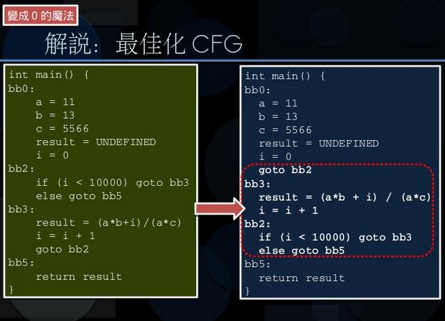

# 編譯器和最佳化原理篇


# [你所不知道的 C 語言](http://hackfoldr.org/dykc/)：編譯器和最佳化原理篇

*以 GNU Toolchain 為探討對象，簡述[編譯器如何運作，以及如何實現最佳化](http://www.slideshare.net/jserv/how-a-compiler-works-gnu-toolchain)*
Copyright (**慣C**) 2015, 2016 [宅色夫](http://wiki.csie.ncku.edu.tw/User/jserv)

- [直播錄影](https://www.youtube.com/watch?v=RYXFLxnLsiM)

## 編譯器無所不在
* [編譯器的多元應用](https://embedded2015.hackpad.com/Compiler-rtfoECtyuOd): 小小一只 Android 手機，裡頭內建了 8 種以上動態編譯器和虛擬機器
* 為什麼你該理解編譯器的原理
    * 其中一個理由是理解編譯器的限制: [gcc can](http://peter.kingofcoders.com/?p=1799)[’t handle too much](http://peter.kingofcoders.com/?p=1799) [#if](https://embedded2015.hackpad.com/ep/search/?q=%23if&via=DWAUb7NnQF0) [macro](http://peter.kingofcoders.com/?p=1799)
        * [Compiler 的多元應用](https://embedded2015.hackpad.com/Compiler-rtfoECtyuOd)
    * [What Can Compilers Do for Us?](http://www.slideshare.net/jserv/what-can-compilers-do-for-us)
* [Don’](http://betterembsw.blogspot.tw/2014/07/dont-overflow-stack.html)[t Overflow the Stack](http://betterembsw.blogspot.tw/2014/07/dont-overflow-stack.html)
    * [MISRA C](https://en.wikipedia.org/wiki/MISRA_C) (Motor Industry Software Reliability Association)
* [Basics of Compiler Design](http://www.diku.dk/~torbenm/Basics/basics_lulu2.pdf)
    * Lexical analysis
        * Regular expression, NFA (Nondeterministic finite automata)
        * NFA -> DFA
        * lexer
    * Syntax analysis
        * context-free grammar, syntax tree and ambiguity, operator precedence, predictive parsing
        * LL(1) parsing: recursive descent
        * SLR parsing
        * LR-parser generator
    * Scopes & Symbol Tables
    * Interpretation
    * Type checking
    * Code generation: register allocation

## [From Source to Binary: How A Compiler Works: GNU Toolchain](http://www.slideshare.net/jserv/how-a-compiler-works-gnu-toolchain)

[ Page 5 ]

* 這邊提到驗證執行檔後並載入動態函式庫，為何要有 C Runtime?

先想想以下程式的執行: (hello.c)

```clike=
int main() { return 1; }
```

當你在 GNU/Linux 下編譯和執行後 (`gcc -o hello hello.c ; ./hello`)，可用 `echo $?` 來取得程式返回值，也就是 `1`，可是這個返回值總有機制來處理吧？所以你需要一套小程式來作，這就是 C runtime (簡稱 crt)。此外，還有 `atexit` 一類的函式，也需要 C runtime 的介入才能實現。

C 語言和一般的程式語言有個很重要的差異，就是 C 語言設計來滿足系統程式的需求，首先是作業系統核心，再來是一系列的工具程式，像是 ls, find, grep 等等，而我們如果忽略指標操作這類幾乎可以直接對應於組合語言的指令的特色，C 語言之所以需要 runtime，有以下幾個地方：

1.  `int main() { return 1; }` 也就是 `main()` 結束後，要將 exit code 傳遞給作業系統的程式，這部份會放在 `crt0`
2.  exception handling，不要懷疑，C 語言當然有這個特徵，只是透過 `setjmp` 和 `longjmp` 函式來存取，這需要額外的函式庫 (如 libgcc) 來協助處理 stack
3.  算術操作，特別在硬體沒有 FPU 時，需要 libgcc 來提供浮點運算協助

* C 語言裡面有沒有例外處理？
    * setjmp
    * longjmp

* 在 kernel 裡的「驗證執行檔」步驟，是要驗證什麼？
* UNIX 的「執行檔」有很多種可能，一個是依據特定格式保存的機械碼，也可能是透過額外程式去解析的 shell script，作業系統核心必須得事先解析並確認這個合法的執行檔，才能著手去執行
* 近來還有對執行檔進行簽章的機制，請見: https://lwn.net/Articles/532710/

[ Page 16 ]

* 能夠自己編譯自己原始程式碼的程式: [Self-hosting](https://en.wikipedia.org/wiki/Self-hosting)：作為 toolchain 的一部分，可以產生新版同一程式的程式
* The term **self-hosting** was coined to refer to the use of a [computer program](https://en.wikipedia.org/wiki/Computer_program) as part of the [toolchain](https://en.wikipedia.org/wiki/Toolchain) or [operating system](https://en.wikipedia.org/wiki/Operating_system) that produces new versions of that same program
* 想一個情境，C compiler 的原始程式碼如果用 C 語言撰寫，那要用什麼東西來編譯 C compiler 的原始程式碼呢？如果可以作到這件事，就是所謂的 self-compilation，這不是容易的事，因為編譯器要很可靠才行
* 要知道一件事，由於電腦發展最初是解決軍事需求，後來則應用到人口普查系統，人們一直都希望電腦可以理解人類的語言，這也是為何早期 (1950 年代) 的程式語言其實很高階的緣故，有透過數學表達的風格 (如 LISP)，也有類似英文書寫風格 (如 COBOL)
* 更有趣的是，就算電腦發展還在真空管的時代，人們就著手研究解析語言學和數學的關聯，這也是為何你在計算理論和編譯器課程 (這兩者是資訊工程系和電機系極少沒有重疊的科目) 會發現一些語言學的跡象
* 回到編譯器的設計，由於早期硬體限制很多，其實是不可能直接實做出高階語言的編譯器，相反的，早期的工程人員必須漸進地開發相關的工具的程式，所以你可以想像最早人們用機械碼拼湊出簡單的 assembler，然後在這之上發展了簡單的 C compiler，之後再用這個 C compiler 開發出更完整的 C compiler，後者可以編譯更完整的 C 語言程式，然後逐步延展下去。

[ Page 31 ]

下圖說明如果沒有 IR 這樣的中間表示法，每個前端 (source files; human readable programming language) 直接對應到後端 (machine code) 的話，有太多種組合，勢必會讓開發量爆增。但如果先讓前端輸出 IR，然後 IR 再接到後端，這樣整體的彈性就大多了

[ Page 36 - 38 ]

1.  Pointer Aliasing會讓編譯器最佳化功能無用武之地。
2.  針對下面程式碼

```clike=
void foo(int *i1, int *i2, int *res)
{
    for (int i = 0; i < 10; i++) {
        *res += *i1 + *i2;
    }
}
```

* 可能一開始會想優化成下面這樣來加速

```clike=
void foo(int *i1, int *i2, int *res)
{
    int tmp = *i1 + *i2;
    for (int i = 0; i < 10; i++) {
        *res += tmp;
    }
}
```

* 但若考慮到有人這樣寫 `foo(&var, &var, &var)` 來呼叫 `foo()`，那很明顯就會發生問題了，*res 值的改變影響 `*i1`、`*i2`。所以 Compiler 不會這樣最佳化，因為不知道 caller 會怎麼傳遞數值。

[ Page 40 ]

* SSA (Static Single Assignment)
* 每個被 Assign 的變數只會出現一次
* 將被 Assign 的變數給一個版本號碼，再使用 ∅function 例如: `ret3 = ? (ret1, ret2)` 去判斷從何而來
* SSA 把原本複雜的條件和程式邏輯轉化為 Graph，用讓每個程式邏輯轉成明確的路徑
    * GCC 的 [SSA 說明](https://gcc.gnu.org/onlinedocs/gccint/SSA.html)
    * " The SSA form is based on the premise that <u>program variables are assigned in exactly one location</u> in the program. Multiple assignments to the same variable create new versions of that variable. "
    * SSA 最佳化實例：
    * constant propagation
    * 用法:

      1.  先拆成 basic blocks (單行的指令, 沒有jump or label)
      2.  合併 basic blocks
      3.  最佳化 CFG (減少 goto )
      4.  轉成 SSA form (變數 runtime decided 時, 用函數表示, 並給新的版本號) . 例: `i1 =Φ(i0, i2)`
      5.  constant propagation (變數換成常數)
      6.  dead code elimination (remove 不需要的變數)
      7.  value range propagation (變數用一個範圍的常數來代替)
      8.  dead code elimination (結果: 直接 `return 0`)

延伸閱讀: [Static Single Assignment Form](http://www.naturalbridge.com/GCC2004Summit.pdf), Kenneth Zadeck (GCC Summit 2004)

[ Page 43 ] GCC 可輸出包含 Basic Block 的CFG

* `gcc -c -fdump-tree-cfg=out test.c`

[ Page 62 ] GCC 後端: Register Transfer Language (RTL)

* LISP-Style Representation (令人喜愛的 S-Expression :) )
* 生成 RTL 的方式

* `gcc -fdump-rtl-expand xxx.c`

* RTL Uses Virtual Register
* GCC Built-in Operation and Arch-defined Operation
* Instruction scheduling (Pipeline scheduling)
* Peephole optimizations

[ Page 67 ]

* 最佳化來自對系統的認知

假設我們有兩個**有號整數**: `<stdint.h>`

```clike=
int32_t a, b;
```

然後原本涉及到分支的陳述：

```clike=
if (b < 0) a++;
```

可更換為沒有分支的版本：

```clike=
a -= b >> 31;
```

[ Page 69 ]

* Compiler可以砍掉沒人使用的static global variable來節省空間，但是不能砍掉沒人使用的 non-static global variable，因為無法確定別的 Compilation Unit 會不會用到此變數
    * 這是為何建議 local function 要宣告成 `static` 的用意！

[ Page 71 ]

* gcc 會把特定的 `printf()` 悄悄換成 `puts()`，這有什麼好處？
* `printf()` 本身就是個解譯器，要處理一堆格式，執行時間和字串長度並未完全相符合。但 `puts()` 就不一樣，只跟何時找到 null terminator 有關，行為明確多了，當然整體執行時間也更短。

* 為何 GCC 算是個 Compiler Driver ? 在使用上，我們要進行 link 也是會另外使用 ld ， gcc 也可以當 linker 嗎?

  > ld 是真正的 linker，而 gcc 作為 compiler driver，自然也可以呼叫到 ld 作 linking[name=jserv]

* 在此範例中.最佳化CFG.為何是將bb0最後加一個goto bb2,而bb2搬移到bb3下方. 如果原本尚未搬移前多一個goto bb2的動作.這樣最佳化的目的是?

  > 減少 compare-n-branch 的總次數
  > 右邊的是接近組合語言的寫法[name=jserv]





[ Page 65 ] GCC後端 管線排程

Instruction scheduling 透過將 instruction 重排的方式以減少 pipeline hazard，已達到 ILP(instruction-level parallelism) 的目的


* peephole 門眼
peephole 的 peep 是「窺視、偷看」的意思，peeping Tom 則是「偷窺狂」的意思，但 peephole 可不是偷窺洞

[peeping Tom 的典故](https://zh.wikipedia.org/wiki/%E6%88%88%E9%BB%9B%E5%A8%83%E5%A4%AB%E4%BA%BA)

[ Page 73 ]

* 「編譯器無法inline一個外部函式，解法為 LTO (Link Time Optimization)」什麼意思？
    * 投影片: [Optimizing large applications](http://www.ucw.cz/~hubicka/slides/labs2013.pdf)
        * 延伸閱讀: [Linktime optimization in GCC](http://hubicka.blogspot.tw/2014/04/linktime-optimization-in-gcc-1-brief.html)

LTO 帶來的提昇，可參考 [gcc-5 的釋出說明](https://gcc.gnu.org/gcc-5/changes.html) ：(和 Firefox 有關)

* During link-time optimization of Firefox, this pass unifies about 31000 functions, that is 14% overall.
* About 50% of virtual calls in Firefox are now speculatively devirtualized during link-time optimization.
    * vtable

* GCC 前端:
    * AST
        * ref: http://www.diku.dk/~torbenm/Basics/basics_lulu2.pdf
        * 3.17.2 Abstract syntax
    * "The syntax trees described in section 3.3.1 are not always optimally suitable for compilation. They contain a lot of redundant information: Parentheses, keywords used for grouping purposes only, and so on.
    * Abstract syntax keeps the essence of the structure of the text but omits the irrelevant details. An abstract syntax tree is a tree structure where each node corresponds to one or more nodes in the (concrete) syntax tree"

* GCC中端:
    * Gimple + Tree SSA Optimizer
    * Gimple: 只能有兩個運算元

* GCC後端:
    * RTL
    * 使用 virtual register (可有無限多個 registers)
    * register allocation (virtual register => hard register)
    * instruction scheduling (pipeline scheduling)
    * register allocation
    * pipeline scheduling
    * peephole optimization

* [Pointer Aliasing](https://en.wikipedia.org/wiki/Pointer_aliasing)
* [Strict Aliasing 延伸](http://blog.tinlans.org/2010/01/09/strict-aliasing/)

## GNU Toolchain

* gcc : GNU compiler collection
* as : GNU assembler
* ld : GNU linker
* gdb : GNU debugger

介紹完編譯工具後，來講點大概編譯的流程還有格式

### Compilation flow

先來看這張圖：


.c 和 .s 比較常見先略過，所以就解釋一下 .coff 和 .elf 是什麼：

* [COFF (common object file format)](https://en.wikipedia.org/wiki/COFF) : 是種用於執行檔、目的碼、共享函式庫 (shared library) 的檔案格式
* [ELF (extended linker format)](https://en.wikipedia.org/wiki/Elf) : 現在最常用的文件格式，是一種用於執行檔、目的碼、共享函式庫和核心的標準檔案格式，用來取代COFF

**GAS syntax (AT&T)**

```=
.file “test.s”
.text
.global main
.type main, %function
main:
	MOV R0, #100
	ADD R0, R0, R0
	SWI #11
.end
```

由一個簡短的 code 來介紹，在程式的 section 會看到 `.` ，是定義一些 control information，如 `.file` , `.global` 等

* `%function` : 是一種 type 的表示方式 `.type` 後面可以放 function 或者是 object 來定義之
* `SWI #11` : 透過 software interrupt 去中斷現有程式的執行，通常會存取作業系統核心的服務 (system call)
* `.end` : 表示是 the end of the program

注意，在後來的 ARM 中，一律以 "SVC" (Supervisor Call) 取代 "SWI"，但指令編碼完全一致

==> [ARM Instruction Set Quick Reference Card](http://infocenter.arm.com/help/topic/com.arm.doc.qrc0001l/QRC0001_UAL.pdf)

以下簡介 ELF 中個別 section 的意義： (注意: ELF section 的命名都由 `.` 開頭)

* `.bss` : 表示未初始化的 data，依照定義，系統會賦予這些未初始化的值 0
* `.data` : 表示有初始過的 data
* `.dynamic` : 表示 dynamic linking information
* `.text` : 表示 "text" 或者是 executable instructions

### 寫程式的要點

* 程式是拿來實現一些演算法 (想法) 進而去解決問題的
* 可以透過 Flow of control 去實現我們的程式
    * Sequence
    * Decision: if-t
    * hen-else, switch
    * Iteration: repeat-until, do-while, for
* 將問題拆成多個更小而且方便管理的單元 (每一個單元或稱 function ，盡量要互相獨立)
* Think: In C, for / while ?

### Procedures

來複習一下名詞

* Arguments: expressions passed into a function
* Parameters: values received by the function
* Caller & callee [呼叫者(通常就是在其他函式呼叫的function) 與 被呼叫者(被呼叫的 function)]

==> "argument" 和 "parameter" 在中文翻譯一般寫「參數」或「引數」，常常混淆

==> "argument" 的重點是「傳遞給函式的形式」，所以在 C 語言程式寫 `int main(int argc, char *argv[])` 時，我們稱 argc 是 argument count，而 argv 是 argument vector

==> "parameter" 的重點是「接受到的數值」，比方說 C++ 有 [parameterized type](https://isocpp.org/wiki/faq/templates#param-types)，就是說某個型態可以當作另外一個型態的「參數」，換個角度說，「型態」變成像是數值一樣的參數了。

==>https://en.wikipedia.org/wiki/Parameter_(computer_programming)


在撰寫程式常常會使用呼叫 ( call )，在上圖中高階語言直接將參數傳入即可，那麼在組語的時候是如何實作的呢?是透過暫存器? Stack ? memory ? In what order ?我們必須要有個 protocol 來規範

**ARM Procedure Call Standard (AAPCS)**

* ARM Ltd. 定義一套規則給 procedure entry 和 exit
    * Object codes generated by different compilers can be linked together
    * Procedures can be called between high-level languages and assembly
* AAPCS 是 [Procedure Call Standard for the ARM® Architecture](http://infocenter.arm.com/help/topic/com.arm.doc.ihi0042e/IHI0042E_aapcs.pdf) 的簡稱，從 10 年前開始，全面切換到 EABI (embedded ABI)
    * 過去的 ARM ABI 稱為 oabi (old ABI)，閱讀簡體中文書籍時，要格外小心，因為資訊過時
* APCS 定義了
    * Use of registers
    * Use of stack
    * stack-based 資料結構型式
    * argument passing 的機制
        * first four word arguments 傳到 R0 到 R3
        * 剩餘的 parameters 會被 push 到 stack (參數依照反過來的排序丟入堆疊中)
        * 少於 4 個 parameters 的 procedure 會比較有效率


* Return value
    * one word value 存在 R0
    * 2 ~ 4 words 的 value 存在 ( R0-R1, R0-R2, R0-R3)

以下測試一個參數數量為 4 和 5 的程式:

```clike=
int add4(int a, int b, int c , int d){
	return a + b + c + d;
}

int add5(int a, int b, int c , int d, int e){
	return a + b + c + d + e;
}
```

程式編譯後，用 objdump 組譯會得到類似以下：


紅框標注的是比左邊多出的程式碼，從這裡可以看到參數 1-4 是存在 R0-R3，而第 5個參數存在原本 sp + 4 的位置，隨著程式碼進行 R0-R3 存在 stack 中，圖下為 stack 恢復前的樣子：


因此若寫到需要輸入 5 個或以上的參數時，就必須存取外部記憶體，這也導致效能的損失。

==> xorg xserver 的最佳化案例

### Standard ARM C program address space

下圖為 ARM C program 標準配置記憶體空間的概念圖:


### Accessing operands

通常 procedure 存取 operands 透過以下幾種方式:

* An argument passed on a register : 直接使用暫存器
* An argument passed on the stack : 使用 stack pointer (R13) 的相對定址 (immediate offset)
* A constant : PC-relative addressing
* A local variable : 分配在 stack 上，透過 stack pointer 相對定址方式存取
* A global variable : 分配在 static area (就是樓上圖片的 static data)，透過 static base (R9) 相對定址存取

用幾張圖來表現出存取 operands 時，stack 的變化:

圖下為 passed on a register：


圖下為存取 local variables：


## Target Triple

在使用 Cross Compiler 時，gcc 前面總有一串術語，例如：

* arm-none-linux-gnueabi-gcc

這樣 `arm-none-linux-gnueabi-`稱為 target tripe，通常規則如下：

`<target>[<endian>][-<vender>]-<os>[-<extra-info>]`

* vendor 部份只是常見是可以塞 vendor 而已, 但沒有一定塞 vendor 的資訊
* extra-info 部份大部份是在拿來描述用的 ABI 或著是 library 相關資訊

先以常見 x86 的平台為例子：

gcc 下 -v 可以看到以下：

```=
Target: x86_64-redhat-linux
```

`<target>-<vendor>-<os>` 的形式

Android Toolchain:

```=
Target: arm-linux-androideabi
```

`<target>-<os>-<extra-info>`

androideabi : 雖然 Android 本身是 Linux 但其 ABI 細節跟一般 linux 不太一樣

Linaro ELF toolchain:
```=
Target: arm-none-eabi
```

`<target>-<vender>-<extra-info>`

vender = none

extra-info = eabi

Linaro Linux toolchain:

```=
Target: arm-linux-gnueabihf
```

`<target><endian>-<os>-<extra-info>`

extra-info:

eabi: EABI

hf : Hard float, 預設有 FPU

* soft (GPR), softfp (GPR -> float register), hardfp

Linaro big-endian Linux toolchain:

```=
Target: armeb-linux-gnueabihf
```

`<target><endian>-<vender>-<extra-info>`

endian = be = big-endian

Buildroot 2015-02

```=
Target: arm-buildroot-linux-uclibcgnueabi
```

`<target>-<vender>-<os>-<extra-info>`

extra-info:

uclibc 用 uclibc (通常預設是 glibc, uclibc 有些細節與 glibc 不同)

gnu : 無意義

eabi : 採用 EABI

NDS32 Toolchain:

```=
Target: nds32le-elf
```

`<target><endian>-<os>`

NDS32 為 Andes Technology 公司特有的 CPU 架構

由以上眾多 pattern 大概可以歸納出一些事情：

vender 欄位變化很大，os 欄位可不填。若不填的話，通常代表 Non-OS (Bare-metal)

source: http://kitoslab.blogspot.tw/2015/08/target-triple.html

## 編譯器原理

為何我們要理解編譯器？這是電腦科學最早的思想體系

* 從理解動態編譯器 (如 Just-in-Time) 的運作，可一路探索作業系統核心, ABI,效能分析的原理

[ [Interpreter, Compiler, JIT from scratch](http://www.slideshare.net/jserv/jit-compiler) ]

* [碎形程式 in C](http://blog.linux.org.tw/~jserv/archives/2011/09/_mandelbrot_set.html) (Brainf*ck 的版本作為 benchmark)

[ [Virtual Machine Constructions for Dummies](http://www.slideshare.net/jserv/vm-construct) ]

[ Page 14 ]

* 為什麼說這是 gray area ? 以及 cell type 指的是什麼?
* cell 是 Brainf*ck 程式的中間狀態，請對照學習計算理論，裡面提到 Turing machine。而 cell type 自然就是說要如何表達 (represent) cell 呢？8-bit, 16-bit, 32-bit 等等
* 解釋 I/O 的 gray area 之前，先想想為何 C 語言標準函式庫的 `getc()` 返回型態是 `int`，而非 `char` 呢？因為要處理 `EOF` (詳情自行 `man getc`)
* 但 `EOF` 在 Braif*ck 的 I/O 操作沒有具體定義

## JIT 實做案例

* [jit-construct](https://github.com/embedded2015/jit-construct) : Brainf*ck

- [ ] [suhorng](https://github.com/suhorng/jit-construct)-jit-construct / [開發紀錄(B)](https://embedded2015.hackpad.com/HW4-Brainfsck-B-NeHDO8iZk7D)
- [ ] [ARM 版本的 Brainf*ck JIT compiler](https://coldnew.gitbooks.io/2015-embedded-summber/content/exame/brainfuck_jit_arm.html)

* [rubi](https://github.com/embedded2015/rubi) : Ruby-like JIT compiler

- [ ] [suhorng](https://github.com/suhorng/rubi)-rubi / [開發紀錄(C)](https://hackpad.com/Rubi-Notes-khxgIbvMqQC)
- [ ] [Rubi JIT 編譯器的架構與設計原理](http://ccc.nqu.edu.tw/wd.html#pmag201511:focus2)

* [AMaCC](https://github.com/jserv/amacc) : 極小的 C 編譯器 (實際上是個 JITC)
    * 背景知識解說: [手把手教你構建C 語言編譯器](http://lotabout.me/2015/write-a-C-interpreter-0/)

TODO:

* 用 DynASM 改寫
* 支援 ELF 檔案輸出
* 用其他程式語言重寫
* 支援更豐富的語法，像是 switch-case

[ Q & A ]

LISP
* [以 C 語言實做 Functional Language 的 Currying](http://blog.linux.org.tw/~jserv/archives/002029.html)
* [以 C 語言模擬 Lisp/Scheme 語法](http://blog.linux.org.tw/~jserv/archives/002058.html)

對於 `hello.c` 的 `printf`，在 armcc 是如何處理的呢?

* opcodes 4 字元: PRTF
* 利用 [dlsym](http://linux.die.net/man/3/dlsym)找出libc 中 "printf" symbol 的位址 (address)
* 對 stack 操作處理所需參數
* 跳至 printf 執行