# 遞迴呼叫篇


# [你所不知道的C語言](http://hackfoldr.org/dykc/)：遞迴呼叫篇
*「[遞迴（recurse）只應天上有, 凡人該當用迴圈（iterate）](http://coder.aqualuna.me/2011/07/to-iterate-is-human-to-recurse-divine.html)」*
Copyright (**慣C**) 2016 [宅色夫](http://wiki.csie.ncku.edu.tw/User/jserv)
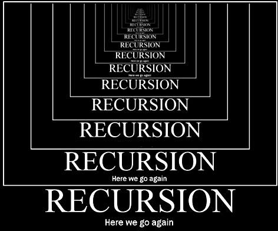

:::warning
:warning: 注意
- 請透過 gitter (線上對話服務，可透過 GitHub 或 Twitter 帳號登入) 提交疑問和建議事項: [guts-general](https://gitter.im/embedded2015/guts-general) (按下去就對了)
:::

## 案例分析：數列輸出
* 以下 C 程式的作用為何？
```clike=
int p(int i, int N)
{
    return (i < N && printf("%d\n", i) && !p(i + 1, N)) \
           || printf("%d\n", i);
}
```

* 拆解為以下兩部份:
- [ ] Line #3
	```clike=3
	(i < N && printf("%d\n", i) && !p(i + 1, N))
	```
	* 依據 [C Operator Precedence](http://en.cppreference.com/w/c/language/operator_precedence)，`&&` (Logical AND) operator 的運算規則為左值優先，只要左值不成立，右值都不會執行
	* 因此我們可確定，當 `i` 不小於 `N` 時，不會印出 `i`，也不會呼叫 `p`
	* [printf(3)](https://linux.die.net/man/3/printf) 會回傳印出的字元數目，這裡一定回傳非零值
	* 接著我們可推斷，當 `i < N` 成立，`i` 會被輸出，接著會呼叫 `p`
	* 換言之，中止條件是 `i < N`
	:::info
    查詢 man page，對應到 GNU/Linux 的指令為 `man 3 printf`
    :::
- [ ] Line #4
	```clike=4
	|| printf("%d\n", i)
	```
	* `||` (Logical OR) operator 的運算規則為當左值成立時，右值就不會執行
	* 因此 `p` 前面的 `!` 很重要。因為 p 的回傳值一定是 true (由於 `printf` 一定回傳非零值)，而為確保會執行到這第二個 `printf`，要將回傳值作 NOT，讓第一部份的結果為 false
		* 如果去掉 NOT，則只會輸出 `i -> N`
		:::info
        把 `!p(i+1, N)` 的反相`!` 拿掉後，得到以下結果:
        ```
        /* i = 1 , n = 5 */
        1
        2
        3
        4
        5
        ```
        :::
	* 第二個 `printf` 要等 `p` 執行完畢才會被執行。遞迴呼叫在實做層面來說，就是藉由 stack 操作，這裡一旦被 push 到 stack 印一次，被 pop 出來再印一次

綜合以上分析，我們可得知上述程式碼的作用為「印出 i -> N -> i 的整數序列，N 只會出現一次」。

* 延伸問題: 把 `&&` 前後的敘述對調，是否影響輸出？
    * 也就是說，變更原始程式碼，從 `i < N && printf("%d\n", i)` 改為 `printf("%d\n", i) && (i < N)` 的話
    * 如果對調 `printf` 跟 `i < N` 則會輸出 `i -> N N -> i` (N 出現兩次)
    * 因為 `printf` 會先被執行，不會受到 `i < N` 成立與否影響。

* 延伸問題：`i` 和 `N` 組合的有效上下界為何？
    * 科技公司的面試過程中，這類題目有助於測驗應試者的系統概念
    * 不妨將原本程式碼改寫為以下：
    ```clike=
    #include <limits.h>
    #include <stdio.h>
    
    int p(int i, int N)
    {
        return (i < N && printf("%d\n", i) && !p(i + 1, N)) \
               || printf("%d\n", i);
    }
    
    int main()
    {
        return p(0, INT_MAX);                   
    }
    ```
    * 在 Linux x86_64 環境編譯並執行後，會得到類似以下輸出: (數字可能會有出入)
    ```
    261918
    261919
    261920
    程式記憶體區段錯誤
    ```
    * 這裡的 segmentation fault 意味著 stack overflow，遞迴呼叫時，每一層都有變數存放於 stack 中，每次呼叫也要保存回傳位址 (return address)
    :::info
    可用 `ulimit -s` 來改 stack size，預設是 8 MB，計算後可推得，每個 stack 大約佔用 32 bytes，N 的限制取決於 stack size 的數值。
    延伸閱讀: [通過ulimit 改善系統效能](https://www.ibm.com/developerworks/cn/linux/l-cn-ulimit/)
    :::
    * 複習 [你所不知道的C語言：函式呼叫篇](https://hackmd.io/s/SJ6hRj-zg)，我們知道為了滿足 [x86_64 ABI / calling convention](https://en.wikipedia.org/wiki/X86_calling_conventions)，回傳位址佔 8 bytes, (int) `i` 和 (int) `N` 這兩個變數合計 8 bytes, 函式的區域變數 (給 `printf()` 用的 format string 的位置) 8 bytes, p 回傳值 int 佔 4bytes ，總共 32  bytes。計算過程:
    ```
    8MB = 8,388,608 bytes
    8,388,608 / 32 = 262,144 次
    ```
    * 綜合上述，推算出 `0 < N - i < 262144`

* 實驗 (檔名為 `p.c`)
```shell
$ gcc -o p p.c -g
$ gdb -q p
Reading symbols from p...done.
(gdb) break p
Breakpoint 1 at 0x6ae: file p.c, line 7.
(gdb) run
Starting program: /tmp/p 

Breakpoint 1, p (i=0, N=2147483647) at p.c:7
7	           || printf("%d\n", i);
(gdb) info frame
Stack level 0, frame at 0x7fffffffdf60:
 rip = 0x5555555546ae in p (p.c:7); saved rip = 0x555555554721
 called by frame at 0x7fffffffdf70
 source language c.
 Arglist at 0x7fffffffdf50, args: i=0, N=2147483647
 Locals at 0x7fffffffdf50, Previous frame's sp is 0x7fffffffdf60
 Saved registers:
  rbp at 0x7fffffffdf50, rip at 0x7fffffffdf58
```

:::warning
現代編譯器的最佳化可能會造成非預期的改變，比方說在前述編譯參數追加 `-O3`，在 gcc-6.2 輸出的執行檔會得到以下輸出:
523637
523638
523639
程式記憶體區段錯誤
:::

## 遞迴程式設計
* [從圖例學習遞迴](http://www.flag.com.tw/book/cento-5105.asp?bokno=F2733&id=981)
* [Recursive Programming](https://www.cs.cmu.edu/~adamchik/15-121/lectures/Recursions/recursions.html)
* [Recursive Functions](https://www.cs.umd.edu/class/fall2002/cmsc214/Tutorial/recursion2.html)

## Fibonacci sequence

數學定義如下:!
[](images/mimihalo.hackpad.com_aqgx9ysllS2_p.478178_1443423633116_undefined)

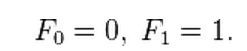

數列值：

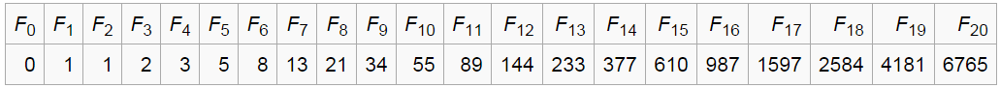

在費氏數列上其解法可分為下列

*   遞迴法
*   非遞迴法
*   [近似解](https://www.mathsisfun.com/numbers/fibonacci-sequence.html)
*   [線性代數解](https://en.wikibooks.org/wiki/Linear_Algebra/Topic:_Linear_Recurrences)
*   [排列組合解](http://yqcmmd.com/2015/06/23/fibonacci/)
*   ……等

此數列之討論程度非常之高，解法也非常多元。下段我們選出幾種經典實做。

### 遞迴法 (Recursive)

即是費氏數列定義，將此轉為程式碼
```clike=
int fib(int n)
{
    if (n == 0) return 0;
    if (n == 1) return 1;
    return fib(n - 1) + fib (n - 2);
}
```

### 非遞迴法 (Iterative)

透過非遞迴方法可縮減原先使用遞迴法Call function所造成之成本。以下先討論基本方法。
```clike=
int fib (int n)
{
    int pre = -1;
    int result = 1;
    int sum = 0;
    for (int i = 0; i <= n; i++) {
        sum = result + pre;
        pre = result;
        result = sum;
    }
    return result;
}
```

我們可降低變數的使用：
```clike=
int fib(int n)
{
    int pre = -1;
    int i = n;
    n = 1;
    int sum = 0;
    while (i > 0) {
        i--;
        sum = n + pre;
        pre = n;
        n = sum;
    }
    return n;
}
```

### Tail recursion

此法可加速原先之遞迴，可減少一半的資料回傳，而概念上是運用從第一次 call function 後即開始計算值，不像之前的遞迴需 call function 至中止條件後才開始計算值，再依序傳回到最上層，因此可大幅降低時間，減少 stack 使用量。參考實做如下：

```clike=
int fib(int n, int a, int b)
{
    if (n == 0) return a;
    return fib(n - 1 , b, a + b);
}
```

此外，我們用樹狀突來解釋 Recursive Method 以及 Tail Recursion 之差別，以下以 Fib(5) 為例。

**Recursive Method**


**Tail Recursion**

.png)

在兩張樹狀圖之顯示下，可明顯看出複雜度之不同，一則會發展出樹狀結構，而另一則是有如迴圈。

### Q-Matrix

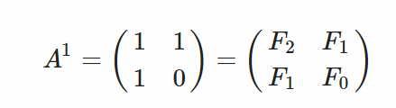

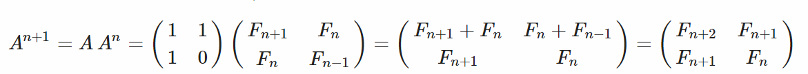

透過矩陣轉換之方法，我們把原本之遞迴式轉換到矩陣表示，並透過矩陣次方之Divide and Conquer Method 來做加速。 

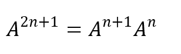

因此能大幅減少預算量，但此方法牽涉除法以及矩陣，在撰寫傳寫組合語言上有一定之難度 ( 除法可使用右移以及可利用最後一個 Bit 來判斷奇偶數 )，在此參考<u>演算法筆記</u>之矩陣型別宣告實作Fibonacci Sequence。

```clike=
int[][] matrix_multiply(int[][] a,int [][] b)
{
    int t[2][2] = { { 0 , 0 } , { 0 , 0 } };
    for (int i = 0 ; i < 2 ; i ++ )
        for (int j = 0 ; j < 2 ; j ++ )
            for (int k = 0 ; k < 2 ; k ++)
                t[i][j] += a[i][k] * b[k][j]; 
    return t;
}

// 使用 Divide-and-Conquer 方法加速矩陣次方
int[][] matrix_pow ( int a[][] , int n )
{
    if ( n == 1 ) return a;
    if (n % 2 == 0) {
        int t[2][2];
        t = matrix_pow(a , n >> 1);
        return matrix_multiply(t , t);
    } else {
        int t1[2][2], t2[2][2];
        t1 = matrix_pow(a, n >> 1 );
        t2 = matrix_pow(a, n >> 1 + 1 );
        return matrix_multiply(t1 , t2);
    }
}
```

我們可在 Q-Matrix 的基礎上，計算 Fibonacci Sequence。

```clike=
int fib(int n)
{
    if (n < = 0) return 0;
    int A1[2][2] = { { 1 , 1 } , { 1 , 0 } };

    int result[2][2];
    result = matrix_pow(A1, n);
    return result[0][1];
}
```

**Fast doubling **

此方法類似上述提及之Q-Matrix做法，基於矩陣之方法繼續推演而得，在效能上更勝Q-Matrix一籌，此概念是使用矩陣乘法相將兩個n次方矩陣相乘而得。


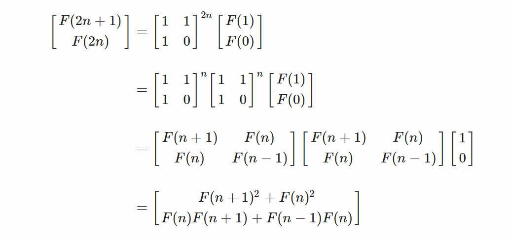

透過上述之數學推論，我們最後可得兩公式可供使用。


接著我們即可使用此公式來撰寫Fibonacci Sequence。

```clike=
int fib(int n)
{
    if (n == 0) return 0;
    int t0 = 1; // F(n)
    int t1 = 1; // F(n + 1)
    int t3 = 1; // F(2n)
    int t4; // F(2n+1)
    int i = 1;
    while (i < n) {
        if ((i << 1) <= n) {
            t4 = t1 * t1+  t0 * t0;
            t3 = t0 * (2 * t1 - t0);
            t0 = t3;
            t1 = t4;
            i = i << 1;
        } else {
            t0 = t3;
            t3 = t4;
            t4 = t0 + t4;
            i++;
        }
    }
    return t3;
}
```

**演算法比較**

在以上之方法中，我們比較這些方法所花費之複雜度如下，可發現最基礎之Recursive 方法是極沒效率之方法，而其後之 Q-Matrix 及 Fast Doubling 效能則有顯著差異。

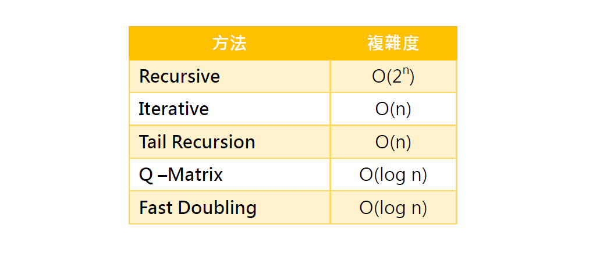

因改良後的時間複雜度皆為同等級，我們接著實際比較執行時間。

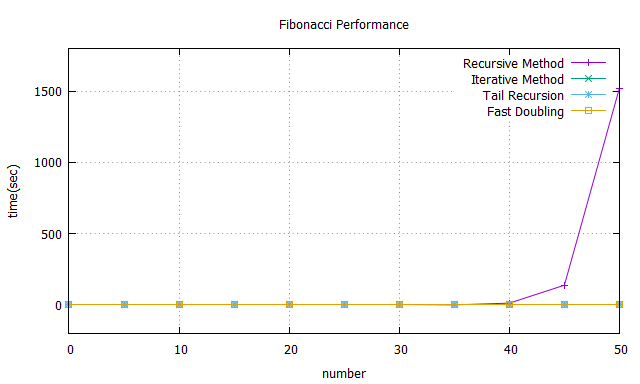

比較 Recursive Method 和 Iterative Method 的效能差異。

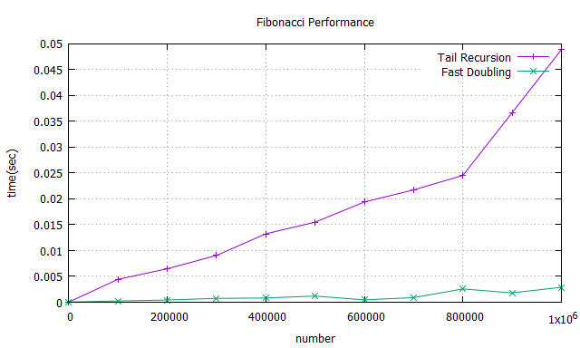

此兩種方法在 n = 1M 時還是都有不錯的表現，與原先之 Recusive method 相比實為甚廣，而透過此兩者之比較，最後還是可得出透過Fast Doubling 的方法能得到更好之效能，對上面之複雜度圖表也能互相呼應。

### Fibonacci 參考資料

* [Fibonacci number](https://en.wikipedia.org/wiki/Fibonacci_number)
* [Tail call](https://en.wikipedia.org/wiki/Tail_call)
* [Fibonacci Q-Matrix](http://mathworld.wolfram.com/FibonacciQ-Matrix.html)
* [How to prove Fibonacci sequence with matrices?](http://math.stackexchange.com/questions/784710/how-to-prove-fibonacci-sequence-with-matrices)
* [演算法筆記 - Q-Matrix](http://acm.nudt.edu.cn/~twcourse/Q-matrix.html)
* [Fast Fibonacci algorithms](http://www.nayuki.io/page/fast-fibonacci-algorithms)
* [Need help understanding Fibonacci Fast Doubling Proof](http://math.stackexchange.com/questions/1124590/need-help-understanding-fibonacci-fast-doubling-proof)


## 案例分析：字串反轉
:::success
:warning: 據說某些 M 開頭的科技公司面試很喜歡出這題
:::

* 要求：用 C 語言實做 `char *reverse(char *s)`，反轉 NULL 結尾的字串，限定 in-place 與遞迴
* 先思考實做 swap 的技巧，考慮以下程式碼：

```clike=
void swap(int *a, int *b)
{
    int t = *a; *a = *b; *b = t;
}
```
能否避免使用區域變數 t？又，可否改用 bit-wise operator 來改寫？
* 數值運算：利用兩個相差距離做運算，但若遇到一個很大的整數與一個負數(足夠讓他超過最大整數)兩個相減時，會產生益位

    ```clike=
    *a = *a - *b; //兩數相差 
    *b = *a + *b; //相加得出*b
    *a = *b - *a; //相減得出*a
    ```

* 邏輯運算：運用邏輯運算查看出兩個不同相差的位元，依據以下真值表：
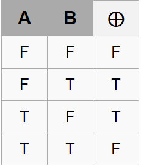

    ```clike=
    *a = *a ^ *b; // 求得相差位元
    *b = *a ^ *b; // 與相差位元做 XOR 得出 *a
    *a = *a ^ *b; // 與相差位元做 XOR 得出 *b
    ```

邏輯運算的好處是，可避免前述算術會遇到的 integer overflow，而且不限定位元數
* 參考的 in-place string reverse 想法：一直 swap '\0'之前的character:
:::info
a b c ==d== ==e== -> a b c ==e== ==d==
a b ==c== ==e== d -> a b ==e== ==c== d
a b e ==c== ==d== -> a b e ==d== ==c==
a ==b== ==e== d c -> a ==e== ==b== d c
a e b ==d== ==c== -> a e b ==c== ==d==
a e ==b== ==c== d -> a e ==c== ==b== d
a e c ==b== ==d== -> a e c ==d== ==b==
==a== ==e== c d b -> ==e== ==a== c d b
e a ==c== ==d== b -> e a ==d== ==c== b
e a d ==c== ==b== -> e a d ==b== ==c==
e ==a== ==d== b c -> e ==d== ==a== b c
e d a ==b== ==c== -> e d a ==c== ==b==
e d ==a== ==c== b -> e d ==c== ==a== b
e d c ==a== ==b== -> e d c ==b== ==a==
:::

```clike=
static inline void swap(char *a, char *b)
{
    *a = *a ^ *b; *b = *a ^ *b; *a = *a ^ *b;
}

char *reverse(char *s)
{
    if （(*s == '\0') || if (*(s + 1) == '\0'))
        return NULL;
        
    reverse(s + 1);
    
    swap(s, (s + 1));
    
    if (reverse(s+2) != '\0')
        reverse(s+2);
        
    reverse(s+1);
}
```

## 案例分析: 類似 find 的程式
* 給定 [opendir(3)](http://man7.org/linux/man-pages/man3/opendir.3.html) 與 [readdir(3)](http://man7.org/linux/man-pages/man3/readdir.3.html) 函式，用遞迴寫出類似 find 的程式
* find 的功能：列出包含目前目錄和其所有子目錄之下的檔案名稱 
```clike=
#include <sys/types.h>
#include <dirent.h>
void list_dir(const char *dir_name)
{
    DIR *d = opendir(dir_name);
    // fail to open directory
    if (!d) return;

    while (1) {
        struct dirent *entry = readdir(d);
        if (!entry) break;

        const char *d_name = entry->d_name;
        printf ("%s/%s\n", dir_name, d_name);

        if ((entry->d_type & DT_DIR)
            && !strcmp(d_name, "..") && !strcmp(d_name, ".")) {
            char path[PATH_MAX];
            int path_length = snprintf(path, PATH_MAX,
                                       "%s/%s", dir_name, d_name);
            printf ("%s\n", path);
            // path is too long
            if (path_length >= PATH_MAX) return;
            /* Recursively call "list_dir" with new path. */
            list_dir (path);
        }
    }

    if (closedir (d)) return;
}
```

* 練習: 如何連同檔案一併列印？
* 練習：上述程式碼實做有誤，額外的 `.` 和 `..` 也輸出了，請修正
source: [rd.c](https://www.lemoda.net/c/recursive-directory/rd.c)

## 案例分析: Merge Sort
* [Program for Merge Sort in C](http://www.thecrazyprogrammer.com/2014/03/c-program-for-implementation-of-merge-sort.html): 內含動畫
    * [非遞迴的版本](http://stackoverflow.com/questions/1557894/non-recursive-merge-sort)

* [Merge Sort](http://www.personal.kent.edu/~rmuhamma/Algorithms/MyAlgorithms/Sorting/mergeSort.htm): 複雜度分析
* 進行中: [MapReduce with POSIX Thread](https://hackmd.io/s/Hkb-lXkyg)

## 案例分析: Bubble Sort
* [Bubble Sort](http://faculty.salina.k-state.edu/tim/CMST302/study_guide/topic7/bubble.html): non-recursive vs. recursive

## 函數式程式開發
* Functional programming 在 [concurrency 環境](https://hackmd.io/s/H10MXXoT) 變得日益重要
* [Functional C](https://pdfs.semanticscholar.org/31ac/b7abaf3a1962b27be9faa2322038d1ac9ed7.pdf)
* [Functional programming in C](https://lucabolognese.wordpress.com/2013/01/04/functional-programming-in-c/)