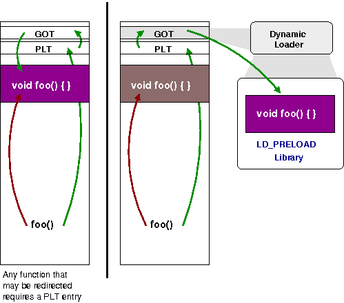

# 動態連結器篇


# [你所不知道的 C 語言](http://hackfoldr.org/dykc/)：動態連結器篇

*連結器比你想像中還親近*
Copyright (**慣C**) 2016 [宅色夫](http://wiki.csie.ncku.edu.tw/User/jserv)
- [直播錄影](https://www.youtube.com/watch?v=q6WGRujpya4)

</img>


[source](https://www.altalang.com/beyond-words/2013/08/19/how-is-english-used-as-a-lingua-franca-today/)

---

## 跨越程式語言的交流：透過 C 語言

lingua franca" 一詞源自 17 世紀義大利語稱呼「法蘭克語/口音」，後來引申為橋接用的語言，現代英語就扮演這樣的角色，讓世界各國、不同文化背景的人，得以透過共通的英語來交流。而對近代程式語言來說，就是指 C 語言。

以 Java 程式語言來說，儘管有 Java 虛擬機器，甚至能用 Java 開發 Java 虛擬機器 (如 [Jikes RVM](http://www.jikesrvm.org/), [Maxine VM](https://en.wikipedia.org/wiki/Maxine_Virtual_Machine), [Graal VM](http://openjdk.java.net/projects/graal/))，但和作業系統相關的操作仍需要透過 C 語言 (或 C++)，連同呼叫原本用 C/C++ 開發的函式庫在內。理解動態連結不僅是重新回顧 C 語言，更是透過橋接語言，深入理解系統運作。

## 貌似簡單的問題：「如何得知 malloc/free 的呼叫次數？」

### 簡單的作法

* 定義全域變數來紀錄: int malloc_count = 0, free_count = 0;
* 透過巨集 `#define MALLOC(x) do { if (malloc(x)) malloc_count++; } while (0)`
    * 技巧: [談Linux Kernel巨集 do{…}while(0) 的撰寫方式](http://loda.hala01.com/2011/11/%E8%AB%87linux-kernel%E5%B7%A8%E9%9B%86-do-while0-%E7%9A%84%E6%92%B0%E5%AF%AB%E6%96%B9%E5%BC%8F/)，避免 dangling-else
    * 因此迴避 “goto” 的使用，對結構化編程有幫助
* 這有什麼問題？
    * 要改寫原始程式碼，將 malloc 換成 MALLOC 巨集，沒更換到的話，就不會追蹤到
    * 對 C++ 不適用，即便底層 [libstdc++](https://gcc.gnu.org/onlinedocs/libstdc++/) 也用 malloc()/free() 來實做 new 和 delete
    * 使用到的函式庫 (靜態和動態) 裡頭若呼叫到 malloc()/free()，也無法追蹤到

* 要徹底解決這問題，其實就需要理解動態連結器 (dynamic linker) 的協助

* 以 GNU/Linux 搭配 [glibc](https://www.gnu.org/software/libc/) 為例
* File: **malloc_count.c**

```clike=
void *malloc(size_t size)
{
    char buf[32];
    static void *(*real_malloc)(size_t) = NULL;
    if (real_malloc == NULL) {
        real_malloc = dlsym(RTLD_NEXT, "malloc");
    }
    sprintf(buf, "malloc called, size = %zu\n", size);
    write(2, buf, strlen(buf));
    return real_malloc(size);
}
```

編譯和執行:

```
$ gcc -D_GNU_SOURCE -shared -ldl -fPIC -o /tmp/libmcount.so malloc_count.c
$ LD_PRELOAD=/tmp/libmcount.so ls
```

即可得知每次 `malloc()` 呼叫對應的參數，甚至可以統計記憶體配置，完全不需要變更原始程式碼。這樣的技巧，我們稱為 interpositioning。可能的應用是遊戲破解, 執行時期追蹤, sandboxing / software fault isolation (SFI), profiling，或者效能最佳化的函式庫 (如 [TCMalloc](http://goog-perftools.sourceforge.net/doc/tcmalloc.html))。

* 延伸閱讀: [Dynamic linker tricks: Using LD_PRELOAD to cheat, inject features and investigate programs](https://rafalcieslak.wordpress.com/2013/04/02/dynamic-linker-tricks-using-ld_preload-to-cheat-inject-features-and-investigate-programs/)
* Unrandomize (暫時不「亂」的亂數)

透過設定 LD_PRELOAD 環境變數，glibc 的 dynamic linker (ld-linux.so) 會在載入和重定位 (relocation) libc.so 之前，載入我們撰寫的 /tmp/libmcount.so 動態連結函式庫，如此一來，我們實做的 malloc 就會在 libc.so 提供的 malloc 函式之前被載入。當然，我們還是需要「真正的」 malloc，否則無法發揮作用，所以透過 dlsym 去從 libc.so 載入 malloc 程式碼，這裡 RTLD_NEXT 參數告知動態連結器，我們想從下一個載入的動態函式庫載入 malloc 的程式碼位址。

* GNU ld 有個選項 `-Bsymbolic-functions` 會影響 LD_PRELOAD 的行為
* [Symbolism and ELF files (or, what does -Bsymbolic do?)](https://blog.flameeyes.eu/2012/10/symbolism-and-elf-files-or-what-does-bsymbolic-do)

另一個範例:

* [用 LD_PRELOAD 替換動態連結的函式庫](https://github.com/shihyu/Linux_Programming/tree/master/example/%E7%94%A8LD_PRELOAD%E6%9B%BF%E6%8F%9B%E5%8B%95%E6%85%8B%E9%80%A3%E7%B5%90%E7%9A%84%E5%87%BD%E5%BC%8F%E5%BA%AB)

延伸閱讀:

* [Tutorial: Function Interposition in Linux](http://jayconrod.com/posts/23/tutorial-function-interposition-in-linux)
* [Real-time Linux 研究: Memory Allocation](https://embedded2016.hackpad.com/Real-time-Linux-Memory-Allocation-kS5wHum1S54)

也可使用 `_ld --wrap=symbol` 的方式，詳見_ [How to wrap a system call (libc function) in Linux](http://samanbarghi.com/blog/2014/09/05/how-to-wrap-a-system-call-libc-function-in-linux/)。

## "No such file or directory" 可能跟你猜想的不一樣

在動態連結的環境中，ELF interpreter 其實就是 dynamic linker!
詳見: [where is ELF interpreter](https://github.com/imay/imay.github.io/blob/master/_posts/2014-11-02-linker-loader.md)
[PatchELF](https://nixos.org/patchelf.html)

linux 核心的程式碼 [fs/binfmt_elf.c](http://lxr.free-electrons.com/source/fs/binfmt_elf.c)
Line 723

```clike=723
if (elf_ppnt->p_type == PT_INTERP) {
/* This is the program interpreter used for
 * shared libraries - for now assume that this
 * is an a.out format binary
 */
...
    elf_interpreter = kmalloc(elf_ppnt->p_filesz, GFP_KERNEL);
    if (!elf_interpreter) goto out_free_ph;

    retval = kernel_read(bprm->file, elf_ppnt->p_offset,
                         elf_interpreter, elf_ppnt->p_filesz);
```

延伸閱讀：

* 《[Binary Hacks](http://ukai.jp/Slides/2006/1024-gree/binhacks.pdf)》
* [Executable and Linkable Format](http://www.cs.stevens.edu/~jschauma/810/elf.html) (非常詳盡)
* [ELF Hacks](https://maskray.me/blog/2015-03-26-elf-hacks)
* [Hacking Your ELF For Fun And Profit](http://mgalgs.github.io/2013/05/10/hacking-your-ELF-for-fun-and-profit.html)

## 複習「編譯器和最佳化原理篇」

### **[From Source to Binary: How A Compiler Works: GNU Toolchain](http://www.slideshare.net/jserv/how-a-compiler-works-gnu-toolchain)**

* Compiler可以砍掉沒人使用的 static global variable 來節省空間，但是不能砍掉沒人使用的 non-static global variable，因為無法確定別的 [Compilation Unit](https://www.cs.auckland.ac.nz/references/unix/digital/AQTLTBTE/DOCU_015.HTM) 會不會用到此變數
    * 這是為何建議 local function 要宣告成 static 的用意！

[早期的 C 語言編譯器](https://www.bell-labs.com/usr/dmr/www/primevalC.html)沒有 preprocessor，在 1973 年之後，引入 preprocessor，啟發自 BCPL 和 PL/I 程式語言的 file inclusion 機制 [ [source](http://www.jslint.com/chistory.html) ]，對模組化設計有更好的支援。

* [legacy-cc](https://github.com/mortdeus/legacy-cc)
* [Hacker News 討論串](https://news.ycombinator.com/item?id=5748672)
* 延伸閱讀: [前置處理器應用篇](/C-nsP3dURE29l)

取自 [DIGITAL UNIX](https://en.wikipedia.org/wiki/Tru64_UNIX) 的 [DEC C Language Reference Manual](https://www.cs.auckland.ac.nz/references/unix/digital/AQTLTBTE/TITLE.HTM): (1997 年 12 月)

"A _compilation unit_ is C source code that is compiled and treated as **one logical unit**. The compilation unit is usually one or more entire files, but can also be a selected portion of a file if, for example, the #ifdef preprocessor directive is used to select specific code sections. **Declarations and definitions within a compilation unit determine the scope of functions and data objects**."

[ [出處](https://www.cs.auckland.ac.nz/references/unix/digital/AQTLTBTE/DOCU_015.HTM) ]
:::info
1998 年初，Compaq 收購 DEC，Digital UNIX 4.0F 更名為 Tru64 UNIX，強調是業界領先的 64-bit 作業系統，並且逐步淡化 Digital 品牌。
:::

在一個 compilation unit 內的宣告和定義，決定了函式與資料物件的有效範圍 (scope)。

* Compilation units
    * The most common way of building C projects is to decompose every source file into an object file then link all the objects together at the end. This procedure works great for incremental development, but it is suboptimal for performance and optimization. Your compiler can’t detect potential optimizations across file boundaries this way.
* LTO (Link Time Optimization)
    * LTO fixes the "source analysis and optimization across compilation units problem" by annotating object files with intermediate representation so source-aware optimizations can be carried out across compilation units at link time.
    * LTO can slow down the linking process noticeably, but make -j helps if your build includes multiple non-interdependent final targets (.a, .so, .dylib, testing executables, application executables, etc).
    * [clang LTO](http://llvm.org/docs/LinkTimeOptimization.html) ([guide](http://llvm.org/docs/GoldPlugin.html))
    * [gcc LTO](https://gcc.gnu.org/onlinedocs/gccint/LTO-Overview.html)

無論是 clang/LLVM 抑或 gcc，都支援了 LTO，對應的命令列選項是 `-flto`。

LTO 的效益: [Elimination of unused functions](https://gcc.gnu.org/wiki/LinkTimeOptimizationFAQ)

### [Modern C](http://icube-icps.unistra.fr/img_auth.php/d/db/ModernC.pdf)

* 來自法國 INRIA (國家資訊暨自動化研究院) 的大作，必讀！
* [CompCert](http://compcert.inria.fr/) 是 INRIA 旗下針對高度安全和可靠性需求研發、支援 formal verification 的 C 語言編譯器
* [CompCert](http://compcert.inria.fr/) 支持 C 語言的子集，可產生 x86 處理器架構輸出。優化後的程式碼效能約為 gcc -O1。CompCert 用 OCaml 開發，並且用證明驗證工具 [Coq](https://coq.inria.fr/) 驗證正確

以下 Rule 摘錄自《[Modern C](http://icube-icps.unistra.fr/img_auth.php/d/db/ModernC.pdf)》

[ **Rule 4.22.2.1** ] File scope static const objects may be replicated in all compilation units that use them. (Page 169)

英語中 replicate 有「複製」或「重複」的意思，這意思是說，一旦物件宣告為 static const，那麼編譯器就可以施加更多樣的最佳化策略。

[ **Rule 4.22.2.2** ] File scope static const objects cannot be used inside inline functions with external linkage. Another way is to declare them

```clike=
extern listElem const singleton;
```

and to define them in one of the compilation units:

```clike=
listElem const singleton = { 0 };
```

This second method has the big **disadvantage** that **the value of the object is not available in the other units that include the declaration**. Therefore we may miss some opportunities for the compiler to optimize our code.

考慮以下程式碼:

```clike=
inline listElem *listElem_init(listElem *el) {
    if (el) *el = singleton;
    return el;
}
```

如果編譯器已經得知 singleton 的內含值，那麼原本指定數值的操作就不用重複自記憶體載入，而且呼叫 listElem_init() 的地方就能更緊湊，對效能和程式追蹤有助益。

[ **Rule 4.22.2.3** ] File scope extern const objects may miss optimization opportunities for constant folding and instruction immediates.

以 extern 宣告的物件，會使得物件的位址可能會不經意被得知，而編譯器無法區分 alias 和常數本體的差異，進而無法施加最佳化。

[ **Rule 4.22.2.4** ] File scope extern or static const objects may miss optimization opportunities because of mispredicted aliasing.

[ **22.5\. Functions.** ] (Page 174)

inline declared functions have difficulties with other symbols that have no or internal linkage. Such functions that are not static at the same time can’t access to static file scope variable, even if they are const qualified. Our proposal simplifies things with that respect.

* A function declaration of storage class register is equivalent to a declaration as **static inline** with the additional property that its address can’t be taken.
* All functions that are **static inline** have access to register objects that are visible at their point of definition.
* All functions declared **inline** have access to register constants that are visible at their point of definition.


## Symbol Visibility

預設情況下，所有「不是 static」的函式都可會開放給其他 compilation unit 去存取，這樣的行為我們稱為 "export"。一個 symbol 一旦 export，就可能遇到前述的 interpositioning，這很可能會導致非預期的行為。解決方法是，妥善地設定 symbol visibility。

gcc 和 clang 都支援 [visibility](https://gcc.gnu.org/wiki/Visibility) 屬性和 **-fvisibility** 編譯命令，以便對每個 object file 來進行全域設定：

* **default** : 不修改 visibility
* **hidden** : 對 visibility 的影響與 **static** 這個 qualifier 相同。此 symbol 不會被放入 dynamic symbol table，其他動態連結函式庫或執行檔看不到此 symbol

```clike=
if (__GNUC__ > 3) && (defined(__ELF__) || defined(__PIC__))
#    define CHEWING_API __attribute__((__visibility__("default")))
#    define CHEWING_PRIVATE __attribute__((__visibility__("hidden")))
#else
#    define CHEWING_API
#    define CHEWING_PRIVATE
#endif
```

[ [source](https://github.com/chewing/libchewing/blob/master/include/global.h) ]

可透過編譯器參數來指定全域的 visibility，一旦設定為 hidden，則所有沒有特別指定 symbol 會被認定為 local，僅有修飾 **__attribute__ ((visibility ("default"))**

延伸閱讀:

* [Linker and Libraries Guide](https://docs.oracle.com/cd/E19683-01/816-1386/chapter6-79797/index.html)
* [Why symbol visibility is good](https://www.technovelty.org/code/why-symbol-visibility-is-good.html)

考慮以下程式碼: (sym.c)

```clike=
static int local(void) { }
int global(void) { }
int  __attribute__((weak)) weak(void) { }
```

編譯和分析:

```
$ gcc -o syms -c syms.c
$ LC_ALL=C readelf --syms ./syms
Symbol table '.symtab' contains 11 entries:
   Num:    Value          Size Type    Bind   Vis      Ndx Name
     0: 0000000000000000     0 NOTYPE  LOCAL  DEFAULT  UND 
     1: 0000000000000000     0 FILE    LOCAL  DEFAULT  ABS syms.c
     2: 0000000000000000     0 SECTION LOCAL  DEFAULT    1 
     3: 0000000000000000     0 SECTION LOCAL  DEFAULT    2 
     4: 0000000000000000     0 SECTION LOCAL  DEFAULT    3 
     5: 0000000000000000     7 FUNC    LOCAL  DEFAULT    1 local
     6: 0000000000000000     0 SECTION LOCAL  DEFAULT    5 
     7: 0000000000000000     0 SECTION LOCAL  DEFAULT    6 
     8: 0000000000000000     0 SECTION LOCAL  DEFAULT    4 
     9: 0000000000000007     7 FUNC    GLOBAL DEFAULT    1 global
    10: 000000000000000e     7 FUNC    WEAK   DEFAULT    1 
```

對照看之前的 malloc_count:

```
$ readelf --syms /tmp/libmcount.so | grep malloc
    15: 00000000000007c0   163 FUNC    GLOBAL DEFAULT   12 malloc
    35: 0000000000000000     0 FILE    LOCAL  DEFAULT  ABS malloc_count.c
    36: 0000000000201050     8 OBJECT  LOCAL  DEFAULT   24 real_malloc.3854
    61: 00000000000007c0   163 FUNC    GLOBAL DEFAULT   12 malloc
```

修改 malloc_count.c，讓定義的程式碼變更為以下:

```clike=
__attribute__((visibility("hidden"))) void *malloc(size_t size)
{ ... 其餘不變 ... }
```

就會發現 `LD_PRELOAD=/tmp/libmcount.so ls` 沒有效果。

換言之，我們定義的 `malloc` 已經變成 local，不會影響到其他動態連結函式庫和執行檔。

重新觀察:

```
$ readelf --syms /tmp/libmcount.so | grep malloc
    35: 0000000000000000     0 FILE    LOCAL  DEFAULT  ABS malloc_count.c
    36: 0000000000201050     8 OBJECT  LOCAL  DEFAULT   24 real_malloc.3854
    46: 00000000000007a0   163 FUNC    LOCAL  DEFAULT   12 malloc
```

可見到 visibility 從原本的 GLOBAL 變更為 LOCAL。

## 動態連結支援

簡報檔案: [Linking](http://www.scs.stanford.edu/15wi-cs140/notes/linkers.pdf)

為了支援動態連結，編譯器必須額外產生以下:

* _procedure Linkage table_ (==PLT==) entry for the function so that the dynamic loader can re-direct the function call.
* _global offset table_ (==GOT==)
    * The PLT is a trampoline which gets the correct address of the function being called (from the _global offset table_, GOT) and bounces the function call to the right place.

</img>


- [ ] [Ian Wienand](https://github.com/ianw) 的電子書 **(必讀！)**

	* [Chapter 9\. Dynamic Linking](https://www.bottomupcs.com/chapter08.xhtml)
    	* [Computer Science from the Bottom Up](https://www.bottomupcs.com/)

- [ ] [C語言編程透視](https://github.com/tinyclub/open-c-book) (電子書)

	* Chap 4

實驗小品

* [Better understanding Linux secondary dependencies solving with examples](http://www.kaizou.org/2015/01/linux-libraries)

延伸閱讀:

* [Modern dynamic linking infrastructure for PLT](http://lambda-the-ultimate.org/node/3474)
* Native Client: [Loading the dynamic linker and executable](https://chromium.googlesource.com/native_client/src/native_client/+/master/docs/initial_dynamic_load.md) (在網頁瀏覽器裡頭載入 ELF 執行檔，包含動態連結函式庫的支援)
    * [](https://developer.chrome.com/native-client)https://developer.chrome.com/native-client
* [Dynamic Linking and Loading](http://www.iecc.com/linker/linker10.html)
* [Anatomy of Linux dynamic libraries](http://www.ibm.com/developerworks/library/l-dynamic-libraries/)

進階應用

* [Applying Partial Virtualization on ELF Binaries Through Dynamic Loaders](http://amslaurea.unibo.it/5065/1/pareschi_federico_tesi.pdf)
* [](https://gitlab.com/o9000/malloc-profile)[https://gitlab.com/o9000/malloc-profile](https://gitlab.com/o9000/malloc-profile)

* A very basic memory profiler. Identifies code paths that allocate and release memory and displays a summary at program exit (or when the SIGUSR2 signal is received).

### 「作中學」：從實踐中學習

"[min-dl](https://github.com/jserv/min-dl)"，意思是 minimal dynamic linker。在這個實做中，我們展示 GOT / PLT 的處理機制，以及如何作 relocation，支援 x86_64 硬體架構，加上測試程式，整個程式碼才四百餘行。

ELF loader 這部分, 就跟 OS Kernel 設計有很大的關係, 像是,

1\. GNU LD (ld.so or ld-linux.so)

2\. Android linker (bionic/linker/*)

但是有些 Android App 出於某些速度上的原因, 希望一開始就把所有 Library 找齊 load 近來. 而非使用 Lazy loading 的方式, 等到 Java VM 需要時才 load shared library, 導致 latency. 所以,

1\. Google 來說, 搞了個叫 "android_crazy_linker" 這個 project

- 應用於 chrome project, 以 C++ 寫成.
- 好處是自己會去看 ELF header, 跟 allocate memory, 略過了 Android linker. 自己掌控大部分.

2\. Facebook 來說, 搞了個叫 "SoLoader" 這個 project.

* 全部都是 Java 寫的, 也會去看 ELF header. 但只限於從 ELF header 中去找到 dependency, 最終還是靠 Android linker 做事.

接下來我想探討的議題:

* [C 語言調試器是如何工作的？](http://blog.jobbole.com/94702/) (How Does a C Debugger Work?)
* gdb / lldb, our own debugger