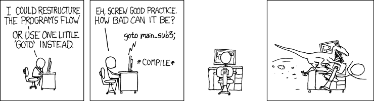

# [你所不知道的C語言](http://hackfoldr.org/dykc/): goto 和流程控制篇
Copyright (**慣C**) 2017 [宅色夫](http://wiki.csie.ncku.edu.tw/User/jserv)

:::warning
:warning: 注意
- 請透過 gitter (線上對話服務，可透過 GitHub 或 Twitter 帳號登入) 提交疑問和建議事項: [guts-general](https://gitter.im/embedded2015/guts-general) (按下去就對了)
:::


出處: [xkcd](https://xkcd.com/292/)

[Edgar Dijkstra: Go To Statement Considered Harmful](https://homepages.cwi.nl/~storm/teaching/reader/Dijkstra68.pdf) [1968 年]

[Considered harmful](https://en.wikipedia.org/wiki/Considered_harmful) 對應到臺灣的新聞用語就是「恐有 ___ 的疑慮」

需要留意到 Dijkstra 撰文的年代，當時的程式開發者面對的程式語言有諸多限制，並且容易濫用 goto，最後產生了 Spaghetti Code

1987 年 Frank Rubin 撰寫另一篇 ["GOTO Considered Harmful" Considered Harmful](https://web.archive.org/web/20090320002214/http://www.ecn.purdue.edu/ParaMount/papers/rubin87goto.pdf) 指出善用 goto 仍可帶來效益。隨後 Dijkstra 發表 ['"GOTO Considered Harmful" Considered Harmful' Considered Harmful?](http://www.cs.utexas.edu/users/EWD/transcriptions/EWD10xx/EWD1009.html)

延伸閱讀:
* [GOTO still considered harmful?](https://stackoverflow.com/questions/46586/goto-still-considered-harmful)


## MISRA C 禁用 goto 和 continue (但可用 break)

[MISRA - the Motor Industry Software Reliability Association](https://www.misra.org.uk/) 針對產業界軟體可靠性與穩定度，提出一系列的方針與準則，而針對 C Programming Language 的部份則稱為 "MISRA-C"，目的是在增進嵌入式系統的安全性及可移植性。針對 C++ 語言也有對應的標準 MISRA C++。

MISRA C 一開始主要是針對汽車產業，不過其他產業也逐漸開始使用 MISRA C，像是航太、電信、國防、醫療設備、鐵路等領域。
MISRA C 第一版《Guidelines for the use of the C language in vehicle based software》在 1998 年發行，一般稱為 MISRA-C:1998。

MISRA-C:1998 有 127 項規則，規則從 1 號編號到 127 號，其中有 93 項是強制要求，其餘 34 項是推薦使用的規則。在 2004 年時發行了第二版的 MISRA C的第一版《[Guidelines for the use of the C language in critical systems](http://caxapa.ru/thumbs/468328/misra-c-2004.pdf)》(或稱 MISRA-C:2004)，其中有許多重要建議事項的變更，其規則也重新編號。MISRA-C:2004 有 141 項規則，其中 121 項是強制要求，其餘的 20 項是推薦使用的規則。規則分為 21 類，從「開發環境」到「執行時期錯誤」。

[MISRA minimizes mishaps](https://www.embedded.com/electronics-blogs/break-points/4025734/MISRA-minimizes-mishaps) 以 "MISRA-C" 的規範為基礎，標示以下五個原則：
1. C is incompletely specified. How does process(j++, j); behave? And exactly what is the size of an int? How astounding that such a basic component of any program is undefined!
2. Developers make mistakes, and the language does little to point out many of the even obvious screwups. It's so easy to mix up "=" and "==."
3. Programmers don't always have a deep knowledge of the language and so make incorrect assumptions. Compilers have bugs, or purposely deviate from the ANSI standard. 4. Most 8051 compilers, for instance, have run-time packages that take and return single precision results for trig functions instead of the prescribed doubles.
5. C offers little intrinsic support for detecting run-time errors.

[Why "continue" is considered as a C violation in MISRA C:2004?](https://stackoverflow.com/questions/10975722/why-continue-is-considered-as-a-c-violation-in-misra-c2004)

Case in point: MISRA C forbids goto statements primarily because it can mess up static analysis. Yet this rule is gratuitously followed even when no static analysis tools are used, thus yielding none of the gains that you trade off for occasionally writing ugly code.


## GOTO 沒想像中那麼可怕

* [有時不用 goto 會寫出更可怕的程式碼](http://eli.thegreenplace.net/2009/04/27/using-goto-for-error-handling-in-c)
* [13118 個 goto 在 Linux 核心原始程式碼](https://github.com/torvalds/linux/search?utf8=%E2%9C%93&q=goto)
* OpenBSD httpd 的「下水道風格」例外處理: [OpenBSD's httpd](https://github.com/reyk/httpd/blob/master/httpd/httpd.c#L548)
```C
const char *canonicalize_host(const char *host, char *name, size_t len)
{
    if (len < 2)
        goto fail;

    ...
    plen = strlen(host);
    memset(name, 0, len);
    for (i = j = 0; i < plen; i++) {
        if (j >= (len - 1))
            goto fail;
        c = tolower((unsigned char) host[i]);
        if ((c == '.') && (j == 0 || name[j - 1] == '.'))
            continue;
        name[j++] = c;
    }

    for (i = j; i > 0; i--) {
        if (name[i - 1] != '.')
            break;
        name[i - 1] = '\0';
        j--;
    }
    if (j <= 0)
        goto fail;

    return (name);

fail:
    errno = EINVAL;
    return (NULL);
}

```
* [Common usage patterns of Goto](https://en.wikipedia.org/wiki/Goto#Common_usage_patterns_of_Goto)


## 對效能影響重大的 goto

根據 [Computed goto for efficient dispatch tables](https://eli.thegreenplace.net/2012/07/12/computed-goto-for-efficient-dispatch-tables) 這篇提到了兩種實作方式，switch-case 以及 computed goto

switch-case 透過一個無窮迴圈內含一個 switch 來判斷目前的 bytecode 應該執行什麼程式，類似的實作還有 [這篇](http://bartoszsypytkowski.com/simple-virtual-machine/)，程式碼大致如下：
```clike
while (1) {   
    switch (instr[pc++]) {
        
        case OP_1:
            OP_1();
            break;
        case OP_2:
            OP_2();
            break;
        
        ...
    }
}
```

computed goto 是 GNU extension，參照 [gcc - labels as values](https://gcc.gnu.org/onlinedocs/gcc/Labels-as-Values.html)，可以將 label 的 address 存入 `void *` 型態的 pointer 中，用法如下：
```clike
void *ptr = &&label;
...
goto *ptr;
```

也能一次跟陣列搭配使用:
```clike
static void *array[] = { &&foo, &&bar, &&hack };
...
goto *array[0];
```

而使用 computed goto 來進行 opcode dispatch 的話，程式碼大致如下：
```clike
static void *op_labels = { &&OP_1, &&OP_2, .... };
#define DISPATCH() goto *op_labels[instr[pc++]]
    
...
OP_1:
    OP_1();
    DISPATCH();
OP_2:
    OP_2();
    DISPATCH();  
...
```

這兩種的效能比較可以從兩個地方來看：
- bounds checking
- branch prediction

bounds checking 是在 switch 中執行的一個環節，每次迴圈中檢查是否有 default case 的狀況，即使程式中的 switch 沒有用到 default case，compiler 在編譯時還是會產生強制檢查的程式，所以 switch 會較 computed goto 多花一個 bounds checking 的步驟

branch prediction 的部分，switch 需要預測接下來跳到哪個分支 case，而 computed goto 則是在每個 instruction 預測下一個 instruction，這之中比較直覺的想法是 computed goto 的可以根據上個指令來預測，但是 switch 的每次預測沒辦法根據上個指令，因此在 branch prediction accuracy 上 computed goto 會比較高

* 延伸閱讀: [實作 simulator](https://hackmd.io/s/Hkf6pkPAb)


## `do { ... } while(0)` 巨集

* 避開 dangling else
* 延伸閱讀: [ multi-line macro: do/while(0) vs scope block](https://stackoverflow.com/questions/1067226/c-multi-line-macro-do-while0-vs-scope-block)

## 用 goto 實作 RAII 開發風格

C++ 常見的 RAII 指的是 "Resource Acquisition Is Initialisation"，字面上的意思是：「資源獲得即進行初始化」。意即：一旦在程式中有「資源配置」的行為，也就是一旦有「配置、釋放」的動作，就讓「配置」成為一個初始化的動作，如此，釋放動作就變成自動的了（依物件的作用範圍 [scope] 決定）。

```C
void foo() {
    if (!doA())
        goto exit;
    if (!doB())
        goto cleanupA;
    if (!doC())
        goto cleanupB;

    /* everything has succeeded */
    return;

cleanupB:
    undoB();
cleanupA:
    undoA();
exit:
    return;
}
```

不用 goto 的話，需要寫成這樣:
```C
int foo() {
    if (!doA())
        return;
    if (!doB()) {
        undoA();
        return;
    }
    if (!doC()) {
        undoB();
        undoA();
        return;
    }
}
```
不僅可讀性差，而且要擴充困難。使用 goto 的版本甚至可透過 macro 來包裝例外處理。

[RAII in C](https://vilimpoc.org/research/raii-in-c/)

Linux 核心原始程式碼: [shmem.c](https://github.com/torvalds/linux/blob/master/mm/shmem.c)

High Level C
(http://libcello.org/)

## 回頭檢閱 C 語言規格書

在 [ISO/IEC 9899:201x Committee Draft](http://www.open-std.org/jtc1/sc22/wg14/www/docs/n1548.pdf) (也就是 C11 標準之前的公開檢閱版本) 的第 150 頁

6.8.6 Jump statements 
- [ ] jump-statement:
> goto identifier ;
> continue ;
> break ;
> return expression~opt~ ;

- [ ] Semantics
A jump statement causes an unconditional jump to another place

無條件跳躍，注意到範圍是 "another place"，而不是「到任意程式碼」

後方的範例:
```C
    /* ... */
    goto first_time;
    for (;;) {
        // determine next operation
        /* ... */
        if (need to reinitialize) {
            // reinitialize-only code
            /* ... */
        first_time:
            // general initialization code
            continue;
        }
        // handle other operations
        /* ... */
   }
```

較大的 C 語言專案中用到 `goto`，常見的情境是例外處理。
因為 C 語言的特性，出錯了的時候，很多動態配置的記憶體會需要回收掉，
要不然會造成 memory leak，這時候 goto 就變得很方便。

舉例: CPython 的 [Modules/_asynciomodule.c](https://github.com/python/cpython/blob/master/Modules/_asynciomodule.c#L1711)

```C
    static void
    TaskObj_finalize(TaskObj *task)
    {
        /* ... */
        if (task->task_state != STATE_PENDING ||
            !task->task_log_destroy_pending) {
            goto done;
        }

        /* ... */
        context = PyDict_New();
        if (context == NULL) {
            goto finally;
        }

        message = PyUnicode_FromString("Task was destroyed...");
        if (message == NULL) {
            goto finally;
        }

        /* ... */
    finally:
        Py_XDECREF(context);
        Py_XDECREF(message);

        /* Restore the saved exception. */
        PyErr_Restore(error_type, error_value, error_traceback);

    done:
        FutureObj_finalize((FutureObj*)task);
    }
```

第一個 `goto done`，因為還沒 allocate context 或是 message，所以不需要去做善後的工作，如果這時候觸發這個 goto 的話，就直接到底就好。

但是如果遇到 context 或是 message allocate 失敗的話，因為已經有
allocate 一些資源，就必須要跳到 finally 去把這些資源給清空以及還原。

在 [Modern C](http://icube-icps.unistra.fr/img_auth.php/d/db/ModernC.pdf)，作者 Jens Gustedt 總結 3 項和 `goto` 有關的規範:

* Rule 2.15.0.1: Labels for goto are visible in the whole function that contains them.
* Rule 2.15.0.2: goto can only jump to a label inside the same function.
* Rule 2.15.0.3: goto should not jump over variable initializations.


## 和想像中不同的 switch-case

考慮以下程式碼：(test.c)
```C
#include <stdio.h>
#define DEBUG 1
#define DBG( ... ) \
    if (DEBUG) {  __VA_ARGS__; }
int main(int argc, char *argv[]) {
    char *num;
    switch (argc - 1) {
             case  0: num =  "zero";
        DBG( case  1: num =   "one"; )
        DBG( case  2: num =   "two"; )
        DBG( case  3: num = "three"; )
        DBG( default: num =  "many"; )
        while (--argc)
            printf("%s ", argv[argc]);
        printf("\nArgument count: %s\n", num);
        break;
    }
    return 0;
}
```
先不看 DBG() macro 的使用，似乎沒什麼特別之處，編譯並執行看看：
```shell
$ gcc -Wall -o test test.c
$ ./test 1 && ./test 1 2 && ./test 1 2 3 && ./test 1 2 3 4
1
Argument count: many
2 1
Argument count: many
3 2 1
Argument count: many
4 3 2 1
Argument count: many
```

完全符合預期，就是把 switch-case 走訪一遍，因為沒有 break 敘述，就到了最終的 "default" 條件，所以 char *nnum 指向字串 "many" 的記憶體位址。但倘若我們將第二行的 DEBUG 定義修改為以下：
```C
#define DEBUG 0
```
再來重新編譯與執行看看：
```shell
$ gcc -Wall -o test test.c
$ ./test 1 && ./test 1 2 && ./test 1 2 3 && ./test 1 2 3 4
1
Argument count: one
2 1
Argument count: two
3 2 1
Argument count: three
4 3 2 1
Argument count: many
```

這是什麼狀況呢？被一串 if (0) { ... } 包圍的 switch-case 竟然會被處理，而且 break 巧妙地伴隨每個敘述出現。也就是說，原本的 "DBG( case 1: num = "one"; )" 相當於 break; case 1: num = "one; break; 的效力。像這樣的 C 語法結構，可歸納為 [Clifford's Device](http://www.clifford.at/cfun/cliffdev/)，簡單來說，就是符合以下的結構：
if (0) { label: ... }

引述網頁描述：
> "it is skipped in the normal flow of execution and is only reached via the goto label, reintegrating with the normal flow of execution and the end of the if (0) statement. It solves a situation where one would usually need to duplicate code or create a state variable holding the information if the additional code block should be called."

在普通的執行流程中，if (0) { ... } 包圍的陳述指令會被忽略，但倘若配合 goto 時 (本例是 switch-case，一個 C 語法的變形)，就不是這麼一回事，翻譯成組合語言或機械碼時，其實是很清楚且常見的結構。這樣的結構對於縮減煩冗的程式碼有些特別用途。上述程式碼有趣之處，就在於像 DBG() 這類的 macro 在前期開發階段通常被設定為 "1"，在後期則會逐步取消偵錯 / 驗證的程式碼時，將 macro 改為 if (0) { ... } 型態，而使開發者誤踩到「未爆彈」。

```C
#include <stdio.h>

typedef enum tagCmd { cmd1, cmd2, cmd3 } Cmd;
void doCmd(Cmd cmd) {
    switch (cmd) {
    case cmd1:
        printf("Cmd1\n");
        break;
    case cmd2:
        printf("Cmd2\n");
        break;
}

int main() {
    doCmd(cmd1);
    return 0;
}
```
用 gcc 編譯會出現以下警告:
```shell
$ gcc -Wall -Werror switch.c
switch.c: In function 'doCmd':
switch.c:5:5: error: enumeration value 'cmd3' not handled in switch [-Werror=switch]
```
如果補上 `if (0) { case cmd3: break; }` 則不會有任何警告。

延伸閱讀:
* [Something You May Not Know About the Switch Statement in C/C++](https://www.codeproject.com/Articles/100473/Something-You-May-Not-Know-About-the-Switch-Statem)
* [How to Get Fired Using Switch Statements & Statement Expressions](http://blog.robertelder.org/switch-statements-statement-expressions/)


# Duff's Device

https://en.wikipedia.org/wiki/Duff%27s_device
	
If Duff's device doesn't need a goto, then neither should you! ;)
```C
void dsend(int count) {
    if (!count)
        return;
    int n = (count + 7) / 8;
    switch (count % 8) {
    case 0:
        do {
            puts("case 0");
        case 7:
            puts("case 7");
        case 6:
            puts("case 6");
        case 5:
            puts("case 5");
        case 4:
            puts("case 4");
        case 3:
            puts("case 3");
        case 2:
            puts("case 2");
        case 1:
            puts("case 1");
        } while (--n > 0);
    }
}
```
關於 [Duff's Device 的詳盡解釋](http://c-faq.com/misc/duffexpln.html)


## co-routine 應用

PuTTY 作者 Simon Tatham
[Coroutines in C](https://www.chiark.greenend.org.uk/~sgtatham/coroutines.html)

Donald E. Knuth 的經典著作《The Art of Computer Programming》提到 coroutine 這個自 1960 年代即現身的多工實做技術，原理相當單純，在多數的文獻中會以 "yield" 來闡述，但不免令人困惑。coroutine 的 "yield" 是屬於程式語言層面，透過特定技巧或機制，讓原本循序執行的陳述指令，得以做出交錯執行的結果，而 multi-threading 的 "yield" 則偏重於系統層面 (如 CPU resource)，簡單來說，該如何一方面允許多 thread 交錯執行，又能適當規劃個別單元對系統資源的使用。

以 run-length decompression 為例，探討 coroutine 技巧可如何大幅改善原本的設計流程，如此的技巧遍及多種領域，知名的 SSH 客戶端程式 PuTTY 就大量使用。
* 對應的 [ssh.c 程式碼](https://github.com/Yasushi/putty/blob/31a2ad775f393aad1c31a983b0baea205d48e219/ssh.c#L414)

最佳的理解方式就是找個主題來驗證我們的認知，我們可試著在 Linux 上模擬一個 user-level thread system，以下是實做程式碼：

```C
#include <stdio.h>
#include <unistd.h>

#define THREAD_INTERVAL 500
#define cr_start()      \
    static int __s = 0; \
    switch (__s) {      \
    case 0:

#define cr_yield                 \
    {                            \
        __s = __LINE__;          \
        usleep(THREAD_INTERVAL); \
        return;                  \
    case __LINE__:;              \
    }
#define cr_end() \
    }            \
    __s = 0;

static int condition = 1;

static void user_thread_1() {
    cr_start();

    for (;;) {
        /* do something */
        printf("Run %s\n", __FUNCTION__);
        cr_yield;
    }

    cr_end();
}

static void user_thread_2() {
    cr_start();

    for (;;) {
        if (condition) {
            /* do something conditional */
            printf("Run %s - (1)\n", __FUNCTION__);
            cr_yield;
        }

        /* do something */
        printf("Run %s - (2)\n", __FUNCTION__);
        condition = !condition;
        cr_yield;
    }

    cr_end();
}

int main() {
    for (;;) {
        user_thread_1();
        user_thread_2();
    }
    return 0;
}
```

一般的 function/method invocation 是 context switching 的行為 (注意：這裡的 context switching 與作業系統的術語不直接對應，而是強調 stack-based operation)，而 coroutine 最重要的想法就是保持上一次的 context，所以常用的實做技巧就是透過 "generator" 來實現 coroutine 中對 "yield" 的認知："yield = context saver + jump"。由上面的程式碼列表可見，我們透過 C Macro 簡化細節以吻合 coroutine 的「表徵」，同時也可看到如此模擬出 thread scheduler 的行為，換言之，這是「合作式多工」的基礎概念。

以下為上述程式碼之執行結果：
```shell
$ ./user-thread
Run user_thread_1
Run user_thread_2 - (1)
Run user_thread_1
Run user_thread_2 - (2)
Run user_thread_1
Run user_thread_2 - (2)
Run user_thread_1
Run user_thread_2 - (1)
Run user_thread_1
Run user_thread_2 - (2)
Run user_thread_1
Run user_thread_2 - (2)
Run user_thread_1
Run user_thread_2 - (1)
...
```
而程式碼列表中的 usleep 則確保有機會透過 Ctrl-C 或互動式操作結束此程式，避免無謂的 busy-waiting。

==[解釋](https://airfishqi.blogspot.tw/2016/11/switch-case.html)==

[Protothreads](http://dunkels.com/adam/pt/): extremely lightweight stackless threads
也用到這技巧

檔案 `lc-addrlabels.h`
```C
#define LC_RESUME(s)                            \
  do {                                          \
    if(s != NULL) {                             \
      goto *s;                                  \
    }                                           \
  } while(0)

...

#define LC_SET(s)                               \
  do {                                          \
    LC_CONCAT(LC_LABEL, __LINE__):              \
    (s) = &&LC_CONCAT(LC_LABEL, __LINE__);      \
  } while(0)
```
Implementation of local continuations based on the "Labels as values" feature of gcc.
