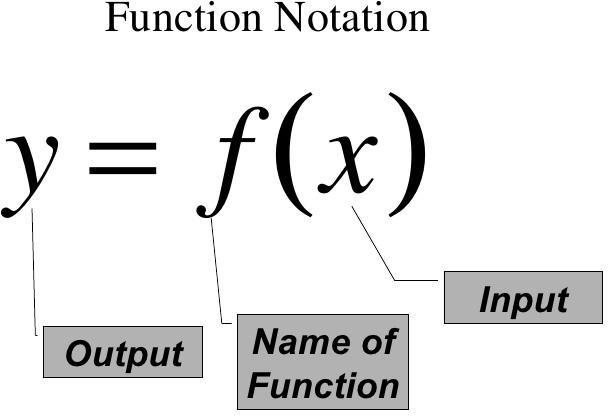
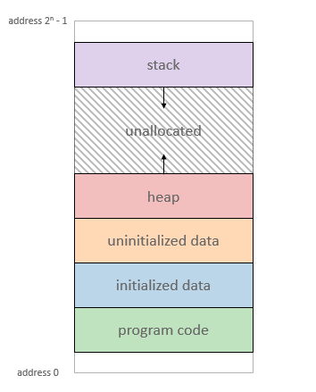
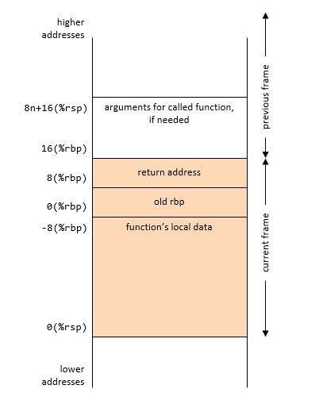
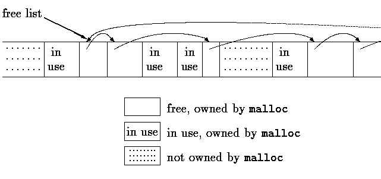

# 函式呼叫篇


# [你所不知道的C語言](http://hackfoldr.org/dykc/)：函式呼叫篇
*函式呼叫和計算機結構的高度關聯*
Copyright (**慣C**) 2015, 2016 [宅色夫](http://wiki.csie.ncku.edu.tw/User/jserv)


* 早期 C 語言 (1972-1973) -> K&R C (1976-1979) -> ANSI C (1983-1989) -> ISO
    * ANSI C -> C++ (1985-) # 融合 Simula 67 和 Ada 特色 
    * Cfront: C with class
    * source: [History of C](http://en.cppreference.com/w/c/language/history)
* 許多程式語言允許 function 和 data 一樣在 function 內部定義，但 C 語言不允許這樣的 nested function，換言之，C 語言所有的 function 在語法層面都是位於最頂層 (top-level)
    * nested function 是編譯器的擴展
* 「不允許 nested function」這件事簡化了 C 編譯器的設計
    * 在 Pascal, Ada, Modula-2, PL/I, Algol-60 這些允許 nested function 的程式語言中，需要一個稱為 static link 的機制來紀錄指向目前 function 的外層 function 的資訊
    * uplevel reference

## 再論 Function


[数学定义的 Function](https://www.cs.colorado.edu/~srirams/courses/csci2824-spr14/functionsCompositionAndInverse-17.html)



在 C 語言中，"function" 其實是退化過的形式。以下摘錄 [Wikipedia C-- 詞條](https://en.wikipedia.org/wiki/C--):

* C is a poor choice for functional languages: it does not support [tail recursion](https://en.wikipedia.org/wiki/Tail_recursion), accurate [garbage collection](https://en.wikipedia.org/wiki/Garbage_collection_(computer_science)) or efficient [exception handling](https://en.wikipedia.org/wiki/Exception_handling).
* C-- is a simpler, tightly-defined alternative to C which does support all of these things.

C-- 在 1997 年才提出，距離 C 語言出現整整過了25 年，前者主要的功能是作為編譯器的 IR (中間表示式)，主要用於  [Glasgow Haskell Compiler](https://en.wikipedia.org/wiki/Glasgow_Haskell_Compiler) (縮寫 ghc，是 Microsoft Research 一項高影響力的開放原始碼專案)

## Process 和 C 程式的關聯

PDP-7 => PDP-11

* PDP-11: MMIO (memory mapped I/O)
* *0x404690 = 1;

IBM PC: 1980s: PIO, inb, outb

runtime = 執行時期

* [The Internals of "Hello World" Program](http://www.slideshare.net/jserv/helloworld-internals)

[ [source](http://gghh.name/dibtp/2015/11/10/function-calls-in-c-the-boring-specs.html) ]



* instructions: 自 object file (ELF) 映射 (map) 到 process 的 program code (機械碼)
* static data: 靜態初始化的變數
* BSS: 全名已 ==不可考==，一般認定為 "Block Started by Symbol”，未初始化的變數或資料
    * 可用 `size` 指令來觀察
* Heap 或 data segment: 執行時期才動態配置的空間
    * sbrk 系統呼叫 (sbrk = set break) 
    * malloc/free 實際的實做透過 sbrk 系統呼叫
* Stack: 函式呼叫的實做基礎


ELF segment & section

一個 segment 包含若干個 section

```shell=
$ sudo cat /proc/1/maps | less
55cff6602000-55cff678b000 rw-p  [heap]
7fff7e13f000-7fff7e160000 rw-p  [stack]
```

program loader
XIP: execution in place

## 從遞迴學習 function call

[ **infinite.c** ]

```clike=
int func() {
    static int count = 0;
    return ++count && func();
}

int main() {
    return func();
}
```

用 GDB 執行和測試，記得加上 `-g`

```shell
$ gcc -o infinite infinite.c -g
$ gdb -q infinite
Reading symbols from infinite...done.
(gdb) r
Starting program: /tmp/infinite

Program received signal SIGSEGV, Segmentation fault.
0x00000000004004f8 in func () at infinite.c:3
3                return ++count && func();
(gdb) p count
$1 = 524032
```

如果將  infinite.c 改為以下，重複上述動作：

```clike=
int func(int x) {
    static int count = 0;
    return ++count && func(x++);
}

int main() {
    return func(0);
}
```

將得到：

```shell
Program received signal SIGSEGV, Segmentation fault.
0x0000000000400505 in func (x=1) at infinite.c:3
3                return ++count && func(x++);
(gdb) p count
$1 = 262016
```

繼續修改 infinite.c 為以下，重複上述動作:

```clike=
int func(int x) {
    static int count = 0;
    int y = x; // local var
    return ++count && func(x++);
}

int main() {
    return func(0);
}
```

將得到以下：

```shell
Program received signal SIGSEGV, Segmentation fault.
0x00000000004004de in func (x=<error reading variable: Cannot access memory at address 0x7fffff7fefec>) at infinite.c:1
1        int func(int x) {
(gdb) p count
$1 = 174677
```

stack 裡面有 x (parameter), y (local variable), return address

stack frame

觀察 UNIX Process 中的 stack 空間

```shell
$ sudo cat /proc/1/maps | grep stack
7fff7e13f000-7fff7e160000 rw-p 00000000 00:00 0 [stack]
```

60000~Hex~ - 3f000~Hex~ = 21000~Hex~ = 135168~Dec~

135168 * 4 = 540672

這跟前面的數字很像！

函式就是「做好」與「做滿」

* return address 很重要，不管有沒有選上，都要有 ==退路==

sp = stack pointer; stack register

操作 GDB

[ [source](http://gghh.name/dibtp/2015/11/11/function-calls-in-c-practical-example.html) ] 

(AMD x86_64) A stack frame’s best friends are the two registers rsp and rbp, called the “stack pointer” and the “frame pointer”.

function prologue

function epilogue

(gdb) x /16gx $rsp

5.10. Borrow an


檔裡可以沒有註解，註解不能離開檔而存在

**延伸閱讀**

* [递归与尾递归（C语言）](http://blog.jobbole.com/80626/)

## stack-based buffer overflow

* [CVE-2015-7547](https://access.redhat.com/security/cve/cve-2015-7547)
    * vulnerability in glibc’s DNS client-side resolver that is used to translate human-readable domain names, like google.com, into a network IP address. [ [解說](http://thehackernews.com/2016/02/glibc-linux-flaw.html) ]

* [Buffer Overflow : Example of Using GDB to Check Stack Memory](http://www.cs.ucf.edu/~czou/CAP6135-12/bufferOverFlow-gdb-example.ppt)

    準備 `gdb-example.c`，其內容為:

    ```clike=
    #include <stdio.h>
    void foo(char * input){
        int a1=11;
        int a2=22;
        char buf[7];
        strcpy(buf, input);
    }

    void main(int argc, char **argv){
        foo(argv[1]);
    }
    ```

    編譯，記得加上 -g 和 -m32

    用 i686 架構執行 GDB:

    ```shell
    $ setarch i686 -R gdb -q ./gdb-example
    (gdb) break 6
    Breakpoint 1 at 0x804847a: file gdb-example.c, line 6.
    (gdb) run “whatever”
    Starting program: /tmp/gdb-example "whatever"

    Breakpoint 1, foo (input=0xffffd406 "whatever") at gdb-example.c:6
    6                strcpy(buf, input);
    ```

    觀察 stack 內容:

    ```shell
    (gdb) info frame
    Stack level 0, frame at 0xffffd180:
    eip = 0x8048490 in foo (gdb-example.c:6); saved eip = 0x80484da
    called by frame at 0xffffd1b0
    source language c.
    Arglist at 0xffffd178, args: input=0xffffd40c "whatever"
    Locals at 0xffffd178, Previous frame’s sp is 0xffffd180
    Saved registers:
    ebp at 0xffffd178, eip at 0xffffd17c
    (gdb) x &a1
    0xffffd15c:        0x0000000b
    (gdb) x &a2
    0xffffd160:        0x00000016
    (gdb) x buf
    0xffffd165:        0x44f7f9c0
    (gdb) x 0xffffd160
    0xffffd160:        0x00000016
    ```

## 藏在 Heap 裡的細節

free() 釋放的是 pointer 指向位於 heap 的連續記憶體，而非 pointer 本身佔有的記憶體 (*ptr)。

舉例來說：

```clike=
#include <stdlib.h>

int main()
{
    int *p = (int *) malloc(1024);
    free(p);
    free(p);
    return 0;
}
```

編譯不會有錯誤，但運作時會失敗：

*** Error in './free': double free or corruption (top): 0x000000000067a010 ***

倘若改為以下：

```clike=
#include <stdlib.h>

int main()
{
    int *p = (int *) malloc(1024);
    free(p);
    p = NULL;
    free(p);
    return 0;
}
```

則會編譯和執行都成功。

因此，為了防止對同一個 pointer 作 free() 兩次的操作，而導致程式失敗，free() 後應該設定為 NULL。

[ ==Homework== ] 為什麼 glibc 可以偵測出上述程式的 "double free or corruption" 呢？

## malloc / free

**在 GNU/Linux 裡頭觀察 malloc**

```shell=
$ gdb -q `which gdb`
Reading symbols from /usr/bin/gdb...(no debugging symbols found)...done.
(gdb) start
Temporary breakpoint 1 at 0x45d450
...
(gdb) p ((double(*)())pow)(2.,3.)
$1 = 8
(gdb) call malloc_stats()
Arena 0:
system bytes     =     135168
in use bytes     =      28000
Total (incl. mmap):
system bytes     =     135168
in use bytes     =      28000
max mmap regions =          0
max mmap bytes   =          0
$2 = -168929728
(gdb) call malloc_info(0, stdout)
<malloc version="1">
<heap nr="0">
```

glibc 提供了 `malloc_stats()` 和 `malloc_info()` 这两个函式，可显示 process 的 heap 资讯

**延伸阅读**

* [如何实现一个malloc](http://blog.jobbole.com/75656/)
* [c malloc/free 初探 ](http://descent-incoming.blogspot.tw/2015/06/c-mallocfree.html) 
* [用 C 语言编写一个简单的垃圾回收器](http://blog.jobbole.com/77248/)

[https://sourceware.org/gdb/onlinedocs/gdb/Target-Description-Format.html](https://sourceware.org/gdb/onlinedocs/gdb/Target-Description-Format.html)

malloc: first-fit => [https://github.com/jserv/mini-arm-os/blob/master/07-Threads/malloc.c](https://github.com/jserv/mini-arm-os/blob/master/07-Threads/malloc.c)



## 參考資料

* [Function calls in C: the boring specs](http://gghh.name/dibtp/2015/11/10/function-calls-in-c-the-boring-specs.html)
* [Function calls in C: a practical example](http://gghh.name/dibtp/2015/11/11/function-calls-in-c-practical-example.html)
* [Glibc malloc internal](http://www.slideshare.net/kosaki55tea/glibc-malloc)
* [Glibc Adventures: The Forgotten Chunks](http://www.contextis.com/documents/120/Glibc_Adventures-The_Forgotten_Chunks.pdf)
* [Are We Shooting Ourselves in the Foot with Stack Overflow](http://embeddedgurus.com/state-space/2014/02/are-we-shooting-ourselves-in-the-foot-with-stack-overflow/)
* [Using GNU’s GDB Debugger: Memory Layout And The Stack](http://www.dirac.org/linux/gdb/02a-Memory_Layout_And_The_Stack.php)
* [What is memory safety?](http://www.pl-enthusiast.net/2014/07/21/memory-safety/)
* [A Malloc Tutorial](http://www.inf.udec.cl/~leo/Malloc_tutorial.pdf)
* [Understanding the Stack](http://www.cs.umd.edu/class/sum2003/cmsc311/Notes/Mips/stack.html)
* [How Functions Work](http://www.slideshare.net/saumilshah/how-functions-work-7776073)
* [C Function Call Conventions and the Stack](http://www.csee.umbc.edu/~chang/cs313.s02/stack.shtml)
* [How Does a C Debugger Work? (GDB Ptrace/x86 example)](http://blog.0x972.info/?d=2014/11/13/10/40/50-how-does-a-c-debugger-work-gdb-ptracex86-example)
* [8 gdb tricks you should know](https://blogs.oracle.com/ksplice/entry/8_gdb_tricks_you_should)
* [A Quick Tutorial on Implementing and Debugging Malloc, Free, Calloc, and Realloc](http://danluu.com/malloc-tutorial/)
    * gdb included!
* [Understanding C by learning assembly](https://www.recurse.com/blog/7-understanding-c-by-learning-assembly)
* [Code Injection into Running Linux Application](http://www.codeproject.com/Articles/33340/Code-Injection-into-Running-Linux-Application)
* [Journey to the Stack, Part I](http://duartes.org/gustavo/blog/post/journey-to-the-stack/)
* [Anatomy of a Program in Memory](http://duartes.org/gustavo/blog/post/anatomy-of-a-program-in-memory/)

## Q&A

* [x] 频繁地使用 `malloc()` / `free()` 会产生 [memory fragmentation](https://en.wikipedia.org/wiki/Fragmentation_(computing))，该如何避免？
    Hint: memory pool

* [x] C++ 中多了 new/delete 两个用法，与 malloc() /  free() 有什么样的差别？<s>比较建议使用哪一种？</s>
    [http://descent-incoming.blogspot.tw/2013/12/operator-newdelete.html](http://descent-incoming.blogspot.tw/2013/12/operator-newdelete.html)
    [http://stackoverflow.com/questions/3941271/why-are-malloc-and-printf-said-as-non-reentrant](http://stackoverflow.com/questions/3941271/why-are-malloc-and-printf-said-as-non-reentrant)

* [x] free完某pointer后是不是一定要做 pointer = NULL？
    避免 doubly free

* [x] 如何检查自己的程式有无memory leak(使用ARM或x86的情况)？
    >> you could try
    >> [http://valgrind.org/](http://valgrind.org/)

* [x] coroutine 主要方法是增加global变数来减少function的中操作stack的存取吗? 而增加的global变数是化简原本stack的记忆体存取，ex 在stack重复push位置一样的值。
    depends on implementations
    => [http://fanf.livejournal.com/105413.html](http://fanf.livejournal.com/105413.html)
    => [http://blog.linux.org.tw/~jserv/archives/001848.html](http://blog.linux.org.tw/~jserv/archives/001848.html)

* [ ] <s>C 语言是否存在能实现如 C++ RAII 机制的方法？</s>

* [x] C有办法做到JAVA内的reflection机制吗？
    Eg.  GLib/GObject 
    GLib/GObject is an object system, with single-inheritance and RTTI (run-time type identification), implemented in C.
    [GObject Introspection](https://wiki.gnome.org/action/show/Projects/GObjectIntrospection)

* [x] <s>之前上课有提到C runtime，C runtime是何时被执行的？每种语言都有自己的runtime吗？有的话，怎么知道现在执行的Program需要哪个runtime？</s>
    [http://descent-incoming.blogspot.tw/2016/01/for-stm32f4discovery-12-c.html](http://descent-incoming.blogspot.tw/2016/01/for-stm32f4discovery-12-c.html)

* [x] 为什么 linux kernel 里面很多 function 都要宣告成 static ??
    name conflict, abstraction

* [x] 請問前面的圖把Kernel映射進virtual memory有什麼功用嗎?

* [x] 為什麼 free() 不要給 size?

* [ ] setjmp() longjmp()如何實做 error handling ? ref: [http://descent-incoming.blogspot.tw/2015/09/c-c-exception-handle.html](http://descent-incoming.blogspot.tw/2015/09/c-c-exception-handle.html)