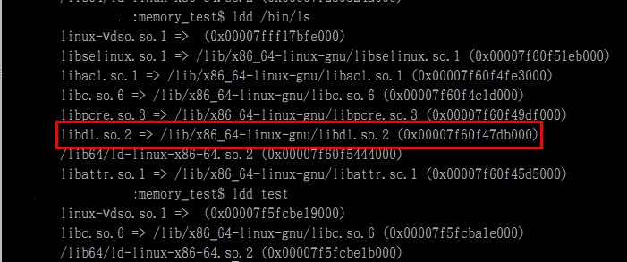
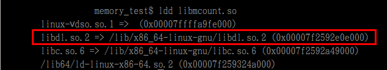
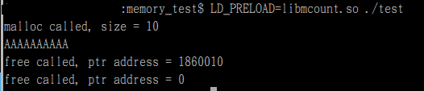
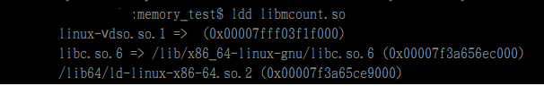

# How to use LD_PRELOAD and dlsym hook


LD_PRELOAD

透過在執行檔案之前加上 LD_PRELOAD=xxx.so 可以將後面執行程式所呼叫的function取代成xxx.so內的function
也就是我們可以做到替換libc內的函式 改成我們自己的 當程式執行時

github 上面也有人寫相關資料

測試

目標是將malloc and free 替換成自己的library 當執行測試檔時,code 的內容如下

- malloc_count.c


```c
#include <stdio.h>
#include <string.h>
#include <stddef.h>
#include <unistd.h>
#include <dlfcn.h>

void* malloc(size_t size)
{
    char buf[32];
    static void* (*real_malloc)(size_t) = NULL;
    // printf("ggggggggggg");

    if (real_malloc == NULL) {
        *(void**)(&real_malloc) = dlsym(RTLD_NEXT, "malloc");
    }

    sprintf(buf, "malloc called, size = %zu\n", size);
    write(2, buf, strlen(buf));
    return real_malloc(size);
}

void free(void* ptr)
{
    char buf[32];
    static void* (*real_free)(void* ptr) = NULL;

    if (real_free == NULL) {
        *(void**)(&real_free) = dlsym(RTLD_NEXT, "free");
    }

    sprintf(buf, "free called, ptr address = %p\n", ptr);
    write(2, buf, strlen(buf));
    real_free(ptr);
}
```

```sh
gcc -D_GNU_SOURCE -shared -fPIC -o libmcount.so malloc_count.c -ldl
LD_PRELOAD=./libmcount.so ls
```

```sh
memory_test$ LD_PRELOAD=./libmcount.so ls
malloc called, size = 568
malloc called, size = 120
free called, ptr address = 136a250
free called, ptr address = 136a010
free called, ptr address = 0
malloc called, size = 5
free called, ptr address = 136a010
malloc called, size = 120
malloc called, size = 12
malloc called, size = 784
malloc called, size = 112
malloc called, size = 952
malloc called, size = 216
```


- test.c

```c
#include <stdio.h>
#include <stdlib.h>
#include <string.h>

int main(void)
{
    char* buffer;
    buffer = malloc(sizeof(char) * 10);
    memset(buffer, 0x41, 10);
    puts(buffer);
    free(buffer);
    buffer = NULL;
    free(buffer);

	return 0;
}
```

但是跑test 測試程式會出現library 找不到的問題


```c
gcc -D_GNU_SOURCE -shared -fPIC -ldl -o libmcount.so malloc_count.c 
```

```c
gcc -o test test.c
memory_test$ LD_PRELOAD=libmcount.so ./test
./test: symbol lookup error: libmcount.so: undefined symbol: dlsym
```


檢查ls and test 執行檔 可以發現ls有linker ld library但是test沒有, 這也是爲何ls可以跑



猜測因該是compiler最佳化之後將librar去除掉了 查看網路上有人說-ldl拉到最後面就可以
修改後做測試確定test可以跑了


```c

// -ldl拉到最後面

gcc -D_GNU_SOURCE -shared -fPIC  -o libmcount.so malloc_count.c -ldl

or 加上  -Wl,--no-as-needed 

gcc -D_GNU_SOURCE -shared -fPIC -ldl  -Wl,--no-as-needed -o libmcount.so malloc_count.c 

```


```sh
LD_PRELOAD=./libmcount.so ./test
```




- lbrary compiler時需要加上-`D_GNU_SOURCE` 是因爲library有用到RTLD_NEXT
- free pointer 之後需要將pointer 設爲null 這樣在後面如果不小心再free 到時才不會有double free message
double free or corruption
C手冊上面有這一段




