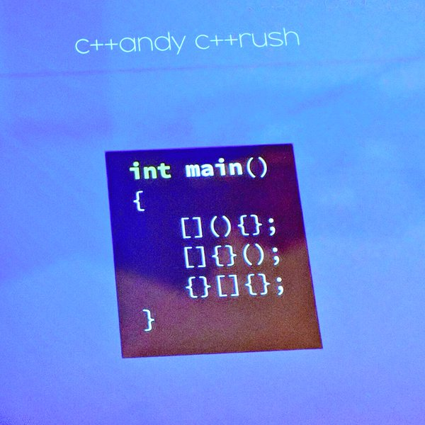
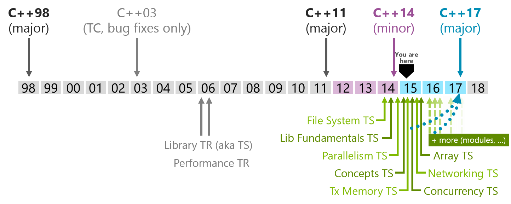

# [你所不知道的 C       語言](http://hackfoldr.org/dykc/): 開發工具和規格標準

Copyright (**慣C**) 2015, 2017 [宅色夫](http://wiki.csie.ncku.edu.tw/User/jserv)

==[直播錄影](https://www.youtube.com/watch?v=scLFY2CRtFo)==


[Jonathan Adamczewski](https://twitter.com/twoscomplement) 貼出經典著作《The C Programming Language》，然後評註說:
> "**C++: The Good Parts**"





C++ 可以美得令人不知所措 [[source](https://twitter.com/jfbastien/status/730963193799938051)]

## 為什麼我不探討 C++

* 在台灣發文好像愛用「為什麼我不」開頭，後面可接「念研究所」、「待在大公司」等描述
* C++ 自稱為物件導向的程式語言，卻不願意對物件在執行時期的表現負責任
    * 若說 C 語言給了你足夠的繩子吊死自己，那麼 C++ 給的繩子除了夠你上吊之外，還夠綁住你身邊的朋友
    * 相較之下，Java 讓你在吊死自己之際仍有親友監視著，雖然死不了，但事後會更想死
    * [ [source](https://twitter.com/RichRogersHDS/status/666798359244611584) ]
        * In Ruby, everything is an object.
        * In Clojure, everything is a list.
        * In Javascript, everything is a terrible mistake.
        * in C, everything is a representation (unsigned char [sizeof(TYPE)]).
* Linus Torvalds [在 2010 年的解釋](http://www.realworldtech.com/forum/?threadid=104196&curpostid=104208)
* C++ 實際上已經是截然不同的程式語言
    * C++ 老爸 Bjarne Stroustrup 的文章: "[Learning Standard C++ as a New Language](http://jjhou.boolan.com/programmer-4-learning-standard-cpp.htm)"
* 最重要的是，C++ 改版飛快，C++ 17 即將推出，但我還沒看懂 C++ 98



* [ [source](https://isocpp.org/std/status) ]

## 延伸閱讀

* [沒有 C 語言之父，就沒有 Steve Jobs](http://blog.jobbole.com/92642/)
* [第一個 C 語言編譯器是怎樣編寫的？](http://blog.jobbole.com/94311/)

</img>

---

## ISO/IEC 9899 (簡稱 "C99")

- 從[一則笑話](https://twitter.com/SoManyHs/status/675505383008415744)談起
  - "Programming in C: if it doesn't work, just add a star. Or multiple stars. Or ampersands."

- 葉秉哲博士的[推文](https://twitter.com/william_yeh/status/705031736371982336)：「==溯源能力==是很重要的，才不會被狀似革新，實則舊瓶裝新酒或跨領域借用的『新觀念』所迷惑」

- [規格書](http://www.open-std.org/jtc1/sc22/wg14/www/docs/n1256.pdf) (PDF) 搜尋 "***object***"，共出現 735 處
  - 搜尋 "***pointer***"，共出現 637 處。有趣的是，許多教材往往不談 object，而是急著談論 pointer，殊不知，這兩者其實就是一體兩面
  - object != object-oriented
    - 前者的重點在於「資料表達法」，後者的重點在於 "everything is object"
  - C11 ([ISO/IEC 9899:201x](http://www.open-std.org/jtc1/sc22/WG14/www/docs/n1570.pdf)) / [網頁版](http://port70.net/~nsz/c/c11/n1570.html)

- 從第一手資料學習：大文豪寫作都不免要查字典，庸俗的軟體開發者如我們，難道不需要翻閱語言規格書嗎？難道不需要搞懂術語定義和規範嗎？

- `&` 不要都念成 and，涉及指標操作的時候，要讀為 "address of"
  - C99 標準 [6.5.3.2] Address and indirection operators 提到 '==&==' address-of operator

- C99 [3.14] ***object***
  - region of data storage in the execution environment, the contents of which can represent values
  - 在 C 語言的物件就指在執行時期，==資料==儲存的區域，可以明確表示數值的內容
  - 很多人誤認在 C 語言程式中，(int) 7 和 (float) 7.0 是等價的，其實以資料表示的角度來看，這兩者截然不同，前者對應到二進位的 "111"，而後者以 IEEE 754 表示則大異於 "111"
</img>

  - A pointer to void shall have the same representation and alignment requirements as a pointer to a character type.  
    > 關鍵描述！規範 `void *` 和 `char *` 彼此可互換的表示法

```clike=
void *memcpy(void *dest, const void *src, size_t n);
```

- C99 規格書的解說就比很多書本清楚，何必捨近求遠呢？
    - EXAMPLE 1 The type designated as `float *` has type ""pointer to float’". Its type category is pointer, not a floating type. The const-qualified version of this type is designated as `float - const` whereas the type designated as "`const float *` is not a qualified type — its type is ""pointer to const qualified float’" and is a pointer to a qualified type.
    - EXAMPLE 2 The type designated as "`struct tag (*[5])(float)` has type "array of pointer to function returning struct tag’". The array has length five and the function has a single parameter of type float. Its type category is array.

- [Understand more about C](https://www.slideshare.net/YiHsiuHsu/understand-more-about-c) 提及若干肇因於不同的 C 語言標準，而使得程式碼行為不同的案例


### 規格不能只看新的，過往也要熟悉

[source](https://twitter.com/0xdeadb/status/766293771663339520)
- 空中巴士 330 客機的娛樂系統裡頭執行 14 年前的 Red Hat Linux，總有人要為「古董」負責
- 而且空中巴士 380 客機[也是如此](https://twitter.com/AlxRogan/status/766382294038872064)


## 英文很重要

安裝 `cdecl` 程式，可以幫你產生 C 程式的宣告。
```shell
$ sudo apt-get install cdecl
```

使用案例

```shell
$ cdecl
cdecl> declare a as array of pointer to function returning pointer to function returning pointer to char
```

會得到以下輸出:

```clike=
char *(*(*a[])())()
```


把前述 C99 規格的描述帶入，可得:

```shell
cdecl> declare array of pointer to function returning struct tag
```
```clike=
struct tag (*var[])()
```

如果你沒辦法用英文來解說 C 程式的宣告，通常表示你不理解！

`cdecl` 可以解釋 C 程式宣告的意義，比方說：

```shell
cdecl> explain char *(*fptab[])(int)
declare fptab as array of pointer to function (int) returning pointer to char
```

---

## GDB

* [Kernel command using Linux system calls](https://www.ibm.com/developerworks/linux/library/l-system-calls/)
* video: [Linux basic anti-debug](https://www.youtube.com/watch?v=UTVp4jpJoyc)
* video: [C Programming, Disassembly, Debugging, Linux, GDB](https://www.youtube.com/watch?v=twxEVeDceGw)
* [rr](http://rr-project.org/) (Record and Replay Framework)
    * video: [Quick demo](https://www.youtube.com/watch?v=hYsLBcTX00I)
    * video: [Record and replay debugging with "rr"](https://www.youtube.com/watch?v=ytNlefY8PIE)

---

## 除了 Vim，我推薦 Visual Studio Code

* Microsoft 開放原始碼專案 Visual Studio Code (VS Code)
    * video: [五個 Visual Studio Code 的實用工具與技巧](https://www.youtube.com/watch?v=zzon9KS90Dk)
    * [共筆](https://hackmd.io/s/rJPKpohsx)