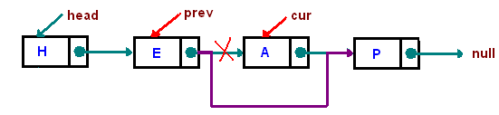
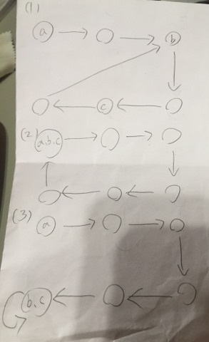
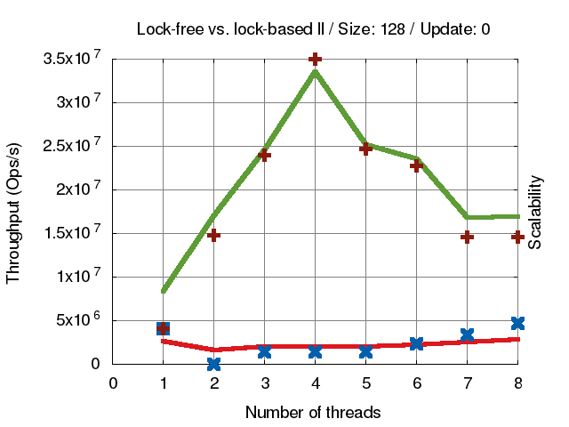
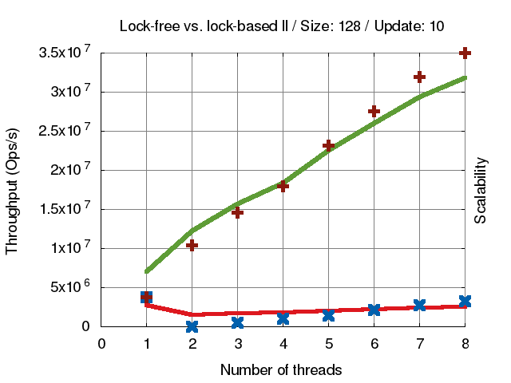
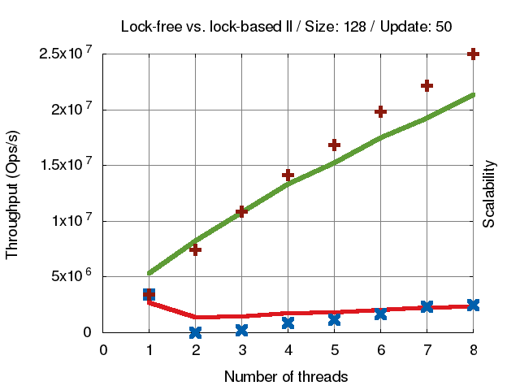

# [你所不知道的C語言](http://hackfoldr.org/dykc/): linked list 和非連續記憶體操作
Copyright (**慣C**) 2018 [宅色夫](http://wiki.csie.ncku.edu.tw/User/jserv)

:::warning
:warning: 注意
- 請透過 gitter (線上對話服務，可透過 GitHub 或 Twitter 帳號登入) 提交疑問和建議事項: [guts-general](https://gitter.im/embedded2015/guts-general) (按下去就對了)
:::

## 從 Linux 核心的藝術談起

- [ ] [Linus Torvalds 在 TED 2016 的訪談](http://www.ted.com/talks/linus_torvalds_the_mind_behind_linux?language=zh-tw)

「我不是願景家，我是工程師。我對那些四處遊蕩、望著雲端的人沒有任何意見。但是我是看著地面的人，我想修補就在我面前的坑洞，以免跌進去。」
* [從刪除 linked-list node 看程式設計的品味](https://medium.com/fcamels-notes/%E5%BE%9E%E5%88%AA%E9%99%A4-linked-list-node-%E7%9C%8B%E7%A8%8B%E5%BC%8F%E8%A8%AD%E8%A8%88%E7%9A%84%E5%93%81%E5%91%B3-b597cc5af785)
    * CMU [Linked Lists](https://www.cs.cmu.edu/~adamchik/15-121/lectures/Linked%20Lists/linked%20lists.html)
    
    * 3 exceptional cases, we need to take care of:
        - list is empty
        - delete the head node
        - node is not in the list

- [ ] 原本的程式碼 (10 行)

```c
void remove_list_node(List *list, Node *target)
{
  Node *prev = NULL;
  Node *current = list->head;
  // Walk the list
  while (current != target) {
    prev = current;
    current = current->next;
  }
  // Remove the target by updating the head or the previous node.
  if (!prev)
    list->head = target->next;
  else
    prev->next = target->next;
}
```

- [ ] 有「品味」的版本 (4 行)

```c
void remove_list_node(List *list, Node *target)
{
    // The "indirect" pointer points to the *address*
    // of the thing we'll update.
    Node **indirect = &list->head;
    // Walk the list, looking for the thing that 
    // points to the node we want to remove.
    while (*indirect != target)
        indirect = &(*indirect)->next;
    *indirect = target->next;
}
```

:::info
從「要更新什麼位置的資料」思考，無論是 head 或者非 head，更新的是同一類型的資料，不用特別操作，自然省下額外的處理
:::

延伸閱讀: [Applying the Linus Torvalds "Good Taste" Coding Requirement](https://medium.com/@bartobri/applying-the-linus-tarvolds-good-taste-coding-requirement-99749f37684a)


## 資料封裝

- [ ] [dlist](https://github.com/laserswald/dlist): Type-safe single file linked list
* [dlist](https://github.com/laserswald/dlist) 使用方式


```c
#include <dlist.h>

struct my_data { int data; }
dlist_declare(struct my_data, my_data);

void operate_on_data_list(dlist(my_data) *l) { ... }

int main(int argc, char **argv) {
    dlist(my_data) *data = dlist_new(my_data);
}
```


## circular linked list

用 [龜兔賽跑(Floyd's algorithm)](http://www.csie.ntnu.edu.tw/~u91029/Function.html#4)來偵測是否有 cycle 產生

有 3 種狀態需要做討論



圖(1) cycle 在中間、圖(2) 頭尾相連、圖(3)為尾尾相連
* $a$ 為起始點
* $b$ 為連接點
* $c$ 為龜兔相遇位置

我們需要求得三點位置，才能進行處理
假設 $\overline{ac}$ 距離為 $X$ ，這代表 tortoise 走了 $X$ 步，那麼 hare 走了 $2X$ 步， $X$ 數值為多少並不重要，他只代表要花多少時間兩點才會相遇，不影響求出 $\mu , \lambda$
接下來要分成三個步驟來處理
* step1: tortoise 速度為每次一步，hare 為每次兩步，兩者同時從起點 $a$ 出發，相遇時可以得到點 $c$。如果是圖(2)的狀況，在第一步結束就求完三點了
* step2: 兩點分別從點 $a$ 、 $c$ 出發，速度皆為一次一步，相遇時可以得到點 $b$。因為 $\overline{ac}$ 長度為 $X$，那麼 $cycle$ $c$ 長度也為 $X$，相遇在點 $b$ 時，所走的距離剛好都是 $X - \overline{bc}$
* step3: 從點 $b$ 出發，速度為一次一步，再次回到點 $b$ 可以得到 cycle 的長度

- [ ] cycle finding

如果只需要判斷是否為 circular linked list，那麼只要執行 step1 的部分，是很簡單。

除了計算 $\mu , \lambda$ ，還需要記錄整個串列的長度，若不記錄，會影響到之後 bubble sort 的實作。

```c
Node *move(Node *cur) {
    if (cur)
        retunr cur->next;
    return NULL;
}

bool cycle_finding(Node *HEAD, Node **TAIL, int *length, int *mu, int *lambda)
{
    // lambda is length
    // mu is the meet node's index
    Node *tortoise = HEAD;
    Node *hare = HEAD;

    // get meet point
    tortoise = move(tortoise);
    hare = move(move(hare));
    while (hare && tortoise) {
        tortoise = move(tortoise);
        hare = move(move(hare));
    }

    // not loop
    if (!hare) {
        *TAIL = NULL;
        *length = 0;
        tortoise = HEAD;
        while(tortoise && (tortoise = move(tortoise))) {
            (*length)++;
        }
        return false;
    }

    // get mu
    *mu = 0;
    tortoise = HEAD;
    while (tortoise != hare) {
        (*mu)++;
        tortoise = tortoise->next;
        hare = hare->next;
    }

    // get lambda
    *lambda = 1;
    tortoise = move(tortoise);
    *TAIL = tortoise;
    while (tortoise != hare) {
        *TAIL = tortoise;
        (*lambda)++;
        tortoise = move(tortoise);
    }
    *length = *mu + *lambda;

    return true;
}
```

* 延伸閱讀
    * [linked list bubble sort](https://hackmd.io/s/BJ3jay-3b)
    * [FreeRTOS](http://wiki.csie.ncku.edu.tw/embedded/freertos)
    * [merge sort](https://github.com/Lukechin/mergesort_doubly_linked_list/blob/master/mergesort.c)


## 開放原始碼專案中的實作

- [ ] Linux 核心
* [include/linux/list.h]( https://github.com/torvalds/linux/blob/master/include/linux/list.h)
* 《Linux Device Drivers 3/e》, ch11.5
特點
* doubly linked list, circular
* API操作對象為struct list_head, 使用者需自行管理記憶體
* non thread-safe

- [ ] glib GList
* [Doubly-Linked Lists](https://developer.gnome.org/glib/stable/glib-Doubly-Linked-Lists.html), glib docs
* [glist source](https://git.gnome.org/browse/glib/tree/glib/glist.c)

特點
* doubly linked list
* API操作對象為pointer to entry data (as void*), glib內部以`struct Glist`表示節點, 用法較接近C++ std::list
```C
struct _GList {
  gpointer data;
  GList *next;
  GList *prev;
};
```

* 記憶體管理: [GNOME memory slice](https://developer.gnome.org/glib/stable/glib-Memory-Slices.html)
    * 延伸資料結構: GQueue, GAsyncQueue, ...

- [ ] glib GQueue
* [GQueue source](https://git.gnome.org/browse/glib/tree/glib/gqueue.c)


## glib GAsyncQueue
[GAsyncQueue source]( https://git.gnome.org/browse/glib/tree/glib/gasyncqueue.c)

特點
* reference counting (g_async_queue_ref() and g_async_queue_unref())
* thread-safe: 以GAsyncQueue::mutex保護, 同一時間只有一個thread可變更queue
* 可自行管理lock (g_async_queue_lock() and g_async_queue_xxx_unlock())

API
```C
// create
GAsyncQueue *	g_async_queue_new ()
GAsyncQueue *	g_async_queue_new_full ()

// operations
void	g_async_queue_push ()
void	g_async_queue_push_front ()
void	g_async_queue_push_sorted () // the queue should be sorted
gpointer	g_async_queue_pop () // blocking
gpointer	g_async_queue_try_pop () // non-blocking
gpointer	g_async_queue_timed_pop ()
gpointer	g_async_queue_timeout_pop () // non-blocking
gboolean	g_async_queue_remove ()
void	g_async_queue_sort ()
gint	g_async_queue_length ()

// reference counting
GAsyncQueue *	g_async_queue_ref ()
void	g_async_queue_unref ()
void	g_async_queue_ref_unlocked ()
void	g_async_queue_unref_and_unlock ()

// operations for manual lock/unlock
void	g_async_queue_lock ()
void	g_async_queue_unlock ()
void	g_async_queue_push_unlocked ()
void	g_async_queue_push_front_unlocked ()
void	g_async_queue_push_sorted_unlocked ()
gpointer	g_async_queue_pop_unlocked ()
gpointer	g_async_queue_try_pop_unlocked ()
gpointer	g_async_queue_timed_pop_unlocked ()
gpointer	g_async_queue_timeout_pop_unlocked ()
gboolean	g_async_queue_remove_unlocked ()
void	g_async_queue_sort_unlocked ()
gint	g_async_queue_length_unlocked ()
```


## Linux 核心原始程式碼的實作

* [Linux Kernel: 強大又好用的list_head結構](https://adrianhuang.blogspot.tw/2007/10/linux-kernel-listhead.html)
* [Linux 核心鏈結串列](http://simon88.leanote.com/post/%E5%86%85%E6%A0%B8%E9%93%BE%E8%A1%A8list.h)
* 在 [作業系統概念和文藝復興](http://hackfoldr.org/oscar/) 線上講座的「從無到有打造 IoT 作業系統核心：以 Piko/RT 為例」提及 [Piko/RT](https://github.com/PikoRT/pikoRT)，仿效 Linux 核心原始程式碼的經典設計，也包含了 linked list
    * [include/linux/list.h](https://github.com/PikoRT/pikoRT/blob/master/include/linux/list.h)
    * [kernel/task.c](https://github.com/PikoRT/pikoRT/blob/master/kernel/task.c)

## 多執行緒和多核心的考量點

[concurrent-ll](https://github.com/jserv/concurrent-ll)程式碼，分析 lock和lock-free版本







十字叉叉代表 scalability（延伸擴展性） 線條代表 Throughput (資料吞吐量)，綠色線條為lock-free，紅色線條為lock-based。可以很清楚看到 lock-based 的效能不管多少 thread 都不太會提升效能，而lock-free就會隨著 thread 變多效能提高。

* Throughput (吞吐量)
	* Throughput is a measure of how many units of information a system can process in a given amount of time.
> 在單位時間內可以處理多少的資料量

* Scalability (擴展性)
	* Scalability is the capability of a system, network, or process to handle a growing amount of work, or its potential to be enlarged in order to accommodate that growth.
> 可以處理越來越多的資料或工作時的能力或潛力

延伸閱讀: [mergesort-concurrent](https://hackmd.io/s/r12FM-MeW)