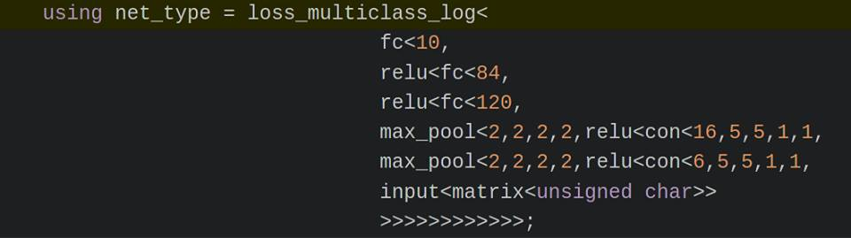
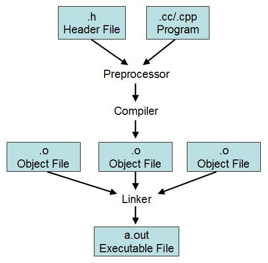

# 前置處理器應用篇


# [你所不知道的 C 語言](http://hackfoldr.org/dykc/)：前置處理器應用篇

*邁向專業程式設計必備技能*
Copyright (**慣C**) 2016 [宅色夫](http://wiki.csie.ncku.edu.tw/User/jserv)
* [系列講座](http://hackfoldr.org/dykc/)

---

概況

* 回顧 C99/C11 的 macro 特徵，探討 C11 新的關鍵字 **_Generic** 搭配 macro 來達到 C++ template 的作用
* 探討 C 語言程式的物件導向程式設計、抽象資料型態 (ADT) / 泛型程式設計 (Generics)、程式碼產生器、模仿其他程式語言，以及用 preprocessor 搭配多種工具程式的技巧

## 不要小看 preprocessor

「[怎樣讓你的程式師朋友懷疑人生：把他代碼裡的分號換成希臘文的問號](https://twitter.com/Horus9527/status/747601486520061952)」

用希臘問號取代分號

; [](http://unicode-table.com/en/037E/)[http://unicode-table.com/en/037E/](http://unicode-table.com/en/037E/) Greek Question Mark

; [](http://unicode-table.com/en/003B/)[http://unicode-table.com/en/003B/](http://unicode-table.com/en/003B/) Semicolon

把以下加進 Makefile 的 CFLAGS 中:

`-D’;’=’;’`

會看到以下悲劇訊息:

`<command-line>:0:1: error: macro names must be identifiers`

C++，叫我如何接納你？

</img>

source: [dlib](https://github.com/davisking/dlib/blob/9000d93789e5ee2a2ba86c21e4f0ddc16f2a9343/examples/dnn_introduction_ex.cpp#L71)

純 C 還是最美！


## 開發物件導向程式時，善用 preprocessor 可大幅簡化開發

延續「[物件導向程式設計篇](https://hackmd.io/s/HJLyQaQMl)」的思考，我們可善用 preprocessor，讓程式碼更精簡、更容易維護，從而提昇程式設計思考的層面

* [Stringification(字串化)](https://gcc.gnu.org/onlinedocs/cpp/Stringification.html)
* [concatenation(連結，接續)](https://gcc.gnu.org/onlinedocs/cpp/Concatenation.html)

</img>

以 [raytracing](https://github.com/embedded2016/raytracing) 程式為例 [ [source](http://wiki.csie.ncku.edu.tw/embedded/2016q1h2) ]，考慮以下 macro ([objects.h](https://github.com/embedded2016/raytracing/blob/master/objects.h)):

```clike=
#define DECLARE_OBJECT(name) \
	struct __##name##_node; \
	typedef struct __##name##_node *name##_node; \
	struct __##name##_node { \
	name element; \
	name##_node next; \
	}; \
	void append_##name(const name *X, name##_node *list); \
	void delete_##name##_list(name##_node *list);

DECLARE_OBJECT(light)
DECLARE_OBJECT(rectangular)
DECLARE_OBJECT(sphere)
```

light 在 `DECLARE_OBJECT(light)` 中會取代 name，因此會產生以下程式碼：

```clike=
struct __light_node;
typedef struct __light_node *light_node;
struct __light_node { light element; light_node next; };
void append_light(const light *X, light_node *list);
void delete_light_list(light_node *list);
```

** generate (產生) / (生成)
可用 gcc -E -P 觀察輸出:

- [ ] [_POSIX_SOURCE](https://www.gnu.org/software/libc/manual/html_node/Feature-Test-Macros.html)

[A Simple Object System](http://c.learncodethehardway.org/book/ex19.html) -> The Prototype Object System

延伸閱讀: [圖解 JavaScript 的物件模型](https://www.facebook.com/JservFans/photos/pcb.886519028141099/886518218141180/)

```clike=
typedef enum { NORTH, SOUTH, EAST, WEST} Direction;
typedef struct {
    char *description;
    int (*init)(void *self);
    void (*describe)(void *self);
    void (*destroy)(void *self);
    void *(*move)(void *self, Direction direction);
    int (*attack)(void *self, int damage);
} Object;
int Object_init(void *self);
void Object_destroy(void *self);
void Object_describe(void *self);
void *Object_move(void *self, Direction direction);
int Object_attack(void *self, int damage);
void *Object_new(size_t size, Object proto, char *description);
#define NEW(T, N) Object_new(sizeof(T), T##Proto, N)
#define _(N) proto.N
```

## _Generic [C11]

C11 沒有 C++ template，但有以 macro 為基礎的 type-generic functions，主要透過 **_Generic** 關鍵字。

- [ ] [C11 standard (ISO/IEC 9899:2011)](http://www.iso.org/iso/iso_catalogue/catalogue_tc/catalogue_detail.htm?csnumber=57853): 6.5.1.1 Generic selection (page: 78-79)

以下求開立方根 ([cube root](https://en.wikipedia.org/wiki/Cube_root)) 的程式 (generic.c) 展示了 _Generic 的使用:

```clike=
#include <stdio.h>
#include <math.h>

#define cbrt(X) \
    _Generic((X), \                                                             
             long double: cbrtl, \
             default: cbrt,  \
             const float: cbrtf, \
             float: cbrtf  \
    )(X)

int main(void)
{
    double x = 8.0;
    const float y = 3.375;
    printf("cbrt(8.0) = %f\n", cbrt(x));
    printf("cbrtf(3.375) = %f\n", cbrt(y));
}
```

編譯並執行:

```=
$ gcc -std=c11 -o generic generic.c -lm
$ ./generic 
cbrt(8.0) = 2.000000
cbrtf(3.375) = 1.500000
```

\<math.h\> 的原型宣告:

```clike=
double cbrt(double x);
float cbrtf(float x);
```

* x (型態為 double) => cbrt(x) => selects the default cbrt
* y (型態為 const float) => cbrt(y) =>
    * gcc: converts const float to float, then selects cbrtf
    * clang: selects cbrtf for const float

注意 casting 的成本和正確性議題

C11 程式碼:

```clike=
#include <stdio.h>
void funci(int x) { printf("func value = %d\n", x); }
void funcc(char c) { printf("func char = %c\n", c); }
void funcdef(double v) { printf("Def func's value = %lf\n", v); }
#define func(X) \
    _Generic((X), \
        int: funci, char: funcc, default: funcdef \
    )(X)
int main() {
        func(1);
        func('a');
        func(1.3);
        return 0;
}
```

輸出結果是

```
func value = 1
func value = 97
Def func's value = 1.300000
```

相似的 C++ 程式碼:

```clike=
template <typename T>
void func(T v) { cout << "Def func's value = " << v << endl; }
template <> void func<int>(int x) { printf("func value = %d\n", x); }
template <>
void func<char>(char c) { printf("func char = %c\n", c); }
```

對照輸出，對於 character 比對不一致，會轉型為 int 。

```
func value = 1
func char = a
Def func's value = 1.3
```

<[tgmath.h](http://pubs.opengroup.org/onlinepubs/009695399/basedefs/tgmath.h.html)> - type-generic macros

[libm 的 \<tgmath.h\> 實做](http://gitweb.dragonflybsd.org/dragonfly.git/commitdiff/de03118d092c3b87f593a7c5ebd54ff2818d218c)

延伸閱讀:

* [C11 - Generic Selections](http://www.robertgamble.net/2012/01/c11-generic-selections.html)
* [Fun with C11 generic selection expression](https://speakerdeck.com/lichray/fun-with-c11-generic-selection-expression)
* [Experimenting with _Generic() for parametric constness in C11](http://fanf.livejournal.com/144696.html)

## 應用: Unit Test

Unity: Unit Test for C
source: [](http://www.throwtheswitch.org/unity/)http://www.throwtheswitch.org/unity/
File: [unity/unity_fixture.h](https://github.com/ThrowTheSwitch/Unity/blob/master/extras/fixture/src/unity_fixture.h)

Google Test
source: [](https://github.com/google/googletest)https://github.com/google/googletest
File: [mock/gmock-generated-actions.h](https://github.com/google/googletest/blob/master/googlemock/include/gmock/gmock-generated-actions.h)

## 應用: Object Model

[ObjectC](https://github.com/DaemonSnake/ObjectC): use as a superset of the C language adding a lot of modern concepts missing in C

Files

* [inc/ObjectC/tools/Object.h](https://github.com/DaemonSnake/ObjectC/blob/master/inc/ObjectC/tools/Object.h)
* [inc/ObjectC/tools/new_delete.h](https://github.com/DaemonSnake/ObjectC/blob/master/inc/ObjectC/tools/new_delete.h)
* [inc/ObjectC/tools/Type.h](https://github.com/DaemonSnake/ObjectC/blob/master/inc/ObjectC/tools/Type.h)

C: exception jmp=> setjmp + longjmp

## 應用: Exception Handling

[ExtendedC](https://github.com/jspahrsummers/libextc) library extends the C programming language through complex macros and other tricks that increase productivity, safety, and code reuse without needing to use a higher-level language such as C++, Objective-C, or D.

File: [include/exception.h](https://github.com/jspahrsummers/libextc/blob/master/include/exception.h)

## 應用: ADT

[pearldb](https://github.com/willemt/pearldb): A Lightweight Durable HTTP Key-Value Pair Database in C

內含 [Klib](https://github.com/willemt/pearldb/tree/master/deps/klib): a Generic Library in C