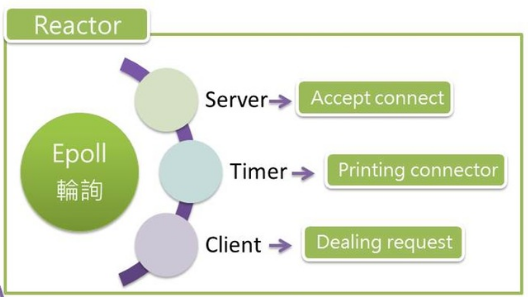
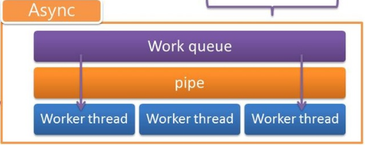
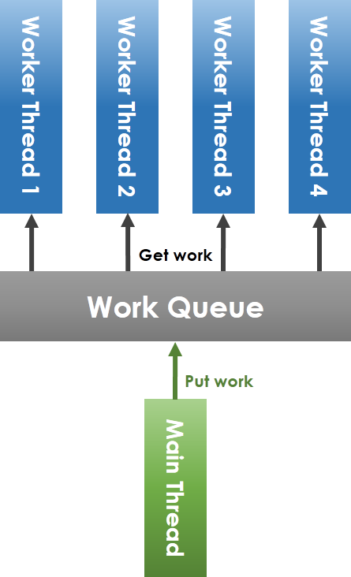
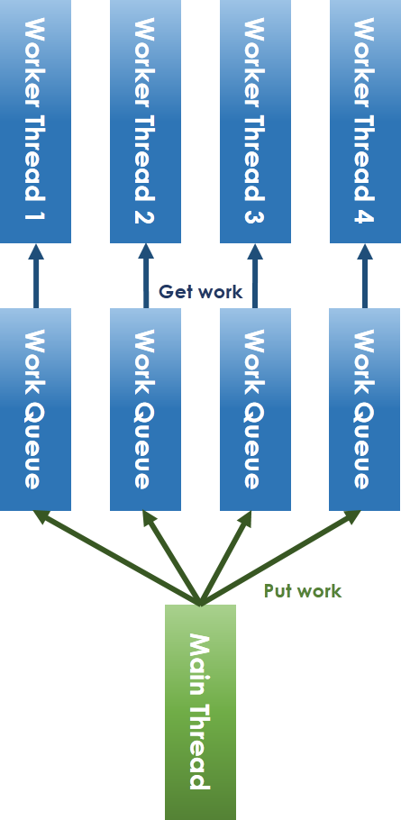

# server-framework
contributed by <`LanKuDot`>, <`ktvexe`>,<`judy66jo`>, <`JonSyuGithub`>
==[直播錄影](https://www.youtube.com/watch?v=H8xb3Jbgmac)==

## 程式碼產出
* [server-framework](https://github.com/ktvexe/server-framework)

## 預期目標
* 整理過去server-framework資料，重現並改良。
* [FB討論整理](https://www.facebook.com/groups/system.software2016/permalink/1082157985197039/)
* [案例探討: 強化 server-framework 效能](https://hackmd.io/s/rJFnrj6A)
* 強化 Concurrecny
* 整合 [cgi-server + facebooc](https://embedded2016.hackpad.com/ep/pad/static/EqEoM4o7nVv)，設計更好的物件導向封裝
* 整合 freeboard 以提供豐富的網頁呈現，並分析過程中伺服器端的行為，提出效能改善機制

## 分工
### 閱讀 API 及提出 refactoring
* buffer：`judy66jo`
* async & reactor：`JonSyuGithub`
* protocol-server (2人)：`LanKuDot`、`ktvexe`

## 如何分析 server 效能
[11/18 如何分析 server 效能](https://hackmd.io/IYMwpgxg7AbCAmBaALBADGFaTMQIyjFwE4BmYAVgA5k1o0AmPIA=?view#level、edge-triggger) / [youtube link](https://youtu.be/VtOdmpOLkSY) ; Nov 18, 2016

## 文獻回顧
### Introduction
server-framework 是一個以 **C99** 撰寫、具備 ==物件導向== 程式設計風格的伺服器開發框架。
>`程式碼特色`部份會介紹C語言物件導向程式設計風格，或是參考[「你所不知道的 C 語言」：物件導向設計篇](https://hackmd.io/s/HJLyQaQMl)。[name=劉亮谷]
> 就是將資料與實作包在一塊兒[name=LanKuDot]

由三個部份組成－

* **async.c** 
    處理工作分配與控管 thread pool。(所以很明顯的，這邊的命名是有問題的)
* **reactor.c**
    使用 `epoll` 管理 server 所有 file descriptor 的狀態，並負責派送工作給 `async.c`
* **protocol-server.c**
    定義一個 server 所需要的功能，如：發送網頁內容

主程式為 `httpd.c`。

### HTTP request & web server

一個最簡單的 Web Server 之功能包含下列三個步驟:
步驟一 : 接收瀏覽器所傳來的網址。
步驟二 : 取出相對應的檔案。
步驟三 : 將檔案內容傳回給瀏覽器。

在這個接收與傳回的過程中，所有的資訊都必須遵照固定的格式，規範這個接收/傳送格式的協定，稱為超文字傳送協定(Hyper Text Transfer Protocol)，簡稱為 HTTP 協定。

HTTP 協定格式的基礎，乃是建構在網址 URL 上的傳輸方式，早期只能用來傳送簡單的 HTML 檔案，後來經擴充後也可以傳送其他類型的檔案，包含 影像、動畫、簡報、Word 文件等。

### server-framework 行為


>1. server要處理client的連線，必須先建立socket，若要討論socket就比較涉及七層，因為socket是屬於TCP/IP的interface，之中就包含很多實作，例如：create、listen、connect、accept、send、read和write等等，像是java中就提供三種不同形態的sockets，其中簡略的介紹，可於恐龍書中Communication in Client-Server system閱讀。
>2. 上圖與影片中所提及的`連接port`其實嚴格來說也算是socket programming的一部份，所以不另行介紹，但是要注意的是listen時的行為。[name=劉亮谷]

#### 運作流程
1. Server 啟動後先建立 socket，讓系統建立通訊端並取得其 file descriptor。
2. 將這個 socket bind 到特定的位址及 port 以接收來自外部的通訊
3. 透過 `Async.create()` 建立 thread pool，準備處理來自 reactor 的工作
    * 每個 thread 會執行 `Async.worker_thread_cycle()`
4. ~~`listen()` 執行後~~ 將 server 接收端的 file descriptor 放到 epoll 中，並啟動 reactor，處理：
	* Accept connect
    * Printing connector
    * Dealing request
5. Client 的 request 將由 Server 的 Reactor 先送入 Work queue 並在 pipe 寫入 one byte
    *  work queue 為 linked list
6. worker thread 將會取得 pipe 的 one byte 負責工作 (i.e. 處理某個 client 的 request)
7. `Async.wait()`: 等待所有 thread 跳出 `Async.worker_thread_cycle()` 迴圈。並處理完剩下的工作
    * 或者透過TERM (ctrl+c) 進入 close()
        * close(): 將結束 Reactor 內的 Async 裡的所有 Worker thread

> 以上皆實作在 `protocol-server.c:srv_listen()` [name=LanKuDot]

## 影片回顧
### [Part1](https://www.youtube.com/watch?v=YnfQVvL7m0g)
> 之後整合起來吧，因為正在看影片，要即時作筆記[name=LanKuDot]

* [02:00] `Epoll` system call：偵測放進 `epoll` 的 task 有沒有 ready，如果有就放到 kernel ready queue
* [03:15] 收到 request 後會放一個 byte 到 pipe 及對應 task 到 work queue，讓 thread 去取用
* [04:20] pipe 是 blocking 的呼叫，寫在 while loop 中，因此 worker thread 不會到 join。利用 `ctrl+c` 來呼叫對應的中止函式，使整個系統可以正確停止。
* [05:30] [Reactor pattern](https://en.wikipedia.org/wiki/Reactor_pattern)
* [07:20] Async；管理 work queue 及 thread pool
    * `async_run`：將 task 放到 work queue 中，並喚醒 thread
    * `worker_thread_cycle`：從 work queue 取得 task，並 consume 掉。
        * `read()` 是 blocking call。
        * [`sched_yield()`](http://man7.org/linux/man-pages/man2/sched_yield.2.html)：讓完成工作的 thread，釋放掉 CPU 的資源，讓其他 thread 可以運作。
        * 跳出迴圈後會再執行一次 `perform_tasks()` 處理剩餘的工作
* [09:40] `set_fd_polling()`，將 request 送到 epoll，並設定輪巡的間隔
* [10:30] `reactor_review()`：偵測 epoll queue 有多少任務要執行 (macro `_WAIT_FOR_EVENTS` 為 [`epoll_wait()`](http://man7.org/linux/man-pages/man2/epoll_wait.2.html))，並將任務推到 work queue 中
* [11:20] `srv_cycle_core()` 監控系統及 client 連線的狀態
    * 如果連線銜至時間超過 timeout 則關閉連線
    * `srv_cycle_core()` 也是其中一個 task，執行完後會自己推回 work queue
* [13:00] lock-less thread pool：所有 thread 搶同一個 work queue 改為每個 thread 有自己的 work queue。
    * 用 Run Rabin 的方式配送工作到各自的 work queue

### [Part2](https://www.youtube.com/watch?v=p_GYmjOGWA0)
* [00:00] HTTP
* [02:40] Web Server 運作
    * `protocal.c` 中的 `bind_server_socket()` 去建立 server 的 listening port
    * `struct addrinfo` 紀錄 socket 所需要的資訊
* [06:10] `socket()`：create file descriptor for socket
* [06:50] `bind()`：bind socket to port
* [07:40] `listen()`：設定 socket 可以接受的最大連線數
* [09:20] `accept()`：取得連進來的 client 專屬的 file desciptor
* [11:26] `epoll` system call：與 `select()` 和 `poll()` 不同的是在 ET mode 下只有在 fd 為 ready state 才會有反應
* [12:50] `reactor.c` 使用 `epoll()` 監控
* [13:30] `async.c` 使用 `pipe()` 取得 work queue 的工作
* [15:10] `signal()` signal re-direction，改變 signal 原本的運作
* [16:29] Apache Benchmark 分析效能瓶頸與改進
    * httpd.c 的 `timeout` 設定會影響效能，但又不能只透過縮短 timeout 時間來加強效能
* [21:31] 無論是不是 keep alive 的連線，全部都視為 not keep alive，當處理完一個 request 就關閉連線
* [23:00] 效能分析 keep alive 與否 x 優化前後
* [25:30] multi-thread 分析
    * timeout 讓 thread 必須等待過時才能處理下個工作，效能無法提升
* [27:30] 將模組掛在核心上，就可以透過模組調用核心資源，直接在 kernal space 建立 socket，而不需要在複製資料到 user space
* [30:30] `server.c` 實作 server kernel 的行為
* [31:56] 修改前的程式流程，將 server kernel 收到的 reqeust 交給外部的 `url.py` 處理
* [33:27] 去除繞路，直接在 server kenel 處理 request

## API

### [Reactor](https://en.wikipedia.org/wiki/Reactor_pattern)
reactor 是一種 design pattern，他的概念是「同時」處理多個請求並回應，在 server-framework 用 epoll 方式實作。 

>昆憶哥，Design Patterns 我實在不懂，不知道 "reactor 是一種design pattern" 這句話對不對，wikipedia 有提到，我就自己揣摩了[color=blue][name=劉亮谷]
>跟據 [wikipedia](https://en.wikipedia.org/wiki/Software_design_pattern) 提到 design pattern 是一種解決常見問題的解法。design pattern 不會提供最後形式 (如：source code)，而是類似 template 的存在。所以這樣解釋是對的。[name=LanKuDot]

* Reactor pattern
	* **Resources**: 會成為系統的 input 及被系統 consume 的資源。如：client 的 request
	* **Synchronous Event Demultiplexer**: 多對一，擋住與收集 Resource。當有 dispatcher 可以處理時，就會派送 resource 給 dispatcher。如： epoll 將收到的 client request 推到 work queue
	* **Dispatcher**: 分派從 Demultiplexer 取得的工作到對應的 requset handler。如：將 client 待處理的 request 丟入 work queue，並喚醒 thread 處理這些 request
	* **Request Handler**: 真正 consume request 的地方。如：worker thread 去處理工作 (client request) 也就是由 Worker thread 負責

* Reactor 目的為回應 requset、使用 epoll 監控整個系統
* Server 進入 listen 階段將做三件事 Accept connect、Printing connector、Dealing request
* reactor 為 ready queue 負責接住 client 的連線要求工作
    * Server: 當有 client 連線到 Server，此時 Server 工作將被設成 ready ，接受 client 連線
    * Client: Client 工作將變成 ready，處理 client 的 request 並給予回應
    * Timer: 

#### API

```clike
// File: reactor.c:23
// 將一個工作存入 epoll
int set_fd_polling(int queue,     // The fd of epoll
                   int fd,        // The fd to be monitored
                   int action,    // ADD, MOD, DEL
                   long milliseconds)    // Scan interval
{
    /* The event argument describes the object linked to the file descriptor
       fd. */
    struct epoll_event chevent;
    /* 使得 epoll 在不同情況下可以做不同的運行 */
    chevent.events = EPOLLOUT | EPOLLIN |
                     EPOLLET | EPOLLERR |
                     EPOLLRDHUP | EPOLLHUP;
    if (milliseconds) {
        struct itimerspec newtime;
        ...
        timerfd_settime(fd, 0, &newtime, NULL); /* 設定 epoll 輪詢時間間隔*/
    }
    return epoll_ctl(queue, action, fd, &chevent); /* 將工作訊息推入 epoll */
} 
```
```clike
// epoll 輪詢實作
// 透過 reactor_review( ) 將 epoll 中的工作抓出來執行
int reactor_review(struct Reactor *reactor)
{
    if (!PRIV(reactor)->reactor_fd) return -1;

    /* set the last tick */
    time(&reactor->last_tick);

    /* wait for events and handle them */
    /* active_count 取得共有幾個工作需要被輪詢 (i.e. #(fd))*/
    int active_count = _WAIT_FOR_EVENTS_; /* _WAIT_FOR_EVENTS_ macro (i.e. epoll wait system call) */
    if (active_count < 0) return -1;

    if (active_count > 0) {
        /* for loop 完成一次的輪詢 */
        for (int i = 0; i < active_count; i++) {
            if (_EVENTERROR_(i)) {
                /* errors are hendled as disconnections (on_close) */
                reactor_close(reactor, _GETFD_(i));
            } else {
                /* no error, then it is an active event */
                /* 從 kernel 的 read queue 取出並服務 fd */
                if (_EVENTREADY_(i) && reactor->on_ready)
                    reactor->on_ready(reactor, _GETFD_(i));
                if (_EVENTDATA_(i) && reactor->on_data)
                    reactor->on_data(reactor, _GETFD_(i));
            }
        }
    }
    return active_count;
}
```

**同場加映－design pattern**
design pattern是對軟體設計中普遍存在（反覆出現）的各種問題，所提出的解決方案。不直接用來完成程式碼的編寫，而是描述在各種不同情況下，要怎麼解決問題的一種方案。例如：Abstract factory、Factory method、Reactor。
物件導向設計模式通常以類別或物件來描述其中的關係和相互作用，但不涉及用來完成應用程式的特定類別或物件。
>原文：Object-oriented design patterns typically show relationships and interactions between classes or objects, without specifying the final application classes or objects that are involved. 
>看不懂"但不涉及用來完成應用程式的特定類別或物件。"這句話的意思，昆憶哥救一下。[color=blue][name=劉亮谷]
>就像我上面提到的，他只是告訴你解法，但不會規定 source code 怎麼實作，反正只要能達成目的就好。[name=LanKuDot]

並非所有的軟體模式都是設計模式，設計模式特指軟體「設計」層次上的問題。還有其它非設計模式的模式，如架構模式(software architecture patterns)。同時，演算法不能算是一種設計模式，因為演算法主要是用來解決計算上的問題，而非設計上的問題。

### Async
* 工作分配、控管 thread (透過 thread pool)

* Reactor 的 Client 工作會將處理 request 的工作丟入Work queue，並且在 pipe 寫入 one byte 紀錄
* Worker thread 若發現 pipe 有紀錄，則會將該 one byte 取出並執行 Work queue 中對應的 request

#### API
```clike
/* API handler*/
struct __ASYNC_API__ Async = {
    .create = async_create,
    .signal = async_signal,
    .wait = async_wait,
    .finish = async_finish,
    .run = async_run,
};
```
```clike
/* Task Management - add a task and perform all tasks in queue */
// 處理存入 work queue 的運行，透過 pipe 喚醒 work thread 處理
static int async_run(async_p async, void (*task)(void *), void *arg) {
    struct AsyncTask *c;  /* work queue 採 linked list 存放，struct AsyncTask 為linked list 的 node */
    ...
    if (async->pool) { /* async->pool 為新的 task */
        c = async->pool;
        async->pool = async->pool->next;
    }
    ...
    write(async->pipe.out, c->task, 1); /* 寫入 one byte 到 pipe*/
}
```
```clike
// thread 進入 read 將會被 block 住
// work threads 將執行此函數負責讀取 pipe 並透過 perform_tasks() 來取得 task
// 處理工作直到所有 task 被處理完 (thread 欲取得 task 時將進入 lock)
// 每個 work thread 進入 lock 取得 task 之後就會 unlock，隨後執行完 task 才會再執行第2次 while loop 請求 task
static void *worker_thread_cycle(void *_async) {
    struct Async *async = _async;
    char sig_buf;
    /* read 就是讀取 async_run 內 wirte 的 one byte */
    /* async->run 若是0則該 work thread 將被結束執行 */
    while (async->run && (read(async->pipe.in, &sig_buf, 1) >= 0)) {
        perform_tasks(async); /* 將 Work queue 的工作都執行完成 */
        sched_yield(); /* 將此 thread 優先權降到最低 */
    }
    
    perform_tasks(async);  /* 執行 Work queue 中剩餘未被執行的工作 */
    ...
}
```
> 當 thread 數量兩個以上將會 thread dispatching ，即使沒有 request 時 worker_thread_cycle() 內的 read(async->pipe.in, &sig_buf, 1) 仍然沒辦法 block 住 thread ? [name=JonSyuGithub]

> 思考這樣的 API 設計有沒有不足？或者值得做 code refactoring 之處 [name=jserv]
#### Refactor

**`IPC: pipe`**
- [ ] Semaphore

### Protocol-Server
* 定義 server、連線收發、連線後工作狀態

#### Private member

**`struct Server`**

儲存 server 屬性與資料管理的 data structure

```clike
struct Server {
    struct Reactor reactor; // 每個 server 都有專屬的 reactor
    struct ServerSettings *setting;
    struct Async *async;    // Thread pool
    pthread_mutex_t lock;   // Server object 是會被搶的
    
    /* 這區的 member 主要用來紀錄每個 connection 對應的資料，透過 fd 作為 offset 去存取 */
    struct Protocol * volatile *protocol_map;    // 聲明 `protoco_map` 是 pointer to array of pointer，而且指向的 struct Protocol 可能會被意外的改變
    struct Server **server_map;    // 不明
    void **udata_map;
    ssize_t (**reading_hooks)(server_pt srv, int fd, void *buffer, size_t size);
    volatile char *busy;    // Is this connection busy?
    unsigned char *tout;    // Timeout value of this connection
    unsigned char *idle;    // Idle cycle counts
    
    pthread_mutex_t task_lock;    // 搶哪個 task?
    
    struct FDTask *fd_task_pool;
    struct GroupTask *group_task_pool;
    size_t fd_task_pool_size;
    size_t group_task_pool_size;
    
    void **buffer_map;
    long capacity; /**< socket capacity */
    time_t last_to; /**< the last timeout review */
    
    int srvfd; // Server 用來聆聽 socket 的 fd
    pid_t root_pid; // Process 的 PID
    volatile char run; // Running flag
}
```

:::info
繼承的實現：將母 strcut 放在子 strcut 的第一個 member，透過 pointer 的 casting，可以將子 struct 視為母 struct 使用。因為母 struct 在第一個 member，當 pointer 指向子 struct 時，同時也指向母 struct。
:::

示範程式：
```clike
struct Base {
    int id; 
};

struct Inherit {
    struct Base base;
    int age;
};

int main(void)
{
    struct Inherit inherit = { .base.id = 3, .age = 16 };
    struct Base *base = (struct Base *)&inherit;

    printf("%d\n", base->id);    // 3
    return 0;
}
```

**`struct FDTask`**

* 配送給某一個 fd (connection) 的 task，用 linked list 來管理。// 註解下的非常不好...
* Definiation:
    ```clike
    /* the data-type for async messages */
    // ^^^ bad comment ^^^
    struct FDTask {
        struct FDTask *next;
        struct Server *server;
        int fd;
        void (*task)(struct Server *server, int fd, void *arg);    // 主要派送的任務
        void *arg;
        void (*fallback)(struct Server *server, int fd, void *arg);    // 任務執行完要執行的工作
    };
    ```

**`struct GroupTask`**

* 需要在多個 fd (connection) 執行的共同 task
* Definiation:
    ```clike
    /* A self handling task structure */
    // Self handling?
    struct GroupTask {
        struct GroupTask *next;
        struct Server *server;
        int fd_origin;
        void (*task)(struct Server *server, int fd, void *arg);
        void *arg;
        void (*on_finished)(struct Server *server, int fd, void *arg);
        unsigned char fds[];    // 要被執行的所有 task
    };
    ```

#### API

**`struct __SERVER_API__`**

* 用來 access `struct Server` object 的 helper function，定義對於 `struct Server` object 的操作。也因此 `struct __SERVER_API__` 宣告成 global const object：
    ```clike=235
    // protocal-server.c:237
    /* Declare the corresponding handler */
    const struct __SERVER_API__ Server;
    ```

    :::info
    `struct Server` 的 definition 是宣告在 `protocaol-server.c` 中，代表其 member 是 `private` 的，只能透過 `struct __SERVER_API_` 去 access (public member function)
    :::

* `__SERVER_API_` 大部分的函式的第一個參數都是指向 `struct Server` 物件的指標。
 
* 物件導向概念的實現：
```clike=
Foo foo();
foo.bar(arg);
// 可以想成：
struct Foo foo;
bar(&foo, arg);
```

##### Gets and Sets
取得或設定 `struct Server` 的 private member
```clike
pid_t (*root_pid)(struct Server *server);
struct Reactor *(*reactor)(struct Server *server);
struct ServerSettings *(*settings)(struct Server *server);
unsigned char (*is_busy)(struct Server *server, int sockfd);

struct Protocol *(*get_protocol)(struct Server*server, int sockfd);
int (*set_protocol)(struct Server *server, int sockfd, struct Protocol *new_protocol);

void *(*get_udata)(struct Server *server, int sockfd);
void *(*set_udata)(struct Server *server, int sockfd, void *udata);

void (*set_timeout)(struct Server *server, int sockfd, unsigned chat timeout);
```
`reactor` 與 `settings` 允許外部直接存取 private 的 member

對應的 handler
```clike
const struct __SERVER_API_ Server = {
    .root_pid     = root_pid,
    .reactor      = srv_reactor,
    .settings     = srv_settings,
    .is_busy      = is_busy,
    .get_protocol = get_protocol,
    .set_protocol = set_protocol,
    .get_udata    = get_udata,
    .set_udata    = set_udata,
    .set_timeout  = set_timeout,
}
```
```clike
// 設定並取得運行 server process 可以開啟的最大 file descriptor 數量
long (*capacity)(void);
.capacity = srv_capacity;
```

* 使用 static variable `flim` 來紀錄允許使用的最大 file descriptor 數量，當該值非零時，會直接回傳該值。
* 透過預估每個 connection 會使用到的記憶體空間 (stack 與 heap) 與該 process 可以取得的記憶體空間，以計算可以容納多少 conenction。
* 實作細節
    * 透過 system call [`getrlimit()`](http://man7.org/linux/man-pages/man2/getrlimit.2.html) 與 `setrlimit()` 取得指定的 resource 限制。設定以下 resource 的最大值：

    ```clike
    struct rlimit {
        rlim_t rlim_cur;  /* Soft limit，kernel 限制的數量 */
        rlim_t rlim_max;  /* Hard limit (ceiling for rlim_cur)，真正可以到達的最大數量 */
    }
    ```

    * `RLIMIT_NOFILE`：該 process 可以開啟的最大 file descriptor 數量。將 `rlim_cur` 設為與 `rlim_max` 一樣，並取得設定後的值。如果設定後的 `rlim_cur` 比 `_SC_OPEN_MAX - 1` 或 `OPEN_MAX - 1` 大的話，就更新 `flim` 的值作為可以開啟的最大 fd 數。
    * `RLIMIT_STACK`：process stack size in bytes。
        * 計算一個 connection 需要多少空間：
            * 19 bytes 的基本資料 mapping
            * 假設 2kb 的空間給 IO buffer 和管理 request
            * 然後要切齊 page 所以就弄了 4kb 給一個 connection.....
            * 所以一共要 `flim` * 4096 bytes 的空間
        > call stack、thread 自己的 stack 應該也要考慮? 代表不太可能在配置的 stack 中開好開滿到自己想要的 connection 數量[name=LanKuDot]

        * 嘗試配置 `flim` * 4096 bytes 的 stack size，設置後取得真正可以配置的 fd 數量，存到 `flim`。
    * `RLIMIT_DATA`：process data segment size。
        > Data segment 包含 initialized variables, uninitizlized variables 及 heap。 [C programming memory layout](http://cs-fundamentals.com/c-programming/memory-layout-of-c-program-code-data-segments.php)[name=LanKuDot]

        * 為每個 connection 配置 24kb 的 data segment，並取得真正可以配置的空間，得到最後可以使用的 fd 數。
        * 24 kb 也沒有根據QQ

##### Server 控制
```clike
// 啟動 server，啟動資訊在 struct ServerSettings 中
// 此函式會將 main threaad block 住，直到 server 停止
int (*listen)(struct ServerSettings);
.listen = srv_listen;
```

* 實作細節
    1. 先檢查傳入的 `struct ServerSettings` 的資料是否有效，否則會使用預設值：
        * `protocol` ：不能為 `NULL`，否則直接回傳錯誤
        > FIXME 註紀要輸出 warning message，用 `assert` 會不會太暴力？[name=LanKuDot]
        > 太暴力的意思是希望只 warning ，但不 suspend 掉嗎? [name=亮谷]
        > 不過如果這是無法透過預設來處理的話，直接強制關閉也是可以[name=LanKuDot][color=green]
        >
        * `port`：8000
        * `timeout`：5
        * `threads`：1
        * `processes`：1
    2. 建立與初始化 `strcut Server`
        * `protocol-server.c:648`
        * 透過 `srv_capacity()` 計算最大連線數，以此建立所需的資料數量
        * 建立一個 `struct Server` object 紀錄 server 的資訊，及儲存上一步所建立的資料的 pointer
        * 初始化資料
            * `srv_fd`：透過 `bind_server_socket()` 取得
            * `lock`, `task_lock`：透過 `pthread_mutex_init()` 初始化
            * `task_pool`, `group_task_pool`：設為空 poll
            * `server_map[i]`：存自己的 reference (類似 `this`)
            * `buffer_map[i]`：透過 `Buffer.create()` 取得
            * `protocol_map[i]`, `busy[i]`, `idle[i]`, `tout[i]`, `udata_map[i]`：設為 0
            * handlers of reactor：
            ```clike
            .reactor.maxfd = capacity - 1, 
            .reactor.on_data = on_data,
            .reactor.on_ready = on_ready,
            .reactor.on_shutdown = on_shutdown,
            .reactor.on_close = on_close, 
            ```
    3. 設定 signal 的行為。參照 `探討 epoll, pipe, signals 等系統呼叫` 的 `SIGNAL` 一節
    4. 依 `settings.processes` fork process
        * `srv.root_pid` 紀錄 root process 之 pid
        * 只有 root process 會紀錄所有 child processes 的 pid

```clike
// 停止指定的 server `server`
void (*stop)(struct Server *server);
.stop = srv_stop;
// 停止所有 server
void (*stop_all)(void);
.stop_all = srv_stop_all;
```

##### Socket (Client coonnection) 控制
```clike
// 註冊新的 connection 到 server 及 protocol 管理系統
int (*attach)(struct Server *server, int sockfd, struct Protocol *protocol);
.attach = srv_attach;
// 關閉連接，只有在該連線的資料傳送完畢時，才會正確關閉
void (*close)(struct Server *server, int sockfd);
.close = srv_close;
// hijack：挾持，從 server 手上搶奪這個 connection 的控制權。
// server 在傳送完這個 connection 的資料之前
// 會 block 住這個 function call
int (*hijack)(struct Server *server, int sockfd);
.hijack = srv_hijack;
// 取得指定 protocol 的連線數量
// 如果 service 為 NULL，則將所有 protocol 納入計算
long (*count)(struct Server *server, char *service);
.count = srv_count;
// 操作指定的 connection，使其重置 timeout counter
void (*touch)(struct Server *server, int sockfd);
.touch = srv_touch;
```

##### Read and Write hook
* 每一個 socket 都有專屬的 hook
* 只有在 invoke read 或 write function (如：`Server.read` 或 `Server.write`) 才會執行，以取代 `read()` 或 `write()`
* 目的在於讓欲傳送的資料作前處理 (如可以支援 SSL/TLS)，或是將收到的資料作後處理
* 對於 writing hook 的實作規定：
    * 必須帶有參數：
        * pointer to server (buffer owner)
        * pointer to socket
        * pointer to data to be written
        * length of data
    * 回傳：
        * 從 buffer 寫入的 byte 數，非實際寫到 socket 的 bytes 數
        * -1：如果資料無法被傳送
        * 0：如果沒有資料傳送，但 connection 應該要維持開啟而且沒有遭遇內部錯誤
    * 必須真的有傳送資料到 network，否則 writing hook 不會再次被呼叫
* 對於 reading hook 的實作規定：
    * 與 writing hook 相似，但 length of data 指定要讀取的 byte 數
    * 回傳實際寫入 buffer 的 bytes 數

```clike
// 設定 connection 對應的 reading 及 writing hook
void (*rw_hooks)(server_pt srv, int sockfd,
                 ssize_t (*reading_hook)(server_pt srv, int fd,
                                         void *buffer, size_t size),
                 ssize_t (*writing_hook)(server_pt srv, int fd,
                                         void *data, size_t len));
.rw_hooks = rw_hooks,
// reading 及 writing hook template
ssize_t (*read)(server_pt srv, int sockfd, void *buffer, size_t max_len);
.read = srv_read,
size_t (*write)(server_pt srv, int sockfd, void *data, size_t len);
.write = srv_write,

// 另外提供三種變種
// 直接將 data pointer 指向 `data`
ssize_t (*write_move)(server_pt srv, int sockfd, void *data, size_t len);
.write_move = srv_write_move,
// 盡快將資料送出，不希望等待
ssize_t (*write_urgent)(server_pt srv, int sockfd, void *data, size_t len);
.write_urgent = srv_write_urgent,
ssize_t (*write_move_urgent)(server_pt srv, int sockfd, void *data, size_t len);
.write_move_urgent = srv_write_move_urgent,
// 傳欉一整個指定的檔案，就好像是一個 atomic 的 package
// 實際上是一個一個 chunk 送出去
ssize_t (*sendfile)(server_pt srv, int sockfd, FILE *file);
.sendfile = srv_sendfile,
```

##### Task and Thread pool

* 非同步 task：並非在呼叫該函式時就會執行的 task，而是被編入排程，等待被執行

```clike
// 指定要跑在除了 `origin_fd` 的非同步 task
// 當指定的 task 執行完後，會呼叫 `on_finish`
int (*each)(struct Server *server, int origin_fd,
            char *service,
            void (*task)(struct Server *server, int target_fd, void *arg),
            void *arg,
            void (*on_finish)(struct Server *server, int origin_fd, void *arg)); 
// 指定要跑在除了 `fd_originator` 的 task
// task 會依序跑在所有 connection，而且會 block 住
int (*each_block)(struct Server *server, int fd_originator,
                  char *service,
                  void (*task)(struct Server*server, int fd, void *arg),
                  void *arg);
// 指定要跑在某個 conection 上的非同步 task
int (*fd_task)(struct Server *server, int sockfd,
               void (*task)(struct Server *server, int fd, void *arg),
               void *arg,
               void (*fallback)(struct Server *server, int fd, void *arg));
```
```clike
// 指定多久後執行該 task，執行完後該 task 就結束
// 會多使用一個 fd 給 timer
int (*run_after)(struct Server *self, long milliseconds, void task(void *), void *arg);
// 與 `run_after` 相似，但可以指定要執行這個 task 幾次。
// 如果 `repetitions` 為 0，則永遠重複執行
int (*run_every)(struct Server *self, long milliseconds, int repetitions, void task(void *), void *arg);
```
```clike
// 用來監控整個系統工作狀態，決定工作是否中斷連線/執行
static void srv_cycle_core(server_pt server)
```

****

再者來聊聊 **`struct Protocol`** 與 **`struct ServerSettings`**

在 `protocol-server.h` 中，有段 macro `start_server`，這邊用到技巧稱為 Variadic Macros ，這種宣告方式允許 macro 像 function call 一樣能有多個參數。
可參考：[Variadic Macros - The C Preprocessor - GCC - GNU](https://gcc.gnu.org/onlinedocs/cpp/Variadic-Macros.html)
```clike=
#define start_server(...) \
    Server.listen((struct ServerSettings){__VA_ARGS__})
```
所以從上方 macro 可以得知 `start_server` 的參數為 `ServerSettings` 的 member 。

##### setting server
固接下來開始來研究 `ServerSettings` 中的 member 。

* `char *port` 顧名思義是用來設定 socket 時所使用的 port ，在 `protocol-server.c` 中 `srv_listen()` 會將其 default 設成8080。
>本來想來介紹一下 port 8080 的用途，但我發現查完資料後還是不太理解，大致內容為 8080 與 80 port 為負責http traffic 。 [name=亮谷][color=blue]

* `char *address` 同理為設定 IP address 用，他的使用在 `protocol.c` 中 `bind_server_socket()` ，他使用到 linux system call `getaddrinfo()` 。

* `getaddrinfo()` 為給定 host IP 與 port/http ，他會回傳 `addrinfo` structures 其中已填好 Internet address 的資訊， 可用於 `bind()` 、`connect()` 。
可參考：[Linux Programmer's Manual           GETADDRINFO(3)
](http://man7.org/linux/man-pages/man3/getaddrinfo.3.html)

* `threads` 、`processes` 、`timeout` 在前面影片回顧有做過整理，分別是用來設定 thread pool 的 thread 數量、並行的 process 數量、 worker thread 每次要等待的時間。
```clike
struct ServerSettings {
    char *port; /**< the port to listen to. default to 8080. */
    char *address; /**< the address to bind to. Default to NULL
                            (all localhost addresses). */
    int threads;
    int processes;
    unsigned char timeout;
}
```

除了上方的 member data 外，在 `server-framework` 中多次提及的以 function pointer 實作物件導向，所以接下來分析各 function pointer 指向之功能。

```clike
void (*on_init)(struct Server *server);

void (*on_finish)(struct Server *server);

void (*on_tick)(struct Server *server);

void (*on_idle)(struct Server *server);

void (*on_init_thread)(struct Server *server);
```
```clike
char *busy_msg; /**< C-style string indicating the server is busy.
                         default to NULL, which means simple disconnection
                         without messages. */
void *udata; /**< opaque user data. */
```

##### protocol


```clike=
char *service; /**< a string to identify the protocol's service    
                        such as "http". */
    void (*on_open)(struct Server *,                                   
                    int sockfd); /**< called when a connection is opened. */
    void (*on_data)(struct Server *,                                   
                    int sockfd); /**< called when a data is available. */                   
    void (*on_ready)(struct Server *,                                  
                     int sockfd); /**< called when the socket is ready 
                                       to be written to. */
    void (*on_shutdown)(struct Server *,                               
                        int sockfd); /**< called when the server is shutting
                                          down, but before closing the 
                                          connection. */               
    void (*on_close)(struct Server *,
                     int sockfd); /**< called when connection was closed. */
    void (*ping)(struct Server *,
                 int sockfd); /**< called when the connection's timeout
                                   was reached. */    
```

****


#### Refactor

**`struct __SERVER_API__`**
- [ ] 有些函式使用 `struct Server *` 有些寫 `server_pt` 來指向 `struct Server` 物件。雖然有 `typedef`，但統一使用一種會比較好
- [ ] `count()` 的 argument `service` 只指定要查詢的 protocol，或許用 `service_protocol` 比較好
- [ ] `run_after()` 與 `run_every()` 的 comment 不佳
    * `run_after()`：run a task after `milliseconds` ms
    * `run_every()`：run a task every `millisecons` and repeat `repetations` times

**`struct Protocol`**

**`struct ServerSettings`**


### Buffer

#### API
```clike
// 建立 buffer，buffer 將負責接收 client 送到 server 的 request 封包
// 提供給 protcol-server 初始化時，會呼叫 capacity 次 Buffer.create(&srv) 來建立 capacity 個 buffer
// 當 server 開始處理該 request (i.e. 讀取 request 對應的 file) 後將寫入 file 到該封包並回傳給 client
static inline void *create_buffer(server_pt owner)
```
```clike
// 釋放掉 buffer
// 提供給 protocol-server 於結束程式時，能將初始化時所建立 capacity 個 buffer (i.e. buffer_map[0~capacity]) 給 free 掉
void destroy_buffer(void *buf)
```

* type volatile
避免程式在 I/O 和 multithread program 時自動優化，只讀取一次具有揮發性的變數


## 探討 epoll, pipe, signals 等系統呼叫

### Epoll
monitoring multiple file descriptors to see if I/O is possible on any of them.
The epoll event distribution interface is able to behave both as edge-triggered (ET) and as level-triggered (LT). 

* 非同步 I/O，解決因大量連線造成 process 和 thread 無法 handle的狀況
* 能 handle 比 select 更多連線，且非線性掃描，但只能在 linux 系統上運作
* ET(edge-triggered)：只有在 fd 變成 ready-state 時有反應，直到事件結束後又發生下一次，如此一來就不用一直詢問一些不活躍的 connect

```clike
// 生成epoll
int epoll_create(int size)
int epoll_create1(int flags)

// 新增或移除監聽的fd或更改fd的監聽選項
int epoll_ctl(int epfd, int op, int fd, struct epoll_event *event)

// 回傳ready的fd的數量，把fd存在events array中
int epoll_wait(int epfd, struct epoll_event *events,int maxevents, int timeout)
```

### [PIPE](http://man7.org/linux/man-pages/man7/pipe.7.html)
* 單向傳輸的 IPC 資料流，有兩個端口 fd，一個是 read-only，一個是 write-only
* 當嘗試 read 一個空的 pipe 時，會被 block 住，當嘗試寫入 full的 pipe 時，write 會被 block

```clike
// 生成 pipe，將 read, write 端 fd 存入 array
int pipe(int pipefd[2]) 

// 將 count bytes 的資料寫入 pipe_write_end
ssize_t write(int fd, const void *buf, size_t count);

// 從 pipe_read_end 讀 count bytes 的資料
ssize_t read(int fd, void *buf, size_t count);
```
* 只需要一個 API，但是其只適用於 parent process 與 child process
* 用法說明：
    * 使用 pipe() 建立兩個 file descripter，第一個 FD 用來從PIPE讀取資料，第二個FD 用來作為寫入資料至PIPE，如下例： 
```clike
#include<unistd.h>
int fds[2];
int pipe(fds);
```
* 接著呼叫 fork ，因為child process 會擁有同樣的 FD，因此便可以透過這兩個 FD 進行溝通

### SIGNAL
* 接收訊號後改變原本動作，確保server正確執行與結束

```clike
// 改變動作
int sigaction(int signum, const struct sigaction *act, struct sigaction *oldact);
```

```clike
// The sigaction structure
struct sigaction {
   void     (*sa_handler)(int);    // Handler。與 sa_sigaction 擇一設定即可。sa_handler 可以為 SIG_DEL (default)、SIG_IGN (Ignore)、或自定義的函式
   void     (*sa_sigaction)(int, siginfo_t *, void *);
   sigset_t   sa_mask;        // 執行 handler 時要忽略哪些訊號
   int        sa_flags;       // 改變 signal 的行為
   void     (*sa_restorer)(void);
};
```

* signum 輸入參考
```clike
Signal     Value     Action   Comment
──────────────────────────────────────────────────────────────────────
SIGINT        2       Term    Interrupt from keyboard
SIGKILL       9       Term    Kill signal
SIGPIPE      13       Term    Broken pipe: write to pipe with no readers
SIGTERM      15       Term    Termination signal
```

* 在 server-framework 中將 SIGINT、SIGTERM 導向到 `on_signal()`；忽略 SIGPIPE 訊號

## 其他討論

### -pthread vs -lpthread

## 效能測試

### apache ab
2016q1 Homework #3中提到以`ab -c 32 -n 100 http://localhost:8080/`測試 server frameworks 效能，看到apache docs 中的描述：
:::info
ab is a tool for benchmarking your Apache Hypertext Transfer Protocol (HTTP) server.

**-c concurrency**
Number of multiple requests to perform at a time. Default is one request at a time.

**-n requests**
Number of requests to perform for the benchmarking session. The default is to just perform a single request which usually leads to non-representative benchmarking results.
:::
所以說，這邊的測試方式是，對 Web Server 送出100個 request ，且一次送出32次 request。
看到結果：

**Web server**－
```
Clients: 32
- Connection to FD: 32
Clients: 32
- Connection to FD: 33
- Connection to FD: 32
Clients: 32
# Total Clients: 0
# Total Clients: 0
# Total Clients: 0
Clients: 0
# Total Clients: 0
Clients: 32
- Connection to FD: 32
Clients: 32
- Connection to FD: 33
- Connection to FD: 32
Clients: 32
# Total Clients: 0
# Total Clients: 0
# Total Clients: 0
Clients: 0
# Total Clients: 0
Clients: 32
- Connection to FD: 32
Clients: 32
- Connection to FD: 33
- Connection to FD: 32
Clients: 32
# Total Clients: 0
# Total Clients: 0
# Total Clients: 0
Clients: 0
# Total Clients: 0
Clients: 29
- Connection to FD: 32
Clients: 29
- Connection to FD: 33
- Connection to FD: 32
Clients: 29

```
**Benchmark**－
```
Server Software:        
Server Hostname:        localhost
Server Port:            8080

Document Path:          /
Document Length:        13 bytes

Concurrency Level:      32
Time taken for tests:   16.167 seconds
Complete requests:      100
Failed requests:        0
Total transferred:      9900 bytes
HTML transferred:       1300 bytes
Requests per second:    6.19 [#/sec] (mean)
Time per request:       5173.529 [ms] (mean)
Time per request:       161.673 [ms] (mean, across all concurrent requests)
Transfer rate:          0.60 [Kbytes/sec] received

Connection Times (ms)
              min  mean[+/-sd] median   max
Connect:        0    1   0.2      1       1
Processing:  3999 4053  78.6   4000    4168
Waiting:        0    0   0.2      0       1
Total:       4000 4054  78.5   4000    4168

Percentage of the requests served within a certain time (ms)
  50%   4000
  66%   4000
  75%   4167
  80%   4167
  90%   4168
  95%   4168
  98%   4168
  99%   4168
 100%   4168 (longest request)

```

### FB討論－ab 測試
**問題描述**：
為什麼 httpd 可以用 ab 測出結果，但是 test-reactor 在 ab test 的時候卻會 timeout？
如果是測 test-reactor 的話會出現這個訊息：
`Benchmarking 127.0.0.1 (be patient)...apr_pollset_poll: The timeout specified has expired (70007)
`

**原因探討**：
epoll 本身沒有 socket 的 timeout, 讓 socket 接上去關不起來，新增一個 list 存放每個 fd 的 time，然後在 epoll_wait return 0的時候去檢查有沒有 timeout, timeout 的話就把 socket 關掉。這樣做之後 ab 就有結果了。
　
可是這樣做就捨棄 epoll 的好處了，變成還要去維護一個 timeout 的 list，每次都要去 iteration 一次，跟 select 與 poll 相去不遠矣。

除此之外的作法還有，想想是否是每次 epoll 的回傳都要檢查 timeout list，或是新增一個 timer，定時去檢查就好 (後面就會看到了)
或是想辦法讓 ab 自己去關閉這個 socket 的連線，當然需要靠我們提供資訊 (Content-Length)，client 端才知道這次的 request 已經回復完畢

==**apache bench的問題**==
by < Broken Performance Tools >
* Single thread limited (use wrk for multi-threaded)
>[wrk](https://github.com/wg/wrk)是一個modern HTTP 效能分析工具，重點是他可以用於single multi-core CPU上，不過有看到資料說wrk只能執行於Unix like的系統上，這點我還沒有進行確認，僅先進行紀錄。
>附上README片段：
  wrk is a modern HTTP benchmarking tool capable of generating significant load when run on a single multi-core CPU. It combines a multithreaded design with scalable event notification systems such as epoll and kqueue.[name=劉亮谷][color=blue]

* Keep-alive option (-k): 
　- without: Can become an unrealistic TCP session benchmark
　- with: Can become an unrealistic server throughput test
* Performance issues of ab's own code
>這個問題雖然不難理解，不過很難想像解決的辦法，畢竟任何的benchmark tool一定也具有本身的overhead。[name=劉亮谷][color=blue]

### 效能瓶頸

## 實驗與實作

### 重現實驗
In `http.c`：
* 更改 epoll polling 的時間，將原先 1000ms 改為 1ms，結果 Requests per second 提升至8.76 [#/sec]

```clike=
void on_init(server_pt srv)
{
    Server.run_every(srv, 1, -1, (void *) timer_task, srv);
}
```

```shell
Server Software:        
Server Hostname:        localhost
Server Port:            8080

Document Path:          /
Document Length:        13 bytes
```
效能：
```clike=
Concurrency Level:      32
Time taken for tests:   11.413 seconds
Complete requests:      100
Failed requests:        1
   (Connect: 0, Receive: 0, Length: 1, Exceptions: 0)
Total transferred:      9900 bytes
HTML transferred:       1300 bytes
Requests per second:    8.76 [#/sec] (mean)
Time per request:       3652.058 [ms] (mean)
Time per request:       114.127 [ms] (mean, across all concurrent requests)
Transfer rate:          0.85 [Kbytes/sec] received

```
>不太確定上面你們想怎麼排版
>所以就麻煩自行更改囉~
>[color=red][name=課程助教]

* 再來更改 epoll 的 timeout，原先設定為 2，代表每次的等待時間為 2 秒，超過則離開，改詢問下個工作，將其降為 1 秒。
結果 Requests per second 提升至 13.08 [#/sec]
```clike=
int main(int argc, char *argv[])
{
    struct Protocol protocol = { .on_data = on_data };
    start_server(.protocol = &protocol,
                 .timeout = 1, 
                 .on_init = on_init,
                 .threads = THREAD_COUNT);
    return 0;
}

```
結果：
```shell
Concurrency Level:      32
Time taken for tests:   7.644 seconds
Complete requests:      100
Failed requests:        5
   (Connect: 0, Receive: 0, Length: 5, Exceptions: 0)
Total transferred:      9900 bytes
HTML transferred:       1300 bytes
Requests per second:    13.08 [#/sec] (mean)
Time per request:       2446.082 [ms] (mean)
Time per request:       76.440 [ms] (mean, across all concurrent requests)
Transfer rate:          1.26 [Kbytes/sec] received

```

In `protocol-server.c`
由於上方實驗可發現，timeout 會影響效能，所以在 trace `protocol-server.c` 時想到，理論上這次實驗中資料的傳輸應該是遠比 timeout 所設定的時間還要都來的短，既然如此在資料傳輸結束時關閉 connection 應該能提升效能。
>TODO：驗證正確性[name=亮谷][color=blue]

```clike=
static void async_on_data(server_pt *p_server)
{
......
        (*p_server)->idle[sockfd] = 0; 
        protocol->on_data((*p_server), sockfd);
        // release the handle
        (*p_server)->busy[sockfd] = 0; 
+       if ((*p_server)->protocol_map[sockfd]->service != timer_protocol_name) {
+           reactor_close(_reactor_(*p_server), sockfd);
+       }
        return;

}
```
效能：
會發現 Requests per second 很浮動，可以發現這個作法效能受到資料傳輸速度的影響極大，所以應該不是好的改善方式。
> 傳輸完就關掉的話，重新連線會不會有 latency 呢? 有沒有方法可以確認這次傳輸是最後一筆資料。[name=LanKuDot][color=blue]

```shell
Concurrency Level:      32
Time taken for tests:   0.013 seconds
Complete requests:      100
Failed requests:        0
Total transferred:      9900 bytes
HTML transferred:       1300 bytes
Requests per second:    7683.44 [#/sec] (mean)
Time per request:       4.165 [ms] (mean)
Time per request:       0.130 [ms] (mean, across all concurrent requests)
Transfer rate:          742.83 [Kbytes/sec] received

```
```shell
Concurrency Level:      32
Time taken for tests:   0.008 seconds
Complete requests:      100
Failed requests:        0
Total transferred:      9900 bytes
HTML transferred:       1300 bytes
Requests per second:    12090.44 [#/sec] (mean)
Time per request:       2.647 [ms] (mean)
Time per request:       0.083 [ms] (mean, across all concurrent requests)
Transfer rate:          1168.90 [Kbytes/sec] received

```

In `reactor.c`
```clike=
int reactor_review(struct Reactor *reactor)
{
    if (!PRIV(reactor)->reactor_fd) return -1; 

    /* set the last tick */
//    time(&reactor->last_tick);
    struct timeval tv; 
    gettimeofday(&tv,NULL);
    reactor->last_tick = (tv.tv_sec)*1000 + (tv.tv_usec)/1000;

    /* wait for events and handle them */
    int active_count = _WAIT_FOR_EVENTS_;
    if (active_count < 0) return -1; 

```
>這部份做了什麼修改呢？[color=red][name=課程助教]

結果：
```shell
Server Software:
Server Hostname:        localhost
Server Port:            8080

Document Path:          /
Document Length:        13 bytes

Concurrency Level:      32
Time taken for tests:   0.017 seconds
Complete requests:      100
Failed requests:        3
   (Connect: 0, Receive: 0, Length: 3, Exceptions: 0)
Total transferred:      9900 bytes
HTML transferred:       1300 bytes
Requests per second:    5841.12 [#/sec] (mean)
Time per request:       5.478 [ms] (mean)
Time per request:       0.171 [ms] (mean, across all concurrent requests)
Transfer rate:          564.72 [Kbytes/sec] received

```

### 實做與分析 lock-less thread pool
* 在使用多執行緒的程式中，為了避免多個執行緒同時對一個變數進行讀寫的動作( race condition)，會使用 mutex_lock 結合 condition variable。然而在 mutex_lock 的取得及釋出上，有不小的成本。



* 執行緒從一個 work queue 中，去搶（競爭）工作來做，為了避免多個執行緒重複執行同一個工作，在取得工作時都必須以 mutex_lock 將執行緒的執行堵塞住。
* 為了降低 mutex_lock 的使用次數，意味著要降低資源競爭的情況。而為了降低資源競爭的情況，可以將單一個 work queue，改成每一個執行緒都有自己的 work queue，這樣一來每一個執行緒只要從自己的 queue 中拿工作來做，以避免執行緒間搶工作時必須使用 mutex_lock。


* 修改Async的實做
* 改變 `struct Async`
原本使用 structure member `tasks` 作為 work queue，儘管 member`threads` 的註解寫著 thread pool 但並沒有實質用處。
```clike=
/** The Async struct */
struct Async {
    pthread_mutex_t lock;              /**< a mutex for data integrity */
    struct AsyncTask * volatile tasks;  /**< work queue*/
    struct AsyncTask * volatile pool;   /**< a pool recycling the task node*/
    struct AsyncTask ** volatile pos;   /**< the position for new tasks: rear of work queue */
    ...
    /** the thread pool */
    pthread_t threads[];
};
```
* 所以在新的實做中，我們移除了與原本 work queue 相關的 structure member，並以 `struct thpool threads` 取代原本的 `pthread_t threads`:
```clike=
struct thpool {
    pthread_t thid; /**<pthread id*/
    struct AsyncTask work_queue[WORK_QUEUE_SIZE]; /**<work queue simple ring buffer*/
    /** The pipe used for thread wakeup */
    struct {
        int in;  /**< read incoming data (opaque data), used for wakeup */
        int out; /**< write opaque data (single byte),used for wakeup signaling */
    } pipe;
    unsigned int rear; /**<the place to get the tasks*/
    unsigned int front; /**<the place to put new tasks*/
};
```
* 將工作加入執行緒所對應的 work queue
    * 在原先的實做中，並不像上面的圖，會有一個 main thread( root thread)將工作一一分配至每個work queue中，queue 裡的工作來源是由執行緒目前執行的某些工作透過`Async.run`產生新的工作。
    * 對於這些會產生新工作的生產者如`srv_cycle_core`，我們額外以一個執行緒來執行:
```clike=
// function: async_create(int threads)
async_p async = malloc(sizeof(*async) + (threads+1) * sizeof(struct thpool)); 
/**< an extra thread is used to be producer */
```
   * 而其餘的工作則是透過 Round-Robin 安排至其他執行緒的 work queue 中:
```clike=
if(flag == 1) return dispatch_task(async, async->threads+async->count, task, arg) ;
    thread = RR(async);
return dispatch_task(async, thread, task, arg);
```

   * 排程與加入工作到 work queue 時，為了避免多個執行緒同時執行排程並加入工作到 work queue 中，我們使用 atomic operation 以確保變數遞增時的同步:
```clike=
cur_thread_index = __sync_add_and_fetch(&cur_thread_index,1) %async->count;
c = thread->work_queue + queue_offset(__sync_fetch_and_add(&(thread->front),1));
```
* 執行 work queue 中的工作
保留原本實做中使用 pipe 喚醒等待工作的執行緒的方式來執行 work queue 中儲存的工作，每次執行 work queue 中的工作，會作到 queue 變成空為止:
```clike=
// function: perform_tasks(async_p async)
do {
    /* grab a task from the queue. */
    if(thread_queue_empty(thread)) break;
    tmp = thread->rear++;
    c = thread->work_queue + queue_offset(tmp);
    /* perform the task */
    if (c->task) c->task(c->arg);
} while (c);
```


## Reference
* [Linux Programmer's Manual - EPOLL(7)](http://man7.org/linux/man-pages/man7/epoll.7.html)
* [ab - Apache HTTP server benchmarking tool](http://httpd.apache.org/docs/2.4/programs/ab.html)
* [Broken Performance Tools](http://www.brendangregg.com/Slides/QCon2015_Broken_Performance_Tools.pdf)
* [鳥哥的 Linux 私房菜-基礎網路概念](http://linux.vbird.org/linux_server/0110network_basic.php)