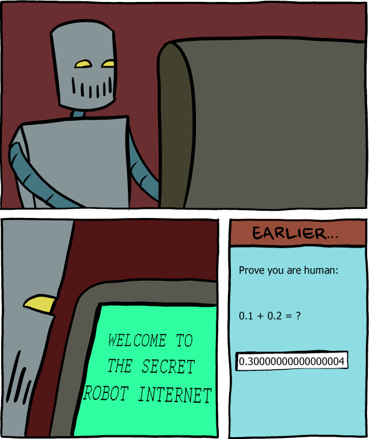

# 數值系統篇


---
tags: C, CLANG, C LANGUAGE, recursion
---

# [你所不知道的C語言](http://hackfoldr.org/dykc/)：數值系統篇
Copyright (**慣C**) 2017 [宅色夫](http://wiki.csie.ncku.edu.tw/User/jserv)
==[直播錄影](https://www.youtube.com/watch?v=IF1XwyRd-bc)==

## 從一則新聞、動畫，和漫畫談起

* [脫離「腦補」而培養專業的重要性](https://www.facebook.com/groups/system.software2016/permalink/1128247150588122/)

* [1/2＋1/3，要孩子怎麼討論？](https://www.facebook.com/thinkinggarden/videos/1542561642443824/)


[ [source](http://www.smbc-comics.com/comic/2013-06-05) ]

不同程式語言給出相似的執行結果: [Floating Point Math](http://0.30000000000000004.com/)

:::info
Python 2.7 在 GNU/Linux 的執行:
```
>>> 1 - 0.1
0.9
>>> 0.1 - 0.01
0.09000000000000001
```
後者顯然比預期數值 `0.09` 略大
```
>>> 0.1 - 0.01 - 0.1
-0.009999999999999995
```
而 `0.1 - 0.01 - 0.1` 又會得到比預期數值 `0.0` 略小的結果，有辦法讓電腦精準地表達和運算數值嗎？
:::

## 電腦不是只有二進位

電腦科學家 Donald E. Knuth 在《The Art of Computer Programming》第 2 卷說：
> "Perhaps the prettiest number system of all is the balanced ternary notation"

這裡的 ternary 意思是三個的、三個一組的、三重的，也稱為 base-3，顧名思義，不是只有 0 或 1，而是將可能的狀態擴充為 `0`, `1`, `2`，在 balanced ternary 中，就是 `-1`, `0`, `+1` 等三個可能狀態，又可以簡寫為 `-`, `0`, `+`。
> the ternary values as being "balanced" around the mid-point of 0. The same rules apply to ternary as to any other numeral system: The right-most symbol, R, has it's own value and each successive symbol has it's value multiplied by the base, B, raised to the power of it's distance, D from R.

考慮以下 balanced ternary:

> `+++-0` = (1 * 3^4^) + (1 * 3^3^) + (1 * 3^2^) + (-1 * 3^1^) + 0
>      = 81 + 27 + 9 + -3
>      = 114

乍看沒什麼特別的，但當我們考慮 `-114` 的表示法時，就有趣了:
> `---+0` = (-1 * 3^4^) + (-1 * 3^3^) + (-1 * 3^2^) + (1 * 3^1^) + 0
>      = -81 + -27 + -9 + 3
>      = -114

也就是把所有的 `+` 和 `-` 對調，就不用像在 2 進位表示法中，需要特別考慮 signed 和 unsigned。

balanced ternary 的作用不僅在一致的方式去表達數值，還可用於浮點數。以下是 10 進位的 `0.2` 對應的 balanced ternary 表示法:
> `0.+--+` = 0 + (1 * (3^-1^)) + (-1 * (3^-2^)) + (-1 * (3^-3^)) + (1 * (3^-4^))
>       = 0.33 + -0.11 + -0.03 + 0.01
>       = 0.2
       
如何表達 10 進位的 `0.8` 呢？既然 `0.8 = 1 - 0.2`，我們做以下表示:
> `+.-++-` = 1 + (-1 * (3^-1^)) + (1 * (3^-2^)) + (1 * (3^-3^)) + (-1 * (3^-4^))
       = 1 + -0.33 + 0.11 + 0.03 + -0.01
       = 0.8

把最開頭的 `0` 換成 `+1`，然後小數點後的 `+` 和 `-` 對調即可。

參考資料:
* [The Balanced Ternary Machines of Soviet Russia](https://dev.to/buntine/the-balanced-ternary-machines-of-soviet-russia)
* [The Tech Behind IOTA Explained](http://www.tangleblog.com/2017/01/25/the-tech-behind-iota-explained/)
>> These 3 states perform transaction very balanced, which is quite helpful to build a self-organizing and self-sustaining network like the tangle.


## 數值表達方式和阿貝爾群

數學中的「群」是個由我們定義的二元運算的集合，這裡的二元運算稱為「加法」，表示為符號 `+`。為了讓一個集合 G 成為群，必須定義加法運算並使之具有以下 4 個特性：

1. 封閉性: 若 a 和 b 是集合 G 中的元素，於是 `(a + b)` 也是集合 G 中的元素;
2. 結合律: `(a + b) + c = a + (b + c)`;
3. 存在單位元 0，使得 `a + 0 = 0 + a = a`;
4. 每個元素都有逆元，也就是說：對於任意 a，存在 b，使得 `a + b = 0`;

倘若我們追加下述條件:
5. 交換律: `a + b = b + a`;

那麼，稱這個群為阿貝爾群 (Abelian group)。

嚴格定義後，我們再回顧通常概念的「加法」時，就可發現，整數的集合 `Z` 就是一個群 (同時也是個阿貝爾群)，但是，自然數的集合 (`N`) 就不是群，因為 N 不滿足上述第 4 個特性。

為何我們要大費周章去表達「群」的特性呢？一旦我們證明它具備上述 4 個特性，那麼就可自由地獲取到一些其他特性。像是：
* 單位元是唯一的；
* 逆元也是唯一的，即：對於每一個 a，存在唯一的一個 b，使得 `a + b = 0` (我們可以將 b 寫成 -a)。

以電腦的數值系統來說，整數 (包含 sign 和 2's complement) 加法形成阿貝爾群，實數 (`R`) 的加法也形成阿貝爾群，但我們必須考慮四捨五入 (或無條件捨入) 對這些屬性的影響。更甚者，由於 overflow 的考慮，導致儘管 x 和 y 都是實數，結果可能截然不同。

回到電腦的資料表示法，假設我們用 4 個 bits 來表示，像是 `0000` 表示 `0`，我們可以額外引入一個 bit 來表示 +/- (sign bit)，但事實上我們可將上述特性考慮進去，引入逆元，讓每個正整數都可有一個對應的反元素，也是負數，這也是為何對應的正整數 bit-wise not 後 +1。`1000` 是唯一沒有對應正整數的數值，因此有號數的負整數會比正整數多一個。

在 IEEE 754 的單精度運算符點數中 ([好看的解說影片](https://www.youtube.com/watch?v=VlX4OlKvzAk)，我說板書)，表達式 (3.14 + 1e10) - 1e10 求值會得到 0.0 —— 因為捨入，數值 3.14 會丟失。另一方面，表達式 3.14 + (1e10 - 1e10) 會得到數值 3.14。
* 延伸閱讀: [浮點數的美麗與哀愁](https://champyen.blogspot.tw/2017/04/blog-post.html)

作為阿貝爾群，大多數值的浮點數加法都有逆元，但是 INF (無窮) 和 NaN 是例外情況，因為對任何 x，都有 NaN + fx = NaN;
浮點數加法不具有結合性，這是缺乏的最重要「群」特性。知道這些後，對我們寫程式有什麼影響呢？

衝擊可大了！

假設 C 語言編譯器即將處理以下程式碼:
```C
x = a + b + c;
y = b + c + d;
```

編譯器可能為了省下一道浮點數運算，而產生以下中間程式碼: (code motion 技巧，詳見 [編譯器和最佳化原理篇](https://hackmd.io/s/Hy72937Me))
```C
t = b + c;
x = a + t;
y = t + d;
```

但對於 x 來說，這樣的計算方式可能會導致和原始數值截然不同的結果，因為它運用了加法運算的不同的結合方式！

單精度浮點數運算中:
* (1e20 * 1e20) * 1e20 為 +INF
* 1e20 * (1e20 * 1e-20) 為 1e20
* 1e20 * (1e20 - 1e20) 為 0.0
* 1e20 * 1e20 - 1e20 * 1e20 為 NaN

## Integer Overflow

* [神一樣的進度條](https://www.facebook.com/JservFans/photos/a.743333619126308.1073741828.638604962932508/908325589293776/)
* [波音 787 不再「夢幻」](https://www.facebook.com/JservFans/posts/907938812665787)
    * 波音 787 的電力控制系統在 248 天電力沒中斷的狀況下，會自動關機，為此 FAA (美國聯邦航空管理局) 告知應每 120 天重開機，看來「重開機治百病」放諸四海都通用？這當然是飛安的治標辦法，我們工程人員當然要探究治本議題。
    * 任教於美國 [Carnegie Mellon University](https://www.facebook.com/carnegiemellonu/) (CMU) 的 Phil Koopman 教授指出，這其實就是 integer overflow，再次驗證「失之毫釐，差之千里」的道理。
    *   我們先將 248 天換成秒數:
    *   248 days * 24 hours/day * 60 minute/hour * 60 seconds/minute = 21,427,200
    *   這個數字若乘上 100，繼續觀察：
        * `0x7FFFFFFF` (32-bit 有號數最大值) = 2147483647 / (24 * 60 * 60) = 24855 / 100 = 248.55 days.
    *   看出來了嗎？每 1/100 秒紀錄在 32-bit signed integer，然後遇到 overflow
    *   [Counter Rollover Bites Boeing](http://betterembsw.blogspot.tw/2015/05/counter-rollover-bites-boeing-787.html)[ ](http://betterembsw.blogspot.tw/2015/05/counter-rollover-bites-boeing-787.html)[ 787](http://betterembsw.blogspot.tw/2015/05/counter-rollover-bites-boeing-787.html)
* [Deep Impact ](https://www.facebook.com/JservFans/posts/904562523003416)(2005)
* [Ariane 5](https://www.facebook.com/JservFans/posts/904552413004427) (1996)
    *   [detail report](https://www.ima.umn.edu/~arnold/disasters/ariane5rep.html) : a data conversion from 64-bit floating point to 16-bit signed integer value

其他 integer overflow 案例:

*   [Openssh 2002 security hole](http://www.openssh.com/txt/preauth.adv)
*   [Year 2038 problem](https://en.wikipedia.org/wiki/Year_2038_problem)
*   [Youtube Gangnam Style overflows](http://arstechnica.com/business/2014/12/gangnam-style-overflows-int_max-forces-youtube-to-go-64-bit/)
*   [Diablo III Real Money Action House integer overflow](http://gamasutra.com/blogs/MaxWoolf/20130508/191959/Diablo_III_Economy_Broken_by_an_Integer_Overflow_Bug.php)
*   [Lempel-Ziv-Oberhumer (LZO) algorithm](http://thehackernews.com/2014/06/20-years-old-vulnerability-in-lzo.html)
*   [OpenSSL integer underflow leading to buffer overflow in base64 decoding](https://bugzilla.redhat.com/show_bug.cgi?id=1202395)
*   [Trend Micro Discovers Vulnerability That Renders Android Devices Silent](http://blog.trendmicro.com/trendlabs-security-intelligence/trend-micro-discovers-vulnerability-that-renders-android-devices-silent/)
*   [IPv4 address ](https://en.wikipedia.org/wiki/IPv4_address_exhaustion)[L](https://en.wikipedia.org/wiki/IPv4_address_exhaustion)[exhaustion](https://en.wikipedia.org/wiki/IPv4_address_exhaustion) , [A bug and a crash --- The explosion of Ariane 5 rocket](http://www.around.com/ariane.html)
*   [Integer overflow in Mozilla Firefox 3.5.x before 3.5.11 and 3.6.x before 3.6.7](http://cve.mitre.org/cgi-bin/cvename.cgi?name=CVE-2010-2753)
*   [CVE-2015-1593 - Linux ASLR integer overflow: Reducing stack entropy by four](http://hmarco.org/bugs/linux-ASLR-integer-overflow.html)
*   [Integer overflow in Bitcoin software](http://cve.circl.lu/cve/CVE-2010-5139), [Bitcoinwiki - Value overflow incident](https://en.bitcoin.it/wiki/Value_overflow_incident)
*   [SSH CRC32 attack detection code contains remote integer overflow](http://www.kb.cert.org/vuls/id/945216)
*   [.NET Framework EncoderParameter integer overflow vulnerability](http://www.akitasecurity.nl/advisory/AK20110801/_net_framework_encoderparameter_integer_overflow_vulnerability.html)
*   [The classic videogame Donkey Kong has an infamous ’kill screen’, where the game stops working. But why? =>integer overflow](http://mentalfloss.com/uk/games/31376/why-does-donkey-kong-break-on-level-22)
*   [Adobe Flash Player casi32 Integer Overflow](http://www.rapid7.com/db/modules/exploit/windows/browser/adobe_flash_casi32_int_overflow)
*   [ngx_http_close_connection integer overflow](http://www.oschina.net/news/39973/ngx_http_close_connection-integer-overflow)
*   [愛國者飛彈系統軟體問題](http://sydney.edu.au/engineering/it/~alum/patriot_bug.html)
*   [PHP Integer Overflow Affects Tenable’s Security Center](https://www.tenable.com/security/tns-2014-10)
*   [Therac-25 radiation overdose](https://en.wikibooks.org/wiki/Professionalism/Therac-25#cite_note-medical-devices-1)
*   [CVE-2014-3669: Integer overflow in unserialize() PHP function](https://www.htbridge.com/blog/cve_2014_3669_integer_overflow_in_unserialize_php_function.html)
*   [MS15-034 – Range Header Integer Overflow](https://sathisharthars.wordpress.com/tag/range-header-integer-overflow/)
*   [PID 控制器設計上的一些考量 避免發生overflow](http://www.ledin.com/integer-algorithms-implementation-and-issues/)
*   [Python Integer Overflow in ’bufferobject.c’ Lets Users Obtain Potentially Sensitive Information](http://www.securitytracker.com/id/1033118)
*   [Super Mario Bros life](https://www.reddit.com/r/programming/comments/1aigv9/integer_overflow_in_an_rpg_defeat_a_boss_by/)

* [gdb 顯示 FLAGS register](https://blog.louie.lu/2016/09/04/gdb-%E9%A1%AF%E7%A4%BA-flags-register/)


## Integer Overflow 案例分析

* 2002 年 FreeBSD [53]
```C
#define KSIZE 1024
char kbuf[KSIZE];
int copy_from_kernel(void *user_dest, int maxlen) {
    int len = KSIZE < maxlen ? KSIZE : maxlen;
    memcpy(user_dest, kbuf, len);
    return len;
}
```
:::info
假設懷有惡意的程式設計師將「負」的數值作為 maxlen 帶入 `copy_from_kernel`，會有什麼問題？
:::

* 2002 年 External data representation (XDR) [62]
```C
void *copy_elements(void *ele_src[], int ele_cnt,
                    int ele_size) {
    void *result = malloc(ele_cnt * ele_size);
    if (result==NULL) return NULL;
    void *next = result;
    for (int i = 0; i < ele_cnt; i++) {
        memcpy(next, ele_src[i], ele_size);
        next += ele_size;
    }
    return result;
}
```
:::info
假設懷有惡意的程式設計師將 ele_cnt = 2^20^ +1, ele_size = 2^12^ 帶入，會有什麼問題？
:::

## 二進位

* 萊布尼茲在 1678 年發明二進位表示法
    * [ [source](https://kknews.cc/zh-tw/education/xzqr6og.html) ] 萊布尼茲研究 Pascal 在 1642 年設計製造的十進位數字計算機，並在 1671年設計出能作加減乘除的分級計算機設計。藉由多次的加減來實現乘除，還可以求平方根。這過程中，他發現平時用起來很方便的十進位計數法，搬到機械上去實在太麻煩。
    * 為了解答「能否用較少的數碼來表示一個數呢？」這問題，萊布尼茲在 1678 年發明二進位計數法，也就是二進位。如此一來，用 0 和 1 兩個數碼就可以表示出一切數。比如用 `10` 表示 2，`11` 表示 3，`100` 表示 4，`101` 表示 5，以此類推。
    * 大清國康熙時期，派遣傳教士白晉 (法語: Joachim Bouvet) 回到法國，白晉在 1701 年寄了一封附上兩張易經六十四卦圖的信給萊布尼茲，萊布尼茲受到啟發，稱讚八卦是
    > 「世上流傳下來的科學中最古老的紀念物」。

* George Boolean 在1800年介紹「邏輯代數」，後來成為「布林代數」(Boolean Algebra)
* Claude E. Shannon 於 1938 年發表布林代數對於二進制函數的應用
* [世界上只有10種人，一種是懂二進位的](https://hellolynn.hpd.io/2017/08/11/%e4%b8%96%e7%95%8c%e4%b8%8a%e5%8f%aa%e6%9c%8910%e7%a8%ae%e4%ba%ba%ef%bc%8c%e4%b8%80%e7%a8%ae%e6%98%af%e6%87%82%e4%ba%8c%e9%80%b2%e4%bd%8d%e7%9a%84/)

## 運用 bit-wise operator

* [實作二進位加法器](https://hellolynn.hpd.io/2017/08/15/%e4%bb%a5c%e5%af%a6%e4%bd%9c%e4%ba%8c%e9%80%b2%e4%bd%8d%e5%8a%a0%e6%b3%95/)

* C 語言中，`x & (x - 1) == 0` 的數學意義
	* power of two
	* signed v.s. unsigned

* 將字元轉成小寫: 免除使用分支
```clike
('a' | ' ') // 得到 'a'
('A' | ' ') // 得到 'a'
```

* 將字元轉為大寫: 免除使用分支
```clike
('a' & '_') // 得到 'A'
('A' & '_') // 得到 'A'
```

* 大小寫互轉: 避免使用分支
```clike
('a' ^ ' ') // 得到 'A'
('A' ^ ' ') // 得到 'a'
```

* [XOR swap](https://en.wikipedia.org/wiki/XOR_swap_algorithm)
    * 交換兩個記憶體空間內的數值，可完全不用額外的記憶體來實作
    ```C
    void xorSwap(int *x, int *y) {
        *x ^= *y;
        *y ^= *x;
        *x ^= *y;
    }
    ```
    * 需要這種手法的情境:
        1. 指令集允許 XOR swap 產生較短的編碼 (某些 DSP);
        2. 考慮到暫存器數量在某些硬體架構 (如 ARM) 非常有限，register allocation 就變得非常棘手，這時透過 XOR swap 可降低這方面的衝擊;
        3. 在微處理器中，記憶體是非常珍貴的資源，此舉可降低記憶體的使用量;
        4. 在加解密的實作中，需要常數時間的執行時間，因此保證 swap 兩個數值的執行成本要固定 (取決於指令週期數量);

* 避免 overflow
    * 比方說 `(x + y) / 2` 這樣的運算，有個致命問題在於 (x + y) 可能會導致 overflow (考慮到 x 和 y 都接近 [UINT32_MAX](https://msdn.microsoft.com/en-us/library/mt764276.aspx)，亦即 32-bit 表示範圍的上限之際)，於是我們可以改寫為以下:
    ```clike
    (x & y) + ((x ^ y) >> 1)
    ```
    * 用加法器來思考: `x & y` 是進位, `x ^ y` 是位元和, `/ 2` 是向右移一位
    *  位元相加不進位的總和: `x ^ y`; 位元相加產生的進位值: `(x & y) << 1`
    *  `x + y = x ^ y + ( x & y ) << 1`
    * 所以 (x + y) / 2
= (x + y) >> 1
= (x ^ y + (x & y) << 1) >> 1
= (x & y) + ((x ^ y) >> 1)

* 以下 C 語言程式的 DETECT 巨集能做什麼？
```C=
#if LONG_MAX == 2147483647L
#define DETECT(X) \
    (((X) - 0x01010101) & ~(X) & 0x80808080)
#else
#if LONG_MAX == 9223372036854775807L
#define DETECT(X) \
    (((X) - 0x0101010101010101) & ~(X) & 0x8080808080808080)
#else
#error long int is not a 32bit or 64bit type.
#endif
#endif
```

* 巨集 `DETECT` 在偵測什麼？
	* Detect NULL

測試這程式時，要注意到由於 **LONG_MAX** 定義在 `<limits.h>` 裡面，因此要記得作 `＃include`

這個巨集的用途是在偵測是否為 0 或者說是否為 NULL char ’\0’，也因此，我們可以在 iOS 的原始程式碼 [strlen](http://opensource.apple.com/source/Libc/Libc-583/arm/string/strlen.s) 的實作中看到這一段。那，為什麼這一段程式碼可以用來偵測 NULL char ?

我們先思考 strlen() 該怎麼實做，以下實作一個簡單的版本
```C=
unsigned int strlen(const char *s)
{
    char *p = s;
    while (*p != ’\0’) p++;
    return (p - s);
}
```
這樣的版本有什麼問題？雖然看起來精簡，但是因為他一次只檢查 1byte，所以一旦字串很長，他就會處理很久。另外一個問題是，假設是在 32-bit 的 CPU 上，一次是處理 4-byte (32-bit) 大小的資訊，不覺得這樣很浪費嗎?

為了可以思考這樣的程式，我們由已知的計算方式來逆推原作者可能的思考流程，首先先將計算再簡化一點點，將他從 **(((X) - 0x01010101) & ~(X) & 0x80808080)** 變成
```
((X) - 0x01) & ~(X) & 0x80
```
還是看不懂，將以前學過的笛摩根定理套用上去，於是這個式子就變成了
```
~( ~(X - 0x01) | X ) & 0x80 
```
再稍微調整一下順序
```
~( X | ~(X - 0x01) ) & 0x80 
```
所以我們就可進行分析

* `X | ~(X - 0x01)` => 取得最低位元是否為 0 ，並將其他位元設為 1
    * X = 0000 0011 => 1111 1111
    * X = 0000 0010 => 1111 1110
*   想想 0x80 是什麼? 0x80 是 1000 0000 ，也就是 1-byte 的最高位元

上面這兩組組合起來，我們可以得到以下結果

*   X = 0    => 1000 0000  => 0x80
*   X = 1     => 0000 0000 => 0
*   X = 2    => 0000 0000 => 0
*   .......
*   X = 255 => 0000 0000 => 0

於是我們知道，原來這樣的運算，如果一個 byte 是 0，那經由這個運算得到的結果會是 0x80，反之為 0。

再將這個想法擴展到 32-bit，是不是可以想到說在 32bit 的情況下，0 會得到 0x80808080 這樣的答案?我們只要判斷這個數值是不是存在，就可以找到 ’\0’ 在哪了！

參考資料:

*   [Hacker’s Delight](http://www.amazon.com/Hackers-Delight-Edition-Henry-Warren/dp/0321842685)  
*   [](http://www.hackersdelight.org/corres.txt)[http://www.hackersdelight.org/corres.txt](http://www.hackersdelight.org/corres.txt)
*   [FreeBSD 的 strlen(3)](https://blog.delphij.net/2012/04/freebsd-strlen3.html) 
*   [Bug 60538  - [SH] improve support for cmp/str insn ](https://gcc.gnu.org/bugzilla/show_bug.cgi?id=60538)

應用:
*   [newlib 的 strlen](https://github.com/eblot/newlib/blob/master/newlib/libc/string/strlen.c)
*   [newlib 的 strcpy](https://github.com/eblot/newlib/blob/master/newlib/libc/string/strcpy.c)
*   SSE 4.2 最佳化版本: [Implementing strcmp, strlen, and strstr using SSE 4.2 instructions](https://www.strchr.com/strcmp_and_strlen_using_sse_4.2)


## 算術完全可用數位邏輯實做

只能使用位元運算子和遞迴，在C程式中實做兩個整數的加法，可行嗎？

先回顧[加法器](http://www.gauss.com.tw/logic/ch6/index6.htm) 的實做，思考以下程式碼:
```C
int add(int a, int b)
{
    if (b == 0) return a;
    int sum = a ^ b; /* 相加但不進位 */
    int carry = (a & b) << 1; /* 進位但不相加 */
    return add(sum, carry);
}
```
延伸閱讀: [How to simulate a 4-bit binary adder in C](http://stackoverflow.com/questions/14695051/how-to-simulate-a-4-bit-binary-adder-in-c)


## Count Leading Zero

當我們計算 log2 (以2為底的對數) 時, 其實只要算高位有幾個 0's bits. 再用 31 減掉即可。
```C
BITS = 31;
for (; i < 32; --BITS) {
    if (N & 0x80000000) break;
    N <<= 1;
}
```

LOG(N) is BITS

當要算 log10 時, 因為 32-bit unsigned integer 最大只能顯示 4294967295U，所以 32-bit LOG10() 的值只有可能是 0 ~ 9.
這時可透過查表法，以省去除法的成本。
```C
unsigned int vals[] = {
    0UL,
    10UL,
    100UL,
    1000UL,
    10000UL,
    100000UL,
    1000000UL,
    10000000UL,
    100000000UL,
    1000000000UL,
};
for (i = 0; i < (nr - 1); ++i) { // 9
    if (N >= vals[i] && N < vals[i + 1]) { // 8
        break; // 1
    }
}
```

換句話說，計算 log2 時，知道「高位開頭有幾個 0」就成為計算的關鍵操作。

延伸閱讀: [Fast computing of log2 for 64-bit integers](http://stackoverflow.com/questions/11376288/fast-computing-of-log2-for-64-bit-integers)

* 類似 De Bruijn 演算法

*   64-bit version
```C
const int tab64[64] = {
    63,  0, 58,  1, 59, 47, 53,  2,
    60, 39, 48, 27, 54, 33, 42,  3,
    61, 51, 37, 40, 49, 18, 28, 20,
    55, 30, 34, 11, 43, 14, 22,  4,
    62, 57, 46, 52, 38, 26, 32, 41,
    50, 36, 17, 19, 29, 10, 13, 21,
    56, 45, 25, 31, 35, 16,  9, 12,
    44, 24, 15,  8, 23,  7,  6,  5
};
int log2_64 (uint64_t value)
{
    value |= value >> 1;
    value |= value >> 2;
    value |= value >> 4;
    value |= value >> 8;
    value |= value >> 16;
    value |= value >> 32;
    return tab64[((uint64_t)((value - (value >> 1 ))*0x07EDD5E59A4E28C2)) >> 58];
}
```

*   32-bit version
```C
const int tab32[32] = {
     0,  9,  1, 10, 13, 21,  2, 29,
    11, 14, 16, 18, 22, 25,  3, 30,
     8, 12, 20, 28, 15, 17, 24,  7,
    19, 27, 23,  6, 26,  5,  4, 31
};
int log2_32 (uint32_t value)
{
    value |= value >> 1;
    value |= value >> 2;
    value |= value >> 4;
    value |= value >> 8;
    value |= value >> 16;
    return tab32[(uint32_t)(value*0x07C4ACDD) >> 27];
}
```

gcc 提供 built-in Function:
* [int __builtin_clz (unsigned int x)](http://gcc.gnu.org/onlinedocs/gcc/Other-Builtins.html)
	* Returns the number of leading 0-bits in x, starting at the most significant bit position.
	* If x is 0, the result is undefined.

可用來實做 log2:
```C
#define LOG2(X) ((unsigned) \
   (8 * sizeof (unsigned long long) -
    __builtin_clzll((X)) - 1))
```

那該如何實做 clz 呢？

- [ ] iteration version
```C
int clz(uint32_t x) {
    int n = 32, c = 16;
    do {
        uint32_t y = x >> c;
        if (y) { n -= c; x = y; }
        c >>= 1;
    } while (c);
    return (n - x);
}
```

- [ ] binary search technique
```C
int clz(uint32_t x) {
    if (x == 0) return 32;
    int n = 0;
    if (x <= 0x0000FFFF) { n += 16; x <<= 16; }
    if (x <= 0x00FFFFFF) { n += 8; x <<= 8; }
    if (x <= 0x0FFFFFFF) { n += 4; x <<= 4; }
    if (x <= 0x3FFFFFFF) { n += 2; x <<= 2; }
    if (x <= 0x7FFFFFFF) { n += 1; x <<= 1; }
    return n;
}
```

- [ ] byte-shift version
```C
int clz(uint32_t x) {
    if (x == 0) return 32;
    int n = 1;
    if ((x >> 16) == 0) { n += 16; x <<= 16; }
    if ((x >> 24) == 0) { n += 8; x <<= 8; }
    if ((x >> 28) == 0) { n += 4; x <<= 4; }
    if ((x >> 30) == 0) { n += 2; x <<= 2; }
    n = n - (x >> 31);
    return n;
}
```

* [ffs](http://man7.org/linux/man-pages/man3/ffs.3.html)() 會回傳給定數值的 first bit set 的位置
	* 例如 128 在 32-bit 表示為 `0x10000000`，ffs(128)會回傳 8
	* 129 在 32bit 表示為 `0x10000001，`ffs(129) 會回傳 1

延伸閱讀: [Bit scanning equivalencies](https://fgiesen.wordpress.com/2013/10/18/bit-scanning-equivalencies/)

## 省去迴圈

考慮以下 C 程式,解說在 32-bit 架構下具體作用(不是逐行註解)，以及能否避開用迴圈？

```c
int func(unsigned int x) {
    int val = 0; int i = 0;
    for (i = 0; i < 32; i++) {
        val = (val << 1) | (x & 0x1);
        x >>= 1;
    }
    return val;
}
```

簡單來說這段程式碼就是拿來顛倒輸入數字的位元順序，如下面測試所示，顛倒後位元不足 32bit 者，全部補 0

```txt
------input number 99--------
2bit= 1100011
val = 11000110000000000000000000000000
------output number -973078528--------

------input number 198--------
2bit= 11000110
val = 1100011000000000000000000000000
------output number 1660944384--------

------input number 297--------
2bit= 100101001
val = 10010100100000000000000000000000
------output number -1803550720--------

------input number 396--------
2bit= 110001100
val = 110001100000000000000000000000
------output number 830472192--------

------input number 4294967281--------
2-bit= 11111111111111111111111111110001
val  = 10001111111111111111111111111111
------output number -1879048193--------
```


參考 [Reverse integer bitwise without using loop](http://stackoverflow.com/questions/21511533/reverse-integer-bitwise-without-using-loop)，將原本的 for 迴圈變更為 bit-wise 操作:
```
new = num;
new = ((new & 0xffff0000) >> 16) | ((new & 0x0000ffff) << 16);
new = ((new & 0xff00ff00) >> 8) | ((new & 0x00ff00ff) << 8);
new = ((new & 0xf0f0f0f0) >> 4) | ((new & 0x0f0f0f0f) << 4);
new = ((new & 0xcccccccc) >> 2) | ((new & 0x33333333) << 2);
new = ((new & 0xaaaaaaaa) >> 1) | ((new & 0x55555555) << 1);
```
在不使用迴圈的情況下，可以做到一樣的功能。

## 加解密的應用

- [ ] Caesar shift cipher
* 把 A-Z 這 26 個字母表示成 A=0, B=1, ..., Z=25，然後給任意一個 KEY，把訊息的字母加上 KEY 之後 mod 26 就會得到加密之後的訊息。假設 KEY=19，那麼原本的訊息例如 HELLO (7 4 11 11 14) 經過 cipher 後 (26 23 30 30 33) mod 26 => (0 23 4 4 7) 會變成 AXEEH 的加密訊息。

- [ ] XOR
* 假設有一張黑白的相片是由很多個0~255的pixel組成(0是黑色，255是白色)，這時候可以用任意的 KEY (00000000~2~ - 11111111~2~) 跟原本的每個 pixel 做運算，如果使用 AND (每個bit 有75% 機率會變成 0)，所以圖會變暗。如果使用 OR (每個 bit有 75% 機率會變 1)，圖就會變亮。這兩種幾乎都還是看的出原本的圖片，但若是用 XOR 的話，每個 bit 變成 0 或 1 的機率都是 50%，所以圖片就會變成看不出東西的雜訊。


上圖左 1 是原圖，左 2 是用 AND 做運算之後，右 2 是用 OR 做運算之後，右 1 是用 XOR，可見使用 XOR 的加密效果最好。

參考資料：[Ciphers vs. codes
](https://www.khanacademy.org/computing/computer-science/cryptography/ciphers/a/ciphers-vs-codes)
