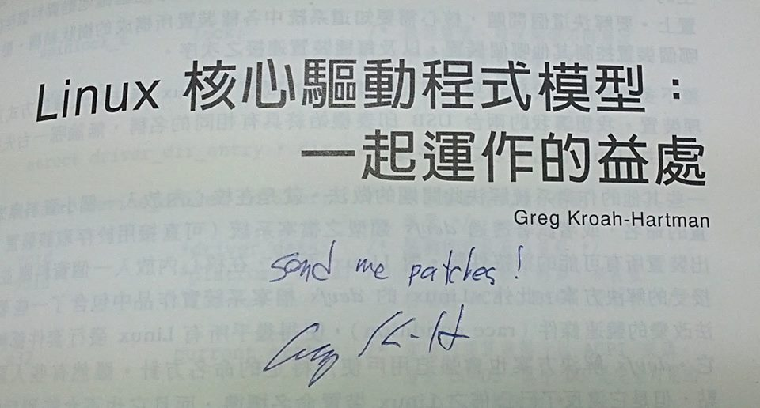

# 物件導向程式設計篇


# [你所不知道的 C 語言](http://hackfoldr.org/dykc/)：物件導向程式設計篇

*「慣 C」當然可以進行物件導向*
Copyright (**慣C**) 2016 [宅色夫](http://wiki.csie.ncku.edu.tw/User/jserv)

- [直播錄影](https://www.youtube.com/watch?v=IG6q8WX0sK4)

---


### DICK Learning

<u>D</u>eeply <u>I</u>ntrospect <u>C</u> <u>K</u>nowledge

學不好物件導向程式設計的人，往往是無法「把故事說好」者

## 先來看一個範例

* Doxygen 可掃描給定原始程式碼內容、註解，之後將自動產生程式文件，其中一種輸出就是 HTML，可透過瀏覽器來閱讀文件和程式碼
    * 延伸閱讀: [Learning Doxygen](http://wiki.herzbube.ch/index.php/LearningDoxygen)
* 修改自 [Doxygen](http://www.stack.nl/~dimitri/doxygen/) 的範例: **[doxygen-oop-in-c](https://github.com/jserv/doxygen-oop-in-c)**

```
$ git clone https://github.com/jserv/doxygen-oop-in-c.git
$ cd doxygen-oop-in-c
$ make
$ make doc
```

用網頁瀏覽器打開 `doc/html/index.html`

點擊 "Classes" -> "Object"

</img>

檔案 [manual.c](https://github.com/jserv/doxygen-oop-in-c/blob/master/manual.c) 定義了物件的繼承

這跟一般的 C 語言程式有什麼差別？
(你乾脆問「你媽媽跟林志玲絕大多數的生理機能都一樣，有什麼差別？」)

</img>


([圖片來源](https://twitter.com/siigech/status/698160217947648000))

「資料 + 動作」包裝成「物件」

## 物件導向是一種態度

只要有心，[Brainf*ck 語言也能作 Object-Oriente d Programming](https://github.com/embedded2015/jit-construct/blob/master/progs/oobrain.b) (OOP)！

### Data Encapsulation

</img>

善用 forward declaration 與 function pointer，用 C 語言實現 [Encapsulation](https://en.wikipedia.org/wiki/Encapsulation_(computer_programming))，示範程式碼如下：

```clike=
#include <stdio.h>
#include <stdlib.h>

/* forward declaration */
typedef struct object Object;
typedef int (*func_t)(Object *);

struct object {
	int a, b;
	func_t add, sub;
};

static int add_impl(Object *self) { // method
	return self->a + self->b;
}
static int sub_impl(Object *self) { // method
	return self->a - self->b;
}

// & : address of
// * : value of // indirect access
int init_object(Object **self) { // call-by-value
	if (NULL == (*self = malloc(sizeof(Object)))) return -1;
	(*self)->a = 0; (*self)->b = 0;
	(*self)->add = add_impl; (*self)->sub = sub_impl;
	return 0;
}

int main(int argc, char *argv[])
{
	Object *o = NULL;
	init_object(&o);
	o->a = 9922; o->b = 5566;
	printf("add = %d, sub = %d\n", o->add(o), o->sub(o));
	return 0;
}
```

注意，為何要 `Object **self` 呢？

</img>

透過 pointer to pointer 才能確認是否有效

### Inheritance & Polymorphism

* [Inheritance and Polymorphism in C](http://www.codeproject.com/Articles/108830/Inheritance-and-Polymorphism-in-C)
* [A Simple Object System](http://c.learncodethehardway.org/book/ex19.html)

延伸閱讀: [探尋C語言名稱空間](http://www.ithome.com.tw/voice/109166)

## 複習 C 語言程式設計

* designated initializers [C99]
    * [The New C: Declarations & Initializations](http://www.drdobbs.com/the-new-c-declarations-initializations/184401377)
* [C preprocessor 和相關背景知識](http://good5dog5.github.io/2016/03/22/embedded_system-note/)
    * https://gcc.gnu.org/onlinedocs/cpp/Stringification.html
    * https://gcc.gnu.org/onlinedocs/cpp/Concatenation.html

* [你所不知道的 C 語言：指標篇](https://hackmd.io/s/HyBPr9WGl)
    * **ISO/IEC 9899 (簡稱 "C99")** [規格書](http://www.open-std.org/jtc1/sc22/wg14/www/docs/n1256.pdf) (PDF) **_"object"_** 出現 735 處， **_"pointer"_** 出現 637 處
    * 許多教材往往不談 object，而是急著談論 pointer，殊不知，這兩者其實就是一體兩面

- C99 [3.14] ***object***
  - region of data storage in the execution environment, the contents of which can represent values
  - 在 C 語言的物件就指在執行時期，==資料==儲存的區域，可以明確表示數值的內容
  - 很多人誤認在 C 語言程式中，(int) 7 和 (float) 7.0 是等價的，其實以資料表示的角度來看，這兩者截然不同，前者對應到二進位的 "111"，而後者以 IEEE 754 表示則大異於 "111"
</img>

- C99 [6.2.4] ***Storage durations of objects***
  - An object has a storage duration that determines its lifetime. There are three storage durations: static, automatic, and allocated.
  
  > 注意生命週期 (lifetime) 的概念，中文講「初始化」時，感覺像是「盤古開天」，很容易令人誤解。其實 initialize 的[英文意義](http://dictionary.reference.com/browse/initialize)很狹隘： "to set (variables, counters, switches, etc.) to their starting values at the beginning of a program or subprogram."
  
  - The lifetime of an object is the portion of program execution during which storage is guaranteed to be reserved for it. An object exists, has a constant address and retains its last-stored value throughout its lifetime. If an object is referred to outside of its lifetime, the behavior is undefined.
  
  > 在 object 的生命週期以內，其存在就意味著有對應的常數記憶體位址。注意，C 語言永遠只有 call-by-value
  - The value of a pointer becomes indeterminate when the object it points to reaches the end of its lifetime.
  
  > 作為 object 操作的「代名詞」(alias) 的 pointer，倘若要在 object 生命週期以外的時機，去取出 pointer 所指向的 object 內含值，是未知的。考慮以下操作 `ptr = malloc(size); free(ptr);` 倘若之後做 `*ptr`，這個 allocated storage 已經超出原本的生命週期
  - An object whose identifier is declared with no linkage and without the storage-class specifier static has automatic storage duration.

- C99 [6.2.5]  ***Types***
  - A pointer type may be derived from a function type, an object type, or an incomplete type, called the referenced type. A pointer type describes an object whose value provides a reference to an entity of the referenced type. A pointer type derived from the referenced type T is sometimes called ‘‘pointer to T’’. The construction of a pointer type from a referenced type is called ‘‘pointer type derivation’’.
  > 注意到術語！這是 C 語言只有 call-by-value 的實證，函式的傳遞都涉及到數值
  >> 這裡的 "incomplete type" 要注意看，稍後會解釋。要區分 `char []` 和 `char *`
  
  - Arithmetic types and pointer types are collectively called scalar types. Array and structure types are collectively called aggregate types.
  
  > 注意 "scalar type" 這個術語，日後我們看到 `++`, `--`, `+=`, `-=` 等操作，都是對 scalar (純量)
  
  >[[來源](http://www.cyut.edu.tw/~cpyu/oldphweb/chapter3/page3.htm)] 純量只有大小，它們可用數目及單位來表示(例如溫度=30oC)。純量遵守算數和普通的代數法則。注意：純量有「單位」(可用 `sizeof` 操作子得知單位的「大小」)，假設 `ptr` 是個  pointer type，對 `ptr++` 來說，並不是單純 `ptr = ptr + 1`，而是遞增或遞移 1 個「單位」
  
  - An array type of unknown size is an incomplete type. It is completed, for an identifier of that type, by specifying the size in a later declaration (with internal or external linkage). A structure or union type of unknown content is an incomplete type. It is completed, for all declarations of that type, by declaring the same structure or union tag with its defining content later in the same scope.
  > 這是 C/C++ 常見的 forward declaration 技巧的原理，比方說我們可以在標頭檔宣告 `struct GraphicsObject;` (不用給細部定義) 然後 `struct GraphicsObject *initGraphics(int width, int height);` 是合法的，但 `struct GraphicsObject obj;` 不合法
  - Array, function, and pointer types are collectively called derived declarator types. A declarator type derivation from a type T is the construction of a derived declarator type from T by the application of an array-type, a function-type, or a pointer-type derivation to T.
  > 這句話很重要，看起來三個不相關的術語「陣列」、「函式」，以及「指標」都稱為 derived declarator types，讀到此處會覺得驚訝的人，表示不夠理解 C 語言

## 案例探討: oltk

再以「[你所不知道的 C 語言：指標篇](https://embedded2015.hackpad.com/C-s0rlzR8wVtm)」提到的 oltk 為例，Polymorphism 的應用在於顯示裝置的支援。試想，如果我們能為 oltk 設計一組高階的 API ("tk" 就是 toolkit 的意思)，然後實做本身可支援 fbdev (Linux framebuffer device) 和 X11 (Linux 桌面系統)，那就可以確保在開發階段和實際在裝置執行的一致性。

**[ [gr_impl.h](http://git.openmoko.org/?p=system-test-suite.git;a=blob_plain;f=gta02-dm2/src/oltk/gr_impl.h;hb=HEAD) ]**

```clike=
struct gr_backend {
	const char *name;
	struct gr *(*open)(const char *, int width, int height, int nonblock);
};
extern struct gr_backend gr_x11_backend;
extern struct gr_backend gr_fb_backend;
```

雖然我們看到 x11 與 fb 字樣，顯然表示兩種不同的環境，但有趣的是，根本沒看到具體實做，僅有 struct gr_backend 以及裡頭的 open 與 name，我們稱 open 為 method / virtual function (OOP 用語)。而在 oltk 銜接的地方，是這樣作：

**[ [gr.c](http://git.openmoko.org/?p=system-test-suite.git;a=blob_plain;f=gta02-dm2/src/oltk/gr.c;hb=HEAD) ]**

```clike=
static const struct gr_backend *backends[] = { &gr_x11_backend, &gr_fb_backend, };
static const int n_backends = sizeof(backends) / sizeof(backends[0]);
struct gr *gr_open(const char *dev, int nonblock)
{
	struct gr *gr = NULL;
	for (int i = 0; i < n_backends; i++) {
		gr = backends[i]->open(dev, 480, 640, nonblock);
		if (gr) break;
		else { printf("gr_open: backend %d bad\n", i); }
	}
	return gr;
}
```

在此可見到，oltk 初始化時，會逐一去呼叫 graphics backend (也可以說 "provider") 的 open 這個 method，界面都是一樣的，但實際上的平臺相依程式碼卻大相逕庭。oltk 可專注在視覺表現和事件處理，而 framebuffer 到底怎麼提供呢？自行看 [gr_fb.c](http://git.openmoko.org/?p=system-test-suite.git;a=blob_plain;f=gta02-dm2/src/oltk/gr_fb.c;hb=HEAD) 的實做細節即可。

值得注意的是，無論是 [gr_fb.c](http://git.openmoko.org/?p=system-test-suite.git;a=blob_plain;f=gta02-dm2/src/oltk/gr_fb.c;hb=HEAD) 或 [gr_x11.c](http://git.openmoko.org/?p=system-test-suite.git;a=blob_plain;f=gta02-dm2/src/oltk/gr_x11.c;hb=HEAD)，這兩個平臺相依的實做，在定義實做本體時，都有 gr 的實例 (instance):

```clike=
struct gr_fb {
	struct gr gr;
	...
};
struct gr_x11 {
	struct gr gr;
	...
};
```

以 OOP 術語來看，我們可說 gr_fb 和 gr_x11 「繼承」(inherit) 了 gr，熟悉 C++ 程式設計的朋友可能會不以為然，這是 "[has-a](https://en.wikipedia.org/wiki/Has-a)"，並非 "[is-a](https://en.wikipedia.org/wiki/Composition_over_inheritance)" 的關聯。的確，我們需要更精確的說法，這裡只是展示概念。

無論實做怎麼變動，oltk 大部份的程式碼只需要在意將按鈕、文字方塊、底圖等視覺元件描繪在 `gr_open` 所指向的真正實做中，定義在 gr.h 的界面：

**[ [gr.h](http://git.openmoko.org/?p=system-test-suite.git;a=blob_plain;f=gta02-dm2/src/oltk/gr.h;hb=HEAD) ]**

```clike=
struct gr {
	int width; int height;
	int bytes_per_pixel; int depth;

	void (*close)(struct gr *);
	void (*update)(struct gr*, struct gr_rectangle *, int);

	void (*set_color)(struct gr *, unsigned int, struct gr_rgb *, unsigned int);
	int (*get_color)(struct gr *, unsigned int);

	int (*sample)(struct gr* gr, struct gr_sample *);
};
```

然後在 [oltk.c](http://git.openmoko.org/?p=system-test-suite.git;a=blob_plain;f=gta02-dm2/src/oltk/oltk.c;hb=HEAD) 中，如果想變更按鈕視覺元件的顏色，可以這麼實做：

**[ [oltk.c](http://git.openmoko.org/?p=system-test-suite.git;a=blob_plain;f=gta02-dm2/src/oltk/oltk.c;hb=HEAD) ]**

```clie=
void oltk_button_set_color(struct oltk_button *b,
			enum oltk_button_state_type state,
			enum oltk_button_color_type color,
			int rgb)
{
	struct gr_rgb grrgb;
	struct gr *gr = b->oltk->gr;
	grrgb.red = ((rgb >> 16) & 0xff) << 8; grrgb.green = ((rgb >> 8) & 0xff) << 8; grrgb.blue = (rgb & 0xff) << 8;
	gr->set_color(gr, b->oltk->color_index, &grrgb, 1);
```

顯然，上述程式呼叫的 "set_color"，也是個 method，完全看 gr 這個 instance 指向哪一種平臺相依的裝置。

更多的案例可見以下：

* [Inheritance and Polymorphism in C](http://www.codeproject.com/Articles/108830/Inheritance-and-Polymorphism-in-C)
    * [中文翻譯](http://blog.jobbole.com/86867/)
* [A Simple Object System](http://c.learncodethehardway.org/book/ex19.html)
* [Object-Oriented Structures in C](http://allenchou.net/2012/01/object-oriented-structures-in-c/)
* [Monk-C](https://github.com/sunpaq/monkc) : a toolkit for OOP in pure C
* [Design patterns of 1972](http://blog.plover.com/prog/design-patterns.html)
* [我所偏愛的 C 語言物件導向設計模式](http://blog.codingnow.com/2010/03/object_oriented_programming_in_c.html)
* [OOP in C](https://www.cs.rit.edu/~ats/books/ooc.pdf) (非常詳盡)

## Design Patterns in C

==抽象化==各種常見的問題，並提供抽象化的==解決方案==

[20年前GoF提出的設計模式，對這個時代是否還有指導意義？](http://www.infoq.com/cn/articles/design-patterns-proposed-by-gof-20-years-ago)

* 二十年前，軟體設計領域的四位大師 (GoF，「四人幫」，又稱 Gang of Four，即 Erich Gamma, Richard Helm, Ralph Johnson & John Vlissides) 通過著作《**_Design Patterns: Elements of Reusable Object-Oriented Software_**》闡述了設計模式領域的開創性成果
* 最後一章（遺憾的是，讀者們大多直接將其忽略），他們指出：
    * 「這本書的實際價值也許還值得商榷。畢竟它並沒有提出任何前所未有的演算法或者程式設計技術。它也沒能給出任何嚴格的系統設計方法或者新的設計開發理論 —— 它只是==對現有設計成果的一種審視==。大家當然可以將其視為一套不錯的教材，但它顯然無法為經驗豐富的物件導向設計人員帶來多少幫助。」
* 「人們很容易將模式視為一種解決方案，或者說一種能夠進行實際採納及重複使用的技術。相較之下，人們很難弄清其更為確切的核心 —— 即定義其能夠解決的問題以及在哪些背景下才屬於最佳解決方案。總體來講，大多數人都能弄清他人正在做什麼，卻不太瞭解這樣做的理由 —— 而所謂『理由』對於模式而言正是其需要解決的主要問題。理解模式的目標同樣重要，因為這能幫助我們選定適合自己的模式，也能幫助我們理解現有系統的設計方式。模式作者必須弄清並定義該模式所能解決的問題，或者至少在將其作為解決方案之後做出進一步思考。」 (第 393 頁)
* 模式是一套立足於特定背景，且擁有一整套可預測結果的解決方案

https://github.com/QMonkey/OOC-Design-Pattern.git
```
cd OOC-Design-Pattern
make
```

### Observer Pattern [ [source](http://teddy-chen-tw.blogspot.tw/2013/08/observer-pattern.html) ]

</img>

[圖片來源](http://business.asiaone.com/news/consumer-goods-firms-should-go-shopping)

**Name：** Observer

**Context：** 你在購物網站上看到一個很熱門且價格超便宜的產品，正當你想要下單購買的時候，你發現這個產品目前「售完補貨中」。

**Problem：** 如何得知商品已到貨？

**Force：**

* 你可以定期連回這個網站查詢產品是否到貨，但是這樣做真的很浪費時間。
* 為了知道商品是否到貨而搬到購物網站的倉庫去住（緊密耦合），是一件很愚蠢的行為。
* 除了你以外，還有很多人都對這個商品有興趣
* 如果商品到貨而你沒有適時地收到通知，你會很火大

**Solution：** 請購物網站 (Subject) 提供「貨到通知」功能，讓你 (Observer) 可以針對有興趣的產品主動加入 (attach) 到「貨到請通知我」的名單之中。你必須將你的電子郵件地址 (update) 提供給購物網站，以便貨品到貨的時候購物網站可以立即通知 (notify) 你。當你對產品不再有興趣的時候，購物網站也要讓你可以從「貨到請通知我」的名單中移除 (detach)。

[ include/iobserver.h ]: `i` means interface

```clike=
typedef struct _IObserved IObserved;
typedef struct _IObserver IObserver;
struct _IObserved { /* 商品 */
	void (*registerObserver)(IObserved *, IObserver *);
	void (*notifyObservers)(IObserved *);
	void (*removeObserver)(IObserved *, IObserver *);
};
struct _IObserver { /* 顧客 */
	void (*handle)(IObserver *);
};
```

[ include/observed.h ]

```clike=
typedef struct _Observed Observed;
struct _Observed {
	IObserver **observers;
	size_t count;
	size_t size;
	union {
		IObserved;
		IObserved iobserved;
	};
};
extern Observed *Observed_construct(void *);
extern void Observed_destruct(Observed *);
```

[ include/observer.h ]

```clike=
#include "iobserver.h"
typedef struct _Observer Observer;
struct _Observer {
	union {
		IObserver;
		IObserver iobserver;
	};
};
extern Observer *Observer_construct(void *);
extern void Observer_destruct(Observer *);
```

Observer 是種被動呼叫的典範，當有份資料會不定期的更新，而許多人都想要最新版的資料時，有兩種做法，最簡單的是寫個執行緒不斷去確認，但這致使 CPU 的 busy wait；另一種做法就是當資料更新時，由資料擁有者去通知大家「嘿！新貨到！」，這時在意的人就會跑過來看，如此模式即是 "observer"。

要留意的是，現實生活中要讓跑過來的眾人不要撞在同一個時間點，如果是網路模組也是，可能會造成阻塞。

[ src/main.c ]

```clike=
const int OBSERVER_SIZE = 10;
int main()
{
	Observed *observed = new (Observed);
	IObserved *iobserved = &observed->iobserved;
	Observer *observers[OBSERVER_SIZE];
	for (int i = 0; i < OBSERVER_SIZE; ++i) {
		observers[i] = new (Observer);
		observed->registerObserver(iobserved, &observers[i]->iobserver);
		printf("handle: %p\n", &observers[i]->iobserver);
	} printf("\n");

	iobserved->notifyObservers(iobserved);
	for (int i = 0; i < OBSERVER_SIZE; ++i)
		delete (Observer, observers[i]);
	delete (Observed, observed);
	return 0;
}
```

### Strategy Pattern [ [source](http://teddy-chen-tw.blogspot.tw/2013/08/strategy-pattern.html) ]

</img>


**Name：** Strategy

**Context：** 為了達到相同的目的，物件可以**因地制宜**，讓行為擁有多種不同的實作方法。例如，一個壓縮檔案物件，可以採用 zip、arj、rar、tar、7z 等不同的演算法來執行壓縮工作。

**Problem：** 如何讓物件自由切換演算法或行為實作？

**Force：**

* 你可以把所有的演算法全部寫進同一個物件，然後用條件式判斷來選用所要執行的版本，但是：
    * 物件的程式碼很容易變得過於複雜與肥大，不好理解與修改。
    * 物件佔用過多的記憶體空間，因為可能不會使用到全部的演算法。
    * 擴充新的演算法必須要修改既有的程式碼。
    * 不容易分別開發、修改與測試每一個演算法。
* 你可以透過繼承，讓子類被重新定義自己的演算法。但是這樣會產生許多類似的類別，但僅僅只有行為上些微的差別。

**Solution：** ==將演算法從物件 (Context) 身上抽離出來。== 為演算法定義一個 Strategy 介面，針對每一種演算法，新增一個實作 Strategy 介面的 ConcreteStrategy 物件。把物件中原本的演算法實作程式碼移到相對應的 ConcreteStrategy 物件身上。讓 Context 物件擁有一個指向 Strategy 介面的成員變數，在執行期間藉由改變 Strategy 成員變數所指向的 ConcreteStrategy 物件，來切換不同的演算法演算法。

[ include/itravel_strategy.h ]

```clike=
typedef struct _ITravelStrategy ITravelStrategy;
struct _ITravelStrategy {
	void (*travel)(ITravelStrategy *);
};
```

[ include/person.h ]

```clike=
typedef struct _Person Person;
struct _Person {
	ITravelStrategy* travelStrategy;
	void (*setTravelStrategy)(Person*, ITravelStrategy*);
	void (*travel)(Person*);
};
extern Person *Person_construct(void *, ITravelStrategy *);
extern void Person_destruct(Person *);
```

[旅行時留下深刻的像](https://www.facebook.com/photo.php?fbid=10208987247868047&set=a.1766845900583.2101554.1522231005) (?!)

[ src/main.c ]

```clike=
#include "base.h"
#include "itravel_strategy.h"
#include "airplane_strategy.h"
#include "train_strategy.h"
#include "person.h"
int main() {
	TrainStrategy *trainStrategy = new (TrainStrategy);
	ITravelStrategy *itravelStrategy = &trainStrategy->itravelStrategy;
	Person* person = new (Person, itravelStrategy);
	person->travel(person);

	AirplaneStrategy *airplaneStrategy = new (AirplaneStrategy);
	itravelStrategy = &airplaneStrategy->itravelStrategy;
	person->setTravelStrategy(person, itravelStrategy);
	person->travel(person);

	delete (Person, person);
	delete (AirplaneStrategy, airplaneStrategy);
	delete (TrainStrategy, trainStrategy);
	return 0;
}
```

Strategy pattern 的重要範本，很多 pattern 其實是從 Strategy pattern 延伸，基本概念是：當一件事情有很多種做法的時候，可在執行時期選擇不同的作法，而非透過 if-else 去列舉，這樣能讓程式碼更容易維護、增修功能。

## Object-Oriented Programming in Kernel




取自《[Beautiful Code](http://shop.oreilly.com/product/9780596510046.do)》

* [Object-oriented design patterns in the kernel (1)](http://lwn.net/Articles/444910/)
* [Object-oriented design patterns in the kernel (2)](http://lwn.net/Articles/446317/)

[淺談探索 Linux 系統設計之道](http://www.slideshare.net/jserv/linux-discovery)

## 案例分析: 通訊系統的可擴充界面


</img>

[ [source](http://stackoverflow.com/questions/351733/can-you-write-object-oriented-code-in-c) ]

定義一個通用的通訊界面:

```clike=
typedef struct {
	int (*open)(void *self, char *fspec);
	int (*close)(void *self);
	int (*read)(void *self, void *buff, size_t max_sz, size_t *p_act_sz);
	int (*write)(void *self, void *buff, size_t max_sz, size_t *p_act_sz);
} tCommClass;

tCommClass commRs232; /* RS-232 communication class */
commRs232.open = &rs232Open;
commRs232.write = &rs232Write;

tCommClass commTcp; /* TCP communication class */
commTcp.open = &tcpOpen;
commTcp.write = &tcpWrite;
```

對應的通訊實做: [TCP subclass]

```clike=
static int tcpOpen (tCommClass *tcp, char *fspec) {
	printf ("Opening TCP: %s\n", fspec);
	return 0;
}
static int tcpInit (tCommClass *tcp) {
	tcp->open = &tcpOpen;
	return 0;
}
```

當然你也可以定義 HTTP subclass

```clike=
static int httpOpen (tCommClass *http, char *fspec) {
	printf ("Opening HTTP: %s\n", fspec);
	return 0;
}
static int httpInit (tCommClass *http) {
	http->open = &httpOpen;
	return 0;
}
```

測試程式:

```clike=
int main (void) {
	int status;
	tCommClass commTcp, commHttp;

	// Same ’base’ class but initialized to
	// different sub-classes.
	tcpInit (&commTcp);
	httpInit (&commHttp);

	// Called in exactly the same manner.
	status = (commTcp.open)(&commTcp, "bigiron.box.com:5000");
	status = (commHttp.open)(&commHttp, "[](images/www.microsoft.com");

	return 0;
}
```

## 案例分析: Stack ADT

</img>


[ [source](http://stackoverflow.com/questions/351733/can-you-write-object-oriented-code-in-c) ]

namespace:

* `stack_push(thing *)`
* `stack::push(thing *); // C++`

用 C++ 表示:

```clike=
class stack {
public:
stack();
void push(thing *);
thing *pop();
static int this_is_here_as_an_example_only;
private:
...
};
```

「慣 C」表示:

```clike=
struct stack {
struct stack_type *my_type; // *self*
/* Put the stuff that you put after private: here */
};
struct stack_type {
	void (*construct)(struct stack *this); /**< initialize memory */
	struct stack *(*operator_new)(); /**< allocate a new struct to construct */
	void (*push)(struct stack *this, thing *t);
	thing * (*pop)(struct stack * this);
	int this_is_here_as_an_example_only;
} Stack = {
	.construct = stack_construct,
	.operator_new = stack_operator_new,
	.push = stack_push,
	.pop = stack_pop
};
```

使用方式:

```clike=
struct stack * st = Stack.operator_new(); /* a new stack */
if (!st) {
	/* Do something about it */
} else {
	stack_push(st, thing0); /* non-virtual call */
	Stack.push(st, thing1); // cast *st to a Stack and push
	st->my_type.push(st, thing2); /* a virtual call */
}
```

## Prototype-based OO

* [以 C 語言實做 Javascript 的 prototype 特性](http://blog.linux.org.tw/~jserv/archives/002057.html)
* [An implementation of Prototype-Based Programming Concept in C99](https://github.com/kinee/linko)

## 案例分析: Server Framework in modern C

* [server-framework](https://github.com/embedded2016/server-framework): 用 C99 撰寫、具備物件導向程式設計風格的伺服器開發框架
* 由三部份組成:
    * [async](https://github.com/embedded2016/server-framework/blob/master/async.h)
    * [reactor](https://github.com/embedded2016/server-framework/blob/master/reactor.h)
    * [protocol-server](https://github.com/embedded2016/server-framework/blob/master/protocol-server.h)
* 取得原始碼並編譯:

```
$ git clone https://github.com/embedded2016/server-framework.git
$ cd server-framework
$ make
```

* 測試 [async](https://github.com/embedded2016/server-framework/blob/master/async.h)

	`$ ./test-async`

	* 預期將看到類似以下輸出:

	```
	wrote task 8190
	wrote task 8191
	Hi! 16377
	Hi! 16378
	# signal finish at (711.426132) ms
	# elapsed time: (711.728594) ms
	```

* 測試 [reactor](https://github.com/embedded2016/server-framework/blob/master/reactor.h)

	`$ ./test-reactor`

	* 預期將看到以下訊息:

	```
	Serving HTTP on 127.0.0.1 port 8080
	now open up the URL [](images/localhost:8080 on your browser
	```

	* 依據指示，在網頁瀏覽器裡頭打開網址 [](images/localhost:8080，將會看到 “Hello World!” 字樣
	* 回到原本執行 ./test-reactor 的終端機視窗，按下 Ctrl-C 以結束程式

* 測試 [protocol-server](https://github.com/embedded2016/server-framework/blob/master/protocol-server.h)

	`$ ./test-protocol-server`

	* 預期將看到類似以下訊息:

	`(pid 4130 : 8 threads) Listening on port 8080 (max sockets: 65536, ~5 used)`

	* 這時開啟新的終端機，輸入 `telnet localhost 8080`，可以發現原本執行 test-protocol-server 的終端機印出以下訊息:

	`A connection was accepted on socket #7.`

	* 回到執行 telnet 的終端機，可發現以下輸出:
	
	```
	Trying 127.0.0.1...
	Connected to localhost.
	Escape character is ’^]’.
	Simple echo server. Type ’bye’ to exit.
	```

	* 試著打字 (記得按下 Enter)，會發現會重複輸出，直到輸入 bye 時，才會結束連線

測試網頁伺服器的效能

* 確保之前的測試程式均已關閉，而且 port 8080 沒被佔用
    * 可透過 `$ pkill -9 httpd 和 $ pkill -9 "test-"` 來強制關閉伺服器

* 執行 `$ ./httpd`，預期將看到類似以下輸出:

```
(pid 4223 : 1 threads) Listening on port 8080 (max sockets: 65536, ~5 used)
Clients: 0
# Total Clients: 0
```

* 不要關閉執行 httpd 的終端機視窗，為了後續說明方面，我們稱為這個終端機畫面為「伺服器」
* 開啟新的終端機視窗，並執行以下指令:

`$ ab -c 32 -n 100 [](images/`

* 預期將看到以下輸出，請抱持耐心等待，且暫時不要執行其他程式

```
This is ApacheBench, Version 2.3 <$Revision: 1706008 $>
Copyright 1996 Adam Twiss, Zeus Technology Ltd, [](images/
Licensed to The Apache Software Foundation, [](images/
```

* 等待一陣子之後，會看到類似以下輸出:

```
Concurrency Level:      32
Time taken for tests:   15.621 seconds
Complete requests:      100
Failed requests:        6
   (Connect: 0, Receive: 0, Length: 6, Exceptions: 0)
Total transferred:      9900 bytes
HTML transferred:       1300 bytes
Requests per second:    6.40 [#/sec] (mean)
Time per request:       4998.873 [ms] (mean)
Time per request:       156.215 [ms] (mean, across all concurrent requests)
Transfer rate:          0.62 [Kbytes/sec] received

Connection Times (ms)
              min  mean[+/-sd] median   max
Connect:        0    2   0.7      2       3
Processing:  3619 3877 177.2   3996    4001
Waiting:        0    1   0.5      0       3
Total:       3621 3879 177.2   3998    4001
```

* 當對伺服器按下 Ctrl-C 時，預期將看到類似以下輸出:

```
server done

(4223) Stopped listening for port 8080
```

使用 Doxygen 自動產生文件

* Doxygen 可掃描給定原始程式碼內容、註解，之後將自動產生程式文件，其中一種輸出就是 HTML，可透過瀏覽器來閱讀文件和程式碼
* 執行 make doc，之後會產生新的目錄 html，可用 Firefox 或 Chrome browser 開啟該目錄底下的 index.html 檔案
* 類似以下網頁畫面，注意右邊有搜尋功能:

* 按下 “Data Structures” 頁面可探究物件相依性示意圖:

</img>


* [HTTP request 與 web server 的行為](https://embedded2016.hackpad.com/-HTTP-request-web-server--PyTnJGajWfl)
* [async, reactor, protocol-server 彼此之間的關聯](https://embedded2016.hackpad.com/-async-reactor-protocol-server--5uDCriIegs8)

* 搭配閱讀以下材料:
    * [How to use epoll? A complete example in C](https://banu.com/blog/2/how-to-use-epoll-a-complete-example-in-c/)
    * [The Event Poll Interface](https://www.safaribooksonline.com/library/view/linux-system-programming/0596009585/ch04s02.html)
    * [Understanding “volatile” qualifier in C](http://www.geeksforgeeks.org/understanding-volatile-qualifier-in-c/)
    * [Unix Signals](http://cis-linux1.temple.edu/~giorgio/cis307/readings/signals.html)
    * [信號量測](http://www.intra.idv.tw/data/tech/hw/travellogic.htm)
    * [Reactor Pattern](https://en.wikipedia.org/wiki/Reactor_pattern)
    * [pipe system call](http://www2.cs.uregina.ca/~hamilton/courses/330/notes/unix/pipes/pipes.html)
    * [Sockets Tutorial](http://www.linuxhowtos.org/C_C++/socket.htm)

## GObject 設計與實做

* GObject 是 [GLib](https://en.wikipedia.org/wiki/GLib) 的核心技術，而 GLib 又是 Gtk+ 的重要根基，GNOME 桌面系統建構於 Gtk+

</img>

* [Glib-C: C as an alternative Object Oriented Environment](http://lore.ua.ac.be/Publications/pdf/Hendrickx2004.pdf)

CHAPTER 6\. UNIT- AND REGRESSION TESTING

## Q & A (請用「複製貼上」來更新你的提問)

- [ ] <s>能用 Gtk+ 來舉例說明物件導向程式設計嗎？</s>
- [ ] <s>struct 沒有private的機制，這樣會不會造成安全上的問題？</s>
- [ ] <s>動作及資料封裝後的連動，在程式開始寫之前，應該如何去規劃？</s>
- [ ] 不是很懂 GTK 的 [interface](https://developer.gnome.org/gobject/stable/gtype-non-instantiable-classed.html) 實作中的這個 **[G_DECLARE_INTERFACE](https://developer.gnome.org/gobject/stable/gobject-Type-Information.html#G-DECLARE-INTERFACE:CAPS) macro** 到底是怎麼做到的這麼多事情的
- [ ]<s>所以對OS來說可以區別函數指標或者資料指標嘛？兩者的差別是否只在於其指向之記憶體位置之屬性（不可執行/可執行）？</s>

	* page attribute (R/W/X), paging

- [ ] <s>使用function pointer是不是會增加額外的記憶體消耗?(原本可以直接執行function，封裝後需要透過function pointer)</s>
- [ ] <s>由於function pointer所執行的function是執行期決定的，會不會造成編譯時期最佳化的阻礙?</s>
- [ ] 在C語言中去sizeof一個function有意義嗎?如果要求function的大小，是不是要去disassembly才能知道確切大小呢?
- [ ] Callback function 的使用時機？
- [ ] 有些function會在function 最末端寫"return; " 不是return 0 也不是 return NULL請問這樣設計的意義何在？

	eg:
	```clike=
	void func(){
		/* do something */
		return;
	}
	```

	> 我猜他應該是說void function中有時候會加return，有沒有加會有什麼差[name=S60203]
	> TODO: look up C99 spec[name=jserv]
	> C99 6.8.6.4 The return statement
	> _Constraints_
	> _A return statement with an expression shall not appear in a function whose return type_
	> _is void. A return statement without an expression shall only appear in a function_
	> _whose return type is void._[name=楊日新]

- [ ] 所以Observer Pattern就是，原本多人去觀察一個『事件』，變成由擁有者去觀察『事件』，再通知有追蹤的人？所以，擁有者還是有需要一個Loop去觀察這個『事件』？

	> 我想Observer Pattern想解決的問題是「減少追蹤者的麻煩」，事件擁有者如何觀察事件並不是Observer Pattern想要關心的。若事件擁有者是事件的起源（或即事件本身），更新事件與通知同時一起做。[name=楊日新]

- [ ] 用C寫物件導向程式的實做方法有許多種，是否有<s>推薦</s>的撰寫方式？例如GTK+有自己的物件導向風格，new(或initialazition)是用回傳的方式；而第一個範例是用指標的指標獲得物件。

- [ ] ZeroMQ 的C語言設計原則：http://rfc.zeromq.org/spec:21 也相當值得一讀，其他極簡化的C library有：

	* klib: [](images/ （主要是提供function）
	* libmowgli: [](images/libmowgli-2 （OO interface for C, 可惜沒有active develeopment）
	* Cello: [](images/Functional programming for C, 介面非常漂亮，不過GC會停住整個世界。

- [ ] 如果希望程式能在32bit跟64bit機器上<s>都能</s>最佳化，有什麼要注意的？
- [ ] <s>Visitor pattern 是個相當實用的模式 (例如實現一個解釋執行 AST 的 Interpreter，我們能讓樹中不同類型的節點都有個名為 eval 的 method，該 method 的作用是對節點自身解釋求值，只要遞迴地呼叫各個結點的 eval，最終就能得到執行結果)，請問如何用 C 漂亮地實現這個模式？</s>

	* 補充：我已經去RTFM、STFW了，找到了示範 https://github.com/QMonkey/OOC-Design-Pattern/tree/master/Visitor/src

[以 libmodbus 為例探討物件導向設計](http://goodspeedlee.blogspot.tw/2016/10/c-c.html)