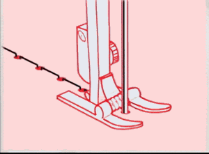
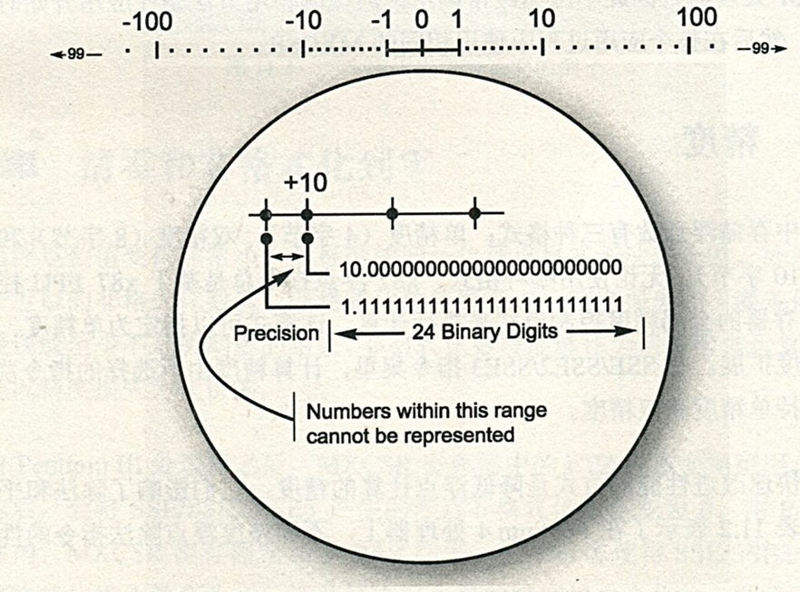
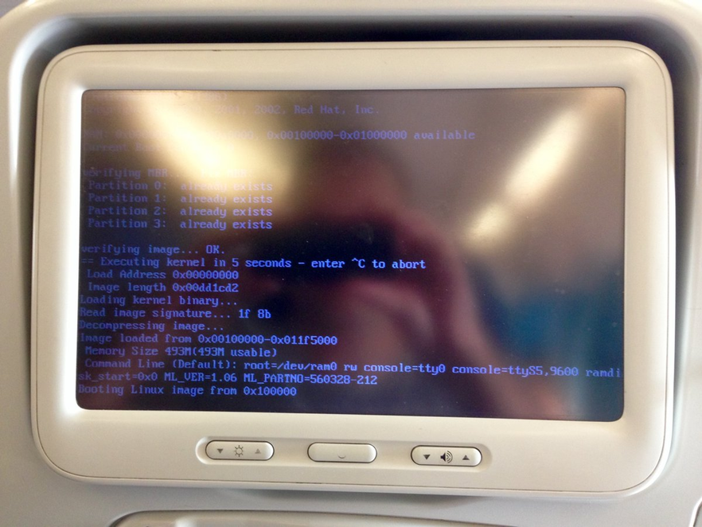

# 指標篇


# [你所不知道的C語言](http://hackfoldr.org/dykc/)：指標篇
*「指標」扮演「記憶體」和「物件」之間的橋樑*
Copyright (**慣C**) 2015, 2016 [宅色夫](http://wiki.csie.ncku.edu.tw/User/jserv)
* [直播錄影](https://www.youtube.com/watch?v=VpyaxUdSd_s)

:::warning
:warning: 注意
- 請透過 gitter (線上對話服務，可透過 GitHub 或 Twitter 帳號登入) 提交疑問和建議事項: [guts-general](https://gitter.im/embedded2015/guts-general) (按下去就對了)
- 本次講座對應的 [隨堂測驗](https://www.facebook.com/events/1775999326010836/)，請協助填寫
:::

</img>

---

## 這個講座並非「頭腦體操」

- stackoverflow 上的 [頭腦體操](http://stackoverflow.com/questions/8208021/how-to-increment-a-pointer-address-and-pointers-value/8208106#8208106)

- 取自 [C Traps and Pitfalls](http://www.literateprogramming.com/ctraps.pdf) 的案例 [Understanding Declarations]

```clike=
(*(void(*)())0)();
```

其實可改寫為：

```clike=
typedef void (*funcptr)();
(* (funcptr) 0)();
```

- [ ] [godbolt](http://gcc.godbolt.org/) : 直接在網頁上看到 gcc 生成的程式碼

### Code editor
```clike=
int main() {
    typedef void (*funcptr)();
    (* (funcptr) (void*) 0)();
}
```

### Assembly output `-Os` (空間最佳化)
```asm=
main:
    pushq       %rax
    xorl        %eax, %eax
    call        *%rax
    xorl        %eax, %eax
    popq        %rdx
    ret
```

---

```clike=
void **(*d) (int &, char **(*)(char *, char **));
```
上述宣告的解讀：

- d is a pointer to a function that takes two parameters:
  - a reference to an int and
  - a pointer to a function that takes two parameters:
    - a pointer to a char and
    - a pointer to a pointer to a char
  - and returns a pointer to a pointer to a char
- and returns a pointer to a pointer to void

- [ ] signal 系統呼叫的宣告方式也很經典: 
  - [How to read this prototype?](http://stackoverflow.com/questions/15739500/how-to-read-this-prototype)

</img>

source: https://media.giphy.com/media/G10pb1bOz98oE/giphy.gif

---

## Go 語言也有指標

- 1999 年 4 月 27 日，Ken Thompson 和 Dennis Ritchie 自美國總統柯林頓手中接過 1998 年 [National Medal of Technology](https://en.wikipedia.org/wiki/National_Medal_of_Technology_and_Innovation) (國家科技獎章)，隔年 12 月，時年 58 歲的 Ken Thompson 自貝爾實驗室退休

- Ken Thompson 成為了一名飛行員。大概是整日翱翔天際，獲得頗多啟發，在 2006 年，他進入 Google 工作，隔年他和過去貝爾實驗室的同僚 [Rob Pike](https://en.wikipedia.org/wiki/Rob_Pike) 及 Robert Griesemer 等人在公司內部提出嶄新的 Go 程式語言，後者可用於雲端運算。
  - 指標這個好東西，當然也要從 C 語言帶過去給 Go 語言，連同美妙的 struct
  - 根據第一份 [Golang Talk](https://talks.golang.org/2009/go_talk-20091030.pdf)，這三位認為，世界在變，但是系統語言卻已經十年沒變
  - Go 之前的程式語言上做不到以下：
    - 新增函式庫不是一個正確的方向
    - 需要從新思考整個架構來開發新的程式語言

- 在實做層面，pointer 和 struct 往往是成雙成對存在 ( 下方會解釋 )

</img>

---

## ISO/IEC 9899 (簡稱 "C99")

- 從[一則笑話](https://twitter.com/SoManyHs/status/675505383008415744)談起
  - "Programming in C: if it doesn't work, just add a star. Or multiple stars. Or ampersands."

- 葉秉哲博士的[推文](https://twitter.com/william_yeh/status/705031736371982336)：「==溯源能力==是很重要的，才不會被狀似革新，實則舊瓶裝新酒或跨領域借用的『新觀念』所迷惑」

- [規格書](http://www.open-std.org/jtc1/sc22/wg14/www/docs/n1256.pdf) (PDF) 搜尋 "***object***"，共出現 735 處
  - 搜尋 "***pointer***"，共出現 637 處。有趣的是，許多教材往往不談 object，而是急著談論 pointer，殊不知，這兩者其實就是一體兩面
  - object != object-oriented
    - 前者的重點在於「資料表達法」，後者的重點在於 "everything is object"
  - C11 ([ISO/IEC 9899:201x](http://www.open-std.org/jtc1/sc22/WG14/www/docs/n1570.pdf)) / [網頁版](http://port70.net/~nsz/c/c11/n1570.html)

- 從第一手資料學習：大文豪寫作都不免要查字典，庸俗的軟體開發者如我們，難道不需要翻閱語言規格書嗎？難道不需要搞懂術語定義和規範嗎？

- `&` 不要都念成 and，涉及指標操作的時候，要讀為 "address of"
  - C99 標準 [6.5.3.2] Address and indirection operators 提到 '==&==' address-of operator

- C99 [3.14] ***object***
  - region of data storage in the execution environment, the contents of which can represent values
  - 在 C 語言的物件就指在執行時期，==資料==儲存的區域，可以明確表示數值的內容
  - 很多人誤認在 C 語言程式中，(int) 7 和 (float) 7.0 是等價的，其實以資料表示的角度來看，這兩者截然不同，前者對應到二進位的 "111"，而後者以 IEEE 754 表示則大異於 "111"
</img>

- C99 [6.2.4] ***Storage durations of objects***
  - An object has a storage duration that determines its lifetime. There are three storage durations: static, automatic, and allocated.
  
  > 注意生命週期 (lifetime) 的概念，中文講「初始化」時，感覺像是「盤古開天」，很容易令人誤解。其實 initialize 的[英文意義](http://dictionary.reference.com/browse/initialize)很狹隘： "to set (variables, counters, switches, etc.) to their starting values at the beginning of a program or subprogram."
  
  - The lifetime of an object is the portion of program execution during which storage is guaranteed to be reserved for it. An object exists, has a constant address and retains its last-stored value throughout its lifetime. If an object is referred to outside of its lifetime, the behavior is undefined.
  
  > 在 object 的生命週期以內，其存在就意味著有對應的常數記憶體位址。注意，C 語言永遠只有 call-by-value
  - The value of a pointer becomes indeterminate when the object it points to reaches the end of its lifetime.
  
  > 作為 object 操作的「代名詞」(alias) 的 pointer，倘若要在 object 生命週期以外的時機，去取出 pointer 所指向的 object 內含值，是未知的。考慮以下操作 `ptr = malloc(size); free(ptr);` 倘若之後做 `*ptr`，這個 allocated storage 已經超出原本的生命週期
  - An object whose identifier is declared with no linkage and without the storage-class specifier static has automatic storage duration.

- C99 [6.2.5]  ***Types***
  - A pointer type may be derived from a function type, an object type, or an incomplete type, called the referenced type. A pointer type describes an object whose value provides a reference to an entity of the referenced type. A pointer type derived from the referenced type T is sometimes called ‘‘pointer to T’’. The construction of a pointer type from a referenced type is called ‘‘pointer type derivation’’.
  > 注意到術語！這是 C 語言只有 call-by-value 的實證，函式的傳遞都涉及到數值
  >> 這裡的 "incomplete type" 要注意看，稍後會解釋。要區分 `char []` 和 `char *`
  
  - Arithmetic types and pointer types are collectively called scalar types. Array and structure types are collectively called aggregate types.
  
  > 注意 "scalar type" 這個術語，日後我們看到 `++`, `--`, `+=`, `-=` 等操作，都是對 scalar (純量)
  
  >[[來源](http://www.cyut.edu.tw/~cpyu/oldphweb/chapter3/page3.htm)] 純量只有大小，它們可用數目及單位來表示(例如溫度=30oC)。純量遵守算數和普通的代數法則。注意：純量有「單位」(可用 `sizeof` 操作子得知單位的「大小」)，假設 `ptr` 是個  pointer type，對 `ptr++` 來說，並不是單純 `ptr = ptr + 1`，而是遞增或遞移 1 個「單位」
  
  - An array type of unknown size is an incomplete type. It is completed, for an identifier of that type, by specifying the size in a later declaration (with internal or external linkage). A structure or union type of unknown content is an incomplete type. It is completed, for all declarations of that type, by declaring the same structure or union tag with its defining content later in the same scope.
  > 這是 C/C++ 常見的 forward declaration 技巧的原理，比方說我們可以在標頭檔宣告 `struct GraphicsObject;` (不用給細部定義) 然後 `struct GraphicsObject *initGraphics(int width, int height);` 是合法的，但 `struct GraphicsObject obj;` 不合法
  - Array, function, and pointer types are collectively called derived declarator types. A declarator type derivation from a type T is the construction of a derived declarator type from T by the application of an array-type, a function-type, or a pointer-type derivation to T.
  > 這句話很重要，看起來三個不相關的術語「陣列」、「函式」，以及「指標」都稱為 derived declarator types，讀到此處會覺得驚訝的人，表示不夠理解 C 語言

  </img>
  
  - [ ] "derivative" 這詞在是微積分學中就是導數。一個函數在某一點的導數描述了這個函數在這一點附近的變化率。導數的本質是通過極限的概念對函數進行局部的線性逼近。

  </img>
  
  (一個實值函數的圖像曲線。函數在一點的導數等於它的圖像上這一點處之切線的斜率)
  
  回到 C 語言，你看到一個數值，是 scalar，但可能也是自某個型態衍生出的 declarator type derivation，實際對應到 array, function, pointer 等型態的 derivation
  
  **(練習題)** 設定絕對地址為 `0x67a9` 的 32-bit 整數變數的值為 `0xaa6`，該如何寫？

```clike=
*(int32_t * const) (0x67a9) = 0xaa6;
/* Lvalue */
```

  - A pointer to void shall have the same representation and alignment requirements as a pointer to a character type.  
    > 關鍵描述！規範 `void *` 和 `char *` 彼此可互換的表示法

```clike=
void *memcpy(void *dest, const void *src, size_t n);
```

- C99 規格書的解說就比很多書本清楚，何必捨近求遠呢？
    - EXAMPLE 1 The type designated as `float *` has type ""pointer to float’". Its type category is pointer, not a floating type. The const-qualified version of this type is designated as `float - const` whereas the type designated as "`const float *` is not a qualified type — its type is ""pointer to const qualified float’" and is a pointer to a qualified type.
    - EXAMPLE 2 The type designated as "`struct tag (*[5])(float)` has type "array of pointer to function returning struct tag’". The array has length five and the function has a single parameter of type float. Its type category is array.

### 規格不能只看新的，過往也要熟悉

[source](https://twitter.com/0xdeadb/status/766293771663339520)
- 空中巴士 330 客機的娛樂系統裡頭執行 14 年前的 Red Hat Linux，總有人要為「古董」負責
- 而且空中巴士 380 客機[也是如此](https://twitter.com/AlxRogan/status/766382294038872064)


## 英文很重要

安裝 `cdecl` 程式，可以幫你產生 C 程式的宣告。
```shell
$ sudo apt-get install cdecl`
```

使用案例

```shell
$ cdecl
cdecl> declare a as array of pointer to function returning pointer to function returning pointer to char
```

會得到以下輸出:

```clike=
char *(*(*a[])())()
```


把前述 C99 規格的描述帶入，可得:

```shell
cdecl> declare array of pointer to function returning struct tag
```
```clike=
struct tag (*var[])()
```

如果你沒辦法用英文來解說 C 程式的宣告，通常表示你不理解！

`cdecl` 可以解釋 C 程式宣告的意義，比方說：

```shell
cdecl> explain char *(*fptab[])(int)
declare fptab as array of pointer to function (int) returning pointer to char
```

## `void *` 之謎

- `void` 在最早的 C 語言是不存在的，直到 C89 才確立，為何要設計這樣的型態呢？
    - [最早的 C 語言中](https://www.bell-labs.com/usr/dmr/www/primevalC.html)，任何函式若沒有特別標注返回型態，一律變成 `int` (伴隨著 `0` 作為返回值)，但這導致無從驗證 function prototype 和實際使用的狀況
- `void *` 的設計，導致開發者必須透過 ==explict (顯式)== 或強制轉型，才能存取最終的 object，否則就會丟出編譯器的錯誤訊息，從而避免危險的指標操作
    - 我們無法直接對 `void *` 做數值操作

```clike=
void- p = ...;
void *p2 = p + 1; /- what exactly is the size of void? */
```

- C/C++ [implicit conversions](http://en.cppreference.com/w/cpp/language/implicit_conversion)
- C99 對 sign extension 的[定義和解說](https://www.ptt.cc/bbs/C_and_CPP/M.1460791524.A.603.html)

- 對某硬體架構，像是 ARM，我們需要額外的 ==alignment==。ARMv5 (含) 以前，若要操作 32-bit 整數 (uint32_t)，該指標必須對齊 32-bit 邊界 (否則會在 dereference 時觸發 exception)。於是，當要從 `void *` 位址讀取 uint16_t 時，需要這麼做：

```clike=
/* may receive wrong value if ptr is not 2-byte aligned */
uint16_t value = *(uint16_t*)ptr;/* portable way of reading a little-endian value */
uint16_t value = *(uint8_t*)ptr | ((*(uint8_t*)(ptr+1))<<8);
```


### void * 真的萬能嗎？

- 依據 C99 規格 6.3.2.3:8 [ Pointers ]
    - A pointer to a function of one type may be converted to a pointer to a function of another type and back again; the result shall compare equal to the original pointer. If a converted pointer is used to call a function whose type is not compatible with the pointed-to type, the behavior is undefined.
- 換言之，C99 不保證 pointers to data (in the standard, “objects or incomplete types” e.g. char* or void*) 和 pointers to functions 之間相互轉換是正確的
    - 可能會招致 undefined behavior (UB)
    - 注意：C99 規範中，存在一系列的 UB

### 延伸閱讀

- [C語言內存地址基礎](http://blog.jobbole.com/44845/)
- [失落的C語言結構體封裝藝術](http://blog.jobbole.com/57822/)

## 沒有「雙指標」只有「指標的指標」

- 「雙馬尾」(左右「獨立」的個體) 和「馬尾的馬尾」(由單一個體關聯到另一個體的對應) 不同
    - 中文的「雙」有「對稱」且「獨立」的意含，但這跟「指標的指標」行為完全迥異
- C 語言中，萬物皆是數值 (everything is a value.)，函式呼叫當然只有 call-by-value
- 「指標的指標」(英文就是 a pointer of a pointer) 是個常見用來改變「傳入變數原始數值」的技巧

- 考慮以下程式碼:

```clike=
int B = 2;
void func(int **p) { *p = &B; }
int main()
{
	int A = 1, C = 3;
	int *ptrA = &A;
	func(&ptrA);
	printf("%d\n", *ptrA);
	return 0;
}
```

- `*ptrA` 的數值從 1 變成 2，而且 ptrA 指向的物件也改變了
- 感想：蔡志浩博士的[推文](https://twitter.com/hao520/status/776971550394167296): (call-by-value 的解讀)
    - 「臺灣人太習慣把人生交給別人決定，把挫折歸咎別人。於是大部分的人的天賦與聰明才智以及改變自己與世界的機會都被浪費了。但這也表示只要正視現實，你有太多價值可以創造」


## forward declaration 搭配指標的技巧

案例: [oltk](http://git.openmoko.org/?p=system-test-suite.git;a=tree;f=gta02-dm2/src/oltk;hb=HEAD) 是 [Openmoko](https://en.wikipedia.org/wiki/Openmoko) 為了工廠測試而開發出的精簡繪圖系統，支援觸碰螢幕，程式碼不到 1000 行 C 語言程式。執行畫面: (oltk 的開發者是 [olv](https://github.com/olvaffe))


### [oltk.h](http://git.openmoko.org/?p=system-test-suite.git;a=blob_plain;f=gta02-dm2/src/oltk/oltk.h;hb=HEAD)

```clike=
struct oltk; // 宣告 (incomplete type, void)
struct oltk_button;
typedef void oltk_button_cb_click(struct oltk_button *button, void *data);
typedef void oltk_button_cb_draw(struct oltk_button *button,
                                 struct oltk_rectangle *rect, void *data);
struct oltk_button *oltk_button_add(struct oltk *oltk,
                                    int x, int y,
                                    int width, int height);
```

`struct oltk` 和 `struct oltk_button` 沒有具體的定義 (definition) 或實做 (implementation)，僅有宣告 (declaration)

### [oltk.c](http://git.openmoko.org/?p=system-test-suite.git;a=blob_plain;f=gta02-dm2/src/oltk/oltk.c;hb=HEAD)

```clike=
struct oltk {
  struct gr *gr;
  struct oltk_button **zbuttons;
  ...
  struct oltk_rectangle invalid_rect;
};
```

軟體界面 (interface) 揭露於 oltk.h，不管 struct oltk 內容怎麼修改，已公開的函式如 `oltk_button_add` 都是透過 pointer 存取給定的位址，而不用顧慮具體 struct oltk 的實做，如此一來，不僅可以隱藏實做細節，還能兼顧二進位的相容性 (binary compatibility)。

同理，struct oltk_button 不管怎麼變更，在 struct oltk 裡面也是用給定的 pointer 去存取，保留未來實做的彈性。

### 延伸閱讀

- [你所不知道的C語言：物件導向程式設計篇](https://hackmd.io/s/HJpiYaZfl)
- [如何在指針中隱藏數據？](http://blog.jobbole.com/83213/)


## 只用 printf 觀察資料，有問題嗎？


[source](https://twitter.com/alang198611/status/735312419715612673)

- 只用 `printf()` 觀察的話，永遠只看到你設定的框架 (format string) 以內的資料，但很容易就忽略資料是否合法、範圍是否正確，以及是否看對地方
- `printf()` 大概是最早被記下來的函式，也困擾很多人，有意思的是，1960 年代初期 MIT 開發的 [CTSS 作業系統](https://en.wikipedia.org/wiki/Compatible_Time-Sharing_System) 中，終端機命令就包含了 printf，後者一路從 Multics 和 Unix 繼承至今
- 在 CTSS 原始程式碼的檔案 com3 中可見到這行 `STMTDC PRINTF,11,T,T25`，前一行註解寫 "The following tables are the dictionaries of statement types"

### 不要急著印出位址，善用 GDB


[source](https://twitter.com/noreenahertz/status/593761269930434560): NASA before PowerPoint, 1961

- 「學會了 GDB，我有種山頂洞人==學會用火==的感動」 -- 張至
- [GDB Rocks!](http://www.slideshare.net/chenkaie/gdb-rocks-16951548)
- [Introduction to gdb](http://www.slideshare.net/owenhsu/introduction-to-gdb-3790833)
- [Debugging with GDB](http://www.slideshare.net/linaroorg/connect12-q2-gdb)
- [除錯程式: gdb](http://user.frdm.info/ckhung/b/c/gdb.php)
- [Introduction to GDB a tutorial - Harvard CS50](https://www.youtube.com/watch?v=sCtY--xRUyI) (教學影片)
- [透過 GDB 學習 C 語言](http://blog.jobbole.com/87482/)


## Pointers vs. Arrays

- array vs. pointer
    - in declaration
        - extern, 如 `extern char x[];` => 不能變更為 pointer 的形式
        - definition/statement, 如 `char x[10]` => 不能變更為 pointer 的形式
        - parameter of function, 如 `func(char x[])` => 可變更為 pointer 的形式 => `func(char *x)`
    - in expression
        - array 與 pointer 可互換

```clike=
int main() {
  int x[10] = {0, 1, 2, 3, 4, 5, 6, 7, 8, 9};
  printf("%d %d %d %d\n", x[4], *(x + 4), *(4 + x), 4[x]);
}
```

- 在 [The C Programming Language](http://www.amazon.com/The-Programming-Language-Brian-Kernighan/dp/0131103628) 第 2 版，Page 99 寫道:

`As formal parameters in a function definition,`

- Page 100 則寫 `char s[]; and char *s are equivalent.`
  - 這就是悲劇的由來，人們往往忘了前一頁
  - `x[i]` 總是被編譯器改寫為 `*(x + i)` <== in expression


- C 提供操作多維陣列的機制 (C99 [6.5.2.1] **_Array subscripting_**)，但實際上只有一維陣列的資料存取
    - 對應到線性記憶體
    - Successive subscript operators designate an element of a multidimensional array object. If E is an n-dimensional array (n ≥ 2) with dimensions i × j × ... × k, then E (used as other than an lvalue) is converted to a pointer to an (n − 1)-dimensional array with dimensions j × ... × k. If the unary * operator is applied to this pointer explicitly, or implicitly as a result of subscripting, the result is the pointed-to (n − 1)-dimensional array, which itself is converted into a pointer if used as other than an lvalue. It follows from this that arrays are stored in row-major order (last subscript varies fastest)
    - Consider the array object defined by the declaration `int x[3][5];` Here x is a 3 × 5 array of ints; more precisely, x is an array of three element objects, each of which is an array of five ints. In the expression `x[i]`, which is equivalent to `(*((x)+(i)))`, x is first converted to a pointer to the initial array of five ints. Then i is adjusted according to the type of x, which conceptually entails multiplying i by the size of the object to which the pointer points, namely an array of five int objects. The results are added and indirection is applied to yield an array of five ints. When used in the expression `x[i][j]`, that array is in turn converted to a pointer to the first of the ints, so `x[i][j]` yields an int.
- array subscripting 在**編譯時期**只能作以下兩件事:
    - 得知 size
    - Obtain a pointer to element 0
- 前兩者以外的操作，都透過 pointer
    - array subscripting => syntax sugar

- Array declaration:

```clike=
int a[3];
struct { double v[3]; double length; } b[17];
int calendar[12][31];
```

那麼...

```clike=
sizeof(calendar) = ? sizeof(b) = ?
```

善用 GDB，能省下沒必要的 `printf()`，並可互動分析: (下方以 GNU/Linux x86_64 作為示範平臺)

- 有時會遇到程式邏輯和結果正確，但因為 `printf()` 的輸出格式沒用對，而誤以為自己程式沒寫好的狀況

```shell
(gdb) p sizeof(calendar)
$1 = 1488
(gdb) print 1488 / 12 / 31
$2 = 4
(gdb) p sizeof(b)
$3 = 544
```

還可以分析型態:

```shell
(gdb) whatis calendar
type = int [12][31]
(gdb) whatis b[0]
type = struct {...}
(gdb) whatis &b[0]
type = struct {...} *
```

更可直接觀察和修改記憶體內容:

```shell
(gdb) x/4 b
0x601060 <b>: 0x00000000 0x00000000 0x00000000 0x00000000
(gdb) p b
$4 = {{
  v = {0, 0, 0},
  length = 0
} <repeats 17 times>}
```

終於可以來作實驗！

```shell
(gdb) p &b
$5 = (struct {...} (*)[17]) 0x601060 <b>
(gdb) p &b+1
$6 = (struct {...} (*)[17]) 0x601280 <a>
```

上一行 `&b + 1` 指向的位址，就是 `int a[3]` 的所在處？！確認一下:

```shell
(gdb) p &a[0]
$7 = (int *) 0x601280 <a>
```

那 `&b[0] + 1` 指向哪呢？

```shell
(gdb) p &b[0]+1
$8 = (struct {...} *) 0x601080 <b+32>
(gdb) p sizeof(b[0]（)
$9 = 32
```

原來 `&b[0] + 1` 的 `+1` 就是遞移一個 `b[0]` 佔用的空間

提昇輸出的可讀性

```shell
(gdb) set print pretty
```

繼續觀察記憶體內容:

```
(gdb) p &b[0]
$10 = (struct {...} *) 0x601060 <b>
(gdb ) p (&b[0])->v
$11 = {0, 0, 0}
```

`p` 命令不僅能 print，可以拿來變更記憶體內容:

```shell
(gdb) p (&b[0])->v = {1, 2, 3}
$12 = {1, 2, 3}
(gdb) p b[0]
$13 = {
  v = {1, 2, 3},
  length = 0
}
```

還記得前面提到 `(float) 7.0` 和 `(int) 7` 的不同嗎？我們來觀察執行時期的表現:

```
(gdb) whatis (&b[0])->v[0]
type = double
(gdb) p sizeof (&b[0])->v[0]
$14 = 8
```

Linux x86_64 採用 [LP64 data model](https://en.wikipedia.org/wiki/64-bit_computing#64-bit_data_models)，double 依據 C 語言規範，至少要 64-bit 長度。現在試著強制轉型:

```shell
(gdb) p &(&b[0])->v[0]
$15 = (double *) 0x601060 <b>
(gdb) p (int *) &(&b[0])->v[0]
$16 = (int *) 0x601060 <b>
(gdb) p *(int *) &(&b[0])->v[0]
$17 = 0
```

然後竟然變成 `0` 了？！

因為:

```shell
(gdb) p sizeof(int)
$18 = 4
```

我們只取出 `v[0]` 開頭的 4 bytes，轉型為 `int` 後，內容就是 0。印出記憶體來觀察：

```shell
(gdb) x/4 (int *) &(&b[0])->v[0]
0x601060 <b>: 0x00000000 0x3ff00000 0x00000000 0x40000000
```

GDB 強大之處不只如此，你甚至在動態時期可呼叫函式 (改變執行順序)，比方說 `memcpy`:

```shell
(gdb) p calendar
$19 = {{0 <repeats 31 times>} <repeats 12 times>}
(gdb) p memcpy(calendar, b, sizeof(b[0]))
$20 = 6296224
(gdb) p calendar
$21 = {{0, 1072693248, 0, 1073741824, 0, 1074266112, 0 <repeats 25 times>}, {0 <repeats 31 times>} <repeats 11 times>}
```

現在 `calendar[][]` 內容已變更。前述輸出有個數字 `6296224`，到底是什麼呢？試著觀察:

```shell
(gdb) p (void *) 6296224
$22 = (void *) 0x6012a0 <calendar>
```

原來就是 `memcpy` 的目的位址，符合 man page [memcpy(3) 描述](http://linux.die.net/man/3/memcpy)。

從 calendar 把 `{1, 2, 3}` 內容取出該怎麼作呢？

```shell
(gdb) p *(double *) &calendar[0][0]
$23 = 1
(gdb) p *(double *) &calendar[0][2]
$24 = 2
(gdb) p *(double *) &calendar[0][4]
$25 = 3
```

- Pointers may happen to point to an element of an array
    - We can use that pointer to obtain a pointer to the next/previous element of that array
    - Add/Subtract 1 for that pointer

```clike=
int a[10];
	...
int *p;
p = a; /* take the pointer to a[0] */
p++; /* next element */
p--; /* previous element */
```


- Adding an integer to a pointer is different from adding that integer to the bit representation of that pointer

```clike=
int *p;
p = p + 1; /* this advances p's value (pointed-address) by sizeof(int) which is usually not 1 */
```

- The name of the array is the same as a pointer to the array in every context but one

```clike=
int a[3];
int *p;
p = a; /* p points to a[0] */
*a = 5; /* sets a[0] to 5 */
*(a+1) = 5; /* sets a[1] to 5 */
```

The only difference is in sizeof:

```clike=
sizeof(a) /* returns the size of the entire array not just a[0] */
```

- Suppose we want to concatenate string s and string t into a single string

```clike=
char *r;
strcpy(r, s);
strcat(r, t);
```

Doesn’t work cause r doesn’t point anywhere.

Lets make r an array – now it points to 100 chars

```clike=
char r[100];
strcpy(r, s);
strcat(r, t);
```

This works as long as the strings pointed to by s and t aren’t too big.

- We would like to write something like:

```clike=
char r[strlen(s) + strlen(t)];
strcpy(r, s); strcat(r, t);
```

However C requires us to state the size of the array as constant.

```clike=
char *r = malloc(strlen(s) + strlen(t));
strcpy(r, s); strcat(r, t);
```

This fails for three reasons:

1.  `malloc()` might fail to allocate the required memory
2.  It is important to free the memory allocated
3.  We did not allocate enough memory

The correct code will be:

```clike=
char *r = malloc(strlen(s) + strlen(t) + 1); // use sbrk; change progrram break
if (!r) exit(1); /* print some error and exit */
```

```clike=
strcpy(r, s); strcat(r, t);

/* later */
free(r);
r = NULL; /* Try to reset free’d pointers to NULL */

`int main(int argc, char *argv[], char *envp[])` 的奧祕

#include <stdio.h>
int main(int argc, char (*argv)[0])
{
  puts(((char **) argv)[0]);
  return 0;
}
```

使用 gdb

```shell
(gdb) b main
(gdb) r
(gdb) print *((char **) argv)
$1 = 0x7fffffffe7c9 "/tmp/x"
```

這裡符合預期，但接下來：

```shell
(gdb) x/4s (char **) argv
0x7fffffffe558: "\311\347\377\377\377\177"
0x7fffffffe55f: ""
0x7fffffffe560: ""
0x7fffffffe561: ""
```

看不懂了，要換個方式：

```shell
(gdb) **x/4s ((char **) argv)[0]**
0x7fffffffe7c9: "/tmp/x"
0x7fffffffe7d0: "LC_PAPER=zh_TW"
0x7fffffffe7df: "XDG_SESSION_ID=91"
0x7fffffffe7f1: "LC_ADDRESS=zh_TW"
```

後三項是 envp (environment variable)

>C array 大概是 C 語言中數一數二令人困惑的部分。根據你使用的地方不同，Array 會有不同的意義：
>1. 如果是用在 expression，array 永遠會被轉成一個 pointer
>2. 用在 function argument 以外的 declaration 中它還是一個 array，而且「不能」被改寫成 pointer
>3. function argument 中的 array 會被轉成 pointer
>
>若現在這裡有一個 global
>```clike=
>char a[10];
>```
>在另一個檔案中，我不能夠用`extern char *a`來操作原本的 `a`，因為實際上會對應到不同的指令 (instruction)。但若你的 >declaration 是在 function argument 中，那麼：
>
>`void function(char a[])` 與 `void function(char * const a)` 是等價的。且真實的type 會是 pointer。因此你不能用 sizeof 來抓它的大小！（array是unmodifiable l-value，所以除了被轉成pointer，它還會是一個不能再被賦值的pointer，因此需要加上const修飾。）
>
>最後，用在取值時，array的行為與pointer幾乎雷同，但array會是用兩步取值，而pointer是三步。（array的位址本身加上offset，共兩步，而使用pointer時，cpu需先載入pointer位址，再用pointer的值當作位址並加上offset取值）
>
>[name=[陳仁乾](https://www.facebook.com/idryman?fref=nf)]

### 延伸閱讀

- [C語言雜談：指針與數組 (上)](http://blog.jobbole.com/86400/)
- [C語言雜談：指針與數組 (下)](http://blog.jobbole.com/86412/)
- [C 語言中的指針和內存洩漏](http://blog.jobbole.com/84548/)

- A common C pitfall is to confuse a pointer with the data to which it points


依據 man-page [strdup(3)](http://linux.die.net/man/3/strdup) :

- The strdup() function returns a pointer to a new string which is a duplicate of the string s. Memory for the new string is obtained with [malloc(3)](http://linux.die.net/man/3/malloc), and can be freed with [free(3)](http://linux.die.net/man/3/free).

`strdup()` 實際上會呼叫 `malloc()` ，來配置足以放置給定字串的「新空間」。


## Function Pointer

```clike=
int main() { return (********puts)("Hello"); }
```

為何可運作？

- C99 [ 6.3.2.1 ] A function designator is an expression that has function type
    - **Except** when it is the operand of the **sizeof** operator or the unary **&** operator, a **function designator** with type ‘‘function returning type’’ **is converted to** an expression that has type ‘‘**pointer to function returning type’**’.
    - `*` is Right associative operator
- C99 [6.5.1 ] It is an lvalue, a function designator, or avoid expression if the unparenthesized expression is, respectively, an lvalue, a function designator, or avoid expression.
- C99 [6.5.3.2-4] The unary * operator denotes indirection. **If the operand points to a function, the result is a function designator**

(注意到 designator 的發音，KK 音標為 [͵dɛ**zɪg**ˋnetɚ])

[實驗程式碼](https://gist.github.com/JIElite/d429aedbc515973ad46cd353a43d2388)

根據 6.3.2.1
```
void (*fptr)();
void test();
fptr = test;
```

test: void (), 會被轉成 function pointer: void (*) ()

fptr is a pointer to function with returning type,

根據 6.5.3.2

(*fptr) is a function designator, a function designator will be converted to pointer.

type of (*fptr): void ()

我們可以利用 gdb 去查看這些數值，搭配 print 指令

```shell
(gdb) print test
$1 = {void ()} 0x400526 <test>
(gdb) print test
$2 = {void ()} 0x400526 <test>
(gdb) print fptr
$3 = (void (*)()) 0x400526 <test>
(gdb) print (*fptr)
$4 = {void ()} 0x400526 <test>
(gdb) print (**fptr)
$5 = {void ()} 0x400526 <test>
```

test 是一個 function designator ，因為不是搭配 `&`, sizeof 使用，所以會被轉成為 pointer to function

`(*fptr)` 是一個 function pointer 搭配 * (dereference, indirection) operator 使用，則它的結果會被轉成為一個 function designator

所以 `(**fptr)` 要拆成兩個部份： `(* ( *fptr) )`, 裡面的 `*fptr` 是個 function designator, 但是還是會被轉成一個 pointer to function，我們可註記為 `fptr`。

又，外面又有一個 * operator, `( *fptr’ ` 是個 function designator, 最後還是會被轉化為 pointer to function

但是，0x400526 這個數值是怎麼來的呢？

我們可以是用以下指令觀察:
```shell
$ gdb -o fp -g fp.c ` & ` objdump -d fp `
```

參考輸出裡頭的一段：

```shell
0000000000400526 <test>:
400526: 55 push %rbp
400527: 48 89 e5 mov %rsp,%rbp
40052a: 90 nop
40052b: 5d pop %rbp
40052c: c3 retq
```

這個數值其實是執行檔反組譯後的函式進入點，但是這個數值並非是在實體記憶體的實際數值，而是虛擬記憶載入位址。

由於 `puts` 的 function prototype 是 `int puts(const char *s)`，因此 每次經過 `*` operator 運算後得到的結果是仍然是 `int`。所以，`*` 的數目不會影響結果。最後 return 的值是根據 s 的長度加上 ’\n’。而這個例子 return 給 `main` 的值是 6

### 延伸閱讀

- [C語言函數指針基礎](http://blog.jobbole.com/44639/)


## Learn C The Hard Way

- 精闢的[電子書](http://c.learncodethehardway.org/book/) (未完成; 需要付費)
- [Exercise 36: Safer Strings](http://c.learncodethehardway.org/book/ex36.html)
    - "**Why C Strings Were A Horrible Idea**"
        - it is not possible to validate a C string without possibly looping infinitely.
        - 延伸閱讀: [“NULL”：計算機科學中的最嚴重錯誤，造成十億美元損失](https://linux.cn/article-6503-1.html)
    - 中華民國刑法第 227 條：「對於未滿十四歲之少男或少女為性交者，處三年以上十年以下有期徒刑 ... 對於十四歲以上未滿十六歲之男女為性交者，處七年以下有期徒刑」
    - 刑法第 227-1 條 (兩小無猜條款)，規定未滿十八歲的人犯 227 條時，為告訴乃論，這是考量到雙方都是未成年，因為對性事好奇，或者是彼此相愛而進行性行為，故有特規定這個例外可通融，得免除或減輕其刑。
    - [ [出處](http://yblog.org/archive/index.php/11764) ] 規定要 18 歲以上才可看限制級內容的影片、圖畫和書刊，不過滿 16 歲就可合法性
        - 看限制級內容還不如實地操作才學得到東西 (實作萬歲！)
    - 有沒有發現跟 C-style string 很像？都「經歷過」了，才跟你說以前有「法律疑慮」
    - 延伸閱讀: [Did Ken, Dennis, and Brian choose wrong with NUL-terminated text strings?](http://queue.acm.org/detail.cfm?id=2010365)
        - Performance Costs: 什麼時候 Visual BASIC 會比 C 來得快？像是取得字串的長度，前者是常數時間，但後者就算做了[各式 strlen() 最佳化](https://coldnew.gitbooks.io/2015-embedded-summber/content/exame/detect_macro.html)，終究耗時
        - Compiler Development Cost: 對於 char msg[256] 這樣的 string literal，編譯器最佳化時，會嘗試用 `memcpy()` 取代 `strcpy()`，前者通常有平臺相依的最佳化，而後者因為不能事先知道長度，無法做更有效率的最佳化。但這樣的最佳化技巧要讓編譯器自動施行，導致額外的維護成本
        - Security Costs: 一個 `gets()` 就有機會搞垮系統，對照看 [Insecure coding in C](http://www.slideshare.net/olvemaudal/insecure-coding-in-c-and-c)
- [Exercise 15: Pointers Dreaded Pointers](http://c.learncodethehardway.org/book/ex15.html)
- [Exercise 16: Structs And Pointers To Them](http://c.learncodethehardway.org/book/ex16.html)
- [Exercise 17: Heap And Stack Memory Allocation](http://c.learncodethehardway.org/book/ex17.html)
- [Exercise 18: Pointers To Functions](http://c.learncodethehardway.org/book/ex18.html)
- [Exercise 19: A Simple Object System](http://c.learncodethehardway.org/book/ex19.html)

## 重新探討「字串」

- 在電腦科學中，字串是由一連串的符號組成 (注意：每單位可能不是 1 byte)，每種程式語言對字串的實作方式或多或少會有不同，C 語言沒有直接的語言層面支援，一般用 "c string" 或稱為 "c-style string" (C++ 觀點) 稱呼，c string 又稱為是 **ASCIIZ** 或 **null-terminated string**
- 自 C99 以來，C 有 2 種字串
    - byte string: 使用 char 作為最小操作單位，每個 char 至少要 8 bits
    - wide string: 使用 [wchar_t](http://pubs.opengroup.org/onlinepubs/007908775/xsh/wchar.h.html) 作為最小操作單位，以便支援 Unicode 或多國語文 (意味著變動程度編碼)
        - 大多數歐語的部分字母都有標示讀音的附加符號 (俗稱 accent marks，學術上則稱 diacritics)，例如法語的 **ç**、西班牙語的 **ñ**、德語的 **ü**、芬蘭語的 **å**、波蘭語的 **ł**、丹麥語的 **ø** 等等
        - 英語在歷史上曾經受過多國語言所沉浸和洗禮，本是歸屬於日耳曼語系，後又受過拉丁語、希臘語、法語、斯堪的納維亞語（即普遍的北歐語）等影響，以致今天英語的讀音變得非常不規則，相比其他歐語，英語的字母失去了表音的功能，已不能從字母本身猜出正確讀音。
        - 延伸閱讀: [字母符號](http://languagemystery.blogspot.tw/2013/05/blog-post_30.html)

:::info
[UTF-8 的發明人](https://www.cl.cam.ac.uk/~mgk25/ucs/utf-8-history.txt)也是主導 UNIX 發展的 Rob Pike 與 Ken Thompson
:::
  > [取自 Wikipedia](https://en.wikipedia.org/wiki/C_string_handling): "Support for Unicode literals such as `char foo[512] = "φωωβαρ";` (UTF-8) or `wchar_t foo[512] = L"φωωβαρ";` (UTF-16 or UTF-32) is implementation defined, and may require that the source code be in the same encoding. Some compilers or editors will require entering all non-ASCII characters as `\xNN` sequences for each byte of UTF-8, and/or `\uNNNN` for each word of UTF-16."

- [出處](http://luse.blogspot.tw/2009/06/blog-post.html) 為了使用上方便，許多程式語言提供 **_string literals_** (在 C 就是 C99 [6.4.5]) ，讓開發者得以在程式碼內表示一些字串。由於 C 語言是個系統程式語言，所以大家對這些東西會身在何處是有高度興趣的。而 string literals 到底會身在何處，和編譯器的實作有關
- C 語言規格中定義了 string literals 會被分配於 "static storage" 當中 (C99 [6.4.5])，並說明如果程式嘗試修改 string literals 的內容，將會造成未定義行為
    - 以 gcc 的 ELF target 來說，將 string literals 分配在 read-only data section 中 (當然包含了 `\0`結尾)
- 由於 C 語言提供了一些 syntax sugar 來初始化陣列，這使得 `char *p = ”hello world”` 和 `char p[] = “hello world”` 寫法相似，但底層的行為卻大相逕庭
    - 以指標的寫法 `char *p` 來說，意思是 `p` 將會是指向 static storage 的一個指標。如此的寫法有潛在問題，因為當開發者嘗試修改 string literals 的內容，將會造成未定義行為，而編譯器並不會對存取 p 的元素提出警告
    - 值得注意的是，陣列的寫法依據 C99 規範，string literals 是必須放在 "static storage" 中，而 `char p[]` 的語意則表示要把資料分配在 stack 內，所以這會造成編譯器 (gcc) 隱性地 (implicitly) 產生額外的程式碼，使得 C 程式在執行時期可把 string literals 從 static storage 複製到 stack 中。雖然字串本身並非存放於 stack 內，但 `char p[]` 卻是分配在 stack內，這也造成 `return p` 是未定義行為
- 光有字串表示法是遠遠不夠的，我們需要在字串上進行若干操作。C 語言的規格書中定義了標準函式庫，在 [7.21] ***String handling \<string.h\>*** 提及，以避免製造重複的輪子。接下來問題來了，這些字串處理函式的原型大部分是使用 `char *` 或 `void *` 的型別來當參數，那這些參數到底能不能接受 null pointer `(void *) 0` 呢？如果不能，那函式要負責檢查嗎？null pointer 算是一個字串嗎 ？對一個 null pointer 使用這些函式 (如 `strlen`) 會發生什麼事？規格書中有定義這些東西嗎？
    - 答案是，像 `strlen` 一類的 "string handling function" ++**不可**++ 接受 null pointer 作為參數，因為在絕大部分的狀況中，null pointer 並非合法字串 (why?)，所以將 null pointer 代入 `strlen()` 也造成未定義行為
    - 多數函式庫實作 (glibc) 也不會在內做 null pointer 檢查 (有些函式庫的實作會使用編譯器的延伸語法來提出警告)，這意味著，開發者要肩負檢查 null pointer 的一切責任！
- 回頭閱讀規格書: [7.21.1] 提到以下:

- Various methods are used for determining the lengths of the arrays, but in all cases a `char *` or `void *` argument points to the initial (lowest addressed) character of the array. If an array is accessed beyond the end of an object, the behavior is undefined.

- null pointer 顯然在 ++**絕大部分**++ 的狀況都不符合這個規定，既然不符合規定，函式庫的實作顯然也不需要浪費心力去做檢查。更不用說想要在一些物件導向的字串函式庫中使用 string 物件的 null pointer 來做字串運算。

### 延伸閱讀

- [SDS：一個簡易動態字符串庫](http://blog.jobbole.com/68119/)


## Linus Torvalds 親自教你 C 語言

- [array argument 的正確使用時機](https://twlinuxkernelhackers.hackpad.com/LinusC-5jnXZm9VdCm)
[source](https://lkml.org/lkml/2015/9/3/541) Are there any cases of multi-dimensional arrays? Because those actually have semantic meaning outside of sizeof(), just in things like adding offsets. Eg something like

```clike=
int fn(int a[][10])
```

- ends up being equivalent to something like

```clike=
int fn(int (*a)[10])
```

and "a+1" is actually 40 bytes ahead of "a", so it does *not* act like
an "int *".
(And I might have screwed that up mightily - C multidimensional arrays
and the conversions to pointers are really easy to get confused about.
Which is why I hope we don’t have them)

- [藝術與核心](http://blog.linux.org.tw/~jserv/archives/001888.html)

```clike=
#define ARRAY_SIZE(x) (sizeof(x) / sizeof((x)[0]))
`char *`
```

## Lvalue 的作用

- 在規格書的 Rationale 將 lvalue 定義為 object locator (C99)
- [Understanding lvalues and rvalues in C and C++](http://eli.thegreenplace.net/2011/12/15/understanding-lvalues-and-rvalues-in-c-and-c)

- 透過 Lvalue 解釋 compound literal 效果的[案例](http://stackoverflow.com/questions/14105645/is-it-possible-to-create-an-anonymous-initializer-in-c99/14105698#14105698)：

```clike=
#include <stdio.h>
struct s { char *a; };
void f(struct s *p) { printf("%s\n", p->a); }
int main() {
  f(&(struct s){ "hello world" });
  return 0;
}
```

## Insecure coding in C

- [slideshare](http://www.slideshare.net/olvemaudal/insecure-coding-in-c-and-c) by [Olve Maudal](http://www.slideshare.net/olvemaudal?utm_campaign=profiletracking&utm_medium=sssite&utm_source=ssslideview)
- 許多危險、未定義的 C 語言程式碼
- [MISRA C](https://en.wikipedia.org/wiki/MISRA_C)
    - "Guidelines for the use of the C language in critical systems"

## Null pointer?

- [臺灣工程師常唸錯的英文單字](http://priv.tw/blog/archives/591/)
    - null `[nʌl]` 請不要發「怒偶」，他沒有怒。


[source](https://www.facebook.com/photo.php?fbid=10206570192283054&set=p.10206570192283054)

考慮以下程式 (null.c)

```clike=
int main() { return (NULL == 0); }
```

用 gcc-6.2 編譯:

```shell
null.c:1:22: error: ‘NULL’ undeclared (first use in this function)
int main() { return (NULL == 0); }
                     ^~~~
null.c:1:22: note: each undeclared identifier is reported only once for each function it appears in
```

表示 NULL 需要定義，我們加上 `#include <stddef.h>` 即可通過編譯。那 `main` 的回傳值是 0 還是 1 (或非零) 呢？

- 依據 C99 規格 6.3.2.3
    - nothing requires the NULL **pointer** to have the numeric value of zero;
    - 這點導致實做上的歧異
- C99 規格 6.3.2.3 - 3
    - A “null **pointer** constant” does not have to be a “null **pointer**”

- [C++11- NULLPTR != NULL](https://cppturkiye.wordpress.com/2016/02/05/c11-nullptr-null/)
- [空指標常數(null pointer constant)](https://www.ptt.cc/bbs/C_and_CPP/M.1461840781.A.192.html)
- 依據 C99 / C11 規格 **6.3.2.3** - 3
    - "An integer constant expression with the value 0, or such an expression cast to type void *, is called a null pointer constant. 66) If a null pointer constant is converted to a pointer type, the resulting pointer, called a null pointer, is guaranteed to compare unequal to a pointer to any object or function."
    - 在 caller 端轉換數值為 pointer type 時，就會變為 null pointer。
- 延伸 C99/C11 規格 **6.3.2.3** - 4
    - Conversion of a null pointer to another pointer type yields a null pointer of that type. Any two null pointers shall compare equal.
    - (void*)(uintptr_t) 0 本質上是個 null pointer，而 NULL 是 null ptr，以 C99 的觀點。
- C99 規格 6.7.8 Initialization
    - 當透過 malloc() 建立的物件經由 free() 釋放後，應該將指標設定為 NULL
    - 避免 doubly-free
- `free()` 傳入 NULL 是安全的

</img>

[source](http://www.viva64.com/en/b/0306/) (裡頭有非常精彩的 undefined behavior 討論)

### 兩個 NULL 指標是否能比較？

- 依據 C99 規格 6.3.2.3 - 3
    - "An integer constant expression with the value 0, or such an expression cast to type void *, is called a null pointer constant.55) If a null pointer constant is converted to a pointer type, the resulting pointer, called a null pointer, is guaranteed to compare **unequal** to a pointer to any object or function."
- 先解釋 **_compare unequal_**
    - "compare unequal" 意味著 "a == b is false"，換句話說："a != b is true"
- 接下來 C99 規格在 6.3.2.3 又說:
    - Conversion of a null pointer to another pointer type yields a null pointer of that type. Any two null pointers shall compare equal.
- 對 pointer type 作比較，又是另外的狀況
- 依據 C99 規格 6.5.8 - 5
    - "Comparison of **pointers** that do not point to the same object or to members of the same aggregate is undefined."
- 需要注意的是 condition (傳入 assert() 的參數也是) 依據 C99 規範是 “a scalar type”，而pointers 也是 scalar

### C 語言 offsetof 巨集的定義

\<stddef.h\> 定義了 [offsetof 巨集](https://en.wikipedia.org/wiki/Offsetof)，取得 struct 特定成員 (member) 的位移量。傳統的實做方式如下:

```clike=
#define **offsetof**(st, m) **((size_t)&(((st *)0)->m))**
```

這對許多 C 編譯器 (像是早期的 gcc) 都可正確運作，但依據 C99 規格，這是 undefined behavior。後來的編譯器就不再透過巨集來實做，而改用 builtin functions，像是 gcc:

```clike=
#define offsetof(st, m) __builtin_offsetof(st, m)
```

這對於 C++ 非常重要，否則原本的巨集連編譯都會失敗。

延伸閱讀: [C99 的 offsetof macro](http://blog.linux.org.tw/~jserv/archives/001399.html)

Linux 核心延伸 offsetof，提供 container_of 巨集，作為反向的操作，也就是給予成員位址和型態，反過來找 struct 開頭位址：

```clike=
#define container_of(ptr, type, member) ({ \
const typeof( ((type *)0)->member ) *__mptr = (ptr); \
(type *)( (char *)__mptr - offsetof(type,member) );})
```

應用方式請見: [Linux Kernel: container_of 巨集](http://adrianhuang.blogspot.tw/2010/01/linux-kernel-containerof.html)

## 延伸閱讀

- [C 語言常見誤解](https://docs.google.com/document/d/12cR0qb-kl7jB8RA_eHQu8OSmGKEOshwLeX4Mx5qBzUE/edit) by PTT littleshan + Favonia
    - 注意：部份以 32-bit 架構為探討對象
    - 建議把前面幾節閱讀完，再來讀這篇 FAQ
- [漫談 C 語言](http://www.douban.com/group/topic/55441892/) (更多參考資料)
- [C Traps and Pitfalls](http://www.literateprogramming.com/ctraps.pdf)
- [The Descent to C](http://www.chiark.greenend.org.uk/~sgtatham/cdescent/)