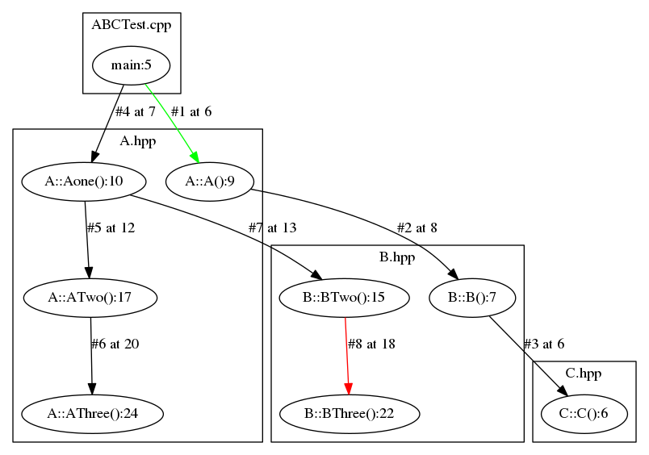

# C++源码的调用图生成


##主要思路

利用`gcc/g++的-finstrument-functions`的注入选项，
得到每个函数的调用地址信息，生成一个`trace文件`，
然后利用`addr2line和c++filt将函数名及其所在源码位置`从地址中解析出来，
从而得到程序的`Call Stack`，
然后用`pygraphviz`画出来

使用示例

比如我现在有`A.hpp、B.hpp、C.hpp、ABCTest.cpp`这几个文件，
我想看他们的`Call Graph`

- A.hpp

```cpp
#ifndef _A_H_
#define _A_H_
#include "B.hpp"
#include "C.hpp"

struct A {
    B b;

    A() {}
    int Aone()
    {
        ATwo();
        b.BTwo();
        return 1;
    }

    int ATwo()
    {

        AThree();
        return 1;
    }

    int AThree()
    {
        return 1;
    }
};
#endif // _A_H_
```
- B.hpp

```cpp
#ifndef _B_H_
#define _B_H_
#include "C.hpp"

struct B {
    C c;
    B() {}
    int Bone()
    {
        BTwo();
        c.CTwo();
        return 1;
    }

    int BTwo()
    {

        BThree();
        return 1;
    }

    int BThree()
    {
        return 1;
    }
};
#endif // _B_H_

```

- C.hpp

```cpp
#ifndef _C_H_
#define _C_H_

struct C {

    C() {}
    int Cone()
    {
        CTwo();
        CThree();
        return 1;
    }

    int CTwo()
    {

        CThree();
        return 1;
    }

    int CThree()
    {
        return 1;
    }
};
#endif // _C_H_
```

- ABCTest.cpp

```cpp
#include "A.hpp"

int main(int argc, char *argv[])
{
    A a;
    a.Aone();
    return 0;
}
```

然后按下面编译(instrument.c在上面github地址中可以下载，用于注入地址信息）：

```sh
g++ -g -finstrument-functions -O0 instrument.c ABCTest.cpp -o test
```

然后运行程序，得到trace.txt
输入shell命令./test
最后
输入shell命令
```sh
python CallGraph.py trace.txt test
```
弹出一张Call Graph




## 图上标注含义:

- 绿线表示程序启动后的第一次调用

- 红线表示进入当前上下文的最后一次调用

- 每一条线表示一次调用，#符号后面的数字是序号，at XXX表示该次调用发生在这个文件（文件路径在框上方）的第几行

- 在圆圈里，XXX:YYY，YYY是调用的函数名，XXX表示这个函数是在该文件的第几行被定义的

##获取C/C++调用关系

利用`-finstrument-functions` 编译选项，
可以让编译器在每个函数的开头和结尾注入`__cyg_profile_func_enter`和 `__cyg_profile_func_exit
`这两个函数的实现由用户定义

在本例中，只用到`__cyg_profile_func_enter`，定义在instrument.c中，
其函数原型如下:
`void __cyg_profile_func_enter (void *this_fn, void *call_site);`
其中this_fn为 被调用的地址，call_site为 调用方的地址

显然，假如我们把所有的 调用方和被调用方的地址 都打印出来，
就可以得到一张完整的运行时Call Graph

因此，我们的instrument.c实现如下：


```c
/* Function prototypes with attributes */
void main_constructor( void )
    __attribute__ ((no_instrument_function, constructor));

void main_destructor( void )
    __attribute__ ((no_instrument_function, destructor));

void __cyg_profile_func_enter( void *, void * )
    __attribute__ ((no_instrument_function));

void __cyg_profile_func_exit( void *, void * )
    __attribute__ ((no_instrument_function));

static FILE *fp;

void main_constructor( void )
{
  fp = fopen( "trace.txt", "w" );
  if (fp == NULL) exit(-1);
}

void main_deconstructor( void )
{
  fclose( fp );
}

void __cyg_profile_func_enter( void *this_fn, void *call_site )
{
    /* fprintf(fp, "E %p %p\n", (int *)this_fn, (int *)call_site); */
    fprintf(fp, "%p %p\n", (int *)this_fn, (int *)call_site);
}
```

其中main_constructor在 调用main 前执行，main_deconstructor在调用main后执行，
以上几个函数的作用就是 将所有的 调用方和被调用方的地址 写入trace.txt中

然而，现在有一个问题，就是trace.txt中保存的是地址，我们如何将地址翻译成源码中的符号？
答案就是用addr2line

以上面ABCTest.cpp工程为例，比如我们现在有地址0x400974，输入以下命令

```sh
addr2line 0x400aa4 -e a.out -f
```


```sh
_ZN1A4AOneEv
/home/cheukyin/PersonalProjects/CodeSnippet/python/SRCGraphviz/c++/A.hpp:11
```

第一行该地址所在的函数名，第二行为函数所在的源码位置

然而，你一定会问，_ZN1A4AOneEv是什么鬼？
为实现重载、命名空间等功能，因此`C++有name mangling`，因此函数名是不可读的

我们需要利用c++filt作进一步解析：
```sh
输入shell命令 addr2line 0x400aa4 -e a.out -f | c++filt
```

经过上面的步骤，我们已经可以把所有的(调用方, 被调用方)对分析出来了，相当于获取到调用图所有的节点和边，
最后可以用`pygraphviz`将 每一条调用关系 画出来即可，代码用python实现在 CallGraph.py 中

- CallGraph.py

```py
import os
import sys
import tempfile
import webbrowser
import pygraphviz as pgv
import pdb

def addr2sym(addr, exe):
    cmd = "addr2line " + addr + " -e " + exe + "  -f | c++filt"
    return os.popen(cmd).read().split()

def src_lineno_process(pos, isCallSite):
    src, lineno = pos.split(':')
    src = src.split( os.getcwd()+'/' )[-1]
    if(isCallSite):
        lineno = str( int(lineno)-1 )
    return [src, lineno]

def parseTrace(tracefile, exe):
    curdir = os.getcwd()
    callStack = []

    with open(tracefile , 'r') as trace:
        for record in trace.readlines():
            fnAddr, callSiteAddr = record.split()

            fn, fn_pos = addr2sym(fnAddr, exe)
            fn_pos = src_lineno_process(fn_pos, False)

            callsite, callsite_pos = addr2sym(callSiteAddr, exe)
            callsite_pos = src_lineno_process(callsite_pos, True)

            callStack.append([callsite, callsite_pos, fn, fn_pos])
    return callStack


def callGraphDraw(callStack):
    G = pgv.AGraph(strict=False, directed=True)

    node_set = set()
    subgraph_set = {}

    for index, \
        [ callsite, [callsite_src, callsite_lineno], \
          fn, [fn_src, fn_lineno] ] \
        in enumerate(callStack):

        node = '{0}:{1}'.format(fn_src, fn)
        if node not in node_set:
            node_set.add(node)
            if fn_src not in subgraph_set:
                subgraph_set[fn_src] = G.add_subgraph(
                    name = 'cluster' + fn_src,
                    label = fn_src
                )
            subgraph = subgraph_set[fn_src]
            subgraph.add_node(
                node,
                label='{0}:{1}'.format(fn, fn_lineno)
            )

        callsite_node = '{0}:{1}'.format(callsite_src, callsite)
        if callsite_node not in node_set:
            continue

        if index == 1:
            color = 'green'
        elif index == len(callStack) - 1:
            color = 'red'
        else:
            color = 'black'

        # import pdb;pdb.settrace()
        G.add_edge(
            '{0}:{1}'.format(callsite_src, callsite),
            '{0}:{1}'.format(fn_src, fn),
            color = color,
            ltail = subgraph_set[fn_src].name,
            lhead = subgraph_set[callsite_src].name,
            label = '#{0} at {1}'.format(index, callsite_lineno)
        )

    fd, name = tempfile.mkstemp('.png')

    G.draw(name, prog='dot')
    G.close()

    webbrowser.open('file://' + name)

if __name__ == "__main__":
    tracefile = sys.argv[1]
    exe = sys.argv[2]
    callGraphDraw( parseTrace(tracefile, exe) )
```