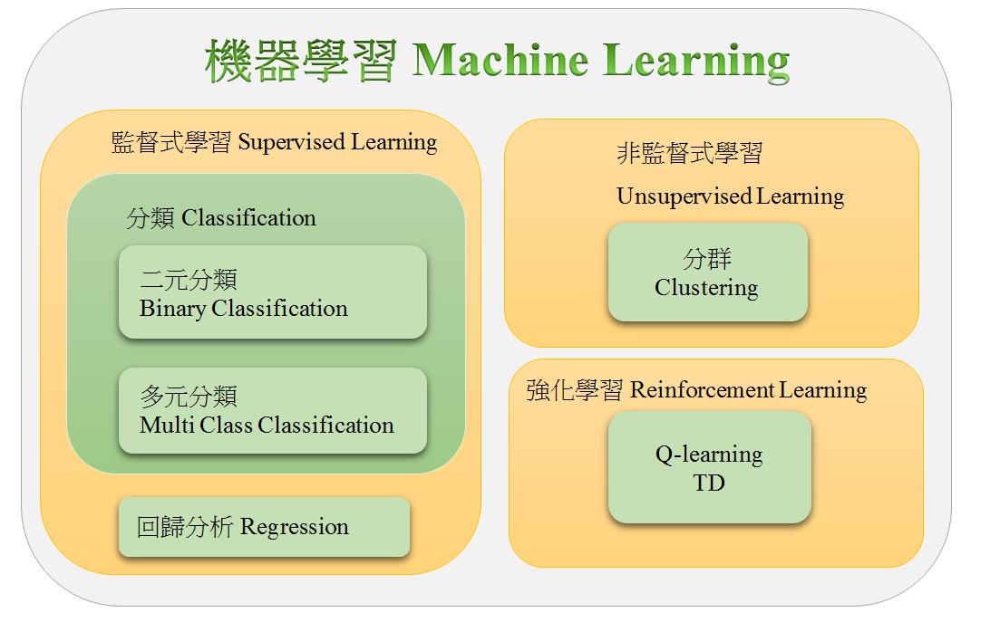

# 機器學習(Machine Learning) 介紹

機器學習(Machine Learning) 介紹

 

由於機器學習技術的進步，應用相當廣泛，例如推薦引擎、定向廣告、需求預測、垃圾郵件過濾、醫學診斷、自然語言處理、搜索引擎、詐騙偵測、證券分析、視覺辨識、語音識別、手寫識別..等等。 
 
您可以先看下列影片,有一些概念
<iframe allowfullscreen="" frameborder="0" height="315" src="https://www.youtube.com/embed/ty-kTUzMnjk" width="560"></iframe> 
 
<!--[if gte mso 9]><xml>
 <o:OfficeDocumentSettings>
  <o:RelyOnVML/>
  <o:AllowPNG/>
 </o:OfficeDocumentSettings>
</xml><![endif]--> 
<!--[if gte mso 9]><xml>
 <w:WordDocument>
  <w:View>Normal</w:View>
  <w:Zoom>0</w:Zoom>
  <w:TrackMoves/>
  <w:TrackFormatting/>
  <w:PunctuationKerning/>
  <w:DisplayHorizontalDrawingGridEvery>0</w:DisplayHorizontalDrawingGridEvery>
  <w:DisplayVerticalDrawingGridEvery>2</w:DisplayVerticalDrawingGridEvery>
  <w:ValidateAgainstSchemas/>
  <w:SaveIfXMLInvalid>false</w:SaveIfXMLInvalid>
  <w:IgnoreMixedContent>false</w:IgnoreMixedContent>
  <w:AlwaysShowPlaceholderText>false</w:AlwaysShowPlaceholderText>
  <w:DoNotPromoteQF/>
  <w:LidThemeOther>EN-US</w:LidThemeOther>
  <w:LidThemeAsian>ZH-TW</w:LidThemeAsian>
  <w:LidThemeComplexScript>X-NONE</w:LidThemeComplexScript>
  <w:Compatibility>
   <w:SpaceForUL/>
   <w:BalanceSingleByteDoubleByteWidth/>
   <w:DoNotLeaveBackslashAlone/>
   <w:ULTrailSpace/>
   <w:DoNotExpandShiftReturn/>
   <w:AdjustLineHeightInTable/>
   <w:BreakWrappedTables/>
   <w:SnapToGridInCell/>
   <w:WrapTextWithPunct/>
   <w:UseAsianBreakRules/>
   <w:DontGrowAutofit/>
   <w:SplitPgBreakAndParaMark/>
   <w:EnableOpenTypeKerning/>
   <w:DontFlipMirrorIndents/>
   <w:OverrideTableStyleHps/>
   <w:UseFELayout/>
  </w:Compatibility>
  <m:mathPr>
   <m:mathFont m:val="Cambria Math"/>
   <m:brkBin m:val="before"/>
   <m:brkBinSub m:val="&#45;-"/>
   <m:smallFrac m:val="off"/>
   <m:dispDef/>
   <m:lMargin m:val="0"/>
   <m:rMargin m:val="0"/>
   <m:defJc m:val="centerGroup"/>
   <m:wrapIndent m:val="1440"/>
   <m:intLim m:val="subSup"/>
   <m:naryLim m:val="undOvr"/>
  </m:mathPr></w:WordDocument>
</xml><![endif]--><!--[if gte mso 9]><xml>
 <w:LatentStyles DefLockedState="false" DefUnhideWhenUsed="true"
  DefSemiHidden="true" DefQFormat="false" DefPriority="99"
  LatentStyleCount="267">
  <w:LsdException Locked="false" Priority="0" SemiHidden="false"
   UnhideWhenUsed="false" QFormat="true" Name="Normal"/>
  <w:LsdException Locked="false" Priority="9" SemiHidden="false"
   UnhideWhenUsed="false" QFormat="true" Name="heading 1"/>
  <w:LsdException Locked="false" Priority="9" QFormat="true" Name="heading 2"/>
  <w:LsdException Locked="false" Priority="9" QFormat="true" Name="heading 3"/>
  <w:LsdException Locked="false" Priority="9" QFormat="true" Name="heading 4"/>
  <w:LsdException Locked="false" Priority="9" QFormat="true" Name="heading 5"/>
  <w:LsdException Locked="false" Priority="9" QFormat="true" Name="heading 6"/>
  <w:LsdException Locked="false" Priority="9" QFormat="true" Name="heading 7"/>
  <w:LsdException Locked="false" Priority="9" QFormat="true" Name="heading 8"/>
  <w:LsdException Locked="false" Priority="9" QFormat="true" Name="heading 9"/>
  <w:LsdException Locked="false" Priority="39" Name="toc 1"/>
  <w:LsdException Locked="false" Priority="39" Name="toc 2"/>
  <w:LsdException Locked="false" Priority="39" Name="toc 3"/>
  <w:LsdException Locked="false" Priority="39" Name="toc 4"/>
  <w:LsdException Locked="false" Priority="39" Name="toc 5"/>
  <w:LsdException Locked="false" Priority="39" Name="toc 6"/>
  <w:LsdException Locked="false" Priority="39" Name="toc 7"/>
  <w:LsdException Locked="false" Priority="39" Name="toc 8"/>
  <w:LsdException Locked="false" Priority="39" Name="toc 9"/>
  <w:LsdException Locked="false" Priority="35" QFormat="true" Name="caption"/>
  <w:LsdException Locked="false" Priority="10" SemiHidden="false"
   UnhideWhenUsed="false" QFormat="true" Name="Title"/>
  <w:LsdException Locked="false" Priority="1" Name="Default Paragraph Font"/>
  <w:LsdException Locked="false" Priority="11" SemiHidden="false"
   UnhideWhenUsed="false" QFormat="true" Name="Subtitle"/>
  <w:LsdException Locked="false" Priority="22" SemiHidden="false"
   UnhideWhenUsed="false" QFormat="true" Name="Strong"/>
  <w:LsdException Locked="false" Priority="20" SemiHidden="false"
   UnhideWhenUsed="false" QFormat="true" Name="Emphasis"/>
  <w:LsdException Locked="false" Priority="59" SemiHidden="false"
   UnhideWhenUsed="false" Name="Table Grid"/>
  <w:LsdException Locked="false" UnhideWhenUsed="false" Name="Placeholder Text"/>
  <w:LsdException Locked="false" Priority="1" SemiHidden="false"
   UnhideWhenUsed="false" QFormat="true" Name="No Spacing"/>
  <w:LsdException Locked="false" Priority="60" SemiHidden="false"
   UnhideWhenUsed="false" Name="Light Shading"/>
  <w:LsdException Locked="false" Priority="61" SemiHidden="false"
   UnhideWhenUsed="false" Name="Light List"/>
  <w:LsdException Locked="false" Priority="62" SemiHidden="false"
   UnhideWhenUsed="false" Name="Light Grid"/>
  <w:LsdException Locked="false" Priority="63" SemiHidden="false"
   UnhideWhenUsed="false" Name="Medium Shading 1"/>
  <w:LsdException Locked="false" Priority="64" SemiHidden="false"
   UnhideWhenUsed="false" Name="Medium Shading 2"/>
  <w:LsdException Locked="false" Priority="65" SemiHidden="false"
   UnhideWhenUsed="false" Name="Medium List 1"/>
  <w:LsdException Locked="false" Priority="66" SemiHidden="false"
   UnhideWhenUsed="false" Name="Medium List 2"/>
  <w:LsdException Locked="false" Priority="67" SemiHidden="false"
   UnhideWhenUsed="false" Name="Medium Grid 1"/>
  <w:LsdException Locked="false" Priority="68" SemiHidden="false"
   UnhideWhenUsed="false" Name="Medium Grid 2"/>
  <w:LsdException Locked="false" Priority="69" SemiHidden="false"
   UnhideWhenUsed="false" Name="Medium Grid 3"/>
  <w:LsdException Locked="false" Priority="70" SemiHidden="false"
   UnhideWhenUsed="false" Name="Dark List"/>
  <w:LsdException Locked="false" Priority="71" SemiHidden="false"
   UnhideWhenUsed="false" Name="Colorful Shading"/>
  <w:LsdException Locked="false" Priority="72" SemiHidden="false"
   UnhideWhenUsed="false" Name="Colorful List"/>
  <w:LsdException Locked="false" Priority="73" SemiHidden="false"
   UnhideWhenUsed="false" Name="Colorful Grid"/>
  <w:LsdException Locked="false" Priority="60" SemiHidden="false"
   UnhideWhenUsed="false" Name="Light Shading Accent 1"/>
  <w:LsdException Locked="false" Priority="61" SemiHidden="false"
   UnhideWhenUsed="false" Name="Light List Accent 1"/>
  <w:LsdException Locked="false" Priority="62" SemiHidden="false"
   UnhideWhenUsed="false" Name="Light Grid Accent 1"/>
  <w:LsdException Locked="false" Priority="63" SemiHidden="false"
   UnhideWhenUsed="false" Name="Medium Shading 1 Accent 1"/>
  <w:LsdException Locked="false" Priority="64" SemiHidden="false"
   UnhideWhenUsed="false" Name="Medium Shading 2 Accent 1"/>
  <w:LsdException Locked="false" Priority="65" SemiHidden="false"
   UnhideWhenUsed="false" Name="Medium List 1 Accent 1"/>
  <w:LsdException Locked="false" UnhideWhenUsed="false" Name="Revision"/>
  <w:LsdException Locked="false" Priority="34" SemiHidden="false"
   UnhideWhenUsed="false" QFormat="true" Name="List Paragraph"/>
  <w:LsdException Locked="false" Priority="29" SemiHidden="false"
   UnhideWhenUsed="false" QFormat="true" Name="Quote"/>
  <w:LsdException Locked="false" Priority="30" SemiHidden="false"
   UnhideWhenUsed="false" QFormat="true" Name="Intense Quote"/>
  <w:LsdException Locked="false" Priority="66" SemiHidden="false"
   UnhideWhenUsed="false" Name="Medium List 2 Accent 1"/>
  <w:LsdException Locked="false" Priority="67" SemiHidden="false"
   UnhideWhenUsed="false" Name="Medium Grid 1 Accent 1"/>
  <w:LsdException Locked="false" Priority="68" SemiHidden="false"
   UnhideWhenUsed="false" Name="Medium Grid 2 Accent 1"/>
  <w:LsdException Locked="false" Priority="69" SemiHidden="false"
   UnhideWhenUsed="false" Name="Medium Grid 3 Accent 1"/>
  <w:LsdException Locked="false" Priority="70" SemiHidden="false"
   UnhideWhenUsed="false" Name="Dark List Accent 1"/>
  <w:LsdException Locked="false" Priority="71" SemiHidden="false"
   UnhideWhenUsed="false" Name="Colorful Shading Accent 1"/>
  <w:LsdException Locked="false" Priority="72" SemiHidden="false"
   UnhideWhenUsed="false" Name="Colorful List Accent 1"/>
  <w:LsdException Locked="false" Priority="73" SemiHidden="false"
   UnhideWhenUsed="false" Name="Colorful Grid Accent 1"/>
  <w:LsdException Locked="false" Priority="60" SemiHidden="false"
   UnhideWhenUsed="false" Name="Light Shading Accent 2"/>
  <w:LsdException Locked="false" Priority="61" SemiHidden="false"
   UnhideWhenUsed="false" Name="Light List Accent 2"/>
  <w:LsdException Locked="false" Priority="62" SemiHidden="false"
   UnhideWhenUsed="false" Name="Light Grid Accent 2"/>
  <w:LsdException Locked="false" Priority="63" SemiHidden="false"
   UnhideWhenUsed="false" Name="Medium Shading 1 Accent 2"/>
  <w:LsdException Locked="false" Priority="64" SemiHidden="false"
   UnhideWhenUsed="false" Name="Medium Shading 2 Accent 2"/>
  <w:LsdException Locked="false" Priority="65" SemiHidden="false"
   UnhideWhenUsed="false" Name="Medium List 1 Accent 2"/>
  <w:LsdException Locked="false" Priority="66" SemiHidden="false"
   UnhideWhenUsed="false" Name="Medium List 2 Accent 2"/>
  <w:LsdException Locked="false" Priority="67" SemiHidden="false"
   UnhideWhenUsed="false" Name="Medium Grid 1 Accent 2"/>
  <w:LsdException Locked="false" Priority="68" SemiHidden="false"
   UnhideWhenUsed="false" Name="Medium Grid 2 Accent 2"/>
  <w:LsdException Locked="false" Priority="69" SemiHidden="false"
   UnhideWhenUsed="false" Name="Medium Grid 3 Accent 2"/>
  <w:LsdException Locked="false" Priority="70" SemiHidden="false"
   UnhideWhenUsed="false" Name="Dark List Accent 2"/>
  <w:LsdException Locked="false" Priority="71" SemiHidden="false"
   UnhideWhenUsed="false" Name="Colorful Shading Accent 2"/>
  <w:LsdException Locked="false" Priority="72" SemiHidden="false"
   UnhideWhenUsed="false" Name="Colorful List Accent 2"/>
  <w:LsdException Locked="false" Priority="73" SemiHidden="false"
   UnhideWhenUsed="false" Name="Colorful Grid Accent 2"/>
  <w:LsdException Locked="false" Priority="60" SemiHidden="false"
   UnhideWhenUsed="false" Name="Light Shading Accent 3"/>
  <w:LsdException Locked="false" Priority="61" SemiHidden="false"
   UnhideWhenUsed="false" Name="Light List Accent 3"/>
  <w:LsdException Locked="false" Priority="62" SemiHidden="false"
   UnhideWhenUsed="false" Name="Light Grid Accent 3"/>
  <w:LsdException Locked="false" Priority="63" SemiHidden="false"
   UnhideWhenUsed="false" Name="Medium Shading 1 Accent 3"/>
  <w:LsdException Locked="false" Priority="64" SemiHidden="false"
   UnhideWhenUsed="false" Name="Medium Shading 2 Accent 3"/>
  <w:LsdException Locked="false" Priority="65" SemiHidden="false"
   UnhideWhenUsed="false" Name="Medium List 1 Accent 3"/>
  <w:LsdException Locked="false" Priority="66" SemiHidden="false"
   UnhideWhenUsed="false" Name="Medium List 2 Accent 3"/>
  <w:LsdException Locked="false" Priority="67" SemiHidden="false"
   UnhideWhenUsed="false" Name="Medium Grid 1 Accent 3"/>
  <w:LsdException Locked="false" Priority="68" SemiHidden="false"
   UnhideWhenUsed="false" Name="Medium Grid 2 Accent 3"/>
  <w:LsdException Locked="false" Priority="69" SemiHidden="false"
   UnhideWhenUsed="false" Name="Medium Grid 3 Accent 3"/>
  <w:LsdException Locked="false" Priority="70" SemiHidden="false"
   UnhideWhenUsed="false" Name="Dark List Accent 3"/>
  <w:LsdException Locked="false" Priority="71" SemiHidden="false"
   UnhideWhenUsed="false" Name="Colorful Shading Accent 3"/>
  <w:LsdException Locked="false" Priority="72" SemiHidden="false"
   UnhideWhenUsed="false" Name="Colorful List Accent 3"/>
  <w:LsdException Locked="false" Priority="73" SemiHidden="false"
   UnhideWhenUsed="false" Name="Colorful Grid Accent 3"/>
  <w:LsdException Locked="false" Priority="60" SemiHidden="false"
   UnhideWhenUsed="false" Name="Light Shading Accent 4"/>
  <w:LsdException Locked="false" Priority="61" SemiHidden="false"
   UnhideWhenUsed="false" Name="Light List Accent 4"/>
  <w:LsdException Locked="false" Priority="62" SemiHidden="false"
   UnhideWhenUsed="false" Name="Light Grid Accent 4"/>
  <w:LsdException Locked="false" Priority="63" SemiHidden="false"
   UnhideWhenUsed="false" Name="Medium Shading 1 Accent 4"/>
  <w:LsdException Locked="false" Priority="64" SemiHidden="false"
   UnhideWhenUsed="false" Name="Medium Shading 2 Accent 4"/>
  <w:LsdException Locked="false" Priority="65" SemiHidden="false"
   UnhideWhenUsed="false" Name="Medium List 1 Accent 4"/>
  <w:LsdException Locked="false" Priority="66" SemiHidden="false"
   UnhideWhenUsed="false" Name="Medium List 2 Accent 4"/>
  <w:LsdException Locked="false" Priority="67" SemiHidden="false"
   UnhideWhenUsed="false" Name="Medium Grid 1 Accent 4"/>
  <w:LsdException Locked="false" Priority="68" SemiHidden="false"
   UnhideWhenUsed="false" Name="Medium Grid 2 Accent 4"/>
  <w:LsdException Locked="false" Priority="69" SemiHidden="false"
   UnhideWhenUsed="false" Name="Medium Grid 3 Accent 4"/>
  <w:LsdException Locked="false" Priority="70" SemiHidden="false"
   UnhideWhenUsed="false" Name="Dark List Accent 4"/>
  <w:LsdException Locked="false" Priority="71" SemiHidden="false"
   UnhideWhenUsed="false" Name="Colorful Shading Accent 4"/>
  <w:LsdException Locked="false" Priority="72" SemiHidden="false"
   UnhideWhenUsed="false" Name="Colorful List Accent 4"/>
  <w:LsdException Locked="false" Priority="73" SemiHidden="false"
   UnhideWhenUsed="false" Name="Colorful Grid Accent 4"/>
  <w:LsdException Locked="false" Priority="60" SemiHidden="false"
   UnhideWhenUsed="false" Name="Light Shading Accent 5"/>
  <w:LsdException Locked="false" Priority="61" SemiHidden="false"
   UnhideWhenUsed="false" Name="Light List Accent 5"/>
  <w:LsdException Locked="false" Priority="62" SemiHidden="false"
   UnhideWhenUsed="false" Name="Light Grid Accent 5"/>
  <w:LsdException Locked="false" Priority="63" SemiHidden="false"
   UnhideWhenUsed="false" Name="Medium Shading 1 Accent 5"/>
  <w:LsdException Locked="false" Priority="64" SemiHidden="false"
   UnhideWhenUsed="false" Name="Medium Shading 2 Accent 5"/>
  <w:LsdException Locked="false" Priority="65" SemiHidden="false"
   UnhideWhenUsed="false" Name="Medium List 1 Accent 5"/>
  <w:LsdException Locked="false" Priority="66" SemiHidden="false"
   UnhideWhenUsed="false" Name="Medium List 2 Accent 5"/>
  <w:LsdException Locked="false" Priority="67" SemiHidden="false"
   UnhideWhenUsed="false" Name="Medium Grid 1 Accent 5"/>
  <w:LsdException Locked="false" Priority="68" SemiHidden="false"
   UnhideWhenUsed="false" Name="Medium Grid 2 Accent 5"/>
  <w:LsdException Locked="false" Priority="69" SemiHidden="false"
   UnhideWhenUsed="false" Name="Medium Grid 3 Accent 5"/>
  <w:LsdException Locked="false" Priority="70" SemiHidden="false"
   UnhideWhenUsed="false" Name="Dark List Accent 5"/>
  <w:LsdException Locked="false" Priority="71" SemiHidden="false"
   UnhideWhenUsed="false" Name="Colorful Shading Accent 5"/>
  <w:LsdException Locked="false" Priority="72" SemiHidden="false"
   UnhideWhenUsed="false" Name="Colorful List Accent 5"/>
  <w:LsdException Locked="false" Priority="73" SemiHidden="false"
   UnhideWhenUsed="false" Name="Colorful Grid Accent 5"/>
  <w:LsdException Locked="false" Priority="60" SemiHidden="false"
   UnhideWhenUsed="false" Name="Light Shading Accent 6"/>
  <w:LsdException Locked="false" Priority="61" SemiHidden="false"
   UnhideWhenUsed="false" Name="Light List Accent 6"/>
  <w:LsdException Locked="false" Priority="62" SemiHidden="false"
   UnhideWhenUsed="false" Name="Light Grid Accent 6"/>
  <w:LsdException Locked="false" Priority="63" SemiHidden="false"
   UnhideWhenUsed="false" Name="Medium Shading 1 Accent 6"/>
  <w:LsdException Locked="false" Priority="64" SemiHidden="false"
   UnhideWhenUsed="false" Name="Medium Shading 2 Accent 6"/>
  <w:LsdException Locked="false" Priority="65" SemiHidden="false"
   UnhideWhenUsed="false" Name="Medium List 1 Accent 6"/>
  <w:LsdException Locked="false" Priority="66" SemiHidden="false"
   UnhideWhenUsed="false" Name="Medium List 2 Accent 6"/>
  <w:LsdException Locked="false" Priority="67" SemiHidden="false"
   UnhideWhenUsed="false" Name="Medium Grid 1 Accent 6"/>
  <w:LsdException Locked="false" Priority="68" SemiHidden="false"
   UnhideWhenUsed="false" Name="Medium Grid 2 Accent 6"/>
  <w:LsdException Locked="false" Priority="69" SemiHidden="false"
   UnhideWhenUsed="false" Name="Medium Grid 3 Accent 6"/>
  <w:LsdException Locked="false" Priority="70" SemiHidden="false"
   UnhideWhenUsed="false" Name="Dark List Accent 6"/>
  <w:LsdException Locked="false" Priority="71" SemiHidden="false"
   UnhideWhenUsed="false" Name="Colorful Shading Accent 6"/>
  <w:LsdException Locked="false" Priority="72" SemiHidden="false"
   UnhideWhenUsed="false" Name="Colorful List Accent 6"/>
  <w:LsdException Locked="false" Priority="73" SemiHidden="false"
   UnhideWhenUsed="false" Name="Colorful Grid Accent 6"/>
  <w:LsdException Locked="false" Priority="19" SemiHidden="false"
   UnhideWhenUsed="false" QFormat="true" Name="Subtle Emphasis"/>
  <w:LsdException Locked="false" Priority="21" SemiHidden="false"
   UnhideWhenUsed="false" QFormat="true" Name="Intense Emphasis"/>
  <w:LsdException Locked="false" Priority="31" SemiHidden="false"
   UnhideWhenUsed="false" QFormat="true" Name="Subtle Reference"/>
  <w:LsdException Locked="false" Priority="32" SemiHidden="false"
   UnhideWhenUsed="false" QFormat="true" Name="Intense Reference"/>
  <w:LsdException Locked="false" Priority="33" SemiHidden="false"
   UnhideWhenUsed="false" QFormat="true" Name="Book Title"/>
  <w:LsdException Locked="false" Priority="37" Name="Bibliography"/>
  <w:LsdException Locked="false" Priority="39" QFormat="true" Name="TOC Heading"/>
 </w:LatentStyles>
</xml><![endif]--><!--[if gte mso 10]>

<![endif]-->

 

<b>機器學習架構</b>

機器學習（Machine Learning）是透過演算法，使用歷史資料進行訓練，訓練完成後會產生模型。未來當有新的資料，我們可以使用訓練產生的模型進行預測。

機器學習的訓練的資料是由 <b style="mso-bidi-font-weight: normal;">features、label</b>組成。

<ul>
<li>features：資料的特徵，例如：濕度、風向、風速、季節、氣壓。</li>
<li>label： 資料的標籤，也就是我們希望預測的目標，例如：降雨（0:不會下雨、1:會下雨）、天候( 1:晴天、2:雨天、3:陰天、4:下雪）、氣溫。</li>
</ul>

 

如下圖，機器學習可分為2 階段：

 

 
 
<ul>
<li>訓練階段（Training）：</li>
</ul>
 
 

訓練資料是過去累積的歷史資料，可能是文字檔、資料庫、或其他來源，經過Feature
Extraction（特徵萃取），產生Feature（資料特徵）與Label（預測目標），然後經過機器學習演算法訓練後產生模型。

 

<ul>
<li>預測階段（Predict）：</li>
</ul>

新輸入資料(可能文字檔、資料庫、或其他來源)，經過Feature
Extraction（特徵萃取）產生Feature（資料特徵），使用訓練完成的模型進行預測，最後產生預測結果。

 

 
<!--[if gte mso 9]><xml>
 <o:OfficeDocumentSettings>
  <o:RelyOnVML/>
  <o:AllowPNG/>
 </o:OfficeDocumentSettings>
</xml><![endif]--> 
<!--[if gte mso 9]><xml>
 <w:WordDocument>
  <w:View>Normal</w:View>
  <w:Zoom>0</w:Zoom>
  <w:TrackMoves/>
  <w:TrackFormatting/>
  <w:PunctuationKerning/>
  <w:DisplayHorizontalDrawingGridEvery>0</w:DisplayHorizontalDrawingGridEvery>
  <w:DisplayVerticalDrawingGridEvery>2</w:DisplayVerticalDrawingGridEvery>
  <w:ValidateAgainstSchemas/>
  <w:SaveIfXMLInvalid>false</w:SaveIfXMLInvalid>
  <w:IgnoreMixedContent>false</w:IgnoreMixedContent>
  <w:AlwaysShowPlaceholderText>false</w:AlwaysShowPlaceholderText>
  <w:DoNotPromoteQF/>
  <w:LidThemeOther>EN-US</w:LidThemeOther>
  <w:LidThemeAsian>ZH-TW</w:LidThemeAsian>
  <w:LidThemeComplexScript>X-NONE</w:LidThemeComplexScript>
  <w:Compatibility>
   <w:SpaceForUL/>
   <w:BalanceSingleByteDoubleByteWidth/>
   <w:DoNotLeaveBackslashAlone/>
   <w:ULTrailSpace/>
   <w:DoNotExpandShiftReturn/>
   <w:AdjustLineHeightInTable/>
   <w:BreakWrappedTables/>
   <w:SnapToGridInCell/>
   <w:WrapTextWithPunct/>
   <w:UseAsianBreakRules/>
   <w:DontGrowAutofit/>
   <w:SplitPgBreakAndParaMark/>
   <w:EnableOpenTypeKerning/>
   <w:DontFlipMirrorIndents/>
   <w:OverrideTableStyleHps/>
   <w:UseFELayout/>
  </w:Compatibility>
  <m:mathPr>
   <m:mathFont m:val="Cambria Math"/>
   <m:brkBin m:val="before"/>
   <m:brkBinSub m:val="&#45;-"/>
   <m:smallFrac m:val="off"/>
   <m:dispDef/>
   <m:lMargin m:val="0"/>
   <m:rMargin m:val="0"/>
   <m:defJc m:val="centerGroup"/>
   <m:wrapIndent m:val="1440"/>
   <m:intLim m:val="subSup"/>
   <m:naryLim m:val="undOvr"/>
  </m:mathPr></w:WordDocument>
</xml><![endif]--><!--[if gte mso 9]><xml>
 <w:LatentStyles DefLockedState="false" DefUnhideWhenUsed="true"
  DefSemiHidden="true" DefQFormat="false" DefPriority="99"
  LatentStyleCount="267">
  <w:LsdException Locked="false" Priority="0" SemiHidden="false"
   UnhideWhenUsed="false" QFormat="true" Name="Normal"/>
  <w:LsdException Locked="false" Priority="9" SemiHidden="false"
   UnhideWhenUsed="false" QFormat="true" Name="heading 1"/>
  <w:LsdException Locked="false" Priority="9" QFormat="true" Name="heading 2"/>
  <w:LsdException Locked="false" Priority="9" QFormat="true" Name="heading 3"/>
  <w:LsdException Locked="false" Priority="9" QFormat="true" Name="heading 4"/>
  <w:LsdException Locked="false" Priority="9" QFormat="true" Name="heading 5"/>
  <w:LsdException Locked="false" Priority="9" QFormat="true" Name="heading 6"/>
  <w:LsdException Locked="false" Priority="9" QFormat="true" Name="heading 7"/>
  <w:LsdException Locked="false" Priority="9" QFormat="true" Name="heading 8"/>
  <w:LsdException Locked="false" Priority="9" QFormat="true" Name="heading 9"/>
  <w:LsdException Locked="false" Priority="39" Name="toc 1"/>
  <w:LsdException Locked="false" Priority="39" Name="toc 2"/>
  <w:LsdException Locked="false" Priority="39" Name="toc 3"/>
  <w:LsdException Locked="false" Priority="39" Name="toc 4"/>
  <w:LsdException Locked="false" Priority="39" Name="toc 5"/>
  <w:LsdException Locked="false" Priority="39" Name="toc 6"/>
  <w:LsdException Locked="false" Priority="39" Name="toc 7"/>
  <w:LsdException Locked="false" Priority="39" Name="toc 8"/>
  <w:LsdException Locked="false" Priority="39" Name="toc 9"/>
  <w:LsdException Locked="false" Priority="35" QFormat="true" Name="caption"/>
  <w:LsdException Locked="false" Priority="10" SemiHidden="false"
   UnhideWhenUsed="false" QFormat="true" Name="Title"/>
  <w:LsdException Locked="false" Priority="1" Name="Default Paragraph Font"/>
  <w:LsdException Locked="false" Priority="11" SemiHidden="false"
   UnhideWhenUsed="false" QFormat="true" Name="Subtitle"/>
  <w:LsdException Locked="false" Priority="22" SemiHidden="false"
   UnhideWhenUsed="false" QFormat="true" Name="Strong"/>
  <w:LsdException Locked="false" Priority="20" SemiHidden="false"
   UnhideWhenUsed="false" QFormat="true" Name="Emphasis"/>
  <w:LsdException Locked="false" Priority="0" Name="Table Elegant"/>
  <w:LsdException Locked="false" Priority="59" SemiHidden="false"
   UnhideWhenUsed="false" Name="Table Grid"/>
  <w:LsdException Locked="false" UnhideWhenUsed="false" Name="Placeholder Text"/>
  <w:LsdException Locked="false" Priority="1" SemiHidden="false"
   UnhideWhenUsed="false" QFormat="true" Name="No Spacing"/>
  <w:LsdException Locked="false" Priority="60" SemiHidden="false"
   UnhideWhenUsed="false" Name="Light Shading"/>
  <w:LsdException Locked="false" Priority="61" SemiHidden="false"
   UnhideWhenUsed="false" Name="Light List"/>
  <w:LsdException Locked="false" Priority="62" SemiHidden="false"
   UnhideWhenUsed="false" Name="Light Grid"/>
  <w:LsdException Locked="false" Priority="63" SemiHidden="false"
   UnhideWhenUsed="false" Name="Medium Shading 1"/>
  <w:LsdException Locked="false" Priority="64" SemiHidden="false"
   UnhideWhenUsed="false" Name="Medium Shading 2"/>
  <w:LsdException Locked="false" Priority="65" SemiHidden="false"
   UnhideWhenUsed="false" Name="Medium List 1"/>
  <w:LsdException Locked="false" Priority="66" SemiHidden="false"
   UnhideWhenUsed="false" Name="Medium List 2"/>
  <w:LsdException Locked="false" Priority="67" SemiHidden="false"
   UnhideWhenUsed="false" Name="Medium Grid 1"/>
  <w:LsdException Locked="false" Priority="68" SemiHidden="false"
   UnhideWhenUsed="false" Name="Medium Grid 2"/>
  <w:LsdException Locked="false" Priority="69" SemiHidden="false"
   UnhideWhenUsed="false" Name="Medium Grid 3"/>
  <w:LsdException Locked="false" Priority="70" SemiHidden="false"
   UnhideWhenUsed="false" Name="Dark List"/>
  <w:LsdException Locked="false" Priority="71" SemiHidden="false"
   UnhideWhenUsed="false" Name="Colorful Shading"/>
  <w:LsdException Locked="false" Priority="72" SemiHidden="false"
   UnhideWhenUsed="false" Name="Colorful List"/>
  <w:LsdException Locked="false" Priority="73" SemiHidden="false"
   UnhideWhenUsed="false" Name="Colorful Grid"/>
  <w:LsdException Locked="false" Priority="60" SemiHidden="false"
   UnhideWhenUsed="false" Name="Light Shading Accent 1"/>
  <w:LsdException Locked="false" Priority="61" SemiHidden="false"
   UnhideWhenUsed="false" Name="Light List Accent 1"/>
  <w:LsdException Locked="false" Priority="62" SemiHidden="false"
   UnhideWhenUsed="false" Name="Light Grid Accent 1"/>
  <w:LsdException Locked="false" Priority="63" SemiHidden="false"
   UnhideWhenUsed="false" Name="Medium Shading 1 Accent 1"/>
  <w:LsdException Locked="false" Priority="64" SemiHidden="false"
   UnhideWhenUsed="false" Name="Medium Shading 2 Accent 1"/>
  <w:LsdException Locked="false" Priority="65" SemiHidden="false"
   UnhideWhenUsed="false" Name="Medium List 1 Accent 1"/>
  <w:LsdException Locked="false" UnhideWhenUsed="false" Name="Revision"/>
  <w:LsdException Locked="false" Priority="34" SemiHidden="false"
   UnhideWhenUsed="false" QFormat="true" Name="List Paragraph"/>
  <w:LsdException Locked="false" Priority="29" SemiHidden="false"
   UnhideWhenUsed="false" QFormat="true" Name="Quote"/>
  <w:LsdException Locked="false" Priority="30" SemiHidden="false"
   UnhideWhenUsed="false" QFormat="true" Name="Intense Quote"/>
  <w:LsdException Locked="false" Priority="66" SemiHidden="false"
   UnhideWhenUsed="false" Name="Medium List 2 Accent 1"/>
  <w:LsdException Locked="false" Priority="67" SemiHidden="false"
   UnhideWhenUsed="false" Name="Medium Grid 1 Accent 1"/>
  <w:LsdException Locked="false" Priority="68" SemiHidden="false"
   UnhideWhenUsed="false" Name="Medium Grid 2 Accent 1"/>
  <w:LsdException Locked="false" Priority="69" SemiHidden="false"
   UnhideWhenUsed="false" Name="Medium Grid 3 Accent 1"/>
  <w:LsdException Locked="false" Priority="70" SemiHidden="false"
   UnhideWhenUsed="false" Name="Dark List Accent 1"/>
  <w:LsdException Locked="false" Priority="71" SemiHidden="false"
   UnhideWhenUsed="false" Name="Colorful Shading Accent 1"/>
  <w:LsdException Locked="false" Priority="72" SemiHidden="false"
   UnhideWhenUsed="false" Name="Colorful List Accent 1"/>
  <w:LsdException Locked="false" Priority="73" SemiHidden="false"
   UnhideWhenUsed="false" Name="Colorful Grid Accent 1"/>
  <w:LsdException Locked="false" Priority="60" SemiHidden="false"
   UnhideWhenUsed="false" Name="Light Shading Accent 2"/>
  <w:LsdException Locked="false" Priority="61" SemiHidden="false"
   UnhideWhenUsed="false" Name="Light List Accent 2"/>
  <w:LsdException Locked="false" Priority="62" SemiHidden="false"
   UnhideWhenUsed="false" Name="Light Grid Accent 2"/>
  <w:LsdException Locked="false" Priority="63" SemiHidden="false"
   UnhideWhenUsed="false" Name="Medium Shading 1 Accent 2"/>
  <w:LsdException Locked="false" Priority="64" SemiHidden="false"
   UnhideWhenUsed="false" Name="Medium Shading 2 Accent 2"/>
  <w:LsdException Locked="false" Priority="65" SemiHidden="false"
   UnhideWhenUsed="false" Name="Medium List 1 Accent 2"/>
  <w:LsdException Locked="false" Priority="66" SemiHidden="false"
   UnhideWhenUsed="false" Name="Medium List 2 Accent 2"/>
  <w:LsdException Locked="false" Priority="67" SemiHidden="false"
   UnhideWhenUsed="false" Name="Medium Grid 1 Accent 2"/>
  <w:LsdException Locked="false" Priority="68" SemiHidden="false"
   UnhideWhenUsed="false" Name="Medium Grid 2 Accent 2"/>
  <w:LsdException Locked="false" Priority="69" SemiHidden="false"
   UnhideWhenUsed="false" Name="Medium Grid 3 Accent 2"/>
  <w:LsdException Locked="false" Priority="70" SemiHidden="false"
   UnhideWhenUsed="false" Name="Dark List Accent 2"/>
  <w:LsdException Locked="false" Priority="71" SemiHidden="false"
   UnhideWhenUsed="false" Name="Colorful Shading Accent 2"/>
  <w:LsdException Locked="false" Priority="72" SemiHidden="false"
   UnhideWhenUsed="false" Name="Colorful List Accent 2"/>
  <w:LsdException Locked="false" Priority="73" SemiHidden="false"
   UnhideWhenUsed="false" Name="Colorful Grid Accent 2"/>
  <w:LsdException Locked="false" Priority="60" SemiHidden="false"
   UnhideWhenUsed="false" Name="Light Shading Accent 3"/>
  <w:LsdException Locked="false" Priority="61" SemiHidden="false"
   UnhideWhenUsed="false" Name="Light List Accent 3"/>
  <w:LsdException Locked="false" Priority="62" SemiHidden="false"
   UnhideWhenUsed="false" Name="Light Grid Accent 3"/>
  <w:LsdException Locked="false" Priority="63" SemiHidden="false"
   UnhideWhenUsed="false" Name="Medium Shading 1 Accent 3"/>
  <w:LsdException Locked="false" Priority="64" SemiHidden="false"
   UnhideWhenUsed="false" Name="Medium Shading 2 Accent 3"/>
  <w:LsdException Locked="false" Priority="65" SemiHidden="false"
   UnhideWhenUsed="false" Name="Medium List 1 Accent 3"/>
  <w:LsdException Locked="false" Priority="66" SemiHidden="false"
   UnhideWhenUsed="false" Name="Medium List 2 Accent 3"/>
  <w:LsdException Locked="false" Priority="67" SemiHidden="false"
   UnhideWhenUsed="false" Name="Medium Grid 1 Accent 3"/>
  <w:LsdException Locked="false" Priority="68" SemiHidden="false"
   UnhideWhenUsed="false" Name="Medium Grid 2 Accent 3"/>
  <w:LsdException Locked="false" Priority="69" SemiHidden="false"
   UnhideWhenUsed="false" Name="Medium Grid 3 Accent 3"/>
  <w:LsdException Locked="false" Priority="70" SemiHidden="false"
   UnhideWhenUsed="false" Name="Dark List Accent 3"/>
  <w:LsdException Locked="false" Priority="71" SemiHidden="false"
   UnhideWhenUsed="false" Name="Colorful Shading Accent 3"/>
  <w:LsdException Locked="false" Priority="72" SemiHidden="false"
   UnhideWhenUsed="false" Name="Colorful List Accent 3"/>
  <w:LsdException Locked="false" Priority="73" SemiHidden="false"
   UnhideWhenUsed="false" Name="Colorful Grid Accent 3"/>
  <w:LsdException Locked="false" Priority="60" SemiHidden="false"
   UnhideWhenUsed="false" Name="Light Shading Accent 4"/>
  <w:LsdException Locked="false" Priority="61" SemiHidden="false"
   UnhideWhenUsed="false" Name="Light List Accent 4"/>
  <w:LsdException Locked="false" Priority="62" SemiHidden="false"
   UnhideWhenUsed="false" Name="Light Grid Accent 4"/>
  <w:LsdException Locked="false" Priority="63" SemiHidden="false"
   UnhideWhenUsed="false" Name="Medium Shading 1 Accent 4"/>
  <w:LsdException Locked="false" Priority="64" SemiHidden="false"
   UnhideWhenUsed="false" Name="Medium Shading 2 Accent 4"/>
  <w:LsdException Locked="false" Priority="65" SemiHidden="false"
   UnhideWhenUsed="false" Name="Medium List 1 Accent 4"/>
  <w:LsdException Locked="false" Priority="66" SemiHidden="false"
   UnhideWhenUsed="false" Name="Medium List 2 Accent 4"/>
  <w:LsdException Locked="false" Priority="67" SemiHidden="false"
   UnhideWhenUsed="false" Name="Medium Grid 1 Accent 4"/>
  <w:LsdException Locked="false" Priority="68" SemiHidden="false"
   UnhideWhenUsed="false" Name="Medium Grid 2 Accent 4"/>
  <w:LsdException Locked="false" Priority="69" SemiHidden="false"
   UnhideWhenUsed="false" Name="Medium Grid 3 Accent 4"/>
  <w:LsdException Locked="false" Priority="70" SemiHidden="false"
   UnhideWhenUsed="false" Name="Dark List Accent 4"/>
  <w:LsdException Locked="false" Priority="71" SemiHidden="false"
   UnhideWhenUsed="false" Name="Colorful Shading Accent 4"/>
  <w:LsdException Locked="false" Priority="72" SemiHidden="false"
   UnhideWhenUsed="false" Name="Colorful List Accent 4"/>
  <w:LsdException Locked="false" Priority="73" SemiHidden="false"
   UnhideWhenUsed="false" Name="Colorful Grid Accent 4"/>
  <w:LsdException Locked="false" Priority="60" SemiHidden="false"
   UnhideWhenUsed="false" Name="Light Shading Accent 5"/>
  <w:LsdException Locked="false" Priority="61" SemiHidden="false"
   UnhideWhenUsed="false" Name="Light List Accent 5"/>
  <w:LsdException Locked="false" Priority="62" SemiHidden="false"
   UnhideWhenUsed="false" Name="Light Grid Accent 5"/>
  <w:LsdException Locked="false" Priority="63" SemiHidden="false"
   UnhideWhenUsed="false" Name="Medium Shading 1 Accent 5"/>
  <w:LsdException Locked="false" Priority="64" SemiHidden="false"
   UnhideWhenUsed="false" Name="Medium Shading 2 Accent 5"/>
  <w:LsdException Locked="false" Priority="65" SemiHidden="false"
   UnhideWhenUsed="false" Name="Medium List 1 Accent 5"/>
  <w:LsdException Locked="false" Priority="66" SemiHidden="false"
   UnhideWhenUsed="false" Name="Medium List 2 Accent 5"/>
  <w:LsdException Locked="false" Priority="67" SemiHidden="false"
   UnhideWhenUsed="false" Name="Medium Grid 1 Accent 5"/>
  <w:LsdException Locked="false" Priority="68" SemiHidden="false"
   UnhideWhenUsed="false" Name="Medium Grid 2 Accent 5"/>
  <w:LsdException Locked="false" Priority="69" SemiHidden="false"
   UnhideWhenUsed="false" Name="Medium Grid 3 Accent 5"/>
  <w:LsdException Locked="false" Priority="70" SemiHidden="false"
   UnhideWhenUsed="false" Name="Dark List Accent 5"/>
  <w:LsdException Locked="false" Priority="71" SemiHidden="false"
   UnhideWhenUsed="false" Name="Colorful Shading Accent 5"/>
  <w:LsdException Locked="false" Priority="72" SemiHidden="false"
   UnhideWhenUsed="false" Name="Colorful List Accent 5"/>
  <w:LsdException Locked="false" Priority="73" SemiHidden="false"
   UnhideWhenUsed="false" Name="Colorful Grid Accent 5"/>
  <w:LsdException Locked="false" Priority="60" SemiHidden="false"
   UnhideWhenUsed="false" Name="Light Shading Accent 6"/>
  <w:LsdException Locked="false" Priority="61" SemiHidden="false"
   UnhideWhenUsed="false" Name="Light List Accent 6"/>
  <w:LsdException Locked="false" Priority="62" SemiHidden="false"
   UnhideWhenUsed="false" Name="Light Grid Accent 6"/>
  <w:LsdException Locked="false" Priority="63" SemiHidden="false"
   UnhideWhenUsed="false" Name="Medium Shading 1 Accent 6"/>
  <w:LsdException Locked="false" Priority="64" SemiHidden="false"
   UnhideWhenUsed="false" Name="Medium Shading 2 Accent 6"/>
  <w:LsdException Locked="false" Priority="65" SemiHidden="false"
   UnhideWhenUsed="false" Name="Medium List 1 Accent 6"/>
  <w:LsdException Locked="false" Priority="66" SemiHidden="false"
   UnhideWhenUsed="false" Name="Medium List 2 Accent 6"/>
  <w:LsdException Locked="false" Priority="67" SemiHidden="false"
   UnhideWhenUsed="false" Name="Medium Grid 1 Accent 6"/>
  <w:LsdException Locked="false" Priority="68" SemiHidden="false"
   UnhideWhenUsed="false" Name="Medium Grid 2 Accent 6"/>
  <w:LsdException Locked="false" Priority="69" SemiHidden="false"
   UnhideWhenUsed="false" Name="Medium Grid 3 Accent 6"/>
  <w:LsdException Locked="false" Priority="70" SemiHidden="false"
   UnhideWhenUsed="false" Name="Dark List Accent 6"/>
  <w:LsdException Locked="false" Priority="71" SemiHidden="false"
   UnhideWhenUsed="false" Name="Colorful Shading Accent 6"/>
  <w:LsdException Locked="false" Priority="72" SemiHidden="false"
   UnhideWhenUsed="false" Name="Colorful List Accent 6"/>
  <w:LsdException Locked="false" Priority="73" SemiHidden="false"
   UnhideWhenUsed="false" Name="Colorful Grid Accent 6"/>
  <w:LsdException Locked="false" Priority="19" SemiHidden="false"
   UnhideWhenUsed="false" QFormat="true" Name="Subtle Emphasis"/>
  <w:LsdException Locked="false" Priority="21" SemiHidden="false"
   UnhideWhenUsed="false" QFormat="true" Name="Intense Emphasis"/>
  <w:LsdException Locked="false" Priority="31" SemiHidden="false"
   UnhideWhenUsed="false" QFormat="true" Name="Subtle Reference"/>
  <w:LsdException Locked="false" Priority="32" SemiHidden="false"
   UnhideWhenUsed="false" QFormat="true" Name="Intense Reference"/>
  <w:LsdException Locked="false" Priority="33" SemiHidden="false"
   UnhideWhenUsed="false" QFormat="true" Name="Book Title"/>
  <w:LsdException Locked="false" Priority="37" Name="Bibliography"/>
  <w:LsdException Locked="false" Priority="39" QFormat="true" Name="TOC Heading"/>
 </w:LatentStyles>
</xml><![endif]--><!--[if gte mso 10]>

<![endif]-->

 

<b style="mso-bidi-font-weight: normal;">機器學習分類:</b> 
<b style="mso-bidi-font-weight: normal;">&nbsp;</b>機器學習可分為: 監督式學習（Supervised Learning）、非監督式學習（Unsupervised Learning）、增強式學習（Unsupervised Learning）。以下詳細介紹其分類：

<ul>
</ul>
<ul>
</ul>
<ul>
<li>&nbsp; <b style="mso-bidi-font-weight: normal;">監督式學習（Supervised Learning）</b></li>
</ul>
監督式學習的資料，具備特徵(features)與預測目標(label)，透過演算法，訓練並建立模型。當有新的資料，我們就可以使用模型進行預測。有下列分類，又可以細分如下：

<ul>
<li>&nbsp;<b style="mso-bidi-font-weight: normal;">二元分類</b></li>
</ul>

我們已知：濕度、風向、風速、季節、氣壓等資料特徵，希望預測當天是否會下雨（0.不會下雨、1.會下雨）。因為希望預測的目標label，只有2種選項，這就好像非題。

<ul>
<li>&nbsp;<b style="mso-bidi-font-weight: normal;">多元分類</b></li>
</ul>

我們已知：濕度、風向、風速、季節、氣壓.資料特徵，希望預測當天天氣（1.晴天、2.雨天、3.陰天、4.下雪）。因為希望預測的目標label，有多個選項，就好像選擇題。

<ul>
<li>&nbsp;<b style="mso-bidi-font-weight: normal;">回歸分析</b></li>
</ul>

我們已知：濕度、風向、風速、季節、氣壓等資料特徵，希望預測當天氣溫。因為希望預測的目標label是連續的值，就好像是計算題。 
 

 

<ul>
<li><b>非監督式學習（Unsupervised Learning）</b></li>
</ul>

<b>&nbsp;</b>但是對於非監督式學習（Unsupervised Learning），從現有資料我們不知道要預測的答案，所以沒有label（預測目標）。cluster集群分析的目的是將資料分成幾個相異性最大的群組，而群組內的相似程度最高。 
<ul>
<li><b>強化學習（Reinforcement Learning）</b></li>
</ul>

<b>&nbsp;</b>增強式學習的原理，藉由定義:動作(Actions)、狀態(States)、獎勵(Rewards)的方式，不斷訓練機器循序漸進，學會執行某項任務的演算法。例如:訓練機器玩超級瑪莉電玩，動作:左/右/跳，狀態:目前遊戲的畫面，獎勵:得分/受傷，藉由不斷訓練，學會玩遊戲。常見的演算法: Q-learning、TD (Temporal Difference)，常用於動態系統及機器人控制。 
 

 

我們可以整理如下列表格:

<table border="1" cellpadding="0" cellspacing="0" class="MsoTableElegant" style="border-collapse: collapse; border: none; mso-border-alt: double black 2.25pt; mso-padding-alt: 0cm 5.4pt 0cm 5.4pt; mso-table-layout-alt: fixed; mso-yfti-tbllook: 1184;">
 <tbody>
<tr style="mso-yfti-firstrow: yes; mso-yfti-irow: -1;">
  <td style="border-color: -moz-use-text-color -moz-use-text-color black; border-style: double solid solid double; border-width: 2.25pt 1pt 1pt 2.25pt; padding: 0cm 5.4pt; width: 35.1pt;" valign="top" width="47">

<b>分類</b>

</td>
  <td style="border-color: black black black -moz-use-text-color; border-style: double solid solid none; border-width: 2.25pt 1pt 1pt medium; padding: 0cm 5.4pt; width: 69.55pt;" valign="top" width="93">

<b>細分類</b>

</td>
  <td style="border-color: black black black -moz-use-text-color; border-style: double solid solid none; border-width: 2.25pt 1pt 1pt medium; padding: 0cm 5.4pt; width: 77.95pt;" valign="top" width="104">

<b>Features</b>

<b>（特徵）</b>

</td>
  <td style="border-color: black black black -moz-use-text-color; border-style: double double solid none; border-width: 2.25pt 2.25pt 1pt medium; padding: 0cm 5.4pt; width: 148.85pt;" valign="top" width="198">

<b>Label</b>

<b>（預測目標）</b>

</td>
 </tr>
<tr style="mso-yfti-irow: 0;">
  <td style="border-color: -moz-use-text-color black black; border-style: none solid solid double; border-width: medium 1pt 1pt 2.25pt; padding: 0cm 5.4pt; width: 35.1pt;" valign="top" width="47">

監督式學習

</td>
  <td style="border-color: -moz-use-text-color black black -moz-use-text-color; border-style: none solid solid none; border-width: medium 1pt 1pt medium; padding: 0cm 5.4pt; width: 69.55pt;" valign="top" width="93">

Binary Classification

二元分類

</td>
  <td style="border-color: -moz-use-text-color black black -moz-use-text-color; border-style: none solid solid none; border-width: medium 1pt 1pt medium; padding: 0cm 5.4pt; width: 77.95pt;" valign="top" width="104">

濕度、風向、風速、季節、氣壓...

</td>
  <td style="border-color: -moz-use-text-color black black -moz-use-text-color; border-style: none double solid none; border-width: medium 2.25pt 1pt medium; padding: 0cm 5.4pt; width: 148.85pt;" valign="top" width="198">

只有0與1選項（是非題）

0:不會下雨、1:會下雨

</td>
 </tr>
<tr style="mso-yfti-irow: 1;">
  <td style="border-color: -moz-use-text-color black black; border-style: none solid solid double; border-width: medium 1pt 1pt 2.25pt; padding: 0cm 5.4pt; width: 35.1pt;" valign="top" width="47">

監督式學習

</td>
  <td style="border-color: -moz-use-text-color black black -moz-use-text-color; border-style: none solid solid none; border-width: medium 1pt 1pt medium; padding: 0cm 5.4pt; width: 69.55pt;" valign="top" width="93">

Multi-Class Classification

多元分類

</td>
  <td style="border-color: -moz-use-text-color black black -moz-use-text-color; border-style: none solid solid none; border-width: medium 1pt 1pt medium; padding: 0cm 5.4pt; width: 77.95pt;" valign="top" width="104">

濕度、風向、風速、季節、氣壓...

</td>
  <td style="border-color: -moz-use-text-color black black -moz-use-text-color; border-style: none double solid none; border-width: medium 2.25pt 1pt medium; padding: 0cm 5.4pt; width: 148.85pt;" valign="top" width="198">

有多個選項（選擇題）

1:晴天、2:雨天、3:陰天、4:下雪

</td>
 </tr>
<tr style="mso-yfti-irow: 2;">
  <td style="border-color: -moz-use-text-color black black; border-style: none solid solid double; border-width: medium 1pt 1pt 2.25pt; padding: 0cm 5.4pt; width: 35.1pt;" valign="top" width="47">

監督式學習

</td>
  <td style="border-color: -moz-use-text-color black black -moz-use-text-color; border-style: none solid solid none; border-width: medium 1pt 1pt medium; padding: 0cm 5.4pt; width: 69.55pt;" valign="top" width="93">

Regression

回歸分析

</td>
  <td style="border-color: -moz-use-text-color black black -moz-use-text-color; border-style: none solid solid none; border-width: medium 1pt 1pt medium; padding: 0cm 5.4pt; width: 77.95pt;" valign="top" width="104">

濕度、風向、風速、季節、氣壓...

</td>
  <td style="border-color: -moz-use-text-color black black -moz-use-text-color; border-style: none double solid none; border-width: medium 2.25pt 1pt medium; padding: 0cm 5.4pt; width: 148.85pt;" valign="top" width="198">

值是數值（計算題）

溫度可能是 -50～50度的範圍

</td>
 </tr>
<tr style="mso-yfti-irow: 3; mso-yfti-lastrow: yes;">
  <td style="border-color: -moz-use-text-color black black; border-style: none solid double double; border-width: medium 1pt 2.25pt 2.25pt; padding: 0cm 5.4pt; width: 35.1pt;" valign="top" width="47">

非監督式學習

</td>
  <td style="border-color: -moz-use-text-color black black -moz-use-text-color; border-style: none solid double none; border-width: medium 1pt 2.25pt medium; padding: 0cm 5.4pt; width: 69.55pt;" valign="top" width="93">

Clustering

群集

</td>
  <td style="border-color: -moz-use-text-color black black -moz-use-text-color; border-style: none solid double none; border-width: medium 1pt 2.25pt medium; padding: 0cm 5.4pt; width: 77.95pt;" valign="top" width="104">

濕度、風向、風速、季節、氣壓...

</td>
  <td style="border-color: -moz-use-text-color black black -moz-use-text-color; border-style: none double double none; border-width: medium 2.25pt 2.25pt medium; padding: 0cm 5.4pt; width: 148.85pt;" valign="top" width="198">

無label

Cluster集群分析；目的是將資料分成幾個相異性最大的群組，而群組內的相似程度最高

</td>

 </tr>
<tr style="mso-yfti-irow: 3; mso-yfti-lastrow: yes;">
  <td style="border-color: -moz-use-text-color black black; border-style: none solid double double; border-width: medium 1pt 2.25pt 2.25pt; padding: 0cm 5.4pt; width: 35.1pt;" valign="top" width="47">

強化學習

</td>
  <td style="border-color: -moz-use-text-color black black -moz-use-text-color; border-style: none solid double none; border-width: medium 1pt 2.25pt medium; padding: 0cm 5.4pt; width: 69.55pt;" valign="top" width="93">

Q-learning、
TD (Temporal Difference)

</td>
  <td style="border-color: -moz-use-text-color black black -moz-use-text-color; border-style: none solid double none; border-width: medium 1pt 2.25pt medium; padding: 0cm 5.4pt; width: 77.95pt;" valign="top" width="104">

 

</td>
  <td style="border-color: -moz-use-text-color black black -moz-use-text-color; border-style: none double double none; border-width: medium 2.25pt 2.25pt medium; padding: 0cm 5.4pt; width: 148.85pt;" valign="top" width="198">

強化學習的原理，藉由定義:動作(Actions)、狀態(States)、獎勵(Rewards)的方式，不斷訓練機器循序漸進，學會執行某項任務的演算法。

</td>
 </tr>
</tbody></table>

機器學習分類，可以整理如下圖：

 

<a href="http://2.bp.blogspot.com/-n3wFa8RoQGY/Vi8BZasyhYI/AAAAAAAAFYw/BhKVMoMdKUE/s1600/book.png" style="clear: left; float: left; margin-bottom: 1em; margin-right: 1em;"> </a>

 

 
以上內容節錄自這本書，很適合Python程式設計師學習Spark機器學習與大數據架構，點選下列連結查看本書詳細介紹: 
&nbsp;<a href="http://pythonsparkhadoop.blogspot.tw/2016/10/pythonspark-20hadoop.html" target="_blank">
<b>Python+Spark 2.0+Hadoop機器學習與大數據分析實戰</b></a> 
<b>&nbsp;</b> 

<a href="http://pythonsparkhadoop.blogspot.tw/2016/10/pythonspark-20hadoop.html" style="color: blue;" target="_blank">
<u><b>http://pythonsparkhadoop.blogspot.tw/2016/10/pythonspark-20hadoop.html</b></u></a>
 

 

<b>《購買本書 限時特價專區》  

博客來網路書店：
<a href="http://www.books.com.tw/products/0010730134?loc=P_007_090" rel="nofollow" target="_blank">http://www.books.com.tw/products/0010730134?loc=P_007_090</a>
    

天瓏網路書店：
<a href="https://www.tenlong.com.tw/items/9864341537?item_id=1023658" rel="nofollow" target="_blank">https://www.tenlong.com.tw/items/9864341537?item_id=1023658</a>  

&nbsp;&nbsp;</b>

 
<b>露天拍賣：<a href="http://goods.ruten.com.tw/item/show?21640846068139" rel="nofollow" target="_blank">http://goods.ruten.com.tw/item/show?21640846068139</a> 
蝦皮拍賣：<a href="https://goo.gl/IEx13P" rel="nofollow" target="_blank">https://goo.gl/IEx13P</a>&nbsp;
</b> 

 

 

<a class="facebook" href="https://www.blogger.com/share-post.g?blogID=4909561029303927131&amp;postID=1053672904184385571&amp;target=facebook" onclick="window.open(this.href, &quot;_blank&quot;, &quot;height=430,width=640&quot;); return false;" target="_blank" title="分享至 Facebook">

                                Share on Facebook
                              </a>
<a class="twitter" href="https://www.blogger.com/share-post.g?blogID=4909561029303927131&amp;postID=1053672904184385571&amp;target=twitter" target="_blank" title="分享至 Twitter">

                                Share on Twitter
                              </a>
<a class="google" href="https://plus.google.com/share?url=http://hadoopspark.blogspot.tw/2016/02/blog-post.html" onclick="javascript:window.open(this.href,   &quot;&quot;, &quot;menubar=no,toolbar=no,resizable=yes,scrollbars=yes,height=600,width=600&quot;);return false;" rel="nofollow" title="Share this on Google+">

                                Share on Google Plus
                              </a>

<h3>
                            About 
                            kevin
</h3>

                            This is a short description in the author block about the author. You edit it by entering text in the "Biographical Info" field in the user admin panel.
                          

<h2>
                              RELATED POSTS
                              
</h2>

