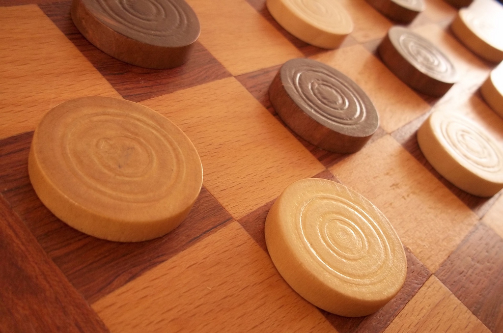

# 人工智慧、機器學習與深度學習間有什麼區別?

 create mode 100644 deep_learning/images/spam_fit.jpg

<em>此為資深科技圈記者</em><em> Michael Copeland </em><em>撰文介紹深度學習基礎系列文章的首篇。</em>

人工智慧是未來科技發展的趨勢。人工智慧是科幻的恣意想像。人工智慧早就存在於我們的日常生活。這些說法都對，端視你指的是人工智慧的哪個特點。 

舉例來說，Google DeepMind 的 AlphaGo 項目今年初擊敗韓國圍棋棋王李世乭時，媒體使用「人工智慧」、「機器學習」與「深度學習」這幾個名詞來描述 DeepMind 的致勝方式，這三者雖皆是 AlphaGo 擊敗李世乭的原因，卻並非指同一件事情，其中各有巧妙不同。 

用同心圓最能簡單說明三者間的關係，最早出現的人工智慧是最大那個圓，接著是後來出現的機器學習，最後是推動目前人工智慧領域出現爆炸性發展的深度學習，則是落在最內一圈。 

<strong>從不景氣走向繁榮 </strong>

1956年達特矛斯會議集合多位電腦科學家誕生出人工智慧領域，人工智慧始終存在我們腦海的想像裡，在實驗室裡醞釀著。數十年間，人工智慧時而被預示為我們的文明最為璀燦的未來，時而被當成不自量力的電腦阿宅們輕率的想法，而被丟到成堆的科技垃圾報裡。平心而論，在2012年前是處在這兩種情況之間。 

在過去幾年裡<a href="https://blogs.nvidia.com/blog/2016/01/12/accelerating-ai-artificial-intelligence-gpus/" target="_blank">人工智慧出現爆炸性成長</a>，尤其是自2015年起，主因之一是 GPUs 日漸普極，使得平行運算的速度更快、成本更低，力量也更強大。無限制的儲存空間和影像、文字、交易、地圖資料等各種數據（整個大數據運動）如洪水般湧出，在這樣連續左右拳猛擊的情況下，同樣也是相關主因之一。 

接著介紹電腦科學家是如何從2012年前人工智慧這個不受重視的領域，發展成為一片欣欣向榮的景象，每天有數百萬人使用這些科學家創造出的應用程式。 

<strong>人工智慧 &nbsp;—&nbsp;&nbsp;機器展現出人類智慧 </strong>

回到 1956 年夏天的那場會議，人工智慧領域先驅們的夢想是藉由新興計算機構建具備等同於人類智力特徵的複雜機器。這就是所謂的「廣義人工智慧（General AI）」的概念，擁有人類的所有感覺（甚至可能更多）、所有理智，並且像人類一樣思考的神奇機器。《星際大戰》裡的 C-3PO、成為人類敵人的終結者，電影已經出現太多這些被我們當做朋友的機器。廣義人工智慧的機器向來有充足的理由出現在電影和科幻小說裡，我們阻止不了這件事，至少目前還做不到。 

那麼我們能做些什麼? 這就到了「狹義人工智慧（Narrow AI）」的概念，這是指在處理特殊任務之際，表現如同人類一樣好，甚至是更好的技術。運用狹義人工智慧的例子有 Pinterest 上的影像分類與 Facebook 的人臉識別。 

這些是應用狹義人工智慧的例子，展現出人類智能的一些面向。但是又如何做到的？那項智能源自於哪裡？接下來我們來看第二個同心圓，也就是機器學習。 

<strong>機器學習&nbsp;—&nbsp;&nbsp;達到人工智慧的方法 </strong>

 <em>清理垃圾郵件：機器學習不斷幫你清理裡收件匣裡的（大部分的）垃圾郵件。</em>

<a href="http://www.nvidia.com.tw/object/machine-learning-tw.html" target="_blank">機器學習</a>最基礎的用法，是通過演算法來分析數據、從中學習，以及判斷或預測現實世界裡的某些事，並非手動編寫帶有特定指令的軟體程序來完成某個特殊任務，而是使用大量的數據和演算法來「訓練」機器，讓它學習如何執行任務。 

  最早提出人工智慧概念的學者們構思出機器學習的概念，多年來也發展出決策樹學習、歸納邏輯編程、叢集、強化學習和貝葉斯網路等演算法，然而這些都沒有達到廣義人工智慧的最終目標，也未實現狹義人工智慧的一小部分目標。 

其實多年來最擅長應用機器學習的領域之一就是<a href="http://www.nvidia.com/object/imaging_comp_vision.html" target="_blank">電腦視覺</a>，不過仍得靠大量人工編碼作業來完成工作。人們會製作人工編碼分類器，像是邊緣檢測過濾器，讓程序可以識別對象的啟止位置、進行形狀檢測以確定是否為八邊形，還有用來識別「S-T-O-P」的分類器。從這些人工編碼分類器中，發展出能理解影像的演算法，「學習」判斷是否這是一個停止標誌。 

這很好，但還不到讓人驚艷的程度，特別是在起霧時無法完全看到標誌的情況下，或者被樹遮住了一部分。太過脆弱又太容易出錯的電腦視覺和影像檢測技術，還達不到與人類媲美的水準，一直要到近期才有重大突破。 

時間和正確的學習演算法改變了一切。 

<strong>深度學習&nbsp;—&nbsp;執行機器學習的技術 </strong>

  驅趕貓兒：從 YouTube 影片裡中挑出貓咪的圖片，是深度學習首次的突破性表現之一 

從早期機器學習又衍生出人工神經網路，這已有幾十年的發展歷史。我們對大腦生物學的理解，也就是所有神經元之間相互連接，成為發展神經網路的靈感。這些人工神經網路的各層、連結和數據傳播方向呈現離散狀態，不像生物大腦中的任何神經元，可以在一定的物理距離內連接其它神經元。 

像是你可以將一個圖像切成一堆碎片，並且輸入到神經網路的第一層，接著第一層的獨立神經元將數據傳遞給第二層，第二層神經元再傳給第三層，一直傳到最後一層並產生出最終結果。 

各神經元對於輸入內容都會分配一個權重，評估與否正確執行任務，並且由權重的加總值來判斷最終產出的結果。以前面那個停止標誌的例子來看，一一分解一個停止標誌圖像的特徵，並且由神經元來「檢查」它的八角形形狀、紅色的消防車、獨特的字母、交通標誌的尺寸，還有它是否有在動作。神經網路的任務是判定它是否為一個停止標誌，這裡產生出了一個「機率向量」，是一項基於權重、經過高度訓練的猜測。在我們的例子裡，系統可能有 86% 的把握，覺得圖像是一個停止標誌，7% 的把握認為是一個限速標誌，5% 的把握認為是一只卡在樹上的風箏，接著網路架構將結果正確與否告訴神經網路。 

這個例子是有點誇張了些，直到近期為止人工智慧研究領域一直都忽視神經網路這一塊。研究人員從最早的人工智慧開始，一直著力於這方面的研究，「智慧」的成果卻不出色。問題在於就算是最基本的神經網路也要使用大量計算資源，這不是一個實際的作法。不過一支由多倫多大學的 Geoffrey Hinton 帶領的異端研究小組持續進行相關研究工作，最終在建置有<a href="http://www.nvidia.com.tw/object/what-is-gpu-computing-tw.html" target="_blank">GPU</a>平行運算的超級電腦上證明了這個概念，實現了他們的承諾。 

我們再回到停止標誌的例子。正在調整或「訓練」網路時，出現大量的錯誤答案，這是一個極佳的機會。網路需要的正是訓練，它需要看到成千上萬，甚至數以百萬計的圖像，直到精確調整神經元的輸入權重，讓它幾乎每次都能得到正確答案，不管有無起霧、天氣是晴是雨。在這方面神經網路已經自己學會停止標誌的外觀；或是在 Facebook 例子裡怎麼辨識媽媽的臉，或者2012年吳恩達在 Google 所製作的貓的圖片。 

吳恩達在研究上的突破在於從根本上使用這些神經網路 並將規模變得龐大，增加了層數和神經元的數量，然後通過系統運行海量數據來訓練它。吳恩達使用了一千萬支 YouTube 影片圖像，將「深度」運用在深度學習裡，而這就描述了這些神經網路裡的所有層。 

目前在一些情景內通過深度學習技術來訓練機器辨識圖像，表現比人類更優秀，從辨識貓咪到確認血液裡的癌症指標，以及磁共振成像掃描中的腫瘤指標。Google 的 AlphaGo 學會了遊戲，並且反覆跟自己比賽來調整神經網路，訓練它進行圍棋比賽。 

<strong>感謝深度學習，為人工智慧創造出一個光明的未來 </strong>

<a href="https://developer.nvidia.com/deep-learning" target="_blank">深度學習</a>開創出眾多機器學習方面的實際應用和全面推廣人工智慧領域&nbsp;，解決了許多任務，看起來有可能實現機器助手的夢想。<a href="http://www.nvidia.com.tw/object/drive-px-tw.html" target="_blank">無人駕駛車</a>、更好的醫療預防服務，甚至是推薦更好看的電影，這些都已實現或在不遠的道路上。人工智慧則是處在當下和未來。有了深度學習，人工智慧甚至能實現我們一直以來在科幻小說裡所想像的狀態。我拿走你的 C-3PO，你則能留著終結者。 

