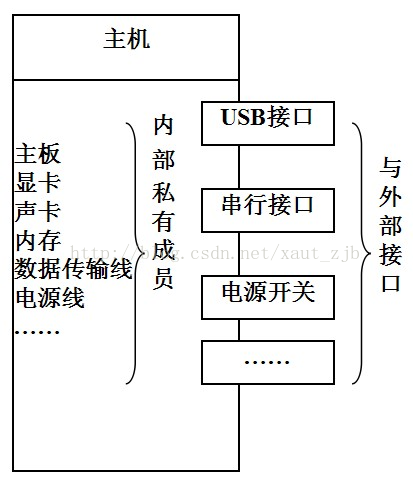

# c++面向对象设计的SOLID原则

SRP The Single Responsibility Principle 单一责任原则

OCP The Open Closed Principle 开放封闭原则

LSP The Liskov Substitution Principle 里氏替换原则

DIP The Dependency Inversion Principle 依赖倒置原则

ISP The Interface Segregation Principle 接口分离原则

 

##单一责任原则： 

当需要修改某个类的时候原因有且只有一个。换句话说就是让一个类只做一种类型责任，当这个类需要承当其他类型的责任的时候，就需要分解这个类。 

##开放封闭原则：

软件实体应该是可扩展，而不可修改的。也就是说，对扩展是开放的，而对修改是封闭的。这个原则是诸多面向对象编程原则中最抽象、最难理解的一个。

##里氏替换原则：

当一个子类的实例应该能够替换任何其超类的实例时，它们之间才具有is-A关系 

##依赖倒置原则：

1、高层模块不应该依赖于低层模块，二者都应该依赖于抽象 

2、抽象不应该依赖于细节，细节应该依赖于抽象 

##接口分离原则： 

不能强迫用户去依赖那些他们不使用的接口。换句话说，使用多个专门的接口比使用单一的总接口总要好。 

 

面向对象的主要进步就是实现了数据的封装和隐藏。从外部看对象就像一个“黑匣子”，数据和方法是隐蔽的、看不见的。当用户使用对象时，不必知道对象的具体实现细节，只需要根据对象提供的外部接口访问对象即可。

封装：是指将对象的数据和与这个数据有关的操作放在一起。各个对象之间相互独立，互不干扰。对象只留少量的接口，以便与外部联系。

封装应具有以下几个特点：

具有一个清楚的边界，私有成员封装在内部，外部不可以访问提供必要的接口

对象内部的数据和方法是受封装外壳保护的，其它对象不能直接使用。

