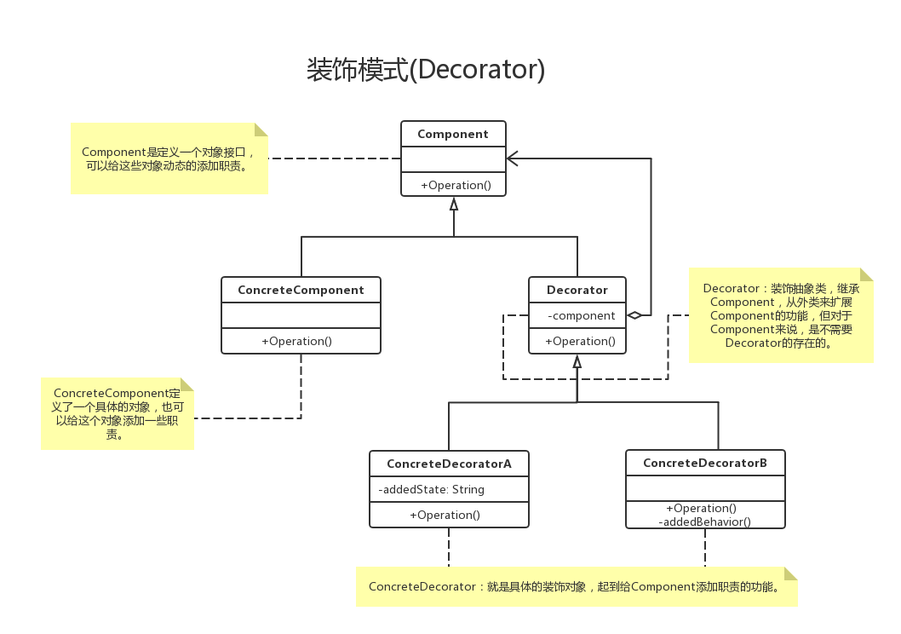

# 装饰者模式

### 一. 基础概念

1. 定义
    - 装饰模式指的是在不必改变原类文件和使用继承的情况下，动态地扩展一个对象的功能。它是通过创建一个包装对象，也就是装饰来包裹真实的对象。


2. 特点
    - 装饰对象和真实对象有相同的接口。这样客户端对象就能以和真实对象相同的方式和装饰对象交互。
    - 装饰对象包含一个真实对象的引用（reference）
    - 装饰对象接受所有来自客户端的请求。它把这些请求转发给真实的对象。
    - 装饰对象可以在转发这些请求以前或以后增加一些附加功能。这样就确保了在运行时，不用修改给定对象的结构就可以在外部增加附加的功能。在面向对象的设计中，通常是通过继承来实现对给定类的功能扩展。

3. 优点
    - Decorator模式与继承关系的目的都是要扩展对象的功能，但是Decorator可以提供比继承更多的灵活性。
    - 通过使用不同的具体装饰类以及这些装饰类的排列组合，设计师可以创造出很多不同行为的组合。

4. 缺点
    - 这种比继承更加灵活机动的特性，也同时意味着更加多的复杂性。
    - 装饰模式会导致设计中出现许多小类，如果过度使用，会使程序变得很复杂。
    - 装饰模式是针对抽象组件（Component）类型编程。但是，如果你要针对具体组件编程时，就应该重新思考你的应用架构，以及装饰者是否合适。当然也可以改变Component接口，增加新的公开的行为，实现“半透明”的装饰者模式。在实际项目中要做出最佳选择。

5. 设计原则
    - 多用组合，少用继承。利用继承设计子类的行为，是在编译时静态决定的，而且所有的子类都会继承到相同的行为。然而，如果能够利用组合的做法扩展对象的行为，就可以在运行时动态地进行扩展。
    - 类应设计的对扩展开放，对修改关闭。

6. 简化
    - 如果只有一个Concrete Component类而没有抽象的Component接口时，可以让Decorator继承Concrete Component。
    - 如果只有一个Concrete Decorator类时，可以将Decorator和Concrete Decorator合并。
    
7. 与其他设计模式区别
    - 关于新职责：适配器也可以在转换时增加新的职责，但主要目的不在此。装饰者模式主要是给被装饰者增加新职责的。
    - 关于原接口：适配器模式是用新接口来调用原接口，原接口对新系统是不可见或者说不可用的。装饰者模式原封不动的使用原接口，系统对装饰的对象也通过原接口来完成使用。（增加新接口的装饰者模式可以认为是其变种--“半透明”装饰者）
    - 关于其包裹的对象：适配器是知道被适配者的详细情况的（就是那个类或那个接口）。装饰者只知道其接口是什么，至于其具体类型（是基类还是其他派生类）只有在运行期间才知道。

8. 应用场景
    - 需要扩展一个类的功能，或给一个类添加附加职责。
    - 需要动态的给一个对象添加功能，这些功能可以再动态的撤销。
    - 需要增加由一些基本功能的排列组合而产生的非常大量的功能，从而使继承关系变的不现实。
    - 当不能采用生成子类的方法进行扩充时。一种情况是，可能有大量独立的扩展，为支持每一种组合将产生大量的子类，使得子类数目呈爆炸性增长。另一种情况可能是因为类定义被隐藏，或类定义不能用于生成子类。
    
### 二. 代码示例

1. 使用装饰模式设计服装搭配系统

- 定义Person类
```
    public class Person {
        /**
         * 姓名
         */
        private String name;
    
        public Person(String name) {
            this.name = name;
        }
    
        public Person() {}
    
        public void show () {
            System.out.print(name);
        }
    
        public String getName() {
            return name;
        }
    
        public void setName(String name) {
            this.name = name;
        }
    }
```

- 定义装饰类, 扩展Person类
```
    /**
     * 装饰类
     */
    public class DressDecorator extends Person {
    
        private Person person;
        
        /**
         * 添加装饰
         * @param person
         */
        public void decorator (Person person) {
            this.person = person;
        }
    
        @Override
        public void show () {
            if (this.person != null) {
                this.person.show();
            }
        }
    
    }
```

- 实现装饰
```
    public class TShirts extends DressDecorator {
    
        @Override
        public void show () {
            System.out.println("T恤");
            super.show();
        }
    }
```

- 测试
```
    public static void main(String[] args) {
        Person person = new Person("K.O");
        BigTrouser trouser = new BigTrouser();
        TShirts tShirts = new TShirts();

        //装饰过程
        trouser.decorator(person);
        tShirts.decorator(trouser);

        tShirts.show();
    }
```