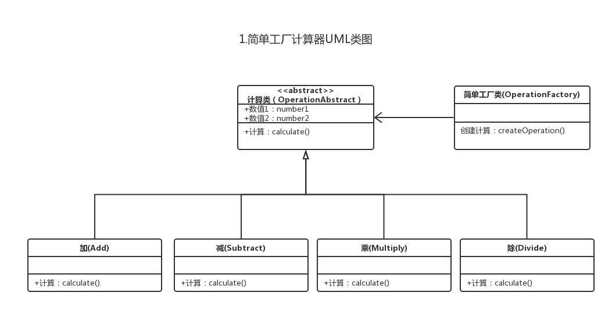

# 简单工厂模式

### 1.概念
- 实例化对象，用工厂方法代替new操作
- 工厂模式包括工厂方法模式和抽象工厂模式
- 抽象工厂模式是工厂方法模式的扩展

### 2.意图
- 定义一个接口来创建对象，但是让子类来决定那些类需要被实例化
- 工厂方法把实例化的工作推迟到子类中去实现

### 3.什么情况适合工厂模式
- 有一组类似的对象需要创建
- 在编码时不能预见需要创建那种类的实例
- 系统需要考虑扩展性，不应依赖于产品类实例如何被创建、组合和表达的细节

### 4.项目中的现状：
- 在软件系统中经常面临着“对象”创建的工作，由于需求的变化，这个对象可能随之也会发生变化，但它却拥有比较稳定的接口
- 我们需要提供一种封装机制来隔离出这个易变对象的变化，从而保持系统中其他依赖，该对象的对象不随着需求的变化而变化

### 5.基于项目现状将代码进行如下设计：
- 尽量松耦合，一个对象的依赖对象的变化与本身无关
- 具体产品与客户端剥离，责任分割

### 6.案例
**1.calculator: 使用简单工厂模式, 创建控制台计算器**



- 创建Calculator抽象类, 添加计算抽象方法, 添加数值属性, get set方法
```
    /**
     * 计算器计算基类
     */
    public abstract class OperationAbstract {
    
        private BigDecimal number1;
    
        private BigDecimal number2;
    
        /**
         * 由子类实现运算规则
         * @return
         */
        public abstract BigDecimal calculate();
    }
```

- 创建加减乘除实现类

```
    /**
     * 加法运算
     */
    public class Add extends OperationAbstract{
    
        @Override
        public BigDecimal calculate() {
            return this.getNumber1().add(this.getNumber2());
        }
    }
    
    /**
     * 减法运算
     */
    public class Subtract extends OperationAbstract {
    
        @Override
        public BigDecimal calculate() {
            return this.getNumber1().subtract(this.getNumber2());
        }
    }
    
    /**
     * 乘法运算
     */
    public class Multiply extends OperationAbstract {
    
        @Override
        public BigDecimal calculate() {
            return this.getNumber1().multiply(this.getNumber2());
        }
    }
    
    /**
     * 除法运算
     */
    public class Divide extends OperationAbstract {
    
        @Override
        public BigDecimal calculate() {
            return this.getNumber1().divide(this.getNumber2());
        }
    }
```

- 创建工厂类

```
    /**
     * 计算机静态工厂类
     */
    public final class OperationFactory {
    
        /**
         * 获取计算
         * @param symbol
         * @return
         */
        public static OperationAbstract createOperation (String symbol) {
            switch (symbol) {
                case SymbolConstants.ADD:
                    return new Add();
                case SymbolConstants.SUBTRACT:
                    return new Subtract();
                case SymbolConstants.MULTIPLY:
                    return new Multiply();
                case SymbolConstants.DIVIDE:
                    return new Divide();
                default:
                    throw new RuntimeException("暂不支持");
            }
        }
    
        private OperationFactory () {}
    }
```

- 测试

```
    public static void main(String[] args) {
    
        do {
            //控制台输入
            Scanner scanner = new Scanner(System.in);

            //输入3次
            BigDecimal number1 = scanner.nextBigDecimal();
            String symbol = scanner.next();
            BigDecimal number2 = scanner.nextBigDecimal();

            //通过静态工厂获取实例
            OperationAbstract operation = OperationFactory.createOperation(symbol);

            //放入计算数据
            operation.setNumber1(number1);
            operation.setNumber2(number2);

            //获取返回
            BigDecimal result = operation.calculate();

            System.out.println(result);

        } while (true);
    }
```