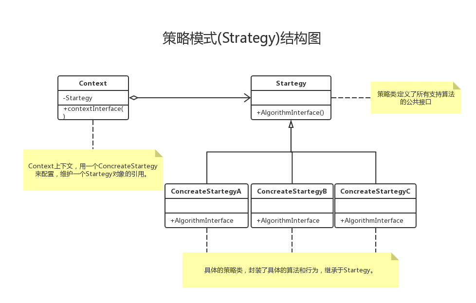
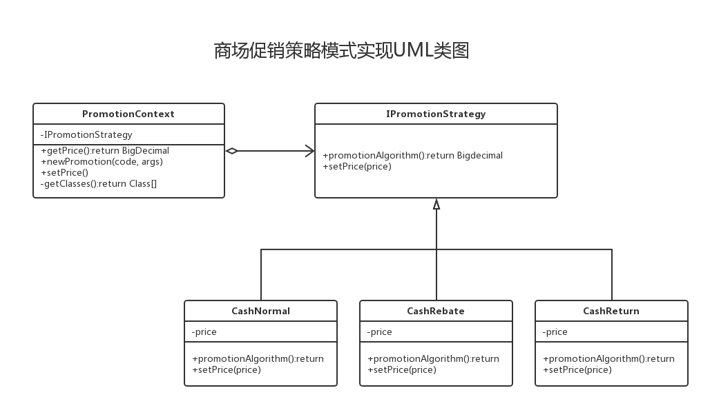

# Strategy-策略模式

## 一. 概念

### 1. 什麼是策略模式

- 從一系列裡抽象出不變的部分
- 策略模式是將可變的部分從程序中抽象分離成算法接口，在該接口下分別封裝一系列算法實現，並使他們可以相互替換，從而導致客戶端程序獨立於算法的改變。

### 2. 策略模式如何實現

**1.繼承-在父類中提供實現方法，子類通過繼承獲得父類中的行為**

- 優點：簡單易用，已有的類可以快速添加父類的方法
- 缺點：不具有靈活性，對未來的變更支持差，需要覆寫子類的方法來提供新的行為

**2.抽象方法-在父類中提供抽象方法，強迫子類實現自己的行為**

- 優點：足夠靈活。
- 缺點：每個子類都要實現一遍代碼，即使相同的行為也不例外，代碼重複，沒有複用的代碼。

**3.組合-策略模式核心**

- 解釋：在類中增加一個私有域，引用另一個已有的類的實例，通過調用引用實例的方法從而獲得新的功能，這種設計稱作組合（複合）。
將行為抽象為接口，在父類中持有該接口，並由該接口代替接口飛行行為
- 優點：
    - 足夠靈活，複用代碼，更易於維護
    - 使用了組合，使架構更加靈活
    - 富有彈性，可以較好的應對變化（開--閉原則）
    - 正好的代碼複用型（相對於繼承）
    - 消除大量的條件語句
- 缺點：
    - 客戶代碼需要了解每個策略實現的細節
    - 增加了對象的數目（維護困難）

**4.注意**
- 繼承是重用代碼的利器，但繼承並不是最好的工具。
- Favor composition over inheritance.(複合優於繼承)


### 3. 策略模式的實現

1. 通過分離變化得出的策略接口Strategy
2. Strategy的實現類
3. 客戶程序中有一個Strategy
4. 在客戶程序中選擇/組裝正確的Strategy實現




### 4. 策略模式總結篇
1. 將一些方法抽象成接口
2. 在基類中實例化接口
3. 設置接口的私有成員變量
4. 在積累中調用接口的同樣方法
5. 這樣實現了代碼的複用
6. 面向接口編程,而不是面向實現編程,多用組合


### 5. 適用場景
1. 許多相關的類僅僅是行為差異
2. 運行時選取不同的算法遍體
3. 通過條件語句在多個分支中選取一

## 二.實例Demo

### 1.使用策略模式實現超市促銷

1. 需求

    - 原價返回
    - 打折
    - 滿減

    
2. 策略類(IPromotionStrategy)定義

```
    /**
     * 促銷策略類
     */
    public interface IPromotionStrategy {
    
        /**
         * 計算邏輯
         */
        BigDecimal promotionAlgorithm();
    
        /**
         * 存入價錢
         * @param price
         */
        void setPrice(BigDecimal price);
    }
```

3. 根據不同情況實現策略類

```
    /**
     * 原價
     */
    public class CashNormal implements IPromotionStrategy{
    
        private BigDecimal price;
    
        @Override
        public BigDecimal promotionAlgorithm() {
            //原價返回
            return this.price;
        }
    
        public void setPrice(BigDecimal price) {
            this.price = price;
        }
    }
    
    
    /**
     * 打折
     */
    public class CashRebate implements IPromotionStrategy {
    
        private BigDecimal price = BigDecimal.ZERO;
    
        private BigDecimal rate;
    
        public CashRebate(BigDecimal rate) {
            this.rate = rate;
        }
    
        @Override
        public BigDecimal promotionAlgorithm() {
            //TODO 打折邏輯實現
        }
    
        public void setPrice(BigDecimal price) {
            this.price = price;
        }
    }
    
    
    /**
     * 滿減
     */
    public class CashReturn implements IPromotionStrategy {
    
        private BigDecimal price;
    
        private BigDecimal minPrice;
    
        private BigDecimal subPrice;
    
        public CashReturn(BigDecimal minPrice, BigDecimal subPrice) {
            this.minPrice = minPrice;
            this.subPrice = subPrice;
        }
    
        @Override
        public BigDecimal promotionAlgorithm() {
            //TODO 滿減邏輯實現
        }
    
        public void setPrice(BigDecimal price) {
            this.price = price;
        }
    }

```

4. 創建打折上下文(PromotionContext), 維護使用促銷模式

```
    public class PromotionContext {
    
        /**
         * 策略實現類包
         */
        private static final String PACKAGE_NAME = "org.ko.strategy.promotion";
    
        /**
         * 組合策略類
         */
        private IPromotionStrategy promotionStrategy;
    
        /**
         * 獲取促銷後價錢
         * @return
         */
        public BigDecimal getPrice () {
            return this.promotionStrategy.promotionAlgorithm();
        }
    
        /**
         * 創建促銷手段
         * @param code 對應促銷模式編碼
         * @param args 對應促銷參數
         */
        public void newPromotion (Integer code, Object... args) {
            //根據促銷模式編碼獲取促銷模式對應類名稱
            String clazz = PromotionType.findClazz(code);
            try {
                //通過反射獲取促銷模式的對象
                this.promotionStrategy = (IPromotionStrategy)Class.forName(PACKAGE_NAME + "." + clazz)
                        .getDeclaredConstructor(getClasses(args)).newInstance(args);
            } catch (InstantiationException e) {
                e.printStackTrace();
            } catch (IllegalAccessException e) {
                e.printStackTrace();
            } catch (InvocationTargetException e) {
                e.printStackTrace();
            } catch (NoSuchMethodException e) {
                e.printStackTrace();
            } catch (ClassNotFoundException e) {
                e.printStackTrace();
            }
        }
    
        /**
         * 設置打折前的價格
         * @param price
         */
        public void setPrice (BigDecimal price) {
            this.promotionStrategy.setPrice(price);
        }
    
        /**
         * 獲取Class
         * @param args
         * @return
         */
        private Class[] getClasses (Object... args) {
            Class[] classes = new Class[args.length];
            for (int i = 0; i < args.length; i ++) {
                classes[i] = args[i].getClass();
            }
            return classes;
        }
    
    }
```
    - 這裡使用反射維護實例對象, 相關知識這裡不再介紹.

5. 創建枚舉維護促銷樣例

```
    /**
     * 促銷手段樣例
     */
    public enum PromotionType {
    
        CashNormal(1, "CashNormal", "原價"),
        CashRebate(2, "CashRebate", "打折"),
        CashReturn(3, "CashReturn", "滿減");
    
        private Integer code;
    
        private String clazz;
    
        private String description;
    
        PromotionType(Integer code, String clazz, String description) {
            this.code = code;
            this.clazz = clazz;
            this.description = description;
        }
    
        /**
         * 通過編碼獲取促銷手段
         * @param code 促銷手段編碼
         * @return
         */
        public static String findClazz(Integer code) {
            for (PromotionType type : PromotionType.values()) {
                if (Objects.equals(code, type.code)) {
                    return type.clazz;
                }
            }
            return null;
        }
    }

```

6. 測試

```
    public static void main(String[] args) {
        //初始化上下文
        PromotionContext context = new PromotionContext();

        //測試無促銷
        context.newPromotion(1);
        context.setPrice(new BigDecimal("200"));
        BigDecimal price = context.getPrice();
        System.out.println(price);

        //測試打折
        context.newPromotion(2, new BigDecimal("0.8"));
        context.setPrice(new BigDecimal("200"));
        price = context.getPrice();
        System.out.println(price);

        //測試滿減
        context.newPromotion(3, new BigDecimal("300"), new BigDecimal("100"));
        context.setPrice(new BigDecimal("200"));
        price = context.getPrice();
        System.out.println(price);
        context.setPrice(new BigDecimal("300"));
        price = context.getPrice();
        System.out.println(price);

    }
```