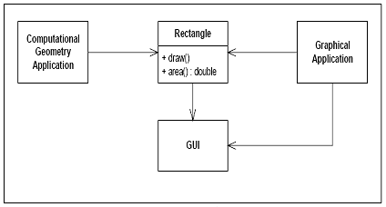

# 物件導向程式設計五大原則：SOLID


前幾天看到一篇非常有趣的文章，因為作者的老婆生產完要回到軟體開發的工作，作者就藉由生活上的比喻讓他瞭解何謂物件導向設計。很推薦大家有空的話可以看一下，作者在文中用很有趣的方式解釋了 SOLID 原則：

##S: Single Responsibility Principle

單一責任原則，一個類別只負責一件事。當然，我們甚至可以把所有的程式都放在同一個原始檔中，但是這樣就會造成耦合度過高，導致維護成本高、可用性低。（就如同我們在前篇文章所提）

來看個例子，在 Rectangle 底下這兩個成員函式都是非常直觀的：畫矩形、算面積。問題出在什麼地方呢？問題就在於 draw() 與 area() 根本就是兩件獨立的事情，即使都與 Rectangle 有關。draw() 只會在圖形化應用被使用，而 area() 則是在地理計算應用中使用。




「但是，draw() 跟 area() 還是分開的啊，至少這作法直觀」，你可能會這樣想，這樣會有什麼缺點呢？

明明不需要的，卻依舊被引用進去了，多出冗餘的程式。
就是因為多出這部份程式，導致修改、編譯、測試都必須考慮到跟實作本身不相干的程式碼。
依照 SRP 原則，比較好的作法是 Rectangle.area() , RectangleUI.draw()。（但請注意，單一責任，而非限制只能單一函式）
##O: Open-Closed Principle

開放（擴充）封閉（修改）原則：Client-Server 系統，如果我們要修改 Server ，甚至替換成另一種伺服器架構（Apache->Lighttpd），就不是這麼單純的，可能 Client 就要做對應的改變，這違反了封閉修改原則。

所以說，比較好的方式，我們應該開放擴充，把 Server 的介面延伸，做出一個抽象介面，讓雙方都依賴這個抽象介面。David Wheeler 說得好：「All problems in computer science can be solved by another level of indirection.」這樣一來，不論雙方做多大的更動，都只要遵循著抽象介面，我可以達到模組化可方便抽換的好處！


##L: Liskov’s Substitution Principle

這是 Liskov 於 1994 年所提出的，原文如下：

Let q(x) be a property provable about objects x of type T. Then q(y) should be provable for objects y of type S where S is a subtype of T.
換句話說，就是子類別必須可以被父類別的所替換，還是有點抽象，看個例子：

可以看到在父類別 Bird 中，沒錯，子類別的鴕鳥跟翠鳥都是屬於鳥綱，但是在我們的設計中，卻認為 Bird 都必須要會飛，所以子類別都繼承了 Fly() 這個函式。導致：

類別階層架構混亂，可能產生不符合預期的行為（Ostrich.Fly() ）。
Unit test 時，父類別通過的測試子類別卻未必可以通過，維護困難。

##I: The Interface Segregation Principle

介面分隔原則：繼續上個例子，如果我們設計 Bird 的介面如下：
問題又來了，鴕鳥並不會飛，但是因為 IBird 是個介面，所以所有的函式都必須被實作：

很多冗餘的程式碼，又提高了耦合度
難以維護、測試
Fat interfaces，可使用的介面太多，反而因為容易混淆而降低可用性
比較好的作法會是如下圖一般，把介面分割出來：

##D: The Dependency Inversion Principle

相依性倒轉原則：試想，如果輪胎破了，你可以想像因為你原廠的輪胎不再產，因此你得整台車換掉的慘況嗎？當然，這不可能發生，同樣的，在軟體設計中，我們不應該讓 High-level module 依賴 Low-level components，而是把這相依關係反向，依賴一個抽象的規格。就如同輪胎一樣，每家車廠設計出來的不可能完全一樣，但是各車廠只要依照輪徑、輪寬等規格設計，輪胎爆了，想換哪家輪胎就完全隨你高興！（Pluggable Nature）


##結論

最後，用簡單的幾句話下個結論：
```
S: 單一類別單一責任、低耦合。
O: 開放擴充、封閉修改。
L: 類別間的相容性。
I: 介面要特定目的、易懂、可再用性高。
D: 抽象化。
```
更多的設計原則

“Composition over Inheritance": This says about favoring composition over inheritance.
“Principle of least knowledge": This says that “the less your class knows, the better".
“The Common Closure principle" : This says that “related classes should be packaged together".
“The Stable Abstractions principle": This says that “the more stable a class is, the more it must consist of abstract classes."