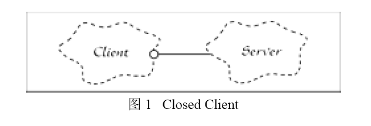
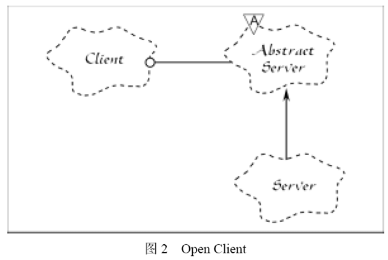

# <总结> 设计模式之 开放封闭原则OCP C++示例


开放封闭原则

系统在添加新的需求的时候能够尽可能做到，只是添加新的代码 open for extension，而不需要修改原有模块代码 closed for modification







通过提取基类的方法，client 调用server 抽象基类abstract server的抽象接口，从而更换不同sever的时候，client的调用server的代码都不需要改动，接口不变，

只是server内容变化。


例子，

一个绘制函数，要求能够针`对输入的不同对象，调用不同的绘制函数`，如能够绘制矩形，圆形，适当调用矩形绘制函数，圆形绘制函数。

###1.用c语言实现

这个例子其实给出了，`c语言模拟c++类继承的方法。利用指针的强制转换`,因为指针仅仅是地址可以指向任何对象，利用指针强制转换，告诉编译器具体按什么对象处理指针所指。


```cpp
/*Procedural Solution to the Square/Circle Problem*/

typedef enum {circle, square} ShapeType;

struct Shape {
    ShapeType itsType;
};

struct Circle {
    ShapeType itsType;
    double itsRadius;
    // Point itsCenter;
};

struct Square {
    ShapeType itsType;
    double itsSide;
    // Point itsTopLeft;
};

void DrawSquare(struct Square* S) {}
void DrawCircle(struct Circle* C) {}

typedef struct Shape *ShapePointer;

void DrawAllShapes(ShapePointer list[], int n)
{
    int i;

    for (i = 0; i < n; i++) {
        struct Shape* s = list[i];

        switch (s->itsType) {
        case square:
            DrawSquare((struct Square*)s);
            break;

        case circle:
            DrawCircle((struct Circle*)s);
            break;
        }
    }
}

int main(int argc, char* argv[])
{

    return 0;
}

```

上面的代码不符合open close法则，因为新加入其它的shape如椭圆， DrawAllShapes函数就需要变化。

###2. C++的实现

```cpp
#include <iostream>
#include <set>
#include <iterator>

using namespace std;

/*OOD solution to Square/Circle problem.*/
class Shape
{
public:
    virtual void Draw() const = 0;
};

class Square : public Shape
{
public:
    virtual void Draw() const;
};

class Circle : public Shape
{
public:
    virtual void Draw() const;
};

void DrawAllShapes(std::set<Shape*>& list)
{
    for (std::set<Shape*>::iterator it = list.begin(); it != list.end(); ++it) {
        (*it)->Draw();
    }
}

int main(int argc, char *argv[])
{
    
    return 0;
}
```


`但是事实上如果有新的需求变化，DrawAllShapes也无法做到完全不变，任何模块只能是相对封闭，无法完全封闭。`

例如我们有新的需求，`要求绘制图形列表的时候，一种形状的图形要在另一种图形前面绘制`。

解决方法，加入` 顺序抽象类`