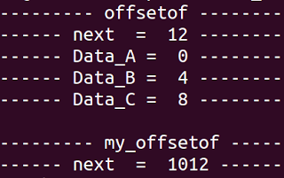

# Linux的container_of 與 offsetof巨集

container_of與offsetof是兩個好用的巨集，因為最近在研究linux kernel的link-list結構才知道這2個東西，但它其實不只在kernel裡也可以在很多地方使用，所以在此做一下紀錄。

##offsetof

offsetof定義在 `<linux/stddef.h>` 中，用來計算某一個struct結構的成員相對於該結構起始位址的偏移量( offset )。(偏移 == 離起始位址有多遠的距離)


```c
/***  TYPE = 結構名稱，MEMBER = 結構成員 ***/
#define offsetof(TYPE, MEMBER)  ((size_t)&((TYPE *)0)->MEMBER)
```

offsetof將數值 0 強制轉型成TYPE指標型別，0 會被當作該TYPE的起始地址，然後再指向某成員 (  (TYPE *) 0 )->MEMBER，就可以得到MEMBER的位址，因為起始位址等於 0，所以MEMBER的位址也就等於MEMBER與起始位址  0 的偏移(offset)。所以若將起始位址 0 改成其它數值的話，得到的偏移(offset)就不對了。

寫個範例來做個簡單的測試：


```c
#include<stdio.h>

#define offsetof(TYPE, MEMBER)   ((size_t) &((TYPE *)0)->MEMBER)
#define my_offsetof(TYPE, MEMBER)  ((size_t) &((TYPE *)1000)->MEMBER)

struct MY_DATA {
    int Data_A , Data_B , Data_C;
    struct MY_DATA* next;
};

int main()
{
    puts("----- offsetof -----");
    printf("---- next  =  %ld-----\n", offsetof(struct MY_DATA, next));
    printf("---- Data_A =  %ld -----\n", offsetof(struct MY_DATA, Data_A));
    printf("---- Data_B =  %ld -----\n", offsetof(struct MY_DATA, Data_B));
    printf("---- Data_C =  %ld -----\n", offsetof(struct MY_DATA, Data_C));

    puts("\n---- my_offsetof----");
    printf("---- next  =  %ld----\n", my_offsetof(struct MY_DATA, next));

	return 0;
}
```

由執行結果可以看出各個成員的偏移量。例如成員next是struct MY_DATA的第四個成員，前面有3個int型別(4bytes)的成員，所以next和結構起始位址隔了12bytes(4bytes*3)的偏移量。

另外，我自己定義一個my_offsetof，起始位址由 ` 0 變成  1000`，可以從結果看出它算出的偏移量多了`1000`。




##container_of

container_of定義在 <linux/kernel.h> 中，它需要引用offsetof巨集，它的作用是用來取得struct結構的起始點，只要知道該結構的任一個成員的位址，就可以使用container_of巨集來算出該結構的起始位址。

