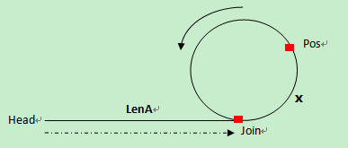

## Linked List Cycle II

Given a linked list, return the node where the cycle begins. If there is no cycle, return null.

Follow up:
Can you solve it without using extra space? 

## Solution

设置两个指针fast、low,fast每次前进2步，slow每次前进1步

如果存在环，则fast必先进入环，而slow后进入环，两个指针必定相遇.否则若fast到达`NULL`，则不存在环。

假设存在环，则两个指针相遇时，slow还没有遍历完，而fast已经在环内循环了n圈`(n >= 1)`.

设slow走了s步，则fast走了2s步，fast还等于s加上在环上多转的圈数，设环长的r，则:



```
s = LenA + x;
2s = nr + LenA + x;
=>
2LenA + 2x = nr + LenA + x
=>
LenA = nr - x

因此：第一次碰撞点Pos到join的距离等于头指针到连接点join的距离

设此时p1 = head, p2 = pos = x; 每次走一步，则当p1到达join点时,
p2 = x + LenA = x + nr -x = nr
即p2也到达了join点，因此p1 与 p2相遇就是join点
```


## 求环的长度

第一次相遇时开始计数，fast和slow继续走，当第二次相遇时，fast比slow多走了一圈，即r的长度

## 求链表长度

求到head到环入口的长度+环的长度

