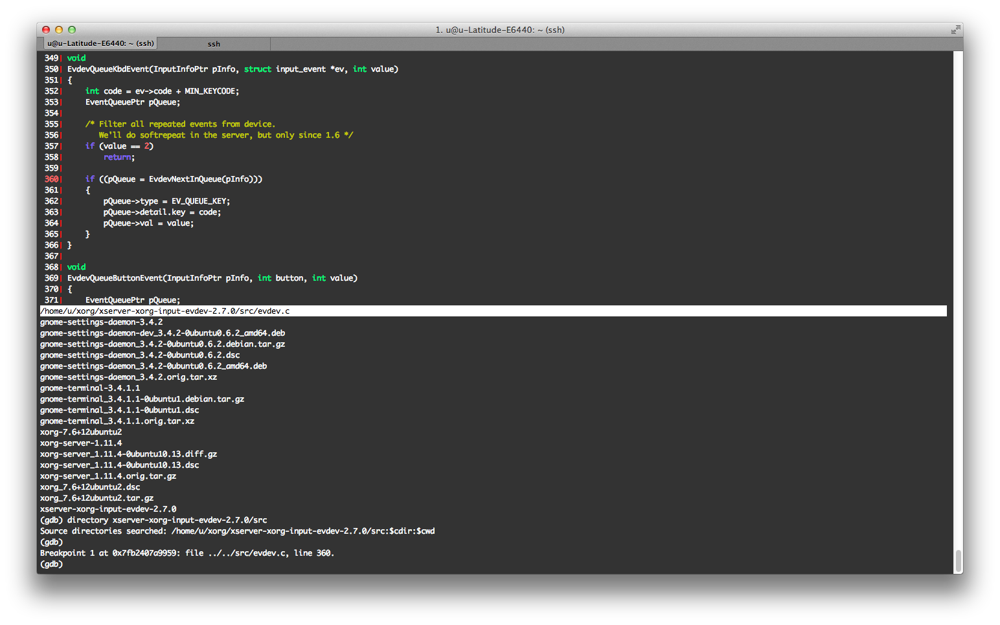

# Debug Xorg with GDB on Ubuntu



在 Ubuntu 上要用 GDB 除錯那些用 apt-get install 安裝的程式十分的容易：1) 安裝 symbols, 2) 打開 GDB。這篇文章以除錯 Xorg 的 evdev 為例，evdev 是 Xorg 的 input driver 之一，它的主要功能是向 Xorg 送出一些鍵盤的按鍵，這篇主要會說明如何用 GDB 在送出 key 之前增加斷點。

實驗環境如下：

```
OS: Ubuntu 12.04 LTS
Kernel: 3.2.0-34-generic #53-Ubuntu
xserver-xorg-core: 2:1.11.4-0ubuntu10.13
xserver-xorg-input-evdev: 1:2.7.0-0ubuntu1.2
```


### 前情提要

本來只是除錯 trackpad (觸碰板）的一些行為，這類的工具很多像是
```
xinput
xev
lsinput
input-event
evtest
```
但是準備要用 input-event and evtest，卻發生 Operation not permit，也沒想到要怎麼解只好開始用 GDB。


### 設定 debug symbol 來源

```
echo "deb http://ddebs.ubuntu.com $(lsb_release -cs) main restricted universe multiverse" | sudo tee -a /etc/apt/sources.list.d/ddebs.list

echo "deb http://ddebs.ubuntu.com $(lsb_release -cs)-updates main restricted universe multiverse
deb http://ddebs.ubuntu.com $(lsb_release -cs)-proposed main restricted universe multiverse" | sudo tee -a /etc/apt/sources.list.d/ddebs.list

sudo apt-key adv --keyserver keyserver.ubuntu.com --recv-keys 428D7C01

sudo apt-get update
```


### 尋找要安裝的 symbol packages

先用 lsof 找到要除錯的 evdev_drv.so 是那支程式在用：

```
sudo lsof /usr/lib/xorg/modules/input/evdev_drv.so
lsof: WARNING: can't stat() fuse.gvfsd-fuse file system /run/user/1000/gvfs
      Output information may be incomplete.
COMMAND  PID USER  FD   TYPE DEVICE SIZE/OFF   NODE NAME
Xorg    1330 root mem    REG    8,2    61432 796073 /usr/lib/xorg/modules/input/evdev_drv.so
```

接著再看看是那個 packages 提供：

```
$ dpkg -S /usr/bin/Xorg
xserver-xorg-core: /usr/bin/Xorg
```

最後就安裝他們的 dbgsym，順便也把 source code 抓下來：
```
$ sudo apt-get install xserver-xorg-core-dbgsym xserver-xorg-input-evdev-dbgsym
$ apt-get source xserver-xorg-core xserver-xorg-input-evdev
```

### 除錯

由於使用 GDB 除錯 Xorg 會造成整個畫面都暫停，請用 ssh 連到 target 再開啟 GDB。

用 cgdb 指定除錯程式及其 PID。正常載入 symbols 應該會有 reading symbols ... done 那行。
```
$ sudo cgdb -- /usr/bin/Xorg `pidof X`
Reading symbols from /usr/lib/xorg/modules/input/evdev_drv.so...Reading symbols from /usr/lib/debug/usr/lib/xorg/modules/input/evdev_drv.so...done.
```
設定源碼路徑
```
(gdb) directory xserver-xorg-input-evdev-2.7.0/src
Source directories searched: /home/u/xorg/xserver-xorg-input-evdev-2.7.0/src:1cdir:1cwd
```
以 cgdb 為例，設完中斷點如下，如上圖：

```
(gdb)
Breakpoint 1 at 0x7fb2407a9959: file ../../src/evdev.c, line 360.
```
針對這個中斷點設定一些 messages，再使其繼續執行。
```
(gdb) commands 1
Type commands for breakpoint(s) 1, one per line.
End with a line saying just "end".
>printf "0x%X, 0x%X", code, value
>c
>end
(gdb) c
```
接著在測試主機上按 asd，就會有如下訊息丟出來。它輸出 2 個數字，第一個是 kernel 回報的 event code，第二個數字應該是 key press/release。

```
Continuing.

Breakpoint 1, EvdevQueueKbdEvent (pInfo=0x7fb2477a0010, ev=0x7fffc5cd0548, value=1) at ../../src/evdev.c:360
0x26, 0x1
Breakpoint 1, EvdevQueueKbdEvent (pInfo=0x7fb2477a0010, ev=0x7fffc5cd0548, value=0) at ../../src/evdev.c:360
0x26, 0x0
Breakpoint 1, EvdevQueueKbdEvent (pInfo=0x7fb2477a0010, ev=0x7fffc5cd0548, value=1) at ../../src/evdev.c:360
0x27, 0x1
Breakpoint 1, EvdevQueueKbdEvent (pInfo=0x7fb2477a0010, ev=0x7fffc5cd0548, value=0) at ../../src/evdev.c:360
0x27, 0x0
Breakpoint 1, EvdevQueueKbdEvent (pInfo=0x7fb2477a0010, ev=0x7fffc5cd0548, value=1) at ../../src/evdev.c:360
0x28, 0x1
Breakpoint 1, EvdevQueueKbdEvent (pInfo=0x7fb2477a0010, ev=0x7fffc5cd0548, value=0) at ../../src/evdev.c:360
0x28, 0x0
```
其中，回報的 event code 可以用 xmodmap 看到列表：
```
$ xmodmap -pke  grep -A 3 ' 38 ='
No protocol specified
keycode  38 = a A a A
keycode  39 = s S s S
keycode  40 = d D d D
keycode  41 = f F f F
```
evtest 也可以，但是要 +8
```
$ sudo evtest /dev/input/event2
Input driver version is 1.0.1
Input device ID: bus 0x3 vendor 0x4ca product 0x4b version 0x110
Input device name: "Lite-On Technology Corp. USB Keyboard"
Supported events:
  Event type 0 (EV_SYN)
  Event type 1 (EV_KEY)
    Event code 1 (KEY_ESC)
    Event code 2 (KEY_1)
    Event code 3 (KEY_2)
    Event code 4 (KEY_3)
    Event code 5 (KEY_4)
    Event code 6 (KEY_5)
    Event code 7 (KEY_6)
    Event code 8 (KEY_7)
    Event code 9 (KEY_8)
    Event code 10 (KEY_9)
    Event code 11 (KEY_0)
    Event code 12 (KEY_MINUS)
    Event code 13 (KEY_EQUAL)
    Event code 14 (KEY_BACKSPACE)
    Event code 15 (KEY_TAB)
    Event code 16 (KEY_Q)
    Event code 17 (KEY_W)
    Event code 18 (KEY_E)
    Event code 19 (KEY_R)
    Event code 20 (KEY_T)
    Event code 21 (KEY_Y)
    Event code 22 (KEY_U)
    Event code 23 (KEY_I)
    Event code 24 (KEY_O)
    Event code 25 (KEY_P)
    Event code 26 (KEY_LEFTBRACE)
    Event code 27 (KEY_RIGHTBRACE)
    Event code 28 (KEY_ENTER)
    Event code 29 (KEY_LEFTCTRL)
    Event code 30 (KEY_A)
vim gdb plugin - pyclewn and dbgsym
```

（8/5 update)

習慣用 debug 可以用 pyclewn 當作介面，參考我之前介紹的文章。

若是需要自己編譯的 deb 也有 dbgysm 的話由[這篇文章提到](http://askubuntu.com/questions/53708/how-to-create-debuginfo-package)，可以 1) 安裝 [pkg-create-dbgsym](https://launchpad.net/ubuntu/+source/pkg-create-dbgsym) 或 2）修改 debian/rules。

###Reference

http://rickey-nctu.blogspot.tw/2013/08/debug-xorg-with-gdb-on-ubuntu.html
