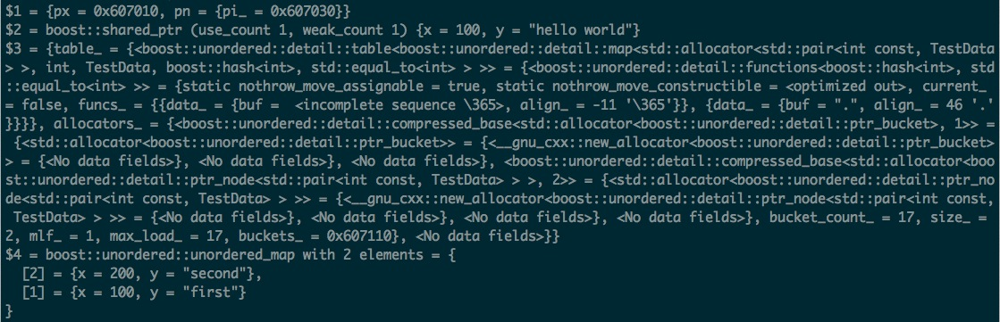

# 調試技巧備忘

##準備工作
為了能讓程序更直觀的被調試，在編譯時應該添加一些選項
- -g: 添加調試選項
- -ggdb3: 調試宏定義


##啟動方式
###不帶參數
```sh
gdb ./a.out
```

###帶參數
```sh
gdb ./a.out
set args -a -b -c any_argument_you_need  
b main  
run  
```

###調試core文件

```sh
gdb bin_name core_name
```

###調試正在運行的程序

大致按如下步驟

```sh
ps axu | grep bin_name ， 獲取進程id
gdb attach pid，啟動gdb
b somewhere，設置斷點
c，繼續運行程序
```

###基本命令
括號裡是命令縮寫，詳細命令介紹見http://www.yolinux.com/TUTORIALS/GDB-Commands.html，這裡只列出常用的


<table>
<thead>
<tr>
<th>命令 </th>
<th> 描述</th>
</tr>
</thead>
<tbody>
<tr>
<td><strong>查看信息</strong></td>
<td></td>
</tr>
<tr>
<td>info break(b)  </td>
<td> 查看斷點</td>
</tr>
<tr>
<td>info threads </td>
<td> 查看線程</td>
</tr>
<tr>
<td>info watchpoints </td>
<td> 查看觀察點</td>
</tr>
<tr>
<td>thread <em>thread-number</em> </td>
<td> 進入某個線程</td>
</tr>
<tr>
<td><strong>刪除信息</strong> </td>
<td></td>
</tr>
<tr>
<td>delete(d) </td>
<td> 刪除所有斷點，觀察點</td>
</tr>
<tr>
<td>delete(d) <em>breakpoint-number</em> <br> delete(d) <em>watchpoint</em></td>
<td> 刪除指定斷點，觀察點</td>
</tr>
<tr>
<td><strong>調試</strong> </td>
<td></td>
</tr>
<tr>
<td>step(s) </td>
<td> 進入函數</td>
</tr>
<tr>
<td>next(n) </td>
<td> 執行一行</td>
</tr>
<tr>
<td>until <em>line-number</em> </td>
<td> 執行到指定行</td>
</tr>
<tr>
<td>continue(c) </td>
<td> 執行到下一個斷點/觀察點</td>
</tr>
<tr>
<td>finish </td>
<td> 執行到函數完成</td>
</tr>
<tr>
<td><strong>堆棧</strong> </td>
<td></td>
</tr>
<tr>
<td>backtrace(bt) </td>
<td> 打印堆棧</td>
</tr>
<tr>
<td>frame(f) <em>number</em> </td>
<td> 查看某一幀</td>
</tr>
<tr>
<td>up/down </td>
<td> 查看上一幀/下一幀</td>
</tr>
<tr>
<td>thread apply all bt </td>
<td> 打印所有線程堆棧信息</td>
</tr>
<tr>
<td><strong>源碼</strong> </td>
<td></td>
</tr>
<tr>
<td>list(l) <br> list <em>function</em> </td>
<td> 查看源碼，函數</td>
</tr>
<tr>
<td>directory(dir) <em>directory-name</em> </td>
<td> 添加源碼搜索路徑</td>
</tr>
<tr>
<td><strong>查看變量</strong> </td>
<td></td>
</tr>
<tr>
<td>print(p) <em>variable-name</em></td>
<td> 打印變量</td>
</tr>
<tr>
<td>p *array-variable@length </td>
<td> 打印數組的前length個變量</td>
</tr>
<tr>
<td>p/<em>format</em> <em>variable-name</em><br><em>format</em>和printf格式近似<br>d: 整數<br>u: 無符號整數<br>c: 字符<br>f: 浮點數<br>x: 十六進制<br>o: 八進制<br>t: 二進制<br>r: raw格式</td>
<td> 按指定格式打印變量，如p/x <em>variable-name</em>代表以十六進制打印變量</td>
</tr>
<tr>
<td>x/nfu <em>address</em><br>nfu為可選的三個參數<br>n代表要打印的數據塊數量<br>f為打印的格式，和p/<em>format</em>中一致<br>u為打印的數據塊大小，有如下選擇<br>b/h/w/g： 單/雙/四/八字節<br>默認為4字節 </td>
<td> 按指定格式查看內存數據，如x/7xh <em>address</em><br>表示從內存地址<em>address</em>開始打印7個雙字節，每個雙字節以十六進制顯示</td>
</tr>
<tr>
<td>ptype variable </td>
<td> 打印變量數據類型</td>
</tr>
<tr>
<td><strong>運行和退出</strong> </td>
<td></td>
</tr>
<tr>
<td>run(r) </td>
<td> 運行程序</td>
</tr>
<tr>
<td>quit(q) </td>
<td> 退出調試</td>
</tr>
<tr>
<td><strong>設置</strong> </td>
<td></td>
</tr>
<tr>
<td>set print pretty on/off</td>
<td> 默認off。格式化結構體的打印</td>
</tr>
<tr>
<td>set print element 0 </td>
<td> 打印完整字符串</td>
</tr>
<tr>
<td>set logging file <em>log-file</em> <br> set logging on/off </td>
<td> 設置日誌文件，默認是gdb.txt<br>打開/關閉日誌</td>
</tr>
</tbody>
</table>


###case說明

####手動加載源代碼
當我們服務器上調試程序時，由於沒有加載源碼路徑而無法查看代碼，此時可以將源碼目錄拷貝到服務器上，然後在gdb調試時通過dir directory-name命令加載源碼，注意，這裡的directory-name一般是程序的makefile所在的路徑

####打印調試信息到日誌文件
有時候需要對打印的信息進行查找分析，這種操作在gdb界面不太方便，可以將內容打印到日誌，然後通過shell腳本處理。先打開日誌調試開關set logging on，然後打印你需要的信息，再關閉開關set logging off，這期間打印的信息就會被寫入gdb.txt文件，如果不想寫入這個文件，可以在打開日誌開關前先設置日誌文件名set logging file log-file


### 可視化調試

gdb自帶TUI（Text User Interface）模式，詳細介紹見https://sourceware.org/gdb/onlinedocs/gdb/TUI.html

基本使用方式如下

- Ctrl-x a：啟動/結束TUI ，啟動TUI還可以使用win命令
- Ctrl-x o：切換激活窗口
- info win：查看窗口
- focus next / prev / src / asm / regs / split：激活指定窗口
- PgUp：在激活窗口上翻
- PgDown：在激活窗口下翻
- Up/Down/Left/Right：在激活窗口上移一行/下移一行/左移一列/右移一列
- layout next / prev：上一個/下一個窗口佈局
- layout src：只展示源碼窗口
- layout asm：只展示彙編窗口
- layout split：展示源碼和彙編窗口
- layout regs：展示寄存器窗口
- winheight name +count/-count：調整窗口高度（慎用，可能會讓屏幕凌亂）

需要注意的是，在cmd窗口上，原本Up/Down是在歷史命令中選擇上一條/下一條命令，若想使用該功能，必須先將焦點轉移到cmd窗口，即執行focus cmd

TUI的窗口一共有4種，src, cmd, asm, regs， 默認是打開src和cmd窗口，可以通過layout選擇不同的窗口佈局。最終的效果圖是這樣的


可以看到上面是代碼區(src)，可以查看當前執行的代碼和斷點信息，當前執行的代碼被高亮顯示，並且在代碼最左邊有一個符號>，設置了斷點的行最左邊的符號是B，下面是命令區（cmd），可以鍵入gdb調試命令

這樣調試的時候

###打印STL和boost數據結構

當我們要查看某種數據結構的變量，如果gdb不認識該數據結構，它會按照p/r variable-name的方式打印數據的原始內容，對於比較複雜的數據結構，比如map類型，我們更關心的是它存儲的元素內容，而不是它的數據結構原始內容，還好gdb7.0提供Python接口可以通過實現Python腳本打印特殊的數據結構，已經有一些開源代碼提供對boost以及STL數據結構的解析

###打印STL數據結構
首先查看系統下是否有/usr/share/gdb/python/libstdcxx目錄，如果有，說明gdb已經自帶對STL數據類型的解析，如果沒有可以自己安裝，詳細介紹見https://sourceware.org/gdb/wiki/STLSupport，這裡簡單說明一下

```sh
svn co svn://gcc.gnu.org/svn/gcc/trunk/libstdc++-v3/python
```

新建~/.gdbinit，鍵入如下內容

```py
python
import sys
sys.path.insert(0, '/home/maude/gdb_printers/python')
from libstdcxx.v6.printers import register_libstdcxx_printers
register_libstdcxx_printers (None)
end
```
其中/home/maude/gdb_printers/python是你實際下載svn代碼的路徑


##打印boost數據結構
souceforge上有現成的boost-gdb-printers，但根據我的試驗發現在打印unordered_map等數據結構時會報錯，因此我做了一些修改並放在github上https://github.com/handy1989/boost-gdb-printers，經測試在boost的1.55和1.58版本下均可用

下載boost-gdb-printers，找到裡面的boost-gdb-printers.py，修改boost.vx_y為實際的版本，並獲取文件絕對路徑，假設為your_dir/boost-gdb-printers.py，在~/.gdbinit裡添加

```sh
source your_dir/boost-gdb-printers.py
```

這時即可打印boost數據結構，我們用以下代碼做一個簡單的測試


```sh
// filename: gdb_test.cpp

#include <stdio.h>
#include <string>
#include <boost/shared_ptr.hpp>
#include <boost/unordered_map.hpp>

using std::map;
using std::string;

struct TestData
{
    int x;
    string y;
};

void break_here()
{
}

int main()
{
    boost::shared_ptr<TestData> shared_x(new TestData());
    shared_x->x = 100;
    shared_x->y = "hello world";

    TestData data1;
    data1.x = 100;
    data1.y = "first";
    TestData data2;
    data2.x = 200;
    data2.y = "second";

    boost::unordered_map<int, TestData> unordered_map_x;
    unordered_map_x[1] = data1;
    unordered_map_x[2] = data2;

    break_here();
    return 0;
}
```
編譯如下

```sh
g++ -g gdb_test.cpp -I/your-boost-include-dir
```

your-boost-include-dir替換為實際的boost頭文件所在路徑，編寫gdb腳本gdb_test.gdb如下

```sh
b break_here
r
fin

p/r shared_x
p shared_x

p/r unordered_map_x
p unordered_map_x

q
y
```
執行gdb ./a.out -x gdb_test.gdb，查看變量的輸出如下



$1和$3分別是shared_ptr和unordered_map數據類型的原始打印格式，$2和$4是加載boost-gdb-printers之後的打印格式

