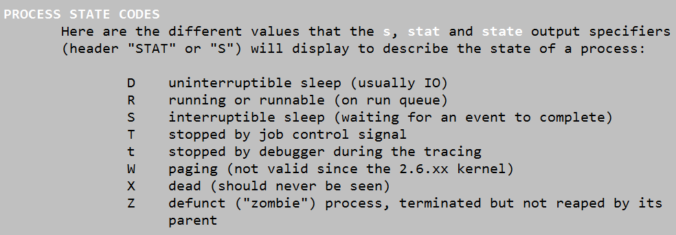
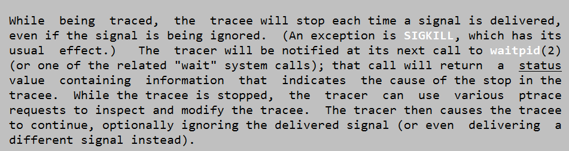
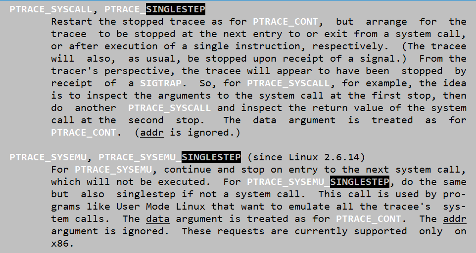

# GDB调试原理 ptrace系统调用


- gdb基本上大家都在用，你有没有想过它的实现原理是什么？为什么它可以控制程序执行、中断、访问内存甚至直接使程序流程改变？

- 在使用gdb调试程序时，程序的进程状态是”T”，但又似乎并非接到了SIGSTOP信号，那么这个”T”是什么呢？


追根溯源，我们今天来研究一下Linux下这个强大的系统调用：ptrace()


首先，linux的进程状态大体分为以下几种：

```sh
D (TASK_UNINTERRUPTIBLE)，不可中断的睡眠状态。
R (TASK_RUNNING)，进程执行中。
S (TASK_INTERRUPTIBLE)，可中断的睡眠状态。
T (TASK_STOPPED)，暂停状态。
t (TASK_TRACED)，进程被追踪。
w (TASK_PAGING)，进程调页中，2.6以上版本的内核中已经被移除。
X (TASK_DEAD – EXIT_DEAD)，退出状态，进程即将被销毁。
Z (TASK_DEAD – EXIT_ZOMBIE)，退出状态，进程成为僵尸进程。
```
 (以上内容来自ps命令的manual手册，原文请看↓)
 
 
 
 
 其中上面的5就是我们要讨论的，gdb调试程序时的t状态，程序被追踪。（关于进程的其他状态请自行百度）。

 

请看ptrace系统调用手册↓
 
 
 
 ptrace的原型可以看到是：

```sh
long ptrace(enum __ptrace_request request, pid_t pid, void *addr, void *data);
```

4个参数的含义分别为：

```sh
enum __ptrace_request request：指示了ptrace要执行的命令。
pid_t pid: 指示ptrace要跟踪的进程。
void *addr: 指示要监控的内存地址。
void *data: 存放读取出的或者要写入的数据。
```

描述译文如下：

ptrace()系统调用提供了一个方法，该方法使一个程序（追踪者）可以观察和控制另外一个程序（被追踪者）的执行，并检查和改变被追踪者的内存及寄存器。它主要用于实现断点调试和追踪系统调用。

被追踪者首先需要被追踪者attach（这个词实在不知道咋翻译了……但是程序员应该都懂@_@）。该行为以及后续操作是线程独立的：在一个多线程的进程中，每一个线程可以被一个独立的（可能是不同的）追踪者attach，或者干脆不理会。因此，被追踪者永远是“一个线程”，而不是一个（可能是多线程的）进程。使用ptrace命令的方法是追踪程序发送如下命令给被追踪程序：

```sh
ptrace(PTRACE_foo, pid, …)
```

pid即linux系统分配的线程号。
 
 
 
 当被追踪时，被追踪线程在接收信号时会被停止，即使那个信号是被忽略的也是如此（SIGKILL除外）。追踪程序会在一个调用waitpid(或者其他类wait系统调用)时收到通知，该调用会返回一个包含被追踪线程停止的原因的状态值。当被追踪线程停止时，追踪程序可以使用多种ptrace请求来检查和编辑被追踪线程。追踪程序可以让被追踪线程继续运行，有选择地忽略发过来的信号（甚至可以发送一个完全不同的信号给被追踪线程）。

 

可以看到，ptrace确实是一个强大的系统调用；gdb就是基于ptrace这个系统调用来做的。其原理是利用ptrace系统调用，在被调试程序和gdb之间建立追踪关系。然后所有发送给被调试程序(被追踪线程)的信号(除SIGKILL)都会被gdb截获，gdb根据截获的信号，查看被调试程序相应的内存地址，并控制被调试的程序继续运行。GDB常用的使用方法有断点设置和单步调试，接下来我们来分析一下他们是如何实现的。

###1.建立调试关系：

用gdb调试程序有2种模式，包括使用gdb启动程序，以及attach到现有进程。分别对应下面2种建立调试关系的方法：

- 1)  `fork:` 利用fork+execve执行被测试的程序，子进程在执行execve之前调用ptrace(PTRACE_TRACEME)，建立了与父进程(debugger)的跟踪关系。

- 2)  `attach:` debugger可以调用ptrace(PTRACE_ATTACH，pid,...)，建立自己与进程号为pid的进程间的跟踪关系。即利用PTRACE_ATTACH，使自己变成被调试程序的父进程(用ps可以看到)。用attach建立起来的跟踪关系，可以调用ptrace(PTRACE_DETACH，pid,...)来解除。注意attach进程时的权限问题，如一个非root权限的进程是不能attach到一个root进程上的。

###2.断点原理：

- 1)    断点的实现原理，就是在指定的位置插入断点指令，当被调试的程序运行到断点的时候，产生SIGTRAP信号。该信号被gdb捕获并进行断点命中判定，当gdb判断出这次SIGTRAP是断点命中之后就会转入等待用户输入进行下一步处理，否则继续。 

- 2)    断点的设置原理: 在程序中设置断点，就是先将该位置的原来的指令保存，然后向该位置写入int 3。当执行到int 3的时候，发生软中断，内核会给子进程发出SIGTRAP信号，当然这个信号会被转发给父进程。然后用保存的指令替换int3,等待恢复运行。

- 3)    断点命中判定:gdb把所有的断点位置都存放在一个链表中，命中判定即把被调试程序当前停止的位置和链表中的断点位置进行比较，看是断点产生的信号，还是无关信号。

- 4)    条件断点的判定:原理同3)，只是恢复断点处的指令后，再多加一步条件判断。若表达式为真，则触发断点。`由于需要判断一次，因此加入条件断点后，不管有没有触发到条件断点，都会影响性能`。在x86平台，某些硬件支持硬件断点，在条件断点处不插入int    3，而是插入一个其他指令，当程序走到这个地址的时候，不发出int 3信号，而是先去比较一下特定寄存器和某个地址的内容，再决定是否发送int 3。`因此，当你的断点的位置会被程序频繁地“路过”时，尽量使用硬件断点，会对提高性能有帮助`。

### 3.单步跟踪原理：

这个最简单，因为ptrace本身支持单步功能，调用ptrace(PTRACE_SINGLESTEP，pid,...)即可，如下图说明：
 
 