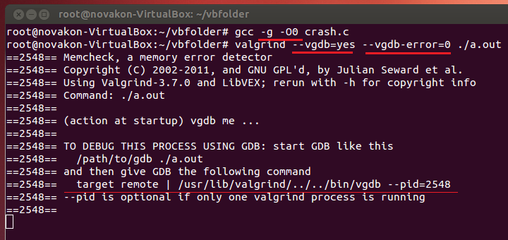
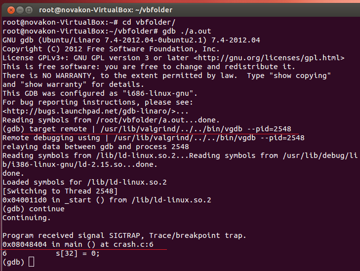

# valgrind + gdb


valgrind 結合 gdb，使 valgrind 偵測到 memory leak/invalid memory access 時自動通知 gdb

### I. 故意寫錯程式

```cpp
/* crash.c */
#include <stdlib.h>
 
int main()
{
    char *s = (char*)malloc(32);
    s[32] = 0;
    return 0;
}
```

### II. 編譯

```sh
gcc -g -O0 crash.c
```

### III. 執行

```
valgrind --vgdb=yes --vgdb-error=0 ./a.out
```



###IV. gdb

```sh
alt+ctrl+t 開啟新 terminal，輸入：
gdb ./a.out
貼上上圖中的 "target remote | ...."
continue
```




上圖可以看到 gdb 停在出錯的那一列，這樣就可以很方便的 debug 了。