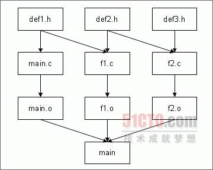

# 深入學習Make命令和Makefile（上）


摘要：make是Linux下的一款程序自動維護工具，配合makefile的使用，就能夠根據程序中模塊的修改情況，自動判斷應該對那些模塊重新編譯，從而保證軟件是由最新的模塊構成。我們將緊緊圍繞make在軟件開發中的應用展開詳細的介紹。

##一、都是源文件太多惹得禍
當我們在開發的程序中涉及眾多源文件時，常常會引起一些問題。首先，如果程序只有兩三個源文件，那麼修改代碼後直接重新編譯全部源文件就行了，但是如果程序的源文件較多，這種簡單的處理方式就有問題了。

設想一下，如果我們只修改了一個源文件，卻要重新編譯所有源文件，那麼這顯然是在浪費時間。其次，要是隻重新編譯那些受影響的文件的話，我們又該如何確定這些文件呢？比如我們使用了多個頭文件，那麼它們會被包含在各個源文件中，修改了某些頭文件後，那些源文件受影響，哪些與此無關呢？如果採取拉網式大檢查的話，可就費勁了。

由此可以看出，源文件多了可真是件讓人頭疼的事。幸運的是，實用程序make可以幫我們解決這兩個問題——當程序的源文件改變後，它能保證所有受影響的文件都將重新編譯，而不受影響的文件則不予編譯，這真是太好了。

##二、Make程序的命令行選項和參數
我們知道，make程序能夠根據程序中各模塊的修改情況，自動判斷應對哪些模塊重新編譯，保證軟件是由最新的模塊構建的。至於檢查哪些模塊，以及如何構建軟件由makefile文件來決定。

雖然make可以在makefile中進行配置，除此之外我們還可以利用make程序的命令行選項對它進行即時配置。Make命令參數的典型序列如下所示：

make [-f makefile文件名][選項][宏定義][目標]
這裡用[]括起來的表示是可選的。命令行選項由破折號“–”指明，後面跟選項，如

```sh
make –e
```
如果需要多個選項，可以只使用一個破折號，如
```sh
make –kr
```
也可以每個選項使用一個破折號，如
```sh
make –k –r
```

甚至混合使用也行，如
```sh
make –e –kr
```

Make命令本身的命令行選項較多，這裡只介紹在開發程序時最為常用的三個，它們是：

`–k`： 如果使用該選項，即使make程序遇到錯誤也會繼續向下運行；如果沒有該選項，在遇到第一個錯誤時make程序馬上就會停止，那麼後面的錯誤情況就不得而知了。我們可以利用這個選項來查出所有有編譯問題的源文件。

`–n`： 該選項使make程序進入非執行模式，也就是說將原來應該執行的命令輸出，而不是執行。

`–f`： 指定作為makefile的文件的名稱。如果不用該選項，那麼make程序首先在當前目錄查找名為makefile的文件，如果沒有找到，它就會轉而查找名為Makefile的文件。如果您在 Linux下使用GNU Make的話，它會首先查找GNUmakefile，之後再搜索makefile和Makefile。按照慣例，許多Linux程序員使用 Makefile，因為這樣能使Makefile出現在目錄中所有以小寫字母命名的文件的前面。所以，最好不要使用GNUmakefile這一名稱，因為它只適用於make程序的GNU版本。

當我們想構建指定目標的時候，比如要生成某個可執行文件，那麼就可以在make命令行中給出該目標的名稱；如果命令行中沒有給出目標的話，make 命令會設法構建makefile中的第一個目標。我們可以利用這一特點，將all作為makefile中的第一個目標，然後將讓目標作為all所依賴的目標，這樣，當命令行中沒有給出目標時，也能確保它會被構建。

##三、Makefile概述
上面提到，make命令對於構建具有多個源文件的程序有很大的幫助。事實上，只有make命令還是不夠的，前面說過還必用須makefile告訴它要做什麼以及怎麼做才行，對於程序開發而言，就是告訴make命令應用程序的組織情況。

我們現在對makefile的位置和數量簡單說一下。一般情況下，makefile會跟項目的源文件放在同一個目錄中。另外，系統中可以有多個 makefile，一般說來一個項目使用一個makefile就可以了；如果項目很大的話，我們就可以考慮將它分成較小的部分，然後用不同的 makefile來管理項目的不同部分。

make命令和Makefile配合使用，能給我們的項目管理帶來極大的便利，除了用於管理源代碼的編譯之外，還用於建立手冊頁，同時還能將應用程序安裝到指定的目錄。

因為Makefile用於描述系統中模塊之間的相互依賴關係，以及產生目標文件所要執行的命令，所以，一個makefile由依賴關係和規則兩部分內容組成。下面分別加以解釋。

依賴關係由一個目標和一組該目標所依賴的源文件組成。這裡所說的目標就是將要創建或更新的文件，最常見的是可執行文件。規則用來說明怎樣使用所依賴得文件來建立目標文件。

當make命令運行時，會讀取makefile來確定要建立的目標文件或其他文件，然後對源文件的日期和時間進行比較，從而決定使用那些規則來創建目標文件。一般情況下，在建立起最終的目標文件之前，肯定免不了要建立一些中間性質的目標文件。這時，Make命令也是使用makefile來確定這些目標文件的創建順序，以及用於它們的規則序列。

##四、makefile中的依賴關係
make程序自動生成和維護通常是可執行模塊或應用程序的目標，目標的狀態取決於它所依賴的那些模塊的狀態。Make的思想是為每一塊模塊都設置一個時間標記，然後根據時間標記和依賴關係來決定哪一些文件需要更新。一旦依賴模塊的狀態改變了，make就會根據時間標記的新舊執行預先定義的一組命令來生成新的目標。

依賴關係規定了最終得到的應用程序跟生成它的各個源文件之間的關係。如下面的圖1描述了可執行文件main對所有的源程序文件及其編譯產生的目標文件之間的依賴關係，見下圖：




就圖1而言，我們可以說可執行程序main依賴於main.o、f1.o和ff1.o。與此同時，main.o依賴於main.c和 def1.h；f1.o依賴於f1.c、def1.h和def2.h；而ff1.o則依賴於ff1.c、def2.h和def3. h。在makefile中，我們可以用目標名稱，加冒號，後跟空格鍵或tab鍵，再加上由空格鍵或tab鍵分隔的一組用於生產目標模塊的文件來描述模塊之間的依賴關係。對於上例來說，可以作以下描述：

```sh
main: main.o f1.o f2.o
main.o: main.c def1.h
f1.o: f1.c def1.h def2.h
f2.o: f2.c def2.h def3.h
```

不難發現，上面的各個源文件跟各模塊之間的關係具有一個明顯的層次結構，如果def2.h發生了變化，那麼就需要更新f1.o和f2.o，而f1.o和f2.o發生了變化的話，那麼main也需要隨之重新構建。

默認時，make程序只更新makefile中的第一個目標，如果希望更新多個目標文件的話，可以使用一個特殊的目標all，假如我們想在一個makefile中更新main和hello這兩個程序文件的話，可以加入下列語句達到這個目的：

```
all: main hello
```

##五、makefile中的規則
除了指明目標和模塊之間的依賴關係之外，makefile還要規定相應的規則來描述如何生成目標，或者說使用哪些命令來根據依賴模塊產生目標。就上例而言，當make程序發現需要重新構建f1.o的時候，該使用哪些命令來完成呢？很遺憾，到目前為止，雖然make知道哪些文件需要更新，但是卻不知道如何進行更新，因為我們還沒有告訴它相應的命令。

當然，我們可以使用命令gcc -c f1.c來完成，不過如果我們需要規定一個include目錄，或者為將來的調試準備符號信息的話，該怎麼辦呢？所有這些，都需要在makefile中用相應規則顯式地指出。

實際上，makefile是以相關行為基本單位的，相關行用來描述目標、模塊及規則（即命令行）三者之間的關係。一個相關行格式通常為：冒號左邊是目標（模塊）名；冒號右邊是目標所依賴的模塊名；緊跟著的規則（即命令行）是由依賴模塊產生目標所使用的命令。相關行的格式為：

```sh
目標：[依賴模塊][;命令]
```

習慣上寫成多行形式，如下所示：

```sh
目標：[依賴模塊]
	命令
	命令
```

需要注意的是，如果相關行寫成一行，“命令”之前用分號“；”隔開，如果分成多行書寫的話，後續的行務必以tab字符為先導。對於makefile而言，空格字符和tab字符是不同的。所有規則所在的行必須以tab鍵開頭，而不是空格鍵。初學者一定對此保持警惕，因為這是新手最容易疏忽的地方，因為幾個空格鍵跟一個tab鍵在肉眼是看不出區別的，但make命令卻能明察秋毫。

此外，如果在makefile文件中的行尾加上空格鍵的話，也會導致make命令運行失敗。所以，大家一定要小心了，免得耽誤許多時間。

##六、Makefile文件舉例
根據圖1的依賴關係，這裡給出了一個完整的makefile文件，這個例子很簡單，由四個相關行組成，我們將其命名為mymakefile1。文件內容如下所示：

```sh
main: main.o f1.o f2.o
	gcc -o main main.o f1.o f2.o
main.o: main.c def1.h
	gcc -c main.c
f1.o: f1.c def1.h def2.h
	gcc -c f1.c
f2.o: f2.c def2.h def3.h
	gcc -c f2.c
```

注意，由於我們這裡沒有使用缺省名makefile 或者Makefile ，所以一定要在make命令行中加上-f選項。如果在沒有任何源碼的目錄下執行命令“make -f Mymakefile1”的話，將收到下面的消息：

```sh
make: *** No rule to make target ‘main.c’, needed by ‘main.o’. Stop.
```

Make命令將makefile中的第一個目標即main作為要構建的文件，所以它會尋找構建該文件所需要的其他模塊，並判斷出必須使用一個稱為 main.c的文件。因為迄今尚未建立該文件，而makefile又不知道如何建立它，所以只好報告錯誤。好了，現在建立這個源文件，為簡單起見，我們讓頭文件為空，創建頭文件的具體命令如下：
```
$ touch def1.h
$ touch def2.h
$ touch def3.h
```

我們將main函數放在main.c文件中，讓它調用function2和function3，但將這兩個函數的定義放在另外兩個源文件中。由於這些源文件含有#include命令，所以它們肯定依賴於所包含的頭文件。如下所示：

```c
/* main.c */
#include “def1.h”
extern void function2();
extern void function3();
int main()
{
	function2();
	function3();
	exit (EXIT_SUCCESS);
}
```

```c
/* f1.c */
#include “def1.h”
#include “def2.h”
void function2() 
{
}
```

```c
/* f2.c */
#include “def2.h”
#include “def3.h”
void function3() 
{
}
```

建好源代碼後，再次運行make程序，看看情況如何：

```sh
$ make -f Mymakefile1
gcc -c main.c
gcc -c f1.c
gcc -c f2.c
gcc -o main main.o f1.o f2.o
$
```

好了，這次順利通過了。這說明Make命令已經正確處理了makefile描述的依賴關係，並確定出了需要建立哪些文件，以及它們的建立順序。雖然我們在makefile 中首先列出的是如何建立main，但是make還是能夠正確的判斷出這些文件的處理順序，並按相應的順序調用規則部分規定的相應命令來創建這些文件。當這些命令執行時，make程序會按照執行情況來顯示這些命令。

如今，我們對def2.h加以變動，來看看makefile能否對此作出相應的迴應：

```sh
$ touch def2.h
```

```sh
$ make -f Mymakefile1
gcc -c f1.c
gcc -c f2.c
gcc -o main main.o f1.o f2.o
$
```

這說明，當Make命令讀取makefile 後，只對受def2.h的變化的影響的模塊進行了必要的更新，注意它的更新順序，它先編譯了C程序，最後連接生產了可執行文件。現在，讓我們來看看刪除目標文件後會發生什麼情況，先執行刪除，命令如下：

```sh
$ rm f1.o
```

然後運行make命令，如下所示：

```sh
$ make -f Mymakefile1
gcc -c f1.c
gcc -o main main.o f1.o f2.o
$
```

很好，make的行為讓我們非常滿意。

##七、makefile中的宏
在makefile中可以使用諸如XLIB、UIL等類似於Shell變量的標識符，這些標識符在makefile中稱為“宏”，它可以代表一些文件名或選項。宏的作用類似於C語言中的define，利用它們來代表某些多處使用而又可能發生變化的內容，可以節省重複修改的工作，還可以避免遺漏。

Make的宏分為兩類，一類是用戶自己定義的宏，一類是系統內部定義的宏。用戶定義的宏必須在makefile或命令行中明確定義，系統定義的宏不由用戶定義。我們首先介紹第一種宏。

這裡是一個包含宏的makefile文件，我們將其命名為mymakefile2，如下所示：

```sh
all: main

# 使用的編譯器
CC = gcc

#包含文件所在目錄
INCLUDE = .

# 在開發過程中使用的選項
CFLAGS = -g -Wall –ansi

# 在發行時使用的選項
# CFLAGS = -O -Wall –ansi

main: main.o f1.o f2.o
	$(CC) -o main main.o f1.o f2.o
main.o: main.c def1.h
	$(CC) -I$(INCLUDE) $(CFLAGS) -c main.c
f1.o: f1.c def1.h def2.h
	$(CC) -I$(INCLUDE) $(CFLAGS) -c f1.c
f2.o: f2.c def2.h def3.h
	$(CC) -I$(INCLUDE) $(CFLAGS) -c f2.c

```

我們看到，在這裡有一些註釋。在makefile中，註釋以#為開頭，至行尾結束。註釋不僅可以幫助別人理解我們的makefile，如果時間久了，有些東西我們自己也會忘掉，它們對makefile的編寫者來說也是很有必要的。

現在言歸正傳，先看一下宏的定義。我們既可以在make命令行中定義宏，也可以在makefile中定義宏。在makefile中定義宏的基本語法是：

宏標識符=值列表
其中，宏標識符即宏的名稱通常全部大寫，但它實際上可以由大、小寫字母、阿拉伯數字和下劃線構成。等號左右的空白符沒有嚴格要求，因為它們最終將被make刪除。至於值列表，既可以是零項，也可以是一項或者多項。如：

```sh
LIST_VALUE = one two three
```

當一個宏定義之後，我們就可以通過\((宏標識符)或者\){宏標識符}來訪問這個標識符所代表的值了。

在makefile中，宏經常用作編譯器的選項。很多時候，處於開發階段的應用程序在編譯時是不用優化的，但是卻需要調試信息；而正式版本的應用程序卻正好相反，沒有調試信息的代碼不僅所佔內存較小，進過優化的代碼運行起來也更快。

對於Mymakefile1來說，它假定所用的編譯器是gcc，不過在其他的UNIX系統上，更常用的編譯器是cc或者c89，而非gcc。如果你想讓自己的makefile適用於不同的UNIX操作系統，或者在一個系統上使用其他種類的編譯器，這時就不得不對這個makefile中的多處進行修改。

但對於mymakefile2來說則不存在這個問題，我們只需修改一處，即宏定義的值就行了。除了在makefile中定義宏的值之外，我們還可以在make命令行中加以定義，如：
```sg
$ make CC=c89
```

當命令行中的宏定義跟makefile中的定義有衝突時，以命令行中的定義為準。當在makefile文件之外使用時，宏定義必須作為單個參數進行傳遞，所以要`避免使用空格`，但是更妥當的方法是`使用引號`，如：
```sh
$ make “CC = c89”
```

這樣就不必擔心空格所引起的問題了。現在讓我們將前面的編譯結果刪掉，來測試一下mymakefile2的工作情況。命令如下所示：

```sh
$ rm *.o main
```

```sh
$ make -f Mymakefile2
gcc -I. -g -Wall -ansi -c main.c
gcc -I. -g -Wall -ansi -c f1.c
gcc -I. -g -Wall -ansi -c f2.c
gcc -o main main.o f1.o f2.o
```
$
就像我們看到的那樣，Make程序會用相應的定義來替換宏引用\((CC)、\)(CFLAGS)和$(INCLUDE)，這跟C語言中的宏的用法比較相似。

上面介紹了用戶定義的宏，現在介紹make的內部宏。常用的內部宏有：

$? ：比目標的修改時間更晚的那些依賴模塊表。 
$@ ：當前目標的全路徑名。可用於用戶定義的目標名的相關行中。 

\(< ：比給定的目標文件時間標記更新的依賴文件名。 \)* ：去掉後綴的當前目標名。例如，若當前目標是pro.o，則$*表示pro。

##八、第一部分小結
我們在上文中分別介紹了make程序的使用方法，makefile中的依賴關係及規則等基礎知識，同時還介紹了一些常用的宏。在下篇文章中，我們會對makefile的高級功能做進一步的介紹。

##九、構建多個目標
有時候，我們想要在一個makefile中生成多個單獨的目標文件，或者將多個命令放在一起，比如，在下面的示例mymakefile3中我們將添加一個clean 選項來清除不需要的目標文件，然後用install選項將生成的應用程序移動到另一個目錄中去。這個makefile跟前面的mymakefile較為相似：

```sh
all: main

# 使用的編譯器
CC = gcc

# 安裝位置
INSTDIR = /usr/local/bin

# include文件所在位置
INCLUDE = .

# 開發過程中所用的選項
CFLAGS = -g -Wall –ansi

# 發行時用的選項
# CFLAGS = -O -Wall –ansi

main: main.o f1.o f2.o
	$(CC) -o main main.o f1.o f2.o
main.o: main.c def1.h
	$(CC) -I$(INCLUDE) $(CFLAGS) -c main.c
f1.o: f1.c def1.h def2.h
	$(CC) -I$(INCLUDE) $(CFLAGS) -c f1.c
f2.o: f2.c def2.h def3.h
	$(CC) -I$(INCLUDE) $(CFLAGS) -c f2.c
clean:
	-rm main.o f1.o f2.o
install: main
	@if [ -d $(INSTDIR) ]; \
	then \
	cp main $(INSTDIR);\
	chmod a+x $(INSTDIR)/main;\
	chmod og-w $(INSTDIR)/main;\
	echo “Installed in $(INSTDIR)“;\
	else \
	echo “Sorry, $(INSTDIR) does not exist”;\
	fi
```

在這個makefile中需要注意的是，雖然這裡有一個特殊的目標all，但是最終還是將main作為目標。因此，如果執行make命令時沒有在命令行中給出一個特定目標的話，仍然會編譯連接main程序。

其次要注意後面的兩個目標：clean和install。目標clean沒有依賴模塊，因為沒有時間標記可供比較，所以它總被執行；它的實際意圖是引出後面的rm命令來刪除某些目標文件。我們看到rm命令以-開頭，這時即使表示make將忽略命令結果，所以即使沒有目標供rm命令刪除而返回錯誤時，make clean依然繼續向下執行。

接下來的目標install依賴於main，所以make知道必須在執行安裝命令前先建立main。用於安裝的指令由一些shell命令組成。

因為make調用shell來執行規則，並且為每條規則生成一個新的shell，所以要用一個shell來執行這些命令的話，必須添加反斜槓，以使所有命令位於同一個邏輯行上。這條命令用@開頭，表示在執行規則前不會向標準輸出打印命令。

為了安裝應用程序，目標install會一條接一條地執行若干命令，並且執行下一個之前，不會檢查上一條命令是否成功。若想只有當前面的命令取得成功時，隨後的命令才得以執行的話，可以在命令中加入&&，如下所示：

```sh
@if [ -d $(INSTDIR) ]; \
then \
cp main $(INSTDIR) &&\
chmod a+x $(INSTDIR)/main && \
chmod og-w $(INSTDIR/main && \
echo “Installed in $(INSTDIR)“ ;\
else \
echo “Sorry, $(INSTDIR) does not exist” ; false ; \
fi
```

這是shell的“與”指令，只有當在前的命令成功時隨後的命令才被執行。這裡不必關心前面命令是否取得成功，只需注意這種用法就可以了。

要想在/usr /local/bin目錄安裝新命令必須具有特權，所以調用make install命令之前，可以讓Makefile使用一個不同的安裝目錄，或者修改該目錄的權限，或切換到root用戶。如下所示：

```sh
$ rm *.o main
```

```sh
$ make -f Mymakefile3
gcc -I. -g -Wall -ansi -c main.c
gcc -I. -g -Wall -ansi -c f1.c
gcc -I. -g -Wall -ansi -c f2.c
gcc -o main main.o f1.o f2.o
```
```
$ make -f Mymakefile3
```
make: Nothing to be done for ‘all’.
```
$ rm main
```
```
$ make -f Mymakefile3 install
```

gcc -o main main.o f1.o f2.o
Installed in /usr/local/bin

```
$ make -f Mymakefile3 clean
```

rm main.o f1.o f2.o
$

讓我們對此作一簡單介紹，首先刪除main和所有目標文件程序，由於將all作為目標，所以make命令會重新編譯main。當我們再次執行 make命令時，由於main是最新的，所以make什麼也不做。之後，我們刪除main程序文件，並執行make install，這會重新建立二進制文件main並將其複製到安裝目錄。最後，運行make clean命令，來刪去所有目標程序。

##十、內部規則
迄今為止，我們已經能夠在makefile中給出相應的規則來指出具體的處理過程。實際上，除了我們顯式給出的規則外，make還具有許多內部規則，這些規則是由預先規定的目標、依賴文件及其命令組成的相關行。在內部規則的幫助下，可以使makefile變得更加簡潔，尤其是在具有許多源文件的時候。現在以實例加以說明，首先建立一個名為foo.c的C程序源文件，文件內容如下所示：

```c
#include <stdio.h>
#include <stdlib.h>
int main()
{
	printf(“Hello World\n”);
	exit(EXIT_SUCCESS);
}
```

現在讓我們用make命令來編譯它：

$ make foo
```sh
cc foo.c -o foo
```

$
您會驚奇地發現，儘管我們沒有指定makefile，但是make仍然能知道如何調用編譯器，並且調用的是cc而不是gcc編譯器。這在Linux 上沒有問題，因為cc常常會鏈接到gcc程序。這完全得益於make內建的內部規則，另外這些內部規則通常使用宏，所以只要為這些宏指定新的值，就可以改變內部規則的默認動作，如下所示：
```sh
$ rm foo
```

```sh
$ make CC=gcc CFLAGS=”-Wall -g” foo
```

gcc -Wall -g foo.c -o foo
$
用 make命令加-p選項後，可以打印出系統缺省定義的內部規則。它們包括系統預定義的宏、以及產生某些種類後綴的文件的內部相關行。內部規則涉及的文件種類很多，它不僅包括C源程序文件及其目標文件，還包括SCCS文件、yacc文件和lex文件，甚至還包括Shell文件。

當然，我們更關心的是如何利用內部規則來簡化makefile，比如讓內部規則來負責生成目標，而只指定依賴關係，這樣makefile就簡潔多了，如下所示：

```sh
main.o: main.c def1.h
f1.o: f1.c def1.h def2.h
f2.o: f2.c def2.h def3.h
```

##十一、後綴規則
前面我們已經看到，有些內部規則會根據文件的後綴（相當於Windows系統中的文件擴展名）來採取相應的處理。換句話說，這樣當make見到帶有一種後綴的文件時，就知道使用哪些規則來建立一個帶有另外一種後綴的文件，最常見的是用以.c結尾的文件來建立以.o結尾的文件，即把源文件編譯成目標程序，但是不連接。

現在舉例說明後綴規則的應用。有時候，我們需要在不同的平臺下編譯源文件，例如Windows和Linux。假設我們的源代碼是C++編寫的，那麼 Windows下其後綴則為.cpp。不過Linux使用的make版本沒有編譯.cpp文件的內部規則，倒是有一個用於.cc的規則，因為在UNIX操作系統中c++文件擴展名通常為.cc。

這時候，要麼為每個源文件單獨指定一條規則，要麼為make建立一條新規則，告訴它如何用.cpp為擴展名的源文件來生成目標文件。如果項目中的源文件較多的話，後綴規則就可以派上用場了。要添加一條新後綴規則，首先在makefile文件中加入一行來告訴make新後綴是什麼；然後就可以添加使用這個新後綴的規則了。這時，make要用到一條專用的語法： .<舊後綴名>.<新後綴名>:

它的作用是定義一條通用規則，用來將帶有舊後綴名的文件變成帶有新後綴名的文件，文件名保持不變，如要將.cpp文件編譯成.o文件，可以使用一個新的通用規則：

```sh
.SUFFIXES: .cpp
.cpp.o:
	$(CC) -xc++ $(CFLAGS) -I$(INCLUDE) -c $<
```

上面的“.cpp .o:”告訴make 這些規則用於把後綴為.cpp的文件轉換成後綴為.o的文件。其中的標誌“-xc++”的作用是告訴gcc這次要編譯的源文件是c++源文件。這裡，我們使用一個宏$＜來通指需要編譯的文件的名稱，不管這些文件名具體是什麼。我們只需知道，所有以.cpp為後綴的文件將被編譯成以.o為後綴的文件，例如以是app.cpp的文件將變成app.o。

注意，我們只跟make說明如何把.cpp文件變成.o文件就行了，至於如何從目標程序文件變成二進制可執行文件，因為make早已知曉，所以就不用我們費心了。所以，當我們調用make程序時，它會使用新規則把類似app.cpp這樣的程序變成app.o，然後使用內部規則將app.o文件連接成一個可執行文件app。

現在，make已經知道如何處理擴展名為.cpp的c++源文件，除此之外，我們還可以通過後綴規則將文件從一種類型轉換為另一種類型。不過，較新版本的make包含一個語法可以達到同樣的效果。例如，模式規則使用%作為匹配文件名的通配符，而不單獨依賴於文件擴展名。以下模式規則相當於上面處理.cpp的規則，具體如下所示：

```sh
%.cpp: %o
	$(CC) -xc++ $(CFLAGS) -I$(INCLUDE) -c $<
```

##十二、用make管理程序庫
一般來說，程序庫也是一種由一組目標程序構成的以.a為擴展名的文件，所以，Make命令也可以用來管理這些程序庫。實際上，為了簡化程序庫的管理，make程序還專門設有一個語法：lib (file.o)，這意味著目標文件file.o以庫文件lib.a的形式存放，這意味著lib.a庫依賴於目標程序file.o。此外，make命令還具有一個內部規則用來管理程序庫，該規則相當於如下內容：

```sh
.c.a:
	$(CC) -c $(CFLAGS) $<
	$(AR) $(ARFLAGS) $@ $*.o
```

其中，宏\((AR)和\)(ARFLAGS)分別表示指令AR和選項rv。如上所見，要告訴make用.c文件生成.a庫，必須用到兩個規則：第一個規則是說把源文件編譯成一個目標程序文件。第二個規則表示使用ar 指令向庫中添加新的目標文件。

所以，如果我們有一個名為filed的庫，其中含有bar.o文件，那麼第一規則中的\(＜會被替換為bar.c；在第二個規則中的\)@被庫名filed.a所替代，而$*將被bar所替代。

下面舉例說明如何用make來管理庫。實際上，用make來管理程序庫的規則是很簡單的。比如，我們可以將前面示例加以修改，讓f1.o和f2.o放在一個稱為mylib.a的程序庫中，這時的Makefile幾乎無需改變，而新的mymakefile4看上去是這樣的：

```sh
all: main

# 使用的編譯器
CC = gcc

# 安裝位置
INSTDIR = /usr/local/bin

# include文件所在位置
INCLUDE = .

# 開發過程中使用的選項
CFLAGS = -g -Wall –ansi

# 用於發行時的選項
# CFLAGS = -O -Wall –ansi

# 本地庫
MYLIB = mylib.a
main: main.o $(MYLIB)
	$(CC) -o main main.o $(MYLIB)
$(MYLIB): $(MYLIB)(f1.o) $(MYLIB)(f2.o)
main.o: main.c def1.h
f1.o: f1.c def1.h def2.h
f2.o: f2.c def2.h def3.h
clean:
	-rm main.o f1.o f2.o $(MYLIB)
install: main
	@if [ -d $(INSTDIR) ]; \
	then \
	cp main $(INSTDIR);\
	chmod a+x $(INSTDIR)/main;\
	chmod og-w $(INSTDIR)/main;\
	echo “Installed in $(INSTDIR)“;\
	else \
	echo “Sorry, $(INSTDIR) does not exist”;\
	fi
```

注意：我們是如何讓省缺規則來替我們完成大部分工作的。如今，我們可以試一下新版的makefile的工作情況：

```sh
$ rm -f main *.o mylib.a
```
```sh
$ make -f Mymakefile4
```

```sh
gcc -g -Wall -ansi -c -o main.o main.c
gcc -g -Wall -ansi -c -o f1.o f1.c
ar rv mylib.a f1.o
a - f1.o
gcc -g -Wall -ansi -c -o f2.o f2.c
ar rv mylib.a f2.o
a - f2.o
gcc -o main main.o mylib.a
```

```sh
$ touch def3.h
```

```sh
$ make -f Mymakefile4
```

```sh
gcc -g -Wall -ansi -c -o f2.o f2.c
ar rv mylib.a f2.o
r - f2.o
gcc -o main main.o mylib.a
```

$
現在對上面的例子做必要的說明。首先刪除全部目標程序文件和程序庫，然後讓make 重新構建main，因為當連接main.o時需要用到庫，所以要先編譯和創建庫。此後，我們還測試f2.o的依賴關係，我們知道如果def3.h發生了改變，那麼必須重新編譯f2.c，事實表明make在重新構建main可執行文件之前，正確地編譯了f2.c並更新了庫。

##十三、Makefile和子目錄
如果你的項目比較大的話，可以考慮將某些文件組成一個庫，然後單獨存放到一個子目錄內。這時，對於makefile有兩種處理方法，下面分別介紹。

第一種方法：在子目錄中放置一個輔助makefile，然後把這個子目錄中的源文件編譯成一個程序庫，最後將這個庫複製到主目錄中。上級目錄中的主要makefile可以放上一個規則，通過調用輔助makefile來建立該庫：

```sh
mylib.a:
	(cd mylibdirectory;$(MAKE))
```

這樣的話，我們就會總是構建mylib.a，因為冒號右邊為空。當make調用該規則構建該庫時，它會切換到子目錄mylibdirectory 中，然後調用一個新的make命令來管理該庫。因為調用了一個新的shell來完成此任務，所以使用makefile 的程序不必進行目錄切換。不過，被調用的shell是在一個不同的目錄中利用該規則構建該庫的，所以括弧能確保所有處理都是由一個shell完成的。

第二種方法：在單個makefile中使用更多的宏，不過這些附加的宏需要在目錄名上加D並且為文件名加上F。例如，可以用下面的命令來覆蓋內建的.c.o後綴規則：

```sh
.c.o:
	$(CC) $(CFLAGS) -c $(@D)/$(
```

為在子目錄編譯文件，並將目標放在子目錄中，可以用像下面這樣的依賴關係和規則來更新當前目錄中的庫：

```sh
mylib.a: mydir/f1.o mydir/f2.o
	ar -rv mylib.a $?
```

上述兩種方法都是可行的，至於使用哪一種，需要根據您的項目的具體情況來決定。

##十四、GNU make和gcc的有關選項
如果您當前正在使用GNU make 和GNU gcc編譯器的話，那麼它們還分別有一個額外的選項可以使用，下面分別加以說明。

我們首先介紹用於make程序的-jN 選項。這個選項允許make同時執行N條命令。這樣的話，就可以將該項目的多個部分單獨進行編譯，make將同時調用多個規則。如果具有許多源文件的話，這樣做能夠節約大量編譯時間。

其次，gcc還有一個-MM選項可用，該選項會為make生成一個依賴關係表。在一個含有大量源文件的項目中，很可能每個源文件都包含一組頭文件，而頭文件有時又會包含其它頭文件，這時正確區分依賴關係就比較難了。這時為了防止遺漏，最笨的方法就是讓每個源文件依賴於所有頭文件，但這顯然沒有必要；另一方面，如果你遺漏一些依賴關係的話，就根本就無法編譯通過。這時，我們就可以用gcc的-MM選項來生成一張依賴關係表，例如：

```sh
$ gcc -MM main.c f1.c f2.c
main.o: main.c def1.h
f1.o: f1.c def1.h def2.h
f2.o: f2.c def2.h def3.h
```

$
這時，Gcc編譯器會掃描所有源文件，並生產一張滿足makefile格式要求的依賴關係表，我們只須將它保存到一個臨時文件內，然後將其插入makefile即可。

##十五、本部分小結
繼上半部分之後，本文又對make和makefile的一些高級應用作了相應的介紹，至此，我們已經對make和makefile在程序開發中的應用有了一個較為全面的認識，希望本文能對讀者的學習和工作有所幫助。

（完）