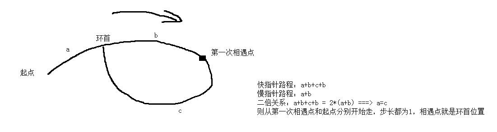

# DS_Algo

##给定单链表，检测是否有环。如果有环，则求出进入环的第一个节点。
判断单向链表是否有环，可以采用快指针与慢指针的方式来解决。即定义一个快指针fast和一个慢指针slow，使得fast每次跳跃两个节点，slow每次跳跃一个节点。如果链表没有环的话，则slow与fast永远不会相遇（这里链表至少有两个节点）；如果有环，则fast与slow将会在环中相遇。
然后获取环的入口点方法如图所示：

##给定两个单链表（链表自身无环），检测两个链表是否有交点，如果有返回第一个交点。
检测两个单链表是否有交点是很容易的，因为如果两个链表有交点，那么这两个链表的最后一个节点必须相同，所以只需比较最后一个节点即可。但是这种方案是无法求出第一个交点的，所以需要另辟蹊径。另外，判断是否有交点可以转换成链表是否有环的问题。让一个链表的最后一个节点指向第二个链表的头结点，这样的话，如果相交，则新的链表是存在环的，并且交点便是环的入口点。

##给定两个单链表（不确定是否带环），判断是否有交点
先判断两个链表是否带环；
　　i).如果两个都不带环，可以用：判断两个无环单链表是否有交点。
　　ii).两个都带环：找到两个入环点r1,r2，环1的入环点为r1，从r1开始遍历一圈，每个结点如r2比较
　 iii).一个带环一个不带环，则肯定不相交。

##给定单链表头结点，删除链表中倒数第k个结点
这个问题的关键是需要获取倒数第k个节点。如何获取呢？这里，需要两个指针p和q，p指向头结点，q指向距离头结点为k的节点。这样p和q每次遍历一个节点，当q遍历到末尾的时候，p指向的节点即为倒数第k个节点，然后删除即可。

##只给定单链表中某个结点p（并非最后一个结点，即p->next!=NULL）指针，删除该结点；
##只给定单链表中某个结点p（非空结点），在p前面插入一个结点。
上诉两种方法的原理都是一样的。
