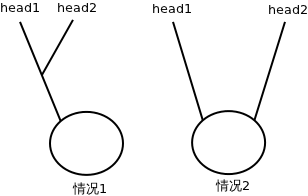

# DS_Algo


這是一道廣為流傳的題目: 編程判斷兩個鏈表是否相交;原題假設“不帶環”，所以只要想通了之後很簡單；但是，若要考慮帶環的情況，那麼要注意的點就很多了。 其實可以把無環和有環的情況全都包括在一個方法實現內解決。

分析

首先，無環的情況；無環是《編程之美》原書裡的題目，很多人都反應說這個題相對書中其它題來講太過於簡單了。也確實，只要在紙上把“所有單向鏈表相交的情況”畫出來很容易就能想通解法了（只要正確理解題意，那麼“兩個無環單向鏈表”畫出來只可能是2條不相干的鏈表或一個”Y”字形） —— 所以，判斷兩個不帶環的鏈表是否相交，只要將兩個鏈表的頭指針都移到鏈表尾，然後比較尾指針地址是否相等就可以了。 如果帶環，個人總結，要明白以下幾點：
 
>1. 無環鏈表和有環鏈表是不可能相交的個
2. 有環鏈表若相交，其“整個環上”的所有node一定都鏈
3. 表的相交，情況只有2種：相交於”環上”或相交於”不是環的部分”,即下圖所示;兩種情況都需要使用“兩個指針的追逐”方法來判斷兩個鏈表的環部分是否相交; 
4. 有關鏈表追逐的考慮: 相對速度、距離、時間要算好，否則很容易漏掉幾種邊界情況;




```c
#include <stdio.h>

// define the node struct of links
typedef struct Node {
    struct Node* next;
} Node;

int is_intersected(Node* p1, Node* p2);

Node* has_circle(Node* head);

int main(int args, char** argv)
{
    Node end1 = { NULL };
    Node end2 = { NULL };
    // 定義幾種鏈表情況
    // two links not intersect with each other, no circle
    Node link_1_n = {
        &(Node)
        {
            &(Node) {
                &(Node) {
                    &(Node) {
                        &(Node) {
                            &(Node) {
                                &(Node) {
                                    &(Node) {
                                        &end1
                                    }
                                }
                            }
                        }
                    }
                }
            }
        }
    };
    Node link_2_n = {
        &(Node)
        {
            &(Node) {
                &(Node) {
                    &(Node) {
                        &(Node) {
                            &(Node) {
                                &(Node) {
                                    &(Node) {
                                        &end2
                                    }
                                }
                            }
                        }
                    }
                }
            }
        }
    };

    // two links intersect with each other, no circle
    Node common_n = { &(Node)
    {
        &(Node) {
            &end1
        }
    }
                    };

    Node link_1_y = { &(Node)
    {
        &(Node) {
            &(Node) {
                &(Node) {
                    &(Node) {
                        &common_n
                    }
                }
            }
        }
    }
                    };
    Node link_2_y = { &(Node)
    {
        &(Node) {
            &(Node) {
                &(Node) {
                    &(Node) {
                        &common_n
                    }
                }
            }
        }
    }
                    };

    // two links, has circle, not intersected.
    Node circle1 = { &(Node)
    {
        &(Node) {
            &(Node) {
                &(Node) {
                    &circle1
                }
            }
        }
    }
                   };
    Node link_c1_n = { &(Node)
    {
        &(Node) {
            &(Node) {
                &(Node) {
                    &circle1
                }
            }
        }
    }
                     };

    Node circle2 = { &(Node)
    {
        &(Node) {
            &(Node) {
                &(Node) {
                    &circle2
                }
            }
        }
    }
                   };
    Node link_c2_n = { &(Node)
    {
        &(Node) {
            &(Node) {
                &(Node) {
                    &circle2
                }
            }
        }
    }
                     };

    // two links, has circle, intersected at a non-circle position
    Node common_c = { &(Node)
    {
        &(Node) {
            &(Node) {
                &(Node) {
                    &common_c
                }
            }
        }
    }
                    };
    Node common_part = { &(Node)
    {
        &common_c
    }
                       };

    Node link_c1_y = { &(Node)
    {
        &(Node) {
            &common_part
        }
    }
                     };
    Node link_c2_y = { &(Node)
    {
        &(Node) {
            &common_part
        }
    }
                     };
    // two links, has common circle, but different 'joint-points'.

    Node jp1 = { NULL };
    Node jp2 = { NULL };
    // 'weave' the joint-points into a circle:
    jp1.next = &(Node) {
        &(Node) {
            &jp2
        }
    };
    jp2.next = &(Node) {
        &jp1
    };

    Node link_c1_y2 = { &(Node)
    {
        &(Node) {
            &(Node) {
                &(Node) {
                    &jp1
                }
            }
        }
    }
                      };
    Node link_c2_y2 = { &(Node)
    {
        &(Node) {
            &(Node) {
                &(Node) {
                    &jp2
                }
            }
        }
    }
                      };

    if (is_intersected(&link_1_n, &link_2_n)) {
        printf("link_1_n and link_2_n Intersected!\n");
    }

    if (is_intersected(&link_1_y, &link_2_y)) {
        printf("link_1_y and link_2_y Intersected!\n");
    }

    if (is_intersected(&link_c1_n, &link_c2_n)) {
        printf("link_c1_n and link_c2_n Intersected!\n");
    }

    if (is_intersected(&link_c1_y, &link_c2_y)) {
        printf("link_c1_y and link_c2_y Intersected!\n");
    }

    if (is_intersected(&link_c1_y2, &link_c2_y2)) {
        printf("link_c1_y2 and link_c2_y2 Intersected!\n");
    }

    return 0;
}

int is_intersected(Node* p1, Node* p2)
{
    Node* has_circle_1 = has_circle(p1);
    Node* has_circle_2 = has_circle(p2);

    if (has_circle_1) {
        if (has_circle_2) {
            Node* pp1 = has_circle_1;
            Node* pp2 = has_circle_2;

            if (pp1 == pp2 || pp1->next == pp2) {
                return 1;
            }

            while (pp1->next != has_circle_1) {
                pp1 = pp1->next;
                pp2 = pp2->next->next;

                if (pp1 == pp2) {
                    return 1;
                }
            }

            return 0;
        } else {
            return 0;
        }
    } else {
        if (has_circle_2) {
            return 0;
        } else {
            while (p1->next) {
                p1 = p1->next;
            }

            while (p2->next) {
                p2 = p2->next;
            }

            return p1 == p2;
        }
    }

    return 0;
}

Node* has_circle(Node* head)
{
    Node* p1;
    Node* p2;
    p1 = p2 = head;

    if (p2->next != NULL) {
        p2 = p2->next;
    } else {
        return NULL;
    }

    while (p2->next != NULL && p2->next->next != NULL) {
        p1 = p1->next;
        p2 = p2->next->next;

        if (p1 == p2) {
            return p1;
        }
    }

    return NULL;
}
```

其中，has_circle方法是判斷一個單向鏈表是否帶環的，基本原理就是設置2個“速度”不同的鏈表，快的去追慢的，追上就是帶環，直到較快指針遇到null還沒追上就是沒有環；假設環包含n個節點，指針p2的”速度”是2，p1的速度是1，相對速度就是1，從相同一點出發的話，p2追上p1至少要n步；若再假設該鏈表除了環的部分外還帶有一個長度為k的“尾巴”，那麼追上的步數最多是n+k;也就是線性時間複雜度內就能完成這個判斷。

這提供了一種很好的判斷是否”環狀”的思路；以前我只寫過“用一個棧來記錄”的方式，弱爆了…(時間複雜度為O(n2))

在has_circle_1和has_circle_2都滿足的時候，也就是說2個鏈表都帶環的時候，要分別取2個環上的一點來玩“追逐遊戲”來判斷是否相交；在這段程序裡是pp1和pp2;然後一個速度為2一個速度為1開始玩“追逐遊戲”，當慢的那個走完環上所有節點時快的那個還沒追上它的話，說明不相交(此時耗費時間n——即環節點數;因為快慢指針的相對速度為1，快指針理應在時間n以內追上慢鏈表，否則不相交)。

##總結

單向鏈表的問題…著實不簡單，可以相當複雜…對於這種關乎“形狀”的問題，在紙上畫一畫會很有幫助。