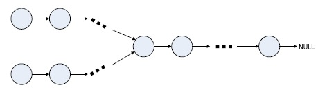

# 面試精選：鏈表問題集錦


鏈表問題在面試過程中也是很重要也很基礎的一部分，鏈表本身很靈活，很考查編程功底，所以是很值得考的地方。我將複習過程中覺得比較好的鏈表問題整理了下。

下面是本文所要用到鏈表節點的定義：


```c
struct Node{
    int data;
    Node* next;
};
```

##1. 在O(1)時間刪除鏈表節點
###題目描述：給定鏈表的頭指針和一個節點指針，在O(1)時間刪除該節點。[Google面試題]

###分析：本題與《編程之美》上的「從無頭單鏈表中刪除節點」類似。主要思想都是「狸貓換太子」，即用下一個節點數據覆蓋要刪除的節點，然後刪除下一個節點。但是如果節點是尾節點時，該方法就行不通了。

代碼如下：

```c
//O(1)時間刪除鏈表節點，從無頭單鏈表中刪除節點
void deleteRandomNode(Node *cur)
{
    assert(cur != NULL);
    assert(cur->next != NULL);    //不能是尾節點
    Node* pNext = cur->next;
    cur->data = pNext->data;
    cur->next = pNext->next;
    delete pNext;
}
```

## 2. 單鏈表的轉置

###題目描述：輸入一個單向鏈表，輸出逆序反轉後的鏈表

###分析：鏈表的轉置是一個很常見、很基礎的數據結構題了，非遞歸的算法很簡單，用三個臨時指針 pre、head、next 在鏈表上循環一遍即可。遞歸算法也是比較簡單的，但是如果思路不清晰估計一時半會兒也寫不出來吧。

下面是循環版本和遞歸版本的鏈表轉置代碼：
```c
//單鏈表的轉置,循環方法
Node* reverseByLoop(Node *head)
{
    if(head == NULL || head->next == NULL)
        return head;
    Node *pre = NULL;
    Node *next = NULL;
    while(head != NULL)
    {
        next = head->next;

        head->next = pre;
        pre = head;
        head = next;
    }
    return pre;
}

//單鏈表的轉置,遞歸方法
Node* reverseByRecursion(Node *head)
{
    //第一個條件是判斷異常，第二個條件是結束判斷
    if(head == NULL || head->next == NULL) 
        return head;

    Node *newHead = reverseByRecursion(head->next);

    head->next->next = head;
    head->next = NULL;

    return newHead;    //返回新鏈表的頭指針
}
```

##3. 求鏈表倒數第k個節點
###題目描述：輸入一個單向鏈表，輸出該鏈表中倒數第k個節點，鏈表的倒數第0個節點為鏈表的尾指針。

###分析：設置兩個指針 p1、p2，首先 p1 和 p2 都指向 head，然後 p2 向前走 k 步，這樣 p1 和 p2 之間就間隔 k 個節點，最後 p1 和 p2 同時向前移動，直至 p2 走到鏈表末尾。

代碼如下：
```c
//倒數第k個節點
Node* theKthNode(Node *head,int k)
{
    if(k < 0) return NULL;    //異常判斷

    Node *slow,*fast;
    slow = fast = head;
    int i = k;
    for(;i>0 && fast!=NULL;i--)
    {
        fast = fast->next;
    }

    if(i > 0)    return NULL;    //考慮k大於鏈表長度的case

    while(fast != NULL)
    {
        slow = slow->next;
        fast = fast->next;
    }

    return slow;
}
```

##4. 求鏈表的中間節點
###題目描述：求鏈表的中間節點，如果鏈表的長度為偶數，返回中間兩個節點的任意一個，若為奇數，則返回中間節點。

###分析：此題的解決思路和第3題「求鏈表的倒數第 k 個節點」很相似。可以先求鏈表的長度，然後計算出中間節點所在鏈表順序的位置。但是如果要求只能掃瞄一遍鏈表，如何解決呢？最高效的解法和第3題一樣，通過兩個指針來完成。用兩個指針從鏈表頭節點開始，一個指針每次向後移動兩步，一個每次移動一步，直到快指針移到到尾節點，那麼慢指針即是所求。

代碼如下：

```c
//求鏈表的中間節點
Node* theMiddleNode(Node *head)
{
    if(head == NULL)
        return NULL;
    Node *slow,*fast;
    slow = fast = head;
    //如果要求在鏈表長度為偶數的情況下，返回中間兩個節點的第一個，可以用下面的循環條件
    //while(fast && fast->next != NULL && fast->next->next != NULL)  
    while(fast != NULL && fast->next != NULL)
    {
        fast = fast->next->next;
        slow = slow->next;
    }
    return slow;
}
```


##5. 判斷單鏈表是否存在環
###題目描述：輸入一個單向鏈表，判斷鏈表是否有環？

###分析：通過兩個指針，分別從鏈表的頭節點出發，一個每次向後移動一步，另一個移動兩步，兩個指針移動速度不一樣，如果存在環，那麼兩個指針一定會在環裡相遇。

代碼如下：
```c
//判斷單鏈表是否存在環,參數circleNode是環內節點，後面的題目會用到
bool hasCircle(Node *head,Node *&circleNode)
{
    Node *slow,*fast;
    slow = fast = head;
    while(fast != NULL && fast->next != NULL)
    {
        fast = fast->next->next;
        slow = slow->next;
        if(fast == slow)
        {
            circleNode = fast;
            return true;
        }
    }

    return false;
}
```
##6. 找到環的入口點
###題目描述：輸入一個單向鏈表，判斷鏈表是否有環。如果鏈表存在環，如何找到環的入口點？

###解題思路： 由上題可知，按照 p2 每次兩步，p1 每次一步的方式走，發現 p2 和 p1 重合，確定了單向鏈表有環路了。接下來，讓p2回到鏈表的頭部，重新走，每次步長不是走2了，而是走1，那麼當 p1 和 p2 再次相遇的時候，就是環路的入口了。

為什麼？：假定起點到環入口點的距離為 a，p1 和 p2 的相交點M與環入口點的距離為b，環路的周長為L，當 p1 和 p2 第一次相遇的時候，假定 p1 走了 n 步。那麼有：

p1走的路徑： a+b ＝ n；
p2走的路徑： a+b+k*L = 2*n； p2 比 p1 多走了k圈環路，總路程是p1的2倍

根據上述公式可以得到 k*L=a+b=n顯然，如果從相遇點M開始，p1 再走 n 步的話，還可以再回到相遇點，同時p2從頭開始走的話，經過n步，也會達到相遇點M。

顯然在這個步驟當中 p1 和 p2 只有前 a 步走的路徑不同，所以當 p1 和 p2 再次重合的時候，必然是在鏈表的環路入口點上。

```c
代碼如下：

//找到環的入口點
Node* findLoopPort(Node *head)
{
    //如果head為空，或者為單結點，則不存在環
    if(head == NULL || head->next == NULL) return NULL;

    Node *slow,*fast;
    slow = fast = head;

    //先判斷是否存在環
    while(fast != NULL && fast->next != NULL)
    {
        fast = fast->next->next;
        slow = slow->next;
        if(fast == slow)
            break;
    }

    if(fast != slow) return NULL;    //不存在環

    fast = head;                //快指針從頭開始走，步長變為1
    while(fast != slow)            //兩者相遇即為入口點
    {
        fast = fast->next;
        slow = slow->next;
    }

    return fast;
}
```

##7. 編程判斷兩個鏈表是否相交
題目描述：給出兩個單向鏈表的頭指針（如下圖所示），



比如h1、h2，判斷這兩個鏈表是否相交。這裡為了簡化問題，我們假設兩個鏈表均不帶環。

##解題思路：

>1. 直接循環判斷第一個鏈表的每個節點是否在第二個鏈表中。但，這種方法的時間複雜度為O(Length(h1) * Length(h2))。顯然，我們得找到一種更為有效的方法，至少不能是O（N^2）的複雜度。

> 2. 針對第一個鏈表直接構造hash表，然後查詢hash表，判斷第二個鏈表的每個節點是否在hash表出現，如果所有的第二個鏈表的節點都能在hash表中找到，即說明第二個鏈表與第一個鏈表有相同的節點。時間複雜度為為線性：O(Length(h1) + Length(h2))，同時為了存儲第一個鏈表的所有節點，空間複雜度為O(Length(h1))。是否還有更好的方法呢，既能夠以線性時間複雜度解決問題，又能減少存儲空間？

> 3. 轉換為環的問題。把第二個鏈表接在第一個鏈表後面，如果得到的鏈表有環，則說明兩個鏈表相交。如何判斷有環的問題上面已經討論過了，但這裡有更簡單的方法。因為如果有環，則第二個鏈表的表頭一定也在環上，即第二個鏈表會構成一個循環鏈表，我們只需要遍歷第二個鏈表，看是否會回到起始點就可以判斷出來。這個方法的時間複雜度是線性的，空間是常熟。

> 4. 進一步考慮「如果兩個沒有環的鏈表相交於某一節點，那麼在這個節點之後的所有節點都是兩個鏈表共有的」這個特點，我們可以知道，如果它們相交，則最後一個節點一定是共有的。而我們很容易能得到鏈表的最後一個節點，所以這成了我們簡化解法的一個主要突破口。那麼，我們只要判斷兩個鏈表的尾指針是否相等。相等，則鏈表相交；否則，鏈表不相交。
所以，先遍歷第一個鏈表，記住最後一個節點。然後遍歷第二個鏈表，到最後一個節點時和第一個鏈表的最後一個節點做比較，如果相同，則相交，否則，不相交。這樣我們就得到了一個時間複雜度，它為O((Length(h1) + Length(h2))，而且只用了一個額外的指針來存儲最後一個節點。這個方法時間複雜度為線性O(N)，空間複雜度為O(1)，顯然比解法三更勝一籌。

解法四的代碼如下：


```c
//判斷兩個鏈表是否相交
bool isIntersect(Node *h1,Node *h2)
{
    if(h1 == NULL || h2 == NULL) return false;    //異常判斷
    while(h1->next != NULL)
    {
        h1 = h1->next;
    }

    while(h2->next != NULL)
    {
        h2 = h2->next;
    }

    if(h1 == h2) return true;        //尾節點是否相同
    else return false;
}

```

##8. 擴展：鏈表有環，如何判斷相交
###題目描述：上面的問題都是針對鏈表無環的，那麼如果現在，鏈表是有環的呢?上面的方法還同樣有效麼?

###分析：如果有環且兩個鏈表相交，則兩個鏈表都有共同一個環，即環上的任意一個節點都存在於兩個鏈表上。因此，就可以判斷一鏈表上倆指針相遇的那個節點，在不在另一條鏈表上。

代碼如下：

```c
//判斷兩個帶環鏈表是否相交
bool isIntersectWithLoop(Node *h1,Node *h2)
{
    Node *circleNode1,*circleNode2;
    if(!hasCircle(h1,circleNode1))    //判斷鏈錶帶不帶環，並保存環內節點
        return false;                //不帶環，異常退出
    if(!hasCircle(h2,circleNode2))
        return false;

    Node *temp = circleNode2->next;
    while(temp != circleNode2)
    {
        if(temp == circleNode1)
            return true;
        temp = temp->next;
    }
    return false;
}
```
##9. 擴展：兩鏈表相交的第一個公共節點
###題目描述：如果兩個無環單鏈表相交，怎麼求出他們相交的第一個節點呢？

###分析：採用對齊的思想。計算兩個鏈表的長度 L1 , L2，分別用兩個指針 p1 , p2 指向兩個鏈表的頭，然後將較長鏈表的 p1（假設為 p1）向後移動L2 - L1個節點，然後再同時向後移動p1 , p2，直到 p1 = p2。相遇的點就是相交的第一個節點。

代碼如下：

```c
//求兩鏈表相交的第一個公共節點
Node* findIntersectNode(Node *h1,Node *h2)
{
    int len1 = listLength(h1);          //求鏈表長度
    int len2 = listLength(h2);
    //對齊兩個鏈表
    if(len1 > len2)
    {
        for(int i=0;i<len1-len2;i++)
            h1=h1->next;
    }
    else 
    {
        for(int i=0;i<len2-len1;i++)
            h2=h2->next;
    }

    while(h1 != NULL)
    {
        if(h1 == h2)
            return h1;
        h1 = h1->next;
        h2 = h2->next;    
    }
    return NULL;
}
```
##10. 總結
可以發現，在鏈表的問題中，通過兩個的指針來提高效率是很值得考慮的一個解決方案，所以一定要記住這種解題思路。記住幾種典型的鏈表問題解決方案，很多類似的題目都可以轉換到熟悉的問題再解決。

##參考文獻
- 程序員編程藝術：第九章、閒話鏈表追趕問題
- 判斷單鏈表是否存在環，判斷兩個鏈表是否相交問題詳解
- 面試算法之鏈表操作集錦
