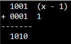
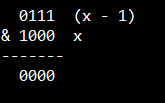
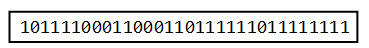
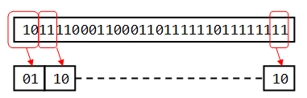
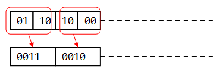
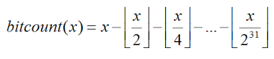
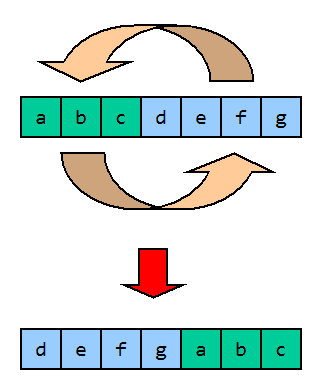

# 面試經驗談 - C 語言篇


年紀一把還要被人確認 C 語言程度實在蠻冏的，不過兩個月沒 coding，程度真的有點下降(拜某幸福企業所賜)，只好再進牛棚熱身一下

這邊揀選的題目，是這1、2個月碰到出現率偏高的題目。這些題目相信很多人都看過了，但這邊不但列出所有的解法，而且還附上大量參考資料，夠有誠意吧？

##問題 1: 無號整數裡位元 == 1 的個數

###解法 1
最基本的解法，沒什麼可以多說的，除非你對 C 語言位移運算很生疏

```c
int bitcount(unsigned int x)
{
    int count, i;
     
    for(i = 0, count = 0; i < 32; ++i)
        if((1<<i) & x)
            ++count;
         
    return count;
}
```

### 解法 2

```c
int bitcount(unsigned int x)
{
    int count;
 
    for(count = 0; x != 0; x &= x - 1)
        ++count;
 
    return count;
}
```

###解法 2 

出自 The C Abswer Book 2nd，也就是 K&R C 2nd 習題 2-9 的解答。這個解法的原理利用最右邊的 bit - 1 時產生的位元變化。首先我們知道：

x = (x - 1) + 1

這邊假設 x 是個只有 4bits 長度的無號整數，x = 1010b：



這代表 x - 1 後，最右端為 0 的位元 0 變 1，最右端為 1 的位元變成 0，則

x &= x - 1 -> x = 1010 & 1001 = 1000

可以清除 x  最右端為 1 的位元。由上面的例子得到 x &= x - 1 得到
x = 1000b，這時候再進行一次 x &= x - 1 效果會更明顯：



按照這個路數，worst case 就是 x 的位元全部等於 1 的情形，但平均起來還是快過解法 1。

###解法 3

解法 3 的思路是這樣，首先，假設我們有一個 32bits unsigned int x，x 內容以二進製表示如下：




然後我們把位元倆倆一組，也就是除以 2 分成 16 組，每一組有 2 bits，如果把這兩個 bit 相加，那就可以得到這一組 bit = 1 的個數。我們知道兩個 bit = 1，相加的極大值就是 2，這個和剛好可以放在這 2 bits 裡：



以這個思路再繼續下去，這次分成 8 組(16 / 2 = 8)，每一組有 4 bits，每一組左半部與右半部相加極大值為 4，也就是需要用 3 bits 表示，但每一組空間有 4bits，可見得綽綽有餘：



以此類推，最後 x 就會等於 x 中 bit = 1 的個數，需要的運算的次數為 log(32) = 5，說穿了這個技巧就是 divide and conquer。C 語言範例如下：

```c
int bitcount(unsigned int x)
{
    x = (x & 0x55555555) + ((x>>1) & 0x55555555);
    x = (x & 0x33333333) + ((x>>2) & 0x33333333);
    x = (x & 0x0F0F0F0F) + ((x>>4) & 0x0F0F0F0F);
    x = (x & 0x00FF00FF) + ((x>>8) & 0x00FF00FF);
    x = (x & 0x0000FFFF) + ((x>>16) & 0x0000FFFF);
    return x;
}
```

甚至還可以再進一步簡化： 


```c
int bitcount(unsigned int x)
{
    x = x - ((x>>1) & 0x55555555);
    x = (x & 0x33333333) + ((x>>2) & 0x33333333);
    x = (x + (x>>4)) & 0x0F0F0F0F;
    x = x + (x>>8);
    x = x + (x>>16);
    return (x & 0x0000003F);
}
```

Line#3 運用了下列公式的前兩項：




其餘部份則是應用了進行位移之後與原數相加會不會造成 每組發生 overflow？以 Line#5 來說，4bits 與 4bits 相加，每個 4bits 裡最大為 4，相加最大為 8，所以不會造成 overflow，可以放心進行省略。

解法 3 取自 Hacker's Delight Chapter 5，事實上筆者不建議面試時用這種解法，因為如此炫技的解法，八成會讓不少主管窮追猛打，正所謂作人張揚，木秀於林風必摧之。建議先用解法 1，如果主管追問有沒有更好的作法再慢慢秀出 2 跟 3，敵不動我不動，積蓄力量，後發制人。


##如何檢查 linked list 是否存在循環？

筆者最早是在 Expert C Programming 附錄 A 看到這個題目，有興趣的朋友請可以找這本書來看，這邊整理出一些摘要分享給大家：

###解法 1
對訪問過的每個元素做標記，直到碰到已經被標記過的元素代表存在循環。

###解法 2
把每個訪問過的元素位址存在一個陣列中，每次訪問下一個元素就檢查是否出現在這個陣列中。

###解法 3
如果面試官說沒有足夠空間放解法 2 的陣列，那訪問第 n 個元素時就往前檢查 n - 1  個元素。

旋轉一維陣列

簡單來說，就是把陣列分為 a b 兩個部份，a 與 b 交換，得到 b a：




對這一題解法有興趣的朋友可以參考 Programmng Pearls 2nd 專欄 2，大概沒有人可以解釋的比 Jon Bentley 更好了。筆者 n 年前也寫過一篇相關文章，這邊就不重複了。


##陷阱題

丟出一段有問題的程式碼，要你把問題找出來。不為何讓我想起有人說過上個世紀是把人訓練成機器，這個世紀是把機器訓練成人，當然你不可以寫  "Do you know cppcheck/oclint/pc-lint/valgrind?"，這樣是不會有分數的。

在已經停刊的 RUN!PC 裡有一期王國榮先生有專門做過這個主題。還有一本 WRITING SOLID CODE(中文版: 如何撰寫零錯誤程式，已絕版)也可以找來看看。

這邊推薦一本小冊子 The C Puzzle Book，這本書每一章都是針對 C 某個語法列出一些題目，然後問你輸出是什麼？或者是調整程式的結構，解答非常詳盡。個人認為這本練完也算有小成了，裡面的題目 C 語言初學者來說頗有難度。如果你很想很想去某間必考 C 語言的公司上班，你沒學過 C 語言，這本苦練半個月應該可以提高錄取的機率，不過講到這裡筆者不禁想起最近常讀的一本書「康乃爾最經典的邏輯思考課(HOW WE KNOW WHAT ISN'T SO)」，裡面有提到一則「錯誤共識效應」，指高估他人跟自己具有相同認知與喜好的程度，所以也別過度想像，LinkedIn 老闆講過，員工最好把上班當成軍隊服役。


##另類想法

「人多的地方不要去」，或許脫穎而出的方式就是去學一門比較沒那麼熱門的語言，比方說 Go，事實上有些公司正苦於找不到會 Go 的人退而求其次找 C/C++，如果您年紀尚輕可以壓寶看看，也許是片新藍海喔！