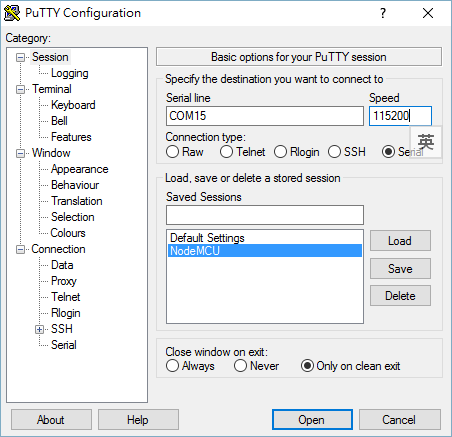

# 在 NODEMCU 上執行 MICROPYTHON


市面有不同 8266 開發板, 我試了

Arduino UNO R3 ESP8266 Web Sever串口WiFi擴展板shiled(ESP-13)
NodeMcu Lua v2 (2版) WIFI 物聯網開發板
第二個開發板燒錄比較方便, 不需要另外按其它的 button 即可進行燒錄.

要使用 NodeMcu 必須安裝  CP210x USB to UART Bridge Virtual COM Port (VCP) drivers, 裝完 driver 將NodeMCU 插上USB, 應該可以在裝置管理員看到新增了一個COM port

cp210x-usb-2-uart-bridge

在 Python 的環境下要燒錄 MicroPython 的 firmware 需要使用到 epstool. 在安裝 esptool 之前要先將它使用到的程式環境安裝好. 有以下三項:

- Python 2.7 – esptool 目前只能執行在 Python 2.7 的環境, 我是安裝 miniconda 的套件.
- PySerial Library –  建議是在一個 virtual environment 下利用 pip install pyserial 來安裝.
- Git – 利用 git 來下載最新版本的 esptool script.


```sh
git clone https://github.com/themadinventor/esptool.git
cd esptool
```


然後下載 MicroPython 的 firmware http://micropython.org/download/#esp8266

可以使用以下命令來上傳 firmware


```sh
esptool.py --port <serial-port-of-ESP8266> --baud 115200 write_flash --flash_size=<size> 0x00000 <firmware>.bin
```

## 我的環境為:

- COM port : 15
- flash size: 32m bit (4M byte)
- firmware: esp8266-20160909-v1.8.4.bin

##執行結果如下


```sh
$ python esptool.py --port COM15 --baud 115200 write_flash --flash_size=32m 0 esp8266-20160909-v1.8.4.bin
esptool.py v1.2-dev
Connecting...
Running Cesanta flasher stub...
Flash params set to 0x0040
Writing 565248 @ 0x0... 565248 (100 %)
Wrote 565248 bytes at 0x0 in 49.0 seconds (92.3 kbit/s)...
Leaving...
````

接下來可以用 putty 來連結 MicroPython REPL (read-evaluate-print loop), putty 的設定如下:


