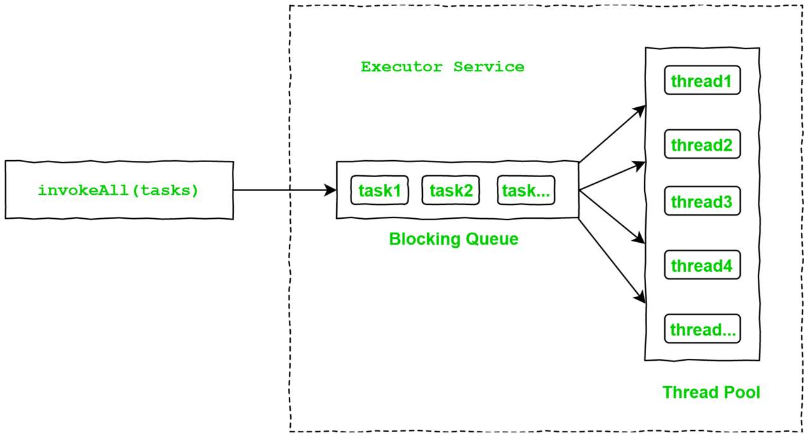
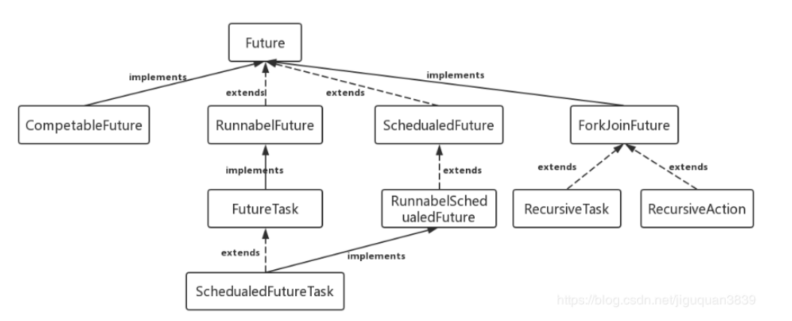

## Java併發程式設計-Future系列之Future的介紹和基本用法


多執行緒(Multithreading)是Java的一個特性，它可以允許一個程式的多個部分(也就是執行緒)併發地執行，以達到最大程度利用CPU的目的。

關於多執行緒程式設計(Multithread Programming)，下面介紹一下`Future`的特性和基本用法。

# About Future

`Future`(`java.util.concurrent Interface Future<V>`)表示非同步計算的結果。`Future`介面提供了檢查計算是否完成、檢查計算是否被取消、等待計算完成並獲取計算結果等方法。

> A Future represents the result of an asynchronous computation. Methods are provided to check if the computation is complete, to wait for its completion, and to retrieve the result of the computation. The result can only be retrieved using method get when the computation has completed, blocking if necessary until it is ready. Cancellation is performed by the cancel method. Additional methods are provided to determine if the task completed normally or was cancelled. Once a computation has completed, the computation cannot be cancelled. If you would like to use a Future for the sake of cancellability but not provide a usable result, you can declare types of the form Future<?> and return null as a result of the underlying task.
>
> [docs.oracle.com/javase/8/do…](https://link.juejin.im/?target=https%3A%2F%2Fdocs.oracle.com%2Fjavase%2F8%2Fdocs%2Fapi%2Fjava%2Futil%2Fconcurrent%2FFuture.html)

# Future Methods

下面對`Future`的幾個方法做一下簡要介紹並提供程式碼演示。

```java
private static ExecutorService executor = Executors.newSingleThreadExecutor();
public static Future<Integer> calculate(Integer input) {
    return executor.submit(() -> {
        Thread.sleep(3000);
         return input * input;
    });

}
```

## `get()`

```
V get()

Waits if necessary for the computation to complete, and then retrieves its result.
```

`get()`方法使用者返回計算結果，如果計算還沒有完成，則在get的時候會進行阻塞，直到獲取到結果為止。

### `get()` Sample Example

```java
Future<Integer> calculateFuture = calculate(100);
System.out.println("calculate result: "+calculateFuture.get());
```

在阻塞3s以後，可以得到執行結果：

```
calculate result: 10000
```

## `get(long timeout, TimeUnit unit)`

```java
V	get(long timeout, TimeUnit unit)

Waits if necessary for at most the given time for the computation to complete, and then retrieves its result, if available.
```

`get(long timeout, TimeUnit unit)`方法的耐心是有限的，如果在指定時間內沒有完成計算，則會丟擲`TimeoutException`.

### `get(long timeout, TimeUnit unit)` Sample Example

```java
Future<Integer> calculateFuture = calculate(100);
System.out.println(calculateFuture.get(2, TimeUnit.SECONDS));
```

等待2s以後，丟擲異常：

```
Exception in thread "main" java.util.concurrent.TimeoutException
```

```java
import java.util.concurrent.ExecutionException;
import java.util.concurrent.ExecutorService;
import java.util.concurrent.Executors;
import java.util.concurrent.Future;

public class FutureTest {
    // private static ExecutorService executor = Executors.newCachedThreadPool();
    private static ExecutorService executor = Executors.newSingleThreadExecutor();

    public static void main(String[] args) throws InterruptedException, ExecutionException {
        Future<Integer> calculateFuture = calculate(100);
        System.out.println("calculate result: " + calculateFuture.get());
    }

    public static Future<Integer> calculate(Integer input) {
        return executor.submit(() -> {
            Thread.sleep(1000);
            return input* input;
        });
    }
}
```


## `isDone()`

```
boolean	isDone()

Returns true if this task completed.
```

`isDone()`方法用於判斷當前Future是否執行完成。

### `isDone()` Sample Example

```
Future<Integer> calculateFuture = calculate(100);

System.out.println(calculateFuture.isDone());
while (!calculateFuture.isDone()){ }
System.out.println(calculateFuture.isDone());
複製程式碼
```

首先輸出`false`，迴圈3秒以後輸出`true`。

## `cancel(boolean mayInterruptIfRunning)`

```
boolean	cancel(boolean mayInterruptIfRunning)

Attempts to cancel execution of this task.
複製程式碼
```

取消當前執行緒的執行。參數列示是否線上程執行的過程中阻斷。

## `isCancelled()`

```
boolean	isCancelled()

Returns true if this task was cancelled before it completed normally.
```

判斷當前task是否被取消。

### `isCancelled()` Sample Example

```java
Future<Integer> calculateFuture = calculate(100);
System.out.println("isCancelled = "+calculateFuture.isCancelled());
System.out.println("cancel success = "+calculateFuture.cancel(true));
System.out.println("isCancelled = "+calculateFuture.isCancelled());
```

# Future ExecutorService



下面提供一個通過執行緒池來非同步獲取執行結果並彙總的程式碼示例。

```java
Callable<Long> callable = new Callable<Long>() {
    @Override
    public Long call() throws Exception {

        long start = System.currentTimeMillis();
        Thread.sleep(100);
        long end = System.currentTimeMillis();

        long seed = end - start;
        System.out.println("seed=" + seed);

        return seed;
    }
};

List<Callable<Long>> tasks = new ArrayList<>();
tasks.add(callable);
tasks.add(callable);
tasks.add(callable);
tasks.add(callable);
tasks.add(callable);
tasks.add(callable);
tasks.add(callable);
tasks.add(callable);
tasks.add(callable);
tasks.add(callable);

int poolSize = Runtime.getRuntime().availableProcessors();
System.out.println("poolSize=" + poolSize);
ExecutorService executorService = Executors.newFixedThreadPool(poolSize);
List<Future<Long>> futures = executorService.invokeAll(tasks);

long result = 0;
for (Future<Long> future : futures) {
    result += future.get();
}
System.out.println("result=" + result);
executorService.shutdown();
```

執行程式的主機是8核的，因此啟動了8個執行緒，每次會同時執行8個task。

下面是執行結果：

```
poolSize=8
seed=109
seed=109
seed=109
seed=109
seed=109
seed=109
seed=109
seed=109
seed=110
seed=110
result=1092
```

---

# 高並發–Future學習


## Future的應用場景

Future接口是Java標准API的一部分，在java.util.concurrent包中。Future接口是Java線程Future模式的實現，可以來進行異步計算。有了Future就可以進行三段式的編程了，1.啟動多線程任務2.處理其他事3.收集多線程任務結果。從而實現了非阻塞的任務調用。在途中遇到一個問題，那就是雖然能異步獲取結果，但是Future的結果需要通過isdone來判斷是否有結果，或者使用get()函數來阻塞式獲取執行結果。這樣就不能實時跟蹤其他線程的結果狀態了，所以直接使用get還是要慎用，最好配合isdone來使用。

在並發編程中，我們經常用到非阻塞的模型，在之前的多線程的三種實現中，不管是繼承thread類還是實現runnable接口，都無法保證獲取到之前的執行結果。通過實現Callable接口，並用Future可以來接收多線程的執行結果。Future表示一個可能還沒有完成的異步任務的結果，針對這個結果可以添加Callable以便在任務執行成功或失敗後作出相應的操作。

## 二、Future類圖結構

Future接口定義了主要的5個接口方法，有RunnableFuture和SchedualFuture繼承這個接口，以及CompleteFuture和ForkJoinTask繼承這個接口。


## 三、Future的主要方法

Future接口主要包括5個方法：

1、**get()** 方法可以當任務結束後返回一個結果，如果調用時，工作還沒有結束，則會阻塞線程，直到任務執行完。
2、**get(long timeout,TimeUnit unit)** 做多等待timeout的時間就會返回結果.。
3、**cancel(boolean mayInterruptIfRunning)** 方法用來取消任務，如果取消任務成功則返回true，如果取消任務失敗則返回false。參數mayInterruptIfRunning表示是否允許取消正在執行卻沒有執行完畢的任務，如果設置true，則表示可以取消正在執行過程中的任務。如果任務已經完成，則無論mayInterruptIfRunning為true還是false，此方法肯定返回false，即如果取消已經完成的任務會返回false；如果任務正在執行，若mayInterruptIfRunning設置為true，則返回true，若mayInterruptIfRunning設置為false，則返回false；如果任務還沒有執行，則無論mayInterruptIfRunning為true還是false，肯定返回true。
4、**isDone()** 方法判斷當前方法是否完成。
5、**isCancel()** 方法判斷當前方法是否取消。

```java
import java.util.concurrent.ExecutionException;
import java.util.concurrent.ExecutorService;
import java.util.concurrent.Executors;
import java.util.concurrent.Future;

public class FutureTest {

    private static ExecutorService executor = Executors.newCachedThreadPool();

    public static void main(String[] args) throws InterruptedException, ExecutionException {
        Future<Integer> future1 = calculate(1);
        Future<Integer> future2 = calculate(2);
        Future<Integer> future3 = calculate(3);
        while(!future1.isDone() && !future2.isDone() && !future3.isDone()) {
            System.out.println(future1.isDone()+" "+future2.isDone()+" "+future3.isDone());
        }
        System.out.println(future1.get()+" "+future2.get()+" "+future3.get());

    }

    public static Future<Integer> calculate(Integer input) {
        return executor.submit(() -> {
            Thread.sleep(1000);
            return input * input;
        });
    }

}
```

