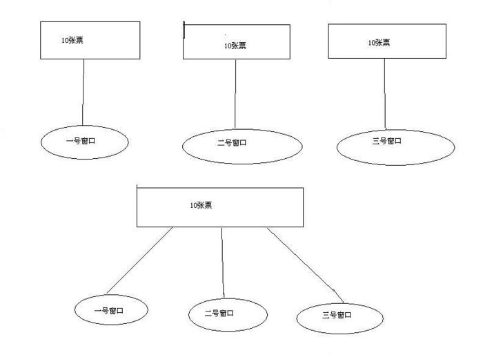

# Java的兩種多線程實現方式


##一、創建多線程的兩種方式
Java中，有兩種方式可以創建多線程：

1 通過繼承Thread類，重寫Thread的run()方法，將線程運行的邏輯放在其中

2 通過實現Runnable接口，實例化Thread類
在實際應用中，我們經常用到多線程，如車站的售票系統，車站的各個售票口相當於各個線程。當我們做這個系統的時候可能會想到兩種方式來實現，繼承Thread類或實現Runnable接口，現在看一下這兩種方式實現的兩種結果。

程序1：

```java
class MyThread extends Thread
{
    private int ticket = 10;
    private String name;
    public  MyThread(String name)
    {
        this.name = name;
    }
    public void run()
    {
        for (int i = 0; i < 500; i++) {
            if (this.ticket > 0) {
                System.out.println(this.name + "賣票---->" + (this.ticket--));
            }
        }
    }
}

public class ThreadDemo
{
    public static void main(String[] args)
    {
        MyThread mt1 = new MyThread("一號窗口");
        MyThread mt2 = new MyThread("二號窗口");
        MyThread mt3 = new MyThread("三號窗口");
        mt1.start();
        mt2.start();
        mt3.start();
    }
}
```
運行結果：
```sh
一號窗口賣票---->10
三號窗口賣票---->10
二號窗口賣票---->10
三號窗口賣票---->9
三號窗口賣票---->8
三號窗口賣票---->7
一號窗口賣票---->9
三號窗口賣票---->6
二號窗口賣票---->9
三號窗口賣票---->5
一號窗口賣票---->8
三號窗口賣票---->4
二號窗口賣票---->8
三號窗口賣票---->3
一號窗口賣票---->7
三號窗口賣票---->2
二號窗口賣票---->7
三號窗口賣票---->1
一號窗口賣票---->6
一號窗口賣票---->5
一號窗口賣票---->4
一號窗口賣票---->3
二號窗口賣票---->6
一號窗口賣票---->2
二號窗口賣票---->5
一號窗口賣票---->1
二號窗口賣票---->4
二號窗口賣票---->3
二號窗口賣票---->2
```

程序2：

```java
class MyThread1 implements Runnable
{
    private int ticket = 10;
    public void run()
    {
        for (int i = 0; i < 500; i++) {
            if (this.ticket > 0) {
                System.out.println(Thread.currentThread().getName()
                                      + "賣票---->" + (this.ticket--));
            }
        }
    }
}

public class RunnableDemo {
    public static void main(String[] args)
    {
        // 設計三個線程
        MyThread1 mt = new MyThread1();
        Thread t1 = new Thread(mt, "一號窗口");
        Thread t2 = new Thread(mt, "二號窗口");
        Thread t3 = new Thread(mt, "三號窗口");
        t1.start();
        t2.start();
        t3.start();
    }
}
```
運行結果：

```sh
一號窗口賣票---->10
二號窗口賣票---->8
二號窗口賣票---->6
二號窗口賣票---->5
三號窗口賣票---->9
二號窗口賣票---->4
一號窗口賣票---->7
二號窗口賣票---->2
三號窗口賣票---->3
一號窗口賣票---->1
```


為什麼兩個程序的結果不同呢？

第1個程序，相當於拿出三件事即三個賣票10張的任務分別分給三個窗口，他們各做各的事各賣各的票各完成各的任務，因為MyThread繼承Thread類，所以在new
MyThread的時候在創建三個對象的同時創建了三個線程。

第2個程序，相當於是拿出一個賣票10張得任務給三個人去共同完成，new
MyThread相當於創建一個任務，然後實例化三個Thread，創建三個線程即安排三個窗口去執行。

用圖表示如下：




通過上面的分析，我們發現這兩種多線程有兩大區別：

(1)
Thread方式是繼承；Runnable方式是實現接口。

(2)
Thread方式是多個線程分別完成自己的任務，即數據獨立；Runnable方式是多個線程共同完成一個任務，即數據共享。

大多數情況下，如果只想重寫run() 方法，而不重寫其他 Thread 方法，那麼應使用 Runnable 接口。這很重要，因為除非程序員打算修改或增強類的基本行為，否則不應為該類（Thread）創建子類。

##二、隱藏的問題


在第二種方法中，由於3個Thread對象共同執行一個Runnable對象中的代碼，因此可能會造成線程的不安全，比如可能ticket會輸出-1（如果我們System.out....語句前加上線程休眠操作，該情況將很有可能出現）。

這種情況的出現是由於，一個線程在判斷ticket為1>0後，還沒有來得及減1，另一個線程已經將ticket減1，變為了0，那麼接下來之前的線程再將ticket減1，便得到了-1。

這就需要加入同步操作（即互斥鎖），確保同一時刻只有一個線程在執行每次for循環中的操作。

而在第一種方法中，並不需要加入同步操作，因為每個線程執行自己Thread對象中的代碼，不存在多個線程共同執行同一個方法的情況。


程序1：

```sh
class MyThread1 implements Runnable
{
    private int ticket = 10;
    public void run()
    {
        for (int i = 0; i < 500; i++) {
            if (this.ticket > 0) {
                try {
                    Thread.sleep(100);
                    System.out.println(Thread.currentThread().getName()
                                          + "賣票---->" + (this.ticket--));
                } catch (Exception e) {
                    e.printStackTrace();
                }
            }
        }
    }
}

public class RunnableDemo {
    public static void main(String[] args)
    {
        // 設計三個線程
        MyThread1 mt = new MyThread1();
        Thread t1 = new Thread(mt, "一號窗口");
        Thread t2 = new Thread(mt, "二號窗口");
        Thread t3 = new Thread(mt, "三號窗口");
        t1.start();
        t2.start();
        t3.start();
    }
}
```

運行結果：

```sh
三號窗口賣票---->10
一號窗口賣票---->10
二號窗口賣票---->10
三號窗口賣票---->9
一號窗口賣票---->8
二號窗口賣票---->7
三號窗口賣票---->6
一號窗口賣票---->5
二號窗口賣票---->4
三號窗口賣票---->3
一號窗口賣票---->2
二號窗口賣票---->1
三號窗口賣票---->0
```

注意，這裡的10張票都是一號窗口賣出的。這是因為用了synchronized並且票數太少了，在t1對this對象鎖定的時間內，10張票就已經被賣完了。輪到t2或t3鎖定this對象時，已經無票可賣了。如果票數多一點，比如有幾萬張，就可以看到三個窗口都參與了賣票。


程序2：


```java
class MyThread1 implements Runnable
{
    private int ticket = 1000;
    public void run()
    {
        for (int i = 0; i < 5000; i++) {
            synchronized(this) {
                if (this.ticket > 0) {
                    System.out.println(Thread.currentThread().getName() + "賣票---->" +
                                       (this.ticket--));
                }
            }
        }
    }
}
public class RunnableDemo {
    public static void main(String[] args)
    {
        // 設計三個線程
        MyThread1 mt = new MyThread1();
        Thread t1 = new Thread(mt, "一號窗口");
        Thread t2 = new Thread(mt, "二號窗口");
        Thread t3 = new Thread(mt, "三號窗口");
        t1.start();
        t2.start();
        t3.start();
    }
}
```

