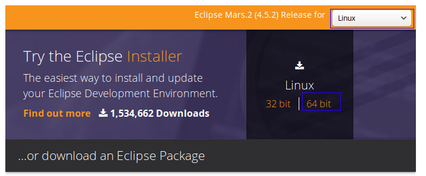
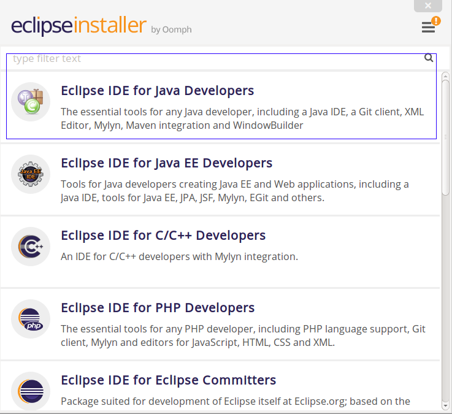
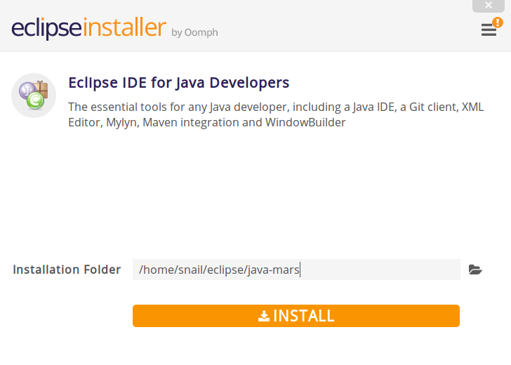
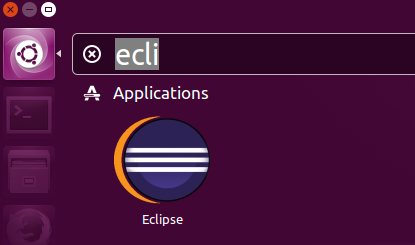

# Ubuntu 16.04 安裝 Eclipse


##1 安裝Java JDK

##2 下載Eclipse安裝器

http://www.eclipse.org/downloads/；根據系統類型下載：



## 3 解壓並運行其中的eclipse-inst


```sh
$ tar xzvf eclipse-inst-linux64.tar.gz
$ cd eclipse-installer
$ ./eclipse-inst
```

選擇你要安裝eclipse的類型：


我選擇java開發環境；

選擇安裝路徑，開始安裝：



##4 在Unity Dash中創建一個快捷菜單項

創建文件：

```sh
sudo vim /usr/share/applications/eclipse.desktop 
```

```
[Desktop Entry]
Name=Eclipse
Type=Application
Exec=/home/shihyu/eclipse/java-oxygen/eclipse/eclipse
Terminal=false
Icon=/home/shihyu/eclipse/java-oxygen/eclipse/icon.xpm
Comment=Integrated Development Environment
NoDisplay=false
Categories=Development;IDE;
Name[en]=Eclipse
```
把上面的/home/snail/eclipse/…替換為你的eclipse安裝路徑。

註銷系統。


