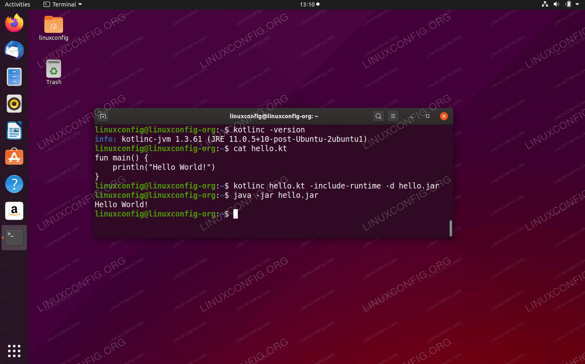

## How to install Kotlin on Ubuntu 20.04 Focal Fossa Linux


6 May 2020 by [Lubos Rendek](https://linuxconfig.org/author/lubos)

Kotlin is a general-purpose programming language which interoperates fully with Java. Kotlin’s JVM version of its standard library depends on the Java Class Library, hence this tutorial will first show the reader how to install Java SDK and then a Kotlin compiler on [Ubuntu 20.04](https://linuxconfig.org/ubuntu-20-04-guide).

**In this tutorial you will learn:**

- How to install Java SDK
- How to install Kotlin compiler
- How to compile simple Kotlin program
- How to run Kotlin program




Kotlin on Ubuntu 20.04 Focal Fossa Linux

## Software Requirements and Conventions Used


| Category    | Requirements, Conventions or Software Version Used           |
| :---------- | :----------------------------------------------------------- |
| System      | [Installed Ubuntu 20.04](https://linuxconfig.org/how-to-install-ubuntu-20-04-focal-fossa-desktop) or [upgraded Ubuntu 20.04 Focal Fossa](https://linuxconfig.org/how-to-upgrade-ubuntu-to-20-04-lts-focal-fossa) |
| Software    | Kotlin Compiler, OpenJDK java                                |
| Other       | Privileged access to your Linux system as root or via the `sudo` command. |
| Conventions | **#** – requires given [linux commands](https://linuxconfig.org/linux-commands) to be executed with root privileges either directly as a root user or by use of `sudo` command **$** – requires given [linux commands](https://linuxconfig.org/linux-commands) to be executed as a regular non-privileged user |

## How to install Kotlin on Ubuntu 20.04 step by step instructions


1. Install desired Java version

    . For example in this case we will go with Java

     

    ```
    openjdk-11-jdk
    ```

    ```
    $ sudo apt install openjdk-11-jdk
    ```
    
2. Next step is to install Kotlin:

    ```
    $ sudo snap install --classic kotlin
    ```

3. Use any text editor and create a file called

     

    ```
    hello.kt
    ```

     

    with the following content:

    ```kotlin
    fun main() {
        println("Hello World!")
    }
    ```

    Compile the Kotlin source code:

    ```
    $ kotlinc hello.kt -include-runtime -d hello.jar
    ```

4.  

    Run the actual Kotlin program:

    

    ```
    $ java -jar hello.jar
    Hello World!
    ```

### Related Linux Tutorials:

- [Things to install on Ubuntu 20.04](https://linuxconfig.org/things-to-install-on-ubuntu-20-04)
- [Things to do after installing Ubuntu 20.04 Focal Fossa Linux](https://linuxconfig.org/things-to-do-after-installing-ubuntu-20-04-focal-fossa-linux)
- [Ubuntu 20.04 Tricks and Things you Might not Know](https://linuxconfig.org/ubuntu-20-04-tricks-and-things-you-might-not-know)
- [How to Install Adobe Acrobat Reader DC (WINE) on…](https://linuxconfig.org/how-to-install-adobe-acrobat-reader-dc-wine-on-ubuntu-20-04-focal-fossa-linux)
- [How to Install Adobe Acrobat Reader on Ubuntu 20.04…](https://linuxconfig.org/how-to-install-adobe-acrobat-reader-on-ubuntu-20-04-focal-fossa-linux)
- [Oracle Java installation on Ubuntu 20.04 Focal Fossa Linux](https://linuxconfig.org/oracle-java-installation-on-ubuntu-20-04-focal-fossa-linux)
- [Ubuntu 20.04 Hadoop](https://linuxconfig.org/ubuntu-20-04-hadoop)
- [How to Install Java on RHEL 8 / CentOS 8 Linux](https://linuxconfig.org/how-to-install-java-on-redhat-8-linux)
- [List of LaTeX editors and compilers on Ubuntu 20.04…](https://linuxconfig.org/list-of-latex-editors-and-compilers-on-ubuntu-20-04-focal-fossa-linux)
- [How to work with the Woocommerce REST API with Python](https://linuxconfig.org/how-to-work-with-the-woocommerce-rest-api-with-python)