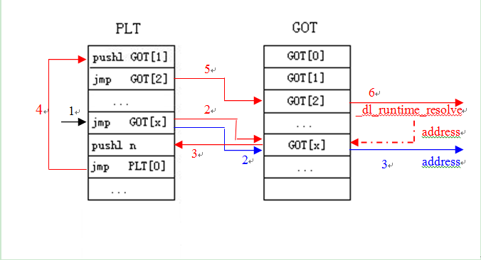

# ELF文件的加載


linux 中用戶態與內核態的聯繫是通過system call進行調用的。最近由於學習了不同的調式工具，以及解析elf文件的objdump，正好可以來熟練一下載入流程。
首先，我先介紹一下ELF文件格式：

```c
#define EI_NIDENT 16
typedef struct{
    unsigned char e_ident[EI_NIDENT];    //目標文件標識信息
    Elf32_Half e_type;                             //目標文件類型
    Elf32_Half e_machine;                       //目標體系結構類型
    Elf32_Word e_version;                      //目標文件版本
    Elf32_Addr e_entry;                          //程序入口的虛擬地址,若沒有，可為0
    Elf32_Off e_phoff;                            //程序頭部表格（Program Header Table）的偏移量（按字節計算）,若沒有，可為0
    Elf32_Off e_shoff;                            //節區頭部表格（Section Header Table）的偏移量（按字節計算）,若沒有，可為0
    Elf32_Word e_flags;                        //保存與文件相關的，特定於處理器的標誌。標誌名稱採用 EF_machine_flag的格式。
    Elf32_Half e_ehsize;                        //ELF 頭部的大小（以字節計算）。
    Elf32_Half e_phentsize;                   //程序頭部表格的表項大小（按字節計算）。
    Elf32_Half e_phnum;                      //程序頭部表格的表項數目。可以為 0。
    Elf32_Half e_shentsize;                  //節區頭部表格的表項大小（按字節計算）。
    Elf32_Half e_shnum;      //節區頭部表格的表項數目。可以為 0。
    Elf32_Half e_shstrndx;  //節區頭部表格中與節區名稱字符串表相關的表項的索引。如果文件沒有節區名稱字符串表，此參數可以為 SHN_UNDEF。
}Elf32_Ehdr;
```


我們先用一個最簡單的hello world來說明elf文件載入流程。


gcc在編譯時，所有程序的鏈接都是動態鏈接的，也就是說需要解釋器。由此可見，我們的Hello World程序在被內核加載到內存，內核跳到用戶空間後並不是執行Hello World的，而是先把控制權交到用戶空間的解釋器，由解釋器加載運行用戶程序所需要的動態庫（Hello World需要libc），然後控制權才會轉移到用戶程序。

首先我們要知道`glic就是一個kernel 與 app 的交流窗口`，`ld_linux_so是一個動態裝入器（linked dynamic）`

當我們call PLT表時，就是動態調用so文件，其實也可以稱為重定向。printf函數的調用已經換成了puts函數。其中的call指令就是調用puts函數。但從上面的代碼可以看出，它調用的是puts@plt這個標號，它代表什麼意思呢？在進一步說明符號的動態解析過程以前，需要先了解兩個概念，一個是global offset table就是GOT表，一個是procedure linkage table（PLT）。

首先 我們先反彙編這個elf文件

```sh
Breakpoint 1, 0x0000000000400530 in main ()
Missing separate debuginfos, use: debuginfo-install glibc-2.16-34.fc18.x86_64
(gdb) disassemble
Dump of assembler code for function main:
   0x000000000040052c <+0>:   push   %rbp
   0x000000000040052d <+1>:   mov    %rsp,%rbp
=> 0x0000000000400530 <+4>:    sub    $0x10,%rsp
   0x0000000000400534 <+8>:   mov    %edi,-0x4(%rbp)
   0x0000000000400537 <+11>:  mov    %rsi,-0x10(%rbp)
   0x000000000040053b <+15>:  mov    $0x400600,%edi
   0x0000000000400540 <+20>:  callq  0x400410 <puts@plt>
   0x0000000000400545 <+25>:  mov    $0x0,%eax
   0x000000000040054a <+30>:  leaveq
   0x000000000040054b <+31>:  retq
End of assembler dump.
(gdb) stepi
0x0000000000400534 in main ()
(gdb)
0x0000000000400537 in main ()
(gdb)
0x000000000040053b in main ()
(gdb)
0x0000000000400540 in main ()
(gdb)
0x0000000000400410 in puts@plt ()
(gdb) disassemble
Dump of assembler code for function puts@plt:
<strong>=> 0x0000000000400410 <+0>:  jmpq   *0x200c02(%rip)        # 0x601018 <puts@got.plt></strong>
   0x0000000000400416 <+6>:   pushq  $0x0
   0x000000000040041b <+11>:  jmpq   0x400400
End of assembler dump.
(gdb) stepi
0x0000000000400400 in ?? ()
(gdb) disassemble
No function contains program counter for selected frame.
(gdb) stepi
0x0000000000400406 in ?? ()
(gdb) stepi
0x0000003cf16149b0 in _dl_runtime_resolve () from /lib64/ld-linux-x86-64.so.2   #動態裝入函數
(gdb) disassemble
<strong>Dump of assembler code for function _dl_runtime_resolve:</strong>
=> 0x0000003cf16149b0 <+0>:    sub    $0x38,%rsp
   0x0000003cf16149b4 <+4>:   mov    %rax,(%rsp)
   0x0000003cf16149b8 <+8>:   mov    %rcx,0x8(%rsp)
   0x0000003cf16149bd <+13>:  mov    %rdx,0x10(%rsp)
   0x0000003cf16149c2 <+18>:  mov    %rsi,0x18(%rsp)
   0x0000003cf16149c7 <+23>:  mov    %rdi,0x20(%rsp)
   0x0000003cf16149cc <+28>:  mov    %r8,0x28(%rsp)
   0x0000003cf16149d1 <+33>:  mov    %r9,0x30(%rsp)
   0x0000003cf16149d6 <+38>:  mov    0x40(%rsp),%rsi
   0x0000003cf16149db <+43>:  mov    0x38(%rsp),%rdi
   0x0000003cf16149e0 <+48>:  callq  0x3cf160e310 <_dl_fixup>
   <strong>0x0000003cf16149e5 <+53>:    mov    %rax,%r11</strong>
   0x0000003cf16149e8 <+56>:  mov    0x30(%rsp),%r9
   0x0000003cf16149ed <+61>:  mov    0x28(%rsp),%r8
   0x0000003cf16149f2 <+66>:  mov    0x20(%rsp),%rdi
   0x0000003cf16149f7 <+71>:  mov    0x18(%rsp),%rsi
   0x0000003cf16149fc <+76>:  mov    0x10(%rsp),%rdx
   0x0000003cf1614a01 <+81>:  mov    0x8(%rsp),%rcx
   0x0000003cf1614a06 <+86>:  mov    (%rsp),%rax
   0x0000003cf1614a0a <+90>:  add    $0x48,%rsp
<strong>   0x0000003cf1614a0e <+94>:    jmpq   *%r11</strong>
End of assembler dump.
(gdb)
```

`從上面，我們能看出stepi中間有兩項是空的，那正是GOT[0]是空的，GOT[1] GOT[2]是一個函數的地址。`

`GOT表的前三項保留，GOT[1]保存的是一個地址，指向已經加載的共享庫的鏈表地址（前面提到加載的共享庫會形成一個鏈表）；GOT[2]保存的是一個函數的地址(dl_runtime_resolve這個函數的入口)，這個函數的主要作用就是找到某個符號的地址，並把它寫到與此符號相關的GOT項中，然後將控制轉移到目標函數。`


從調用puts函數到現在，總共有兩次壓棧操作，一次是壓入puts函數的重定向信息的偏移量，一次是GOT[1]（共享庫鏈表的地址）。上面的movl操作就是將這數據分別取到一系列的寄存器，然後調用_dl_fixup（從寄存器取參數），此函數完成的功能就是找到puts函數的實際加載地址，並將它寫到GOT中，然後通過寄存器將此值返回給_dl_runtime_resolve。棧頂為puts函數的返回地址（main函數中call指令的下一條指令），這樣，當puts函數返回時，就返回到正確的位置。


```sh
Disassembly of section .plt:
 
0000000000400400 <puts@plt-0x10>:
  400400:   ff 35 02 0c 20 00       pushq  0x200c02(%rip)        # 601008 <_GLOBAL_OFFSET_TABLE_+0x8>
  400406:   ff 25 04 0c 20 00       jmpq   *0x200c04(%rip)        # 601010 <_GLOBAL_OFFSET_TABLE_+0x10>
  40040c:   0f 1f 40 00             nopl   0x0(%rax)
 
0000000000400410 <puts@plt>:
  400410:   ff 25 02 0c 20 00       jmpq   *0x200c02(%rip)        # 601018 <_GLOBAL_OFFSET_TABLE_+0x18>
  400416:   68 00 00 00 00          pushq  $0x0
  40041b:   e9 e0 ff ff ff          jmpq   400400 <_init+0x20>
 
0000000000400420 <__libc_start_main@plt>:
  400420:   ff 25 fa 0b 20 00       jmpq   *0x200bfa(%rip)        # 601020 <_GLOBAL_OFFSET_TABLE_+0x20>
  400426:   68 01 00 00 00          pushq  $0x1
  40042b:   e9 d0 ff ff ff          jmpq   400400 <_init+0x20>
 
0000000000400430 <__gmon_start__@plt>:
  400430:   ff 25 f2 0b 20 00       jmpq   *0x200bf2(%rip)        # 601028 <_GLOBAL_OFFSET_TABLE_+0x28>
  400436:   68 02 00 00 00          pushq  $0x2
  40043b:   e9 c0 ff ff ff          jmpq   400400 <_init+0x20>
  ```
  
除PLT0以外（就是puts@plt-0x10所標記的內容），其它的所有PLT項的形式都是一樣的，而且最後的jmp指令都是0x400400，即PLT0為目標的。


```sh
(gdb) x/w 0x601018
0x601018 <puts@got.plt>:  0x00400416
(gdb) disassemble
Dump of assembler code for function puts@plt:
=> 0x0000000000400410 <+0>:    jmpq   *0x200c02(%rip)        # 0x601018 <puts@got.plt>
   0x0000000000400416 <+6>:   pushq  $0x0
   0x000000000040041b <+11>:  jmpq   0x400400
End of assembler dump.
(gdb) x/32x 0x601018
0x601018 <puts@got.plt>:  0x00400416  0x00000000  0xf1a21910  0x0000003c
0x601028 <__gmon_start__@got.plt>:    0x00400436  0x00000000  0x00000000  0x00000000
0x601038:   0x00000000  0x00000000  0x00000000  0x00000000
0x601048:   0x00000000  0x00000000  0x00000000  0x00000000

```

從上面可以看出，這個地址就是GOT表中的一項。它裡面的內容是0x00400416，即puts@plt中的第二條指令。原來鏈接器在把所需要的共享庫加載進內存後，並沒有把共享庫中的函數的地址寫到GOT表項中，而是延遲到函數的第一次調用時，才會對函數的地址進行定位。

這樣我們就從so文件中加載了一個庫函數。

`當然，如果是第二次調用puts函數，那麼就不需要這麼複雜的過程，而只要通過GOT表中已經確定的函數地址直接進行跳轉即可。下圖是前面過程的一個示意圖，紅色為第一次函數調用的順序，藍色為後續函數調用的順序（第1步都要執行）。`



##參考

http://blog.csdn.net/flydream0/article/details/8719036
