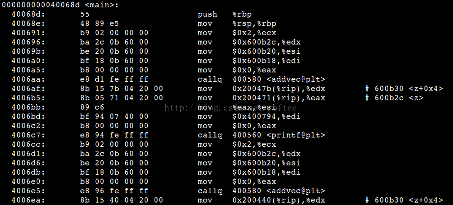
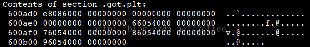
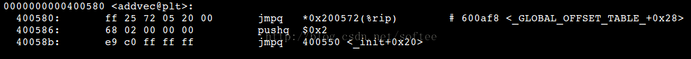
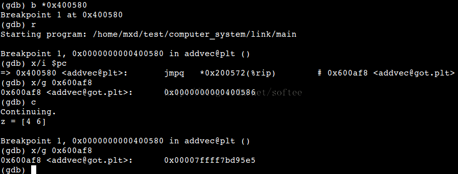

# GOT和PLT原理简析

GOT(Global Offset Table)和PLT(Procedure Linkage Table)是Linux系统下面ELF格式的可执行文件中，用于定位全局变量和过程的数据信息。以C程序为例，一个程序可能会包含多个文件，可执行文件的生成过程通常由以下几步组成。

1. 编译器把每个.c文件编译成汇编(.s)文件。

2. 汇编器把每个(.s)文件转换为(.o)文件。

3. 链接器把多个.o文件链接为一个可执行文件（.out）。

.s文件是汇编文件的后缀，一般对此种类型文件的关注不多，不再讨论，重点在.o文件和.out文件。

.c文件中通常有对变量和过程的使用，若是变量和过程定义在当前文件中，则可以使用相对偏移寻址来调用。若是定义在其他文件中，则在编译当前文件时无法获取其地址；若是定义在动态库中，则直到程序被加载、运行时，才能够确定。本文通过《深入理解计算机系统》中讲动态链接一章中的例子，通过gdb的调试，研究调用动态库中函数时的重定位过程。

### 1. 动态库程序。

- addvec.c

```c
void addvec(int *x, int *y, int *z, int n){
  int i;

  for(i = 0; i < n; i++)
    z[i] = x[i] + y[i];
}
```

通过命令gcc -fPIC -shared addvec.c -o libvec.so可以把上面的程序转换为动态库libvec.so。

###2. 调用动态库的主程序。

```c
#include <stdio.h>

int x[2] = {1, 2};
int y[2] = {3, 4};
int z[2];

int main(){
  addvec(x, y, z, 2);
  printf("z = [%d %d]\n", z[0], z[1]);
  addvec(x, y, z, 2);
  printf("z = [%d %d]\n", z[0], z[1]);

  return 0;
}
```


通过命令

```sh
gcc main.c -o main -L./ -lvec
```

生成可执行文件main。-L./ -lvec表示链接当前目录下的动态链接库libvec.so。

使用命令objdump -d -s > main.dmp反汇编main。

反汇编生成的文件中，主要有三个段与对动态库函数addvec的调用有关：.got.plt，.plt和代码段.text。

代码段容易理解，就是程序语句所对应的指令组成的。.got.plt中保存的是数据，为每个动态调用保存一个条目，条目的内容应该是对动态库函数的调用所跳转到的目标地址。由于Linux采用了延迟绑定技术，可执行文件中got.plt中的地址并不是目标地址，而是动态链接器（ld-linux）中的地址。在程序执行的第一次调用时，ld-linux把.got.plt的地址填写正确，之后的调用，就可以使用.got.plt中的目标地址了。.plt段中的内容则是实现跳转操作的代码片段。

###代码段：



### .got.plt



### .plt


源代码中，对于函数的addvec的两次调用，命令为

callq  400580 <addvec@plt>

调用的目标地址是.plt段中的addvec@plt函数。该函数由三条语句组成，其作用分别为：

1. 跳转到地址600af8，这个地址位于.got.plt中。从图中可以看到got.plt起始于600ad0，终止于600b08(600b00 + 8)。并且600af8的内容为86054000，按照小端的读法，其内容为00400586，实际就是下一条（第2条）指令。

2. 第二条指令把当前函数的id(0x2)压入栈中。

3. 第三条指令，跳转到400550，这之后的工作可以视为系统在运行时填充地址600af8的过程。也就是在延迟绑定机制下，第一次执行时，600af8的内容是400586，第二次及之后的内容就会修改为addvec函数的实际地址，可以通过gdb来验证。




可以看到，第一次调用addvec的时候，地址600af8中的内容是0x0000000000400586，第二次调用的时候就变成了0x00007ffff7bd95e5，是addvec的实际入口地址，与预期的相同。