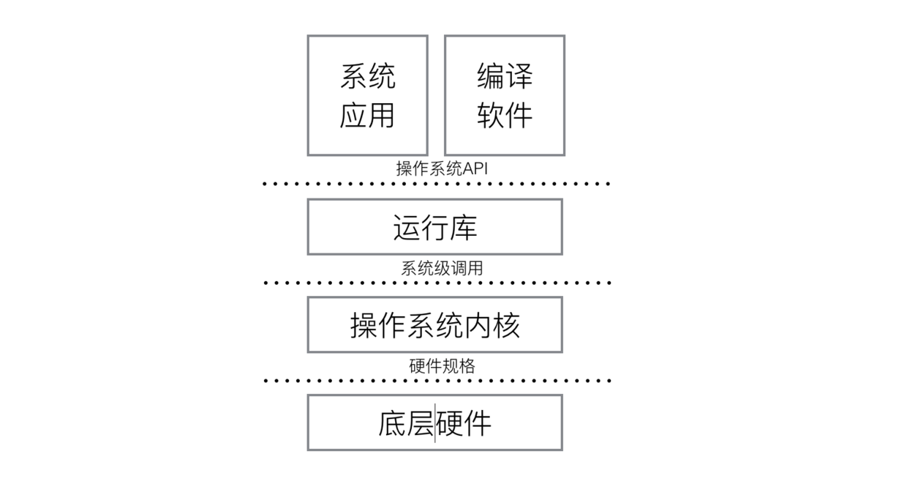
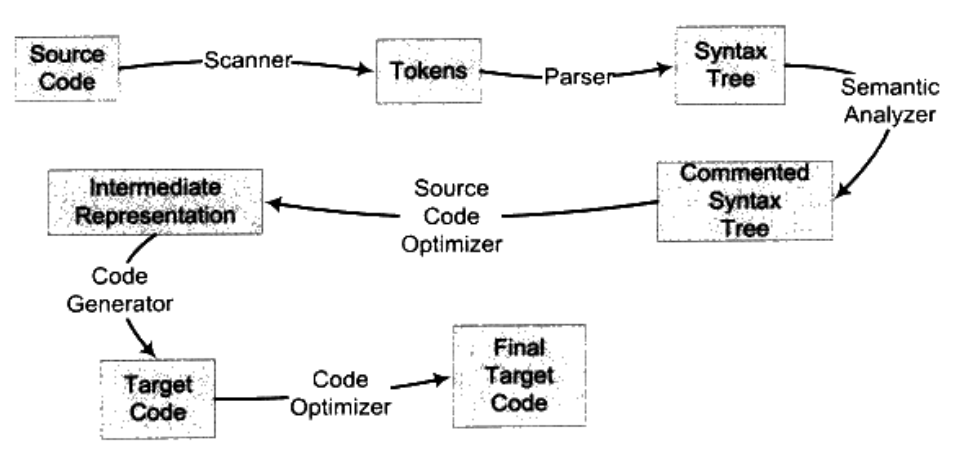

# 鏈接、裝載、與庫_讀書筆記

## 一.預備知識

1.為了協調CPU、內存和高速的圖形設備  ->  北橋 ->  有相對低速的設備連在北橋上  ->  南橋，專門處理低速設備  ->  CPU頻率被4GHz天花板限制，增加CPU數量  ->  對稱多處理器  ->  成本高，多處理機之間共享昂貴緩存，只多個核  -> 多核處理器

2.將用於管理計算機本身的軟件成為系統軟件

- 平臺級：操作系統內核 驅動程序 運行庫 系統工具

- 程序開發級：編譯器、彙編器、鏈接器等開發工具和開發庫

- 運行庫

- 操作系統內核

- 底層硬件

3.將計算機上有限的物理內存分配給多個程序使用，但問題是地址空間不隔離、內存使用效率低、程序運行地址不確定。

加中間層的方法可以避免問題，把程序給出的地址看作是虛擬地址，通過映射，將虛擬地址轉換為實際物理地址。

`分段` 將程序所需的內存空間大小的虛擬地址映射到某個物理地址，程序A、B被映射到兩塊不同物理空間區域且無重疊，解決了地址空間不隔離、程序運行地址不確定的問題

根據局部性原理，程序在運行時，在某個時間段內，只是頻繁用到一小部分數據，`分頁` 將地址空間人為地等分成固定大小的頁共程序使用，提高內存使用效率

4.

`進程`：所有應用程序以進程的方式運行在比操作系統權限更低的級別

`有獨立的地址空間，進程之間地址空間相互隔離，cpu分配資源的最小單位`

`線程`：`cpu執行任務的最小單位，線程ID + 當前指令指針PC + 寄存器集合 + 堆棧`

一個進程由一個或多個線程組成，各個線程之間共享程序的內存空間(代碼段、數據段、堆)及一些進程級資源(打開文件和信號)，

線程私有：局部變量、函數參數、線程局部存儲數據

線程之間共享：全局變量、堆上的數據、函數裡的靜態變量、程序代碼打開的文件

線程狀態：運行 就緒 等待

線程調度：

- `輪轉法讓各個線程輪流執行一小段時間的方法`

- `優先級調度改變優先級的方法：指定優先級、根據進入等待狀態的頻繁程度提升或降級優先級、長時間得不到執行而提升優先級`

5.線程安全

同步：在一個線程訪問數據未結束時，其他線程不得對同一個數據進行訪問，將數據的訪問原子化

同步最常見方法：鎖，線程訪問數據或資源前先獲取鎖，並在訪問結束之後釋放鎖，鎖被佔用時，獲取鎖的線程等待，直到鎖重新可用

信號量    標誌資源佔用或非佔用

互斥量    必須由同一個線程釋放、獲取的信號量

臨界區    僅限於本進程，其他進程無法獲取的互斥量

編譯器優化時，可能為了效率而交換毫不相干的兩條相鄰指令的執行順序，使用volatile關鍵字阻止過度優化

1.阻止編譯器為了提高速度將一個變量緩存到寄存器內而不寫回

2.阻止編譯器調整操作volatile變量的指令順序

##二.編譯和鏈接

編譯 + 鏈接 = 構建

- 預編譯  

   處理以‘#’開始的預編譯指令，展開宏定義 #define #if #endif 

   刪除註釋 添加行號標示

- 編譯

     - 詞法分析  將源代碼字符序列分割成一系列記號

     - 語法分析  用語法分析器將產生的記號進行語法分析，產生語法樹

     - 語義分析  將語法樹上的類型不符的插入相應結點，做隱式轉換

     - 生成中間代碼  編譯器前端 

- 彙編  編譯器後端        將彙編代碼轉變為機器可執行指令

- 鏈接  將源代碼模塊獨立地編譯，然後將其組裝起來，將目標文件鏈接形成可執行文件

      - 地址和空間分配

      - 符號決議、地址綁定

      - 重定向      確定全局變量和函數最終運行時的絕對地址

##三.目標文件

ELF executable file                        內容

文件頭描述文件屬性                      段表 重定位表

代碼段  .code .text                         源代碼編譯後的機器指令，程序的指令

數據段  .data                                  已初始化的全局變量、局部靜態變量

.bss                                                未初始化的全局變量、局部靜態變量

.text/.data 它們在文件中和虛擬地址中分配空間，.bss僅分配虛擬地址空間

段表：數組中每個元素都是結構體，包括段名、類型、加載地址、相對於文件頭的偏移量、段大小、鏈接信息

重定位表：需要重定位的信息

函數、變量需要獨特的符號名，防止類似的符號名衝突，C++採用命名空間的方法解決符號衝突，Objective-C 採用加前綴方式。

函數簽名：包含了一個函數的信息，包括函數名、參數類型、所屬類、名稱空間及其他信息

符號分為強符號，和弱符號。強符號不可名稱重複，弱符號（未初始化的全局變量）可以符號名相同。

對符號名的引用分為強引用和弱引用，強引用表示如果找不到符號定義會報錯，弱引用不報錯，默認為0或某個特殊值。

目標文件裡面還有可能保存調試信息

可以進行設置斷點、監視變量變化、單步行進等調試是因為編譯器將源代碼的行、函數和變量類型、結構體的定義、字符串保存在目標文件裡

GCC編譯時加上 -g 參數，編譯器就會加上調試信息

##四.靜態鏈接

鏈接：將幾個輸入目標文件加工後合併成一個輸出文件

兩步鏈接：空間與地址分配    符號解析與鏈接時重定位

一種語言的開發環境會附帶語言庫，語言庫是對操作系統API的包裝、常用函數

靜態庫可看做一組目標文件的集合

鏈接控制腳本控制鏈接器的運行，將目標文件和庫文件轉化為可執行文件

##五.可執行文件的裝載與進程

程序：靜態  預先編譯好的指令和數據集合的文件

進程：動態  程序運行時的過程

CPU位數決定了虛擬地址空間的大小 —> 硬件尋址空間大小頁映射函數將虛擬空間的各個頁映射至相應的物理空間

程序執行時所需要的指令和數據必須在內存中才能夠正常運行，又根據局部性原理，可將程序最常用的部分駐留在內存中，不常用的存放在磁盤裡，需要時，動態裝入

動態裝載的方法：

覆蓋裝入

手工將程序分成若干塊，在編寫覆蓋管理器管理模塊何時應該駐留內存、何時應被替換掉

頁映射

將內存和磁盤中的數據及指令按照“頁”為單位劃分，需要時裝入，超出範圍後，用FIFO或最少使用算法替換新頁

進程的建立：

創建一個獨立的虛擬地址空間

讀取可執行文件頭，並且建立虛擬空間與可執行文件的映射關係

將CPU的指令寄存器設置成可執行文件的入口地址，啟動運行

進程結束後，將相關資源(進程地址空間、物理內存、打開文件、網絡鏈接)都被操作系統關閉或收回

頁錯誤：當執行到某個地址的指令時，發現頁為空(未被裝入)

段地址對齊

進程啟動前，將系統環境變量和程序運行參數保存到進程的虛擬空間棧中

程序庫部分會把堆棧裡的初始化信息中的參數信息傳遞給main函數的argc、argv參數argc命令行參數數量、argv命令行參數字符串指針數組

##六.動態鏈接

靜態鏈接：把所有程序模塊都鏈接成一個單獨的可執行文件

問題：

對計算機內存和磁盤空間浪費嚴重，每個程序內部都保留著公用庫函數

更新庫函數時，程序需重新鏈接

動態鏈接：把程序按照模塊拆分為各個相對獨立的部分，運行時才將他們鏈接在一起

共享對象會被多個程序調用，導致其在虛擬地址空間中的位置難以確定，所以共享對象需要在`裝載時重定位`

但裝載時重定位會導致無法在多個進程間共享，採用`地址無關代碼`

將共享對象模塊中的地址引用劃分為模塊內部引用和模塊外部引用、指令引用和數據訪問

對於`模塊內部的指令和數據引用`，採用`相對偏移調用`的方法

對於`模塊外部的指令和數據引用`，採用`GOT全局偏移表`間接訪問

`延遲綁定Lazy Binding` 當函數第一次被用到的時候才重定位，提供程序運行速度

動態鏈接器是一個特殊共享對象，不依賴與任何動態共享文件，且自己的重定位工作由自己完成

自舉：不用到任何全局和靜態變量，自己完成重定位工作

##七.記憶體

內核空間(內核使用，應用程序無法訪問) + 用戶空間

用戶空間：

- 棧  從高位向低地址增長，向下增長

​  i386中，esp寄存器指向棧頂，ebp寄存器指向了函數活動記錄的一個固定位置

  堆棧幀 保存了一個函數調用所需要的維護信息

  函數的返回地址和參數

  臨時變量 函數的非靜態局部變量 編譯器自動生成的其他臨時變量

保存的上下文 在函數調用前後需要保持不變的寄存器

調用慣例：函數的調用方和被調用方對於函數如何調用的明確約定

棧上的數據在函數返回時會被釋放掉，無法將數據傳遞至函數外部

堆  從低位向高地址增長(不總是向上增長)

程序可申請一段內存，釋放申請的這個內存

堆上的內存管理由堆自己進行，若由操作系統進行，會頻繁進行系統調用，性能開銷較大

若一次性分給進程的空間不夠，可能出現系統調用，再申請一部分空間

​

堆分配算法含義優點缺點

空閒鏈表把堆中各個空閒塊按照鏈表的方式鏈接起來，當用戶請求空間時，遍歷整個鏈表，直到找到合適大小的塊並將其拆分，釋放時，將它合併到空閒鏈表中簡單記錄長度的字節易被改變，導致整個堆無法使用

位圖將堆劃分為大小相同的塊，頭+主體 ，用整數數組記錄塊的使用情況H B BF F FH BF F FH塊、穩定性好、易管理易產生碎片

對象池針對固定大小的分配空間

可執行文件映像：由裝載器將可執行文件的內存讀取或映射在這裡

保留區：對內存中收到保護而禁止訪問的內存區域總稱

Debug模式中，將未初始化區域都初始化為0xCC，有助於判斷一個變量是否沒有初始化，0xCCCC被當做文本就是燙，0xCDCD是屯

HotPatch 可替換函數，實現Hook，允許用戶在某些時刻截獲特定函數的調用

##八.運行庫

入口函數：運行庫的一部分，一個程序的初始化和結束部分，準備好了main函數執行所需要的環境，並且負責調用main函數，這樣在main函數中才能：申請內存、使用系統調用、觸發異常、訪問I/O

程序運行步驟：

1.操作系統創建進程後，`把控制權交給程序入口` 
2.入口函數對運行庫和程序運行環境進行初始化，包括堆、I/O、線程、全局變量構造等 
3.入口函數完成初始化後，`調用main函數，進行程序主體部分` 
4.main函數執行完畢後，`返回入口函數`，入口函數進行清理工作，包括全局變量析構、堆銷燬、關閉I/O，然後系統調用結束進程

環境變量：存在於系統中的一些公用數據，如系統搜索路徑，當前OS版本

I/O 指代了程序與外界的交互，包括文件FILE、管道、網絡、命令行、信號等

運行庫：啟動與退出、標準函數、I/O、堆、語言實現、調試

##九.系統調用

系統調用：為了讓應用程序 (運行庫) 有能力訪問系統資源，讓程序藉助操作系統做一些必須由操作系統支持的行為，操作系統提供的接口

現代CPU可在多種截然不同的特權級別下執行指令，分為用戶模式、內核模式

接口的調用通過中斷實現從用戶模式到內核模式的切換
