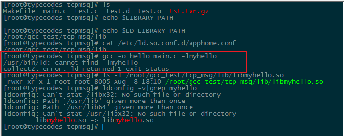
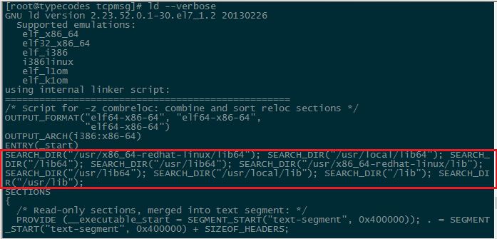

# Linux gcc链接动态库出错：LIBRARY_PATH和LD_LIBRARY_PATH的区别


昨天在自己的CentOs7.1上写makefile的时候，发现在一个C程序在编译并链接一个已生成好的lib动态库的时候出错。链接命令大概是这样的：


```sh
[root@typecodes tcpmsg]# gcc -o hello main.c -lmyhello
/usr/bin/ld: cannot find -lmyhello
collect2: error: ld returned 1 exit status
```


##1 gcc链接动态库时的搜索路径

自以为在当前工程中设置好了环境变量`LD_LIBRARY_PATH`包含了工程中的lib库路径，并且还在`/etc/ld.so.conf/apphome.conf`中配置了lib库的路径。那么在调用动态库的时候，gcc就应该能自动去搜索该目录。




很遗憾ld链接器报了如上的错误，但是如果在上面的gcc命令中添加上-L /root/gcc_test/tcp_msg/lib/参数，即明确动态库的绝对路径，是能够链接成功的。


##2 Google上查找 /usr/bin/ld: cannot find -l* 的出错原因

gg了很久gcc ld链接动态库出错的原因，结果还是没找到理想的答案。后来猜想是不是在CentOs7中LD_LIBRARY_PATH不起作用的缘故，但是也不应该，因为自己用的GCC（version 4.8.3）跟操作系统没关系。于是重新搜索了gcc LD_LIBRARY_PATH的作用，竟然发现
`gcc在编译链接时链接的动态库跟LIBRARY_PATH有关`而跟`  `LD_LIBRARY_PATH没关系`！

## 3 关于Linux gcc中的LIBRARY_PATH和LD_LIBRARY_PATH参数说明

下面摘取了两篇较权威的说明资料：

### 1、GNU上关于LIBRARY_PATH的说明：

```sh
LIBRARY_PATH
The value of LIBRARY_PATH is a colon-separated list of directories, much like PATH.
When configured as a native compiler, GCC tries the directories thus specified when searching for special linker files, if it can't find them using GCC_EXEC_PREFIX.
Linking using GCC also uses these directories when searching for ordinary libraries for the -l option (but directories specified with -L come first).
```

### 2、man7上关于LD_LIBRARY_PATH的说明：

```sh
LD_LIBRARY_PATH
A colon-separated list of directories in which to search for
ELF libraries at execution-time.  Similar to the PATH
environment variable.  Ignored in set-user-ID and set-group-ID
programs.
```

后面发现StackOverflow上关于`LIBRARY_PATH`和`LD_LIBRARY_PATH`的解释更直白：
```sh
LIBRARY_PATH is used by gcc before compilation to search for directories containing libraries that need to be linked to your program.

LD_LIBRARY_PATH is used by your program to search for directories containing the libraries after it has been successfully compiled and linked.

EDIT: As pointed below, your libraries can be static or shared.
If it is static then the code is copied over into your program and you don't need to search for the library after your program is compiled and linked.
If your library is shared then it needs to be dynamically linked to your program and that's when LD_LIBRARY_PATH comes into play.
```

通过这三篇资料的说明，很快明白了`LIBRARY_PATH`和`LD_LIBRARY_PATH`的作用。于是，自己在项目配置文件中添加`export LIBRARY_PATH=${LIBRARY_PATH}:${APPHOME}/lib`。接着将这个配置文件加载到CentOs的环境变量中，这样就在gcc编译不用加-L参数生成目标文件CommuTcp了。


## 4 总结

关于`LIBRARY_PATH`和`LD_LIBRARY_PATH`的关系，这里自己再总结一下。

###4.1 Linux gcc编译链接时的动态库搜索路径

GCC编译、链接生成可执行文件时，动态库的搜索路径顺序如下（注意不会递归性地在其子目录下搜索）：

```sh
1、gcc编译、链接命令中的-L选项；
2、gcc的环境变量的LIBRARY_PATH（多个路径用冒号分割）；
3、gcc默认动态库目录：/lib:/usr/lib:usr/lib64:/usr/local/lib。
```

###4.2 执行二进制文件时的动态库搜索路径

链接生成二进制可执行文件后，在运行程序加载动态库文件时，搜索的路径顺序如下：


```sh
1、编译目标代码时指定的动态库搜索路径：用选项-Wl,rpath和include指定的动态库的搜索路径，比如gcc -Wl,-rpath,include -L. -ldltest hello.c，在执行文件时会搜索路径`./include`；
2、环境变量LD_LIBRARY_PATH（多个路径用冒号分割）；
3、在 /etc/ld.so.conf.d/ 目录下的配置文件指定的动态库绝对路径（通过ldconfig生效，一般是非root用户时使用）；
4、gcc默认动态库目录：/lib:/usr/lib:usr/lib64:/usr/local/lib等。
```

其中，Linux GCC默认的动态库搜索路径可以通过`ld --verbose`命令查看：

```sh
[root@typecodes tcpmsg]# ld --verbose
    ............
    SEARCH_DIR("/usr/x86_64-redhat-linux/lib64");
    SEARCH_DIR("/usr/local/lib64");
    SEARCH_DIR("/lib64");
    SEARCH_DIR("/usr/lib64");               ##### 64位系统
    SEARCH_DIR("/usr/x86_64-redhat-linux/lib");
    SEARCH_DIR("/usr/local/lib");
    SEARCH_DIR("/lib");
    SEARCH_DIR("/usr/lib");
    
```



