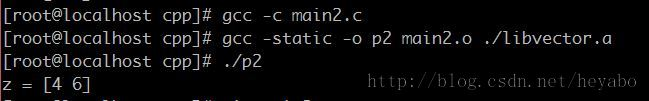
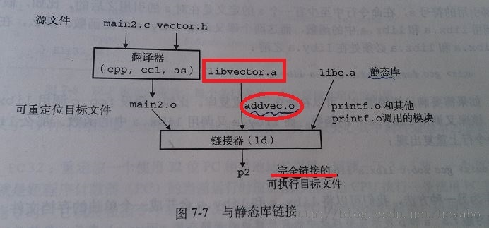
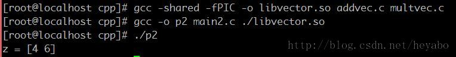
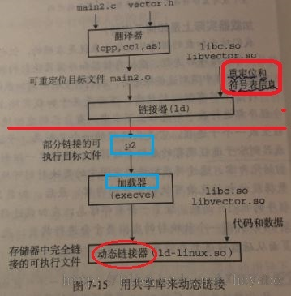
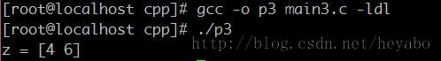

# Linux 靜態庫與共享庫的使用


##一、靜態庫

###1、概念：
靜態庫指將所有相關的目標文件打包成為一個單獨的文件-即靜態庫文件，以.a結尾。`靜態庫可作為鏈接器的輸入`，鏈接器會將程序中使用的到函數的代碼從庫文件中拷貝到應用程序中。`一旦鏈接完成，在執行程序的時候就不需要靜態庫了`。

- 注1：由於每個使用靜態庫的應用程序都需要拷貝所用函數的代碼，所以靜態鏈接的文件會比較大。
- 注2：在Unix系統中，靜態庫以一種稱為存檔（archive）的特殊文件格式存放在磁盤中。存檔文件是一組連接起來的可重定位目標文件的集合，有一個頭部用來描述每個成員目標文件的大小和位置（存檔文件名由後綴.a標識）。

###2、創建與應用

假設我們想在一個叫做libvector.a的靜態庫中提供以下向量函數：

```c
// addvec.c
void addvec(int* x, int* y, int* z, int n)
{
    int i = 0;

    for (; i < n; ++i) {
        z[i] = x[i] + y[i];
    }
}
```

```c
// multvec.c
void multvec(int* x, int* y, int*  z, int n)
{
    int i = 0;

    for (; i < n; ++i) {
        z[i] = x[i] * y[i];
    }
}
```

使用AR工具創建靜態庫文件：


為了使用這個庫，編寫一個應用（其調用addvec庫中的函數）：

```c
/* main2.c */
#include <stdio.h>

int x[2] = {1, 2};
int y[2] = {3, 4};
int z[2] = {0};

int main()
{
    addvec(x, y, z, 2);
    printf("z = [%d %d]\n", z[0], z[1]);
    return 0;
}
```
編譯-鏈接-運行程序：


- 注1：`-static` 參數告訴編譯器驅動程序，鏈接器應該構建一個完全的可執行目標文件，它可以加載到存儲器並運行，在加載時無需進一步的鏈接 -`即一次性靜態鏈接完畢，不允許存在動態鏈接`。

- 注2：當鏈接器運行時，它判定addvec.o定義的addvec符號是被main2.o引用的，所以它拷貝addvec.o到可執行文件。因為程序中沒有引用任何由multvec.o定義的符號，所以鏈接器就不會拷貝這個模塊到可執行文件。同時，鏈接器還會拷貝libc.a中的pirintf.o模塊，以及許多C運行時系統中的其他模塊。鏈接器完整的行為可如下圖所示：



##二、共享庫

`1、概念`：共享庫是一個目標模塊（以.so後綴表示），在運行時，可以加載到任意的存儲器地址，並和一個在存儲器中的程序鏈接起來，這個過程稱為動態鏈接，是由一個叫做動態鏈接器的程序來執行的。

`2、分類`：根據加載和鏈接共享庫的時機又可分為：
`A）`應用程序自身加載時動態鏈接和加載共享庫；
`B）`應用程序運行過程中動態鏈接和加載共享庫兩種情況。

2-A：`應用程序自身加載時動態鏈接和加載共享庫`

2-A.1 `基本思路是`：當創建可執行文件時，靜態執行一些鏈接（共享庫的重定位和符號表信息，而非代碼和數據），然後在應用程序加載時，動態完成鏈接過程。

2-A.2 創建與應用

創建類似於靜態庫的創建，假設我們現在想在一個叫做libvector.so的共享庫庫中提供以下addvec和multvec函數：
下面使用`-shared`選項來指示鏈接器創建一個共享的目標文件（即共享庫），鏈接並運行程序：


- 注1：`-fPIC`選項指示編譯器生成與位置無關的代碼
其動態鏈接過程可如下圖所示：



- 注2：在可執行文件p2中沒有拷貝任何libvector.so真正的代碼和數據節，而是由鏈接器拷貝了一些重定位和符號表信息，它們使得運行時動態鏈接器可以解析libvector.so中代碼和數據的引用，重定位完成鏈接任務。其中需要重定位的有：

- 1）重定位libc.so的文本和數據到某個存儲器段；
- 2）重定位libvector.so的文本和數據到另一個存儲器段；
- 3）重定位p2中所有對libc.so和libvector.so定義的符號的引用。

最後鏈接器將控制傳遞給應用程序。`從這個時刻開始，共享庫的位置就固定了，並在在程序的執行過程中都不會再改變！`

2-B：`應用程序運行過程中動態鏈接和加載共享庫`


`2-B.1 概念`：與A情況不同，此情況下：`應用程序在運行過程中要求動態鏈接器加載和鏈接任意共享庫，而無需編譯時鏈接那些庫到應用中。`

`2-B.2 應用實例`
Linux系統為應用程序在運行過程中加載和鏈接共享庫提供了一組API：


```c
#include<dlfcn.h>

/* 加載和鏈接共享庫 filename
    filename：共享庫的名字
    flag有：RTLD_LAZY, RTLD_NOW,二者均可以和RTLD_GLOBAL表示取或
*/
void* dlopen(const char* filename,
             int flag); // 若成功則返回執行句柄的指針，否則返回NULL

/*根據共享庫操作句柄與符號，返回符號對應的地址
    handle:共享庫操作句柄
    symbol：需要引用的符號名字
*/
void* dlsym(void* handle,
            char* symbol); // 若成功則返回執行符號的指針（即地址），若出錯則返回NULL

/* 如果沒有程序正在使用這個共享庫，卸載該共享庫 */
int dlclose(void* handle); // 若卸載成功，則返回0，否則返回-1

/* 捕捉最近發生的錯誤 */
const char* dlerror(
    void); // 若前面對dlopen，dlsym或dlclose調用失敗，則返回錯誤消息，否則返回NULL

```

例子：

```c
#include <stdio.h>
#include <stdlib.h>
#include <dlfcn.h>

int x[2] = {1, 2};
int y[2] = {3, 4};
int z[2] = {0};

int main()
{
    void* handle;
    void (*addvec)(int*, int*, int*, int);
    char* error;

    handle = dlopen("./libvector.so", RTLD_LAZY);

    if (!handle) {
        fprintf(stderr, "%s\n", dlerror());
        exit(1);
    }

    addvec = dlsym(handle, "addvec");

    if ((error = dlerror()) != NULL) {
        fprintf(stderr, "%s\n", dlerror());
        exit(1);
    }

    addvec(x, y, z, 2);
    printf("z = [%d %d]\n", z[0], z[1]);

    if (dlclose(handle) < 0) {
        fprintf(stderr, "%s\n", dlerror());
        exit(1);
    }

    return 0;
}

```

運行結果：`-ldl`參數：表示生成的對象模塊需要用到共享庫



##Referebces:

1.《深入理解計算機系統》第7章：鏈接 P448-P479
2. 靜態庫、共享庫、動態庫的創建和使用 ：http://bbs.chinaunix.net/thread-2037617-1-1.html
3. Linux 動態庫剖析：http://www.ibm.com/developerworks/cn/linux/l-dynamic-libraries/
4. dlopen: http://baike.baidu.com/link?url=VswI42A-IxFuF5SelbJxDREXuY0BvYWHEdcCYozSNH93ark0nTMi4YdhHrvt-bIo2_F-swU2onuYMNwXeUGVMq