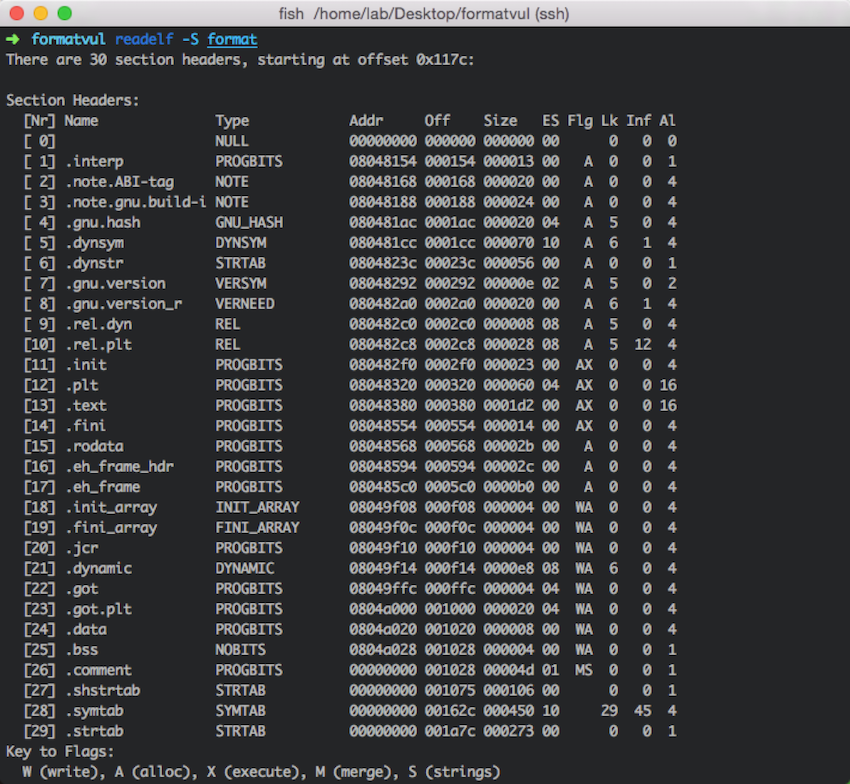
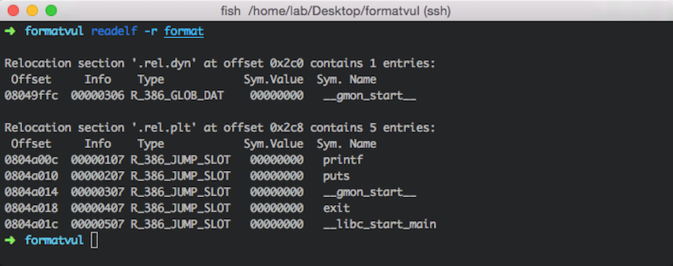
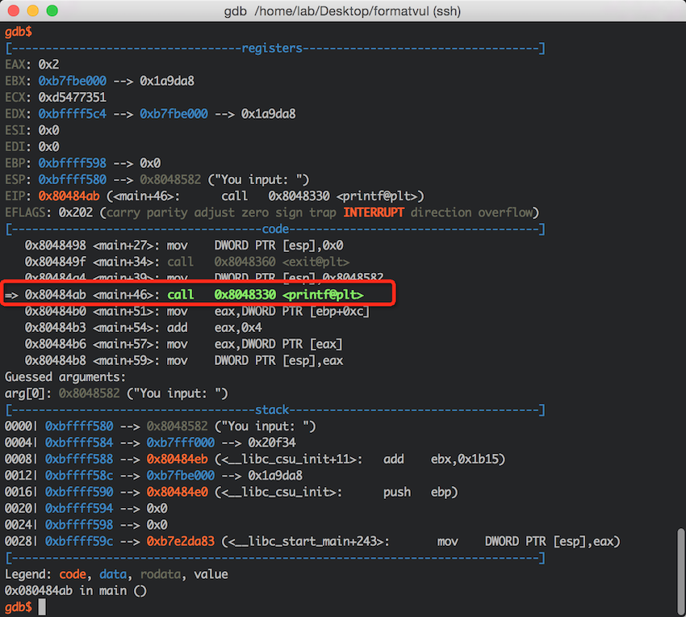
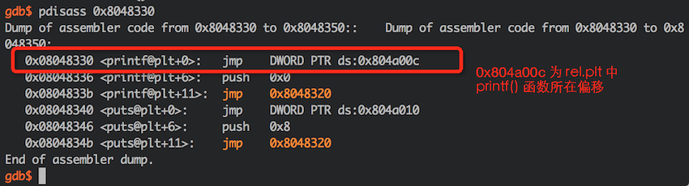
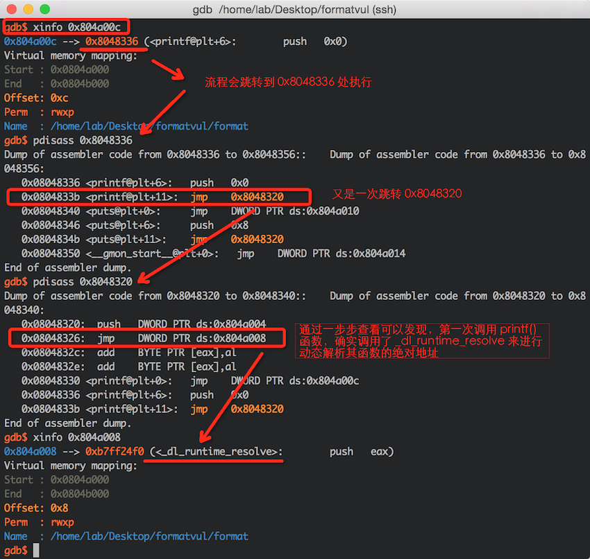
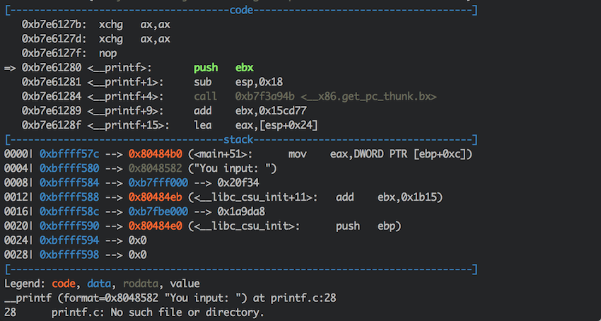
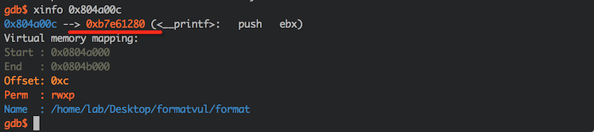
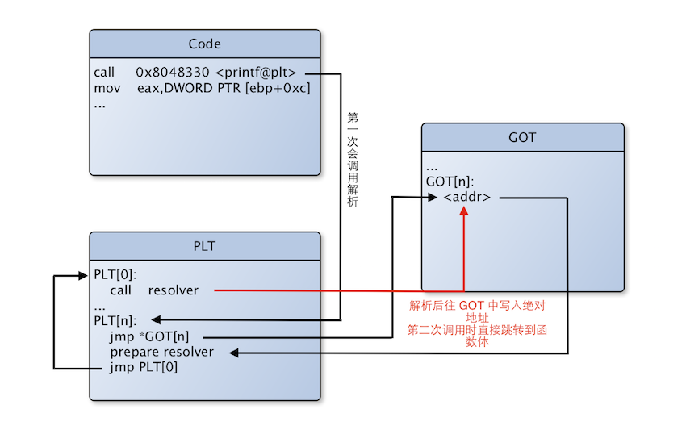

# 通过 GDB 调试理解 GOT/PLT


关于 Linux 中 ELF 文件格式可参考详细文档《ELF_Format》，本文仅记录笔者理解GOT/PLT的过程。

GOT（Global Offset Table）：全局偏移表用于记录在 ELF 文件中所用到的共享库中符号的绝对地址。在程序刚开始运行时，GOT 表项是空的，当符号第一次被调用时会动态解析符号的绝对地址然后转去执行，并将被解析符号的绝对地址记录在 GOT 中，第二次调用同一符号时，由于 GOT 中已经记录了其绝对地址，直接转去执行即可（不用重新解析）。

PLT（Procedure Linkage Table）：过程链接表的作用是将位置无关的符号转移到绝对地址。当一个外部符号被调用时，PLT 去引用 GOT 中的其符号对应的绝对地址，然后转入并执行。

GOT 位于 `.got.plt` section 中，而 PLT 位于 `.plt` section中。下面给出一示例程序：

```c
#include <stdio.h>
#include <stdlib.h>

int main(int argc, char* argv[])
{
    if(argc < 2)
    {
        printf("argv[1] required!\n");
        exit(0);
    }
    printf("You input: ");
    printf(argv[1]);
    printf("Down\n");

    return 0;
}
```

编译该程序：

```sh
gcc -o format format.c
```

然后我们通过 `readelf` 命令来查看 `format` 程序的 sectioin 信息，并检查 GOT：




从上图可看到，该 ELF 文件共包含29个 section，有关 GOT 的重定向：





`.rel.dyn` 记录了加载时需要重定位的变量，`.rel.plt` 记录的是需要重定位的函数。

接下来，我们使用 `gdb` 来对程序进行调试，观察程序在调用 `printf()` 函数时，GOT 的变化情况。

因为程序逻辑需要输入参数，设置好参数后，在主函数处下断点，然后运行，单步调试来到 `printf()` 函数调用的地方：



这里可以看到在 `0x080484ab` 处指令为：
```sh
call 0x8048330 <printf@plt>
```
然后查看一下 `0x8048330` 处的代码：



可以看到流程会跳转到 `ds[0x804a00c]` 处，而 `0x804a00c` 是 `printf()` 重定位偏移（查看上面 GOT 信息图），接着看一下后面的流程都做了什么：



根据上面的流程分析，进行单步调试，当动态解析（_dl_runtime_resolve）完成后，流程会直接跳转到 `printf()` 函数主体：



上面我们说过，当第一次调用符号时会动态解析其绝对地址并写到 GOT 中，下次调用的时候就不用再次解析了，我们来看看这个时候原先 `0x804a00c` 处的指向情况：




其所指向的地址正好为第一次解析后得到的` printf() `函数的入口地址。

程序中，`printf() ` 函数的调用过程可以总结为：



总结来说就是，GOT 保存了程序中所要调用的函数的地址，运行一开时其表项为空，会在运行时实时的更新表项。一个符号调用在第一次时会解析出绝对地址更新到 GOT 中，第二次调用时就直接找到 GOT 表项所存储的函数地址直接调用了。

（清楚上述动态解析的过程，有助于理解GOT覆写利用）

##参考

http://blog.csdn.net/anzhsoft/article/details/18776111
http://flint.cs.yale.edu/cs422/doc/ELF_Format.pdf

