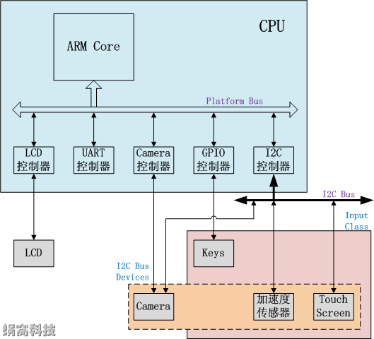

# Linux设备模型(1)_基本概念

##1. 前言

在“Linux内核的整体架构”中，蜗蜗有提到，由于Linux支持世界上几乎所有的、不同功能的硬件设备（这是Linux的优点），导致Linux内核中有一半的代码是设备驱动，而且随着硬件的快速升级换代，设备驱动的代码量也在快速增长。个人意见，这种现象打破了“简洁就是美”的理念，是丑陋的。它导致Linux内核看上去非常臃肿、杂乱、不易维护。但蜗蜗也知道，这不是Linux的错，Linux是一个宏内核，它必须面对设备的多样性，并实现对应的驱动。

为了降低设备多样性带来的Linux驱动开发的复杂度，以及设备热拔插处理、电源管理等，Linux内核提出了设备模型（也称作Driver Model）的概念。设备模型将硬件设备归纳、分类，然后抽象出一套标准的数据结构和接口。驱动的开发，就简化为对内核所规定的数据结构的填充和实现。

本文将会从设备模型的基本概念开始，通过分析内核相应的代码，一步一步解析Linux设备模型的实现及使用方法。

##2. Linux设备模型的基本概念

###2.1 Bus, Class, Device和Device Driver的概念

下图是嵌入式系统常见的硬件拓扑的一个示例：

硬件拓扑描述Linux设备模型中四个重要概念中三个：Bus，Class和Device（第四个为Device Driver，后面会说）。

`Bus（总线）`：Linux认为（可以参考include/linux/device.h中struct bus_type的注释），总线是CPU和一个或多个设备之间信息交互的通道。而为了方便设备模型的抽象，所有的设备都应连接到总线上（无论是CPU内部总线、虚拟的总线还是“platform Bus”）。

`Class（分类）`：在Linux设备模型中，Class的概念非常类似面向对象程序设计中的Class（类），它主要是集合具有相似功能或属性的设备，这样就可以抽象出一套可以在多个设备之间共用的数据结构和接口函数。因而从属于相同Class的设备的驱动程序，就不再需要重复定义这些公共资源，直接从Class中继承即可。

`Device（设备）`：抽象系统中所有的硬件设备，描述它的名字、属性、从属的Bus、从属的Class等信息。

`Device Driver（驱动）`：Linux设备模型用Driver抽象硬件设备的驱动程序，它包含设备初始化、电源管理相关的接口实现。而Linux内核中的驱动开发，基本都围绕该抽象进行（实现所规定的接口函数）。

`注：什么是Platform Bus？ `

在计算机中有这样一类设备，它们通过各自的设备控制器，直接和CPU连接，CPU可以通过常规的寻址操作访问它们（或者说访问它们的控制器）。这种连接方式，并不属于传统意义上的总线连接。但设备模型应该具备普适性，因此Linux就虚构了一条Platform Bus，供这些设备挂靠。

###2.2 设备模型的核心思想

Linux设备模型的核心思想是（通过xxx手段，实现xxx目的）：
1. 用Device（struct device）和Device Driver（struct device_driver）两个数据结构，分别从“有什么用”和“怎么用”两个角度描述硬件设备。这样就统一了编写设备驱动的格式，使驱动开发从论述题变为填空体，从而简化了设备驱动的开发。

2. 同样使用Device和Device Driver两个数据结构，实现硬件设备的即插即用（热拔插）。 
在Linux内核中，只要任何Device和Device Driver具有相同的名字，内核就会执行Device Driver结构中的初始化函数（probe），该函数会初始化设备，使其为可用状态。 
而对大多数热拔插设备而言，它们的Device Driver一直存在内核中。当设备没有插入时，其Device结构不存在，因而其Driver也就不执行初始化操作。当设备插入时，内核会创建一个Device结构（名称和Driver相同），此时就会触发Driver的执行。这就是即插即用的概念。

3. 通过"Bus-->Device”类型的树状结构（见2.1章节的图例）解决设备之间的依赖，而这种依赖在开关机、电源管理等过程中尤为重要。 
试想，一个设备挂载在一条总线上，要启动这个设备，必须先启动它所挂载的总线。很显然，如果系统中设备非常多、依赖关系非常复杂的时候，无论是内核还是驱动的开发人员，都无力维护这种关系。 
而设备模型中的这种树状结构，可以自动处理这种依赖关系。启动某一个设备前，内核会检查该设备是否依赖其它设备或者总线，如果依赖，则检查所依赖的对象是否已经启动，如果没有，则会先启动它们，直到启动该设备的条件具备为止。而驱动开发人员需要做的，就是在编写设备驱动时，告知内核该设备的依赖关系即可。

4. 使用Class结构，在设备模型中引入面向对象的概念，这样可以最大限度地抽象共性，减少驱动开发过程中的重复劳动，降低工作量。
