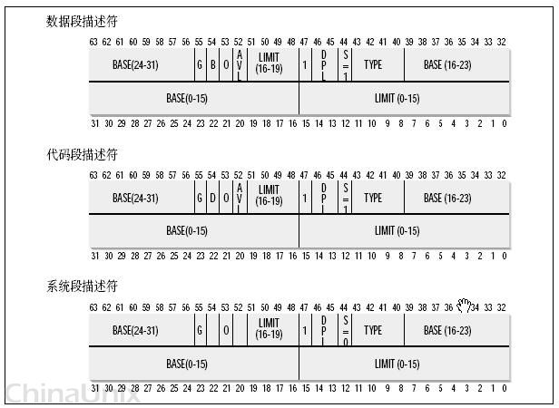
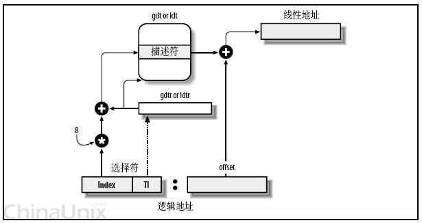
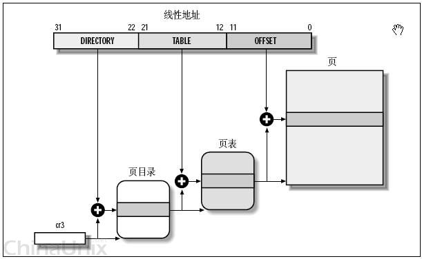
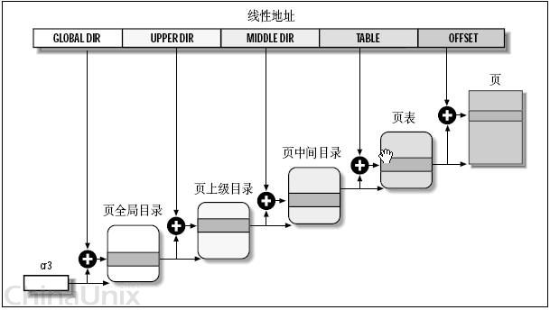

# 我理解的邏輯地址、線性地址、物理地址和虛擬地址
本貼涉及的硬件平臺是X86，如果是其它平臺，嘻嘻，不保證能一一對號入座，但是舉一反三，我想是完全可行的。

##一、概念

###物理地址(physical address)
用於內存芯片級的單元尋址，與處理器和CPU連接的地址總線相對應。
——這個概念應該是這幾個概念中最好理解的一個，但是值得一提的是，雖然可以直接把物理地址理解成插在機器上那根內存本身，把內存看成一個從0字節一直到最大空量逐字節的編號的大數組，然後把這個數組叫做物理地址，但是事實上，這只是一個硬件提供給軟件的抽像，內存的尋址方式並不是這樣。所以，說它是“與地址總線相對應”，是更貼切一些，不過拋開對物理內存尋址方式的考慮，直接把物理地址與物理的內存一一對應，也是可以接受的。也許錯誤的理解更利於形而上的抽像。

###虛擬內存(virtual memory)
這是對整個內存（不要與機器上插那條對上號）的抽像描述。它是相對於物理內存來講的，可以直接理解成“不直實的”，“假的”內存，例如，一個0x08000000內存地址，它並不對就物理地址上那個大數組中0x08000000 - 1那個地址元素；
之所以是這樣，是因為現代操作系統都提供了一種內存管理的抽像，即虛擬內存（virtual memory）。進程使用虛擬內存中的地址，由操作系統協助相關硬件，把它“轉換”成真正的物理地址。這個“轉換”，是所有問題討論的關鍵。

有了這樣的抽像，一個程序，就可以使用比真實物理地址大得多的地址空間。（拆東牆，補西牆，銀行也是這樣子做的），甚至多個進程可以使用相同的地址。不奇怪，因為轉換後的物理地址並非相同的。
——可以把連接後的程序反編譯看一下，發現連接器已經為程序分配了一個地址，例如，要調用某個函數A，代碼不是call A，而是call 0x0811111111 ，也就是說，函數A的地址已經被定下來了。沒有這樣的“轉換”，沒有虛擬地址的概念，這樣做是根本行不通的。
打住了，這個問題再說下去，就收不住了。


###邏輯地址(logical address)
Intel為了兼容，將遠古時代的段式內存管理方式保留了下來。邏輯地址指的是機器語言指令中，用來指定一個操作數或者是一條指令的地址。以上例，我們說的連接器為A分配的0x08111111這個地址就是邏輯地址。
——不過不好意思，這樣說，好像又違背了Intel中段式管理中，對邏輯地址要求，“一個邏輯地址，是由一個段標識符加上一個指定段內相對地址的偏移量，表示為 [段標識符：段內偏移量]，也就是說，上例中那個0x08111111，應該表示為[A的代碼段標識符: 0x08111111]，這樣，才完整一些”

###線性地址(linear address)或也叫虛擬地址(virtual address)
跟邏輯地址類似，它也是一個不真實的地址，如果邏輯地址是對應的硬件平臺段式管理轉換前地址的話，那麼線性地址則對應了硬件頁式內存的轉換前地址。

-------------------------------------------------------------
CPU將一個虛擬內存空間中的地址轉換為物理地址，需要進行兩步：首先將給定一個邏輯地址（其實是段內偏移量，這個一定要理解！！！），CPU要利用其段式內存管理單元，先將為個邏輯地址轉換成一個線程地址，再利用其頁式內存管理單元，轉換為最終物理地址。

這樣做兩次轉換，的確是非常麻煩而且沒有必要的，因為直接可以把線性地址抽像給進程。之所以這樣冗餘，Intel完全是為了兼容而已。

###2、CPU段式內存管理，邏輯地址如何轉換為線性地址
一個邏輯地址由兩部份組成，段標識符: 段內偏移量。段標識符是由一個16位長的字段組成，稱為段選擇符。其中前13位是一個索引號。後面3位包含一些硬件細節，如圖：


最後兩位涉及權限檢查，本貼中不包含。

索引號，或者直接理解成數組下標——那它總要對應一個數組吧，它又是什麼東東的索引呢？這個東東就是“段描述符(segment descriptor)”，呵呵，段描述符具體地址描述了一個段（對於“段”這個字眼的理解，我是把它想像成，拿了一把刀，把虛擬內存，砍成若干的截——段）。這樣，很多個段描述符，就組了一個數組，叫“段描述符表”，這樣，可以通過段標識符的前13位，直接在段描述符表中找到一個具體的段描述符，這個描述符就描述了一個段，我剛才對段的抽像不太準確，因為看看描述符裡面究竟有什麼東東——也就是它究竟是如何描述的，就理解段究竟有什麼東東了，每一個段描述符由8個字節組成，如下圖：

這些東東很複雜，雖然可以利用一個數據結構來定義它，不過，我這裡只關心一樣，就是Base字段，它描述了一個段的開始位置的線性地址。

Intel設計的本意是，一些全局的段描述符，就放在“全局段描述符表(GDT)”中，一些局部的，例如每個進程自己的，就放在所謂的“局部段描述符表(LDT)”中。那究竟什麼時候該用GDT，什麼時候該用LDT呢？這是由段選擇符中的T1字段表示的，=0，表示用GDT，=1表示用LDT。

GDT在內存中的地址和大小存放在CPU的gdtr控制寄存器中，而LDT則在ldtr寄存器中。

好多概念，像繞口令一樣。這張圖看起來要直觀些：
 
首先，給定一個完整的邏輯地址[段選擇符：段內偏移地址]，
1、看段選擇符的T1=0還是1，知道當前要轉換是GDT中的段，還是LDT中的段，再根據相應寄存器，得到其地址和大小。我們就有了一個數組了。
2、拿出段選擇符中前13位，可以在這個數組中，查找到對應的段描述符，這樣，它了Base，即基地址就知道了。
3、把Base + offset，就是要轉換的線性地址了。

還是挺簡單的，對於軟件來講，原則上就需要把硬件轉換所需的信息準備好，就可以讓硬件來完成這個轉換了。OK，來看看Linux怎麼做的。

###3、Linux的段式管理
Intel要求兩次轉換，這樣雖說是兼容了，但是卻是很冗餘，呵呵，沒辦法，硬件要求這樣做了，軟件就只能照辦，怎麼著也得形式主義一樣。
另一方面，其它某些硬件平臺，沒有二次轉換的概念，Linux也需要提供一個高層抽像，來提供一個統一的界面。所以，Linux的段式管理，事實上只是“哄騙”了一下硬件而已。

按照Intel的本意，全局的用GDT，每個進程自己的用LDT——不過Linux則對所有的進程都使用了相同的段來對指令和數據尋址。即用戶數據段，用戶代碼段，對應的，內核中的是內核數據段和內核代碼段。這樣做沒有什麼奇怪的，本來就是走形式嘛，像我們寫年終總結一樣。
include/asm-i386/segment.h
```c
#define GDT_ENTRY_DEFAULT_USER_CS        14
#define __USER_CS (GDT_ENTRY_DEFAULT_USER_CS * 8 + 3)

#define GDT_ENTRY_DEFAULT_USER_DS        15
#define __USER_DS (GDT_ENTRY_DEFAULT_USER_DS * 8 + 3)

#define GDT_ENTRY_KERNEL_BASE        12

#define GDT_ENTRY_KERNEL_CS                (GDT_ENTRY_KERNEL_BASE + 0)
#define __KERNEL_CS (GDT_ENTRY_KERNEL_CS * 8)

#define GDT_ENTRY_KERNEL_DS                (GDT_ENTRY_KERNEL_BASE + 1)
#define __KERNEL_DS (GDT_ENTRY_KERNEL_DS * 8)
```

把其中的宏替換成數值，則為：
```c
#define __USER_CS 115        [00000000 1110  0  11]
#define __USER_DS 123        [00000000 1111  0  11]
#define __KERNEL_CS 96      [00000000 1100  0  00]
#define __KERNEL_DS 104    [00000000 1101  0  00]
```


方括號後是這四個段選擇符的16位二製表示，它們的索引號和T1字段值也可以算出來了
```c
__USER_CS              index= 14   T1=0
__USER_DS               index= 15   T1=0
__KERNEL_CS           index=  12  T1=0
__KERNEL_DS           index= 13   T1=0
```


T1均為0，則表示都使用了GDT，再來看初始化GDT的內容中相應的12-15項(arch/i386/head.S)：
```c
        .quad 0x00cf9a000000ffff        /* 0x60 kernel 4GB code at 0x00000000 */
        .quad 0x00cf92000000ffff        /* 0x68 kernel 4GB data at 0x00000000 */
        .quad 0x00cffa000000ffff        /* 0x73 user 4GB code at 0x00000000 */
        .quad 0x00cff2000000ffff        /* 0x7b user 4GB data at 0x00000000 */
```


按照前面段描述符表中的描述，可以把它們展開，發現其16-31位全為0，即四個段的基地址全為0。

這樣，給定一個段內偏移地址，按照前面轉換公式，0 + 段內偏移，轉換為線性地址，可以得出重要的結論，“在Linux下，邏輯地址與線性地址總是一致（是一致，不是有些人說的相同）的，即邏輯地址的偏移量字段的值與線性地址的值總是相同的。！！！”

忽略了太多的細節，例如段的權限檢查。呵呵。

Linux中，絕大部份進程並不例用LDT，除非使用Wine ，仿真Windows程序的時候。

### 4.CPU的頁式內存管理

CPU的頁式內存管理單元，負責把一個線性地址，最終翻譯為一個物理地址。從管理和效率的角度出發，線性地址被分為以固定長度為單位的組，稱為頁(page)，例如一個32位的機器，線性地址最大可為4G，可以用4KB為一個頁來劃分，這頁，整個線性地址就被劃分為一個tatol_page[2^20]的大數組，共有2的20個次方個頁。這個大數組我們稱之為頁目錄。目錄中的每一個目錄項，就是一個地址——對應的頁的地址。

另一類“頁”，我們稱之為物理頁，或者是頁框、頁楨的。是分頁單元把所有的物理內存也劃分為固定長度的管理單位，它的長度一般與內存頁是一一對應的。

這裡注意到，這個total_page數組有2^20個成員，每個成員是一個地址（32位機，一個地址也就是4字節），那麼要單單要表示這麼一個數組，就要佔去4MB的內存空間。為了節省空間，引入了一個二級管理模式的機器來組織分頁單元。文字描述太累，看圖直觀一些：



 Snap1.jpg
如上圖，
- 1、分頁單元中，頁目錄是唯一的，它的地址放在CPU的cr3寄存器中，是進行地址轉換的開始點。萬裡長徵就從此長始了。
- 2、每一個活動的進程，因為都有其獨立的對應的虛似內存（頁目錄也是唯一的），那麼它也對應了一個獨立的頁目錄地址。——運行一個進程，需要將它的頁目錄地址放到cr3寄存器中，將別個的保存下來。
- 3、每一個32位的線性地址被劃分為三部份，面目錄索引(10位)：頁表索引(10位)：偏移(12位)
依據以下步驟進行轉換：
- 1、從cr3中取出進程的頁目錄地址（操作系統負責在調度進程的時候，把這個地址裝入對應寄存器）；
- 2、根據線性地址前十位，在數組中，找到對應的索引項，因為引入了二級管理模式，頁目錄中的項，不再是頁的地址，而是一個頁表的地址。（又引入了一個數組），頁的地址被放到頁表中去了。
- 3、根據線性地址的中間十位，在頁表（也是數組）中找到頁的起始地址；
4 、將頁的起始地址與線性地址中最後12位相加，得到最終我們想要的葫蘆；

這個轉換過程，應該說還是非常簡單地。全部由硬件完成，雖然多了一道手續，但是節約了大量的內存，還是值得的。那麼再簡單地驗證一下：
1、這樣的二級模式是否仍能夠表示4G的地址；
頁目錄共有：2^10項，也就是說有這麼多個頁表
每個目表對應了：2^10頁；
每個頁中可尋址：2^12個字節。
還是2^32 = 4GB

**2、這樣的二級模式是否真的節約了空間；
也就是算一下頁目錄項和頁表項共佔空間 (2^10 * 4 + 2 ^10 *4) = 8KB。哎，……怎麼說呢！！！**

紅色錯誤，標註一下，後文貼中有此討論。。。。。。
按<深入理解計算機系統>中的解釋,二級模式空間的節約是從兩個方面實現的:
A、如果一級頁表中的一個頁表條目為空，那麼那所指的二級頁表就根本不會存在。這表現出一種巨大的潛在節約，因為對於一個典型的程序，4GB虛擬地址空間的大部份都會是未分配的；
B、只有一級頁表才需要總是在主存中。虛擬存儲器系統可以在需要時創建，並頁面調入或調出二級頁表，這就減少了主存的壓力。只有最經常使用的二級頁表才需要緩存在主存中。——不過Linux並沒有完全享受這種福利，它的頁表目錄和與已分配頁面相關的頁表都是常駐內存的。

值得一提的是，雖然頁目錄和頁表中的項，都是4個字節，32位，但是它們都只用高20位，低12位屏蔽為0——把頁表的低12屏蔽為0，是很好理解的，因為這樣，它剛好和一個頁面大小對應起來，大家都成整數增加。計算起來就方便多了。但是，為什麼同時也要把頁目錄低12位屏蔽掉呢？因為按同樣的道理，只要屏蔽其低10位就可以了，不過我想，因為12>10，這樣，可以讓頁目錄和頁表使用相同的數據結構，方便。

本貼只介紹一般性轉換的原理，擴展分頁、頁的保護機制、PAE模式的分頁這些麻煩點的東東就不囉嗦了……可以參考其它專業書籍。

### 5.Linux的頁式內存管理
原理上來講，Linux只需要為每個進程分配好所需數據結構，放到內存中，然後在調度進程的時候，切換寄存器cr3，剩下的就交給硬件來完成了（呵呵，事實上要複雜得多，不過偶只分析最基本的流程）。

前面說了i386的二級頁管理架構，不過有些CPU，還有三級，甚至四級架構，Linux為了在更高層次提供抽像，為每個CPU提供統一的界面。提供了一個四層頁管理架構，來兼容這些二級、三級、四級管理架構的CPU。這四級分別為：

頁全局目錄PGD（對應剛才的頁目錄）
頁上級目錄PUD（新引進的）
頁中間目錄PMD（也就新引進的）
頁表PT（對應剛才的頁表）。

整個轉換依據硬件轉換原理，只是多了二次數組的索引罷了，如下圖：




那麼，對於使用二級管理架構32位的硬件，現在又是四級轉換了，它們怎麼能夠協調地工作起來呢？嗯，來看這種情況下，怎麼來劃分線性地址吧！
從硬件的角度，32位地址被分成了三部份——也就是說，不管理軟件怎麼做，最終落實到硬件，也只認識這三位老大。
從軟件的角度，由於多引入了兩部份，，也就是說，共有五部份。——要讓二層架構的硬件認識五部份也很容易，在地址劃分的時候，將頁上級目錄和頁中間目錄的長度設置為0就可以了。
這樣，操作系統見到的是五部份，硬件還是按它死板的三部份劃分，也不會出錯，也就是說大家共建了和諧計算機系統。

這樣，雖說是多此一舉，但是考慮到64位地址，使用四層轉換架構的CPU，我們就不再把中間兩個設為0了，這樣，軟件與硬件再次和諧——抽像就是強大呀！！！

例如，一個邏輯地址已經被轉換成了線性地址，0x08147258，換成二制進，也就是：
0000100000 0101000111 001001011000
內核對這個地址進行劃分
PGD = 0000100000
PUD = 0
PMD = 0
PT = 0101000111
offset = 001001011000

現在來理解Linux針對硬件的花招，因為硬件根本看不到所謂PUD,PMD，所以，本質上要求PGD索引，直接就對應了PT的地址。而不是再到PUD和PMD中去查數組（雖然它們兩個在線性地址中，長度為0，2^0 =1，也就是說，它們都是有一個數組元素的數組），那麼，內核如何合理安排地址呢？
從軟件的角度上來講，因為它的項只有一個，32位，剛好可以存放與PGD中長度一樣的地址指針。那麼所謂先到PUD，到到PMD中做映射轉換，就變成了保持原值不變，一一轉手就可以了。這樣，就實現了“邏輯上指向一個PUD，再指向一個PDM，但在物理上是直接指向相應的PT的這個抽像，因為硬件根本不知道有PUD、PMD這個東西”。

然後交給硬件，硬件對這個地址進行劃分，看到的是：
頁目錄 = 0000100000
PT = 0101000111
offset = 001001011000
嗯，先根據0000100000(32)，在頁目錄數組中索引，找到其元素中的地址，取其高20位，找到頁表的地址，頁表的地址是由內核動態分配的，接著，再加一個offset，就是最終的物理地址了。
