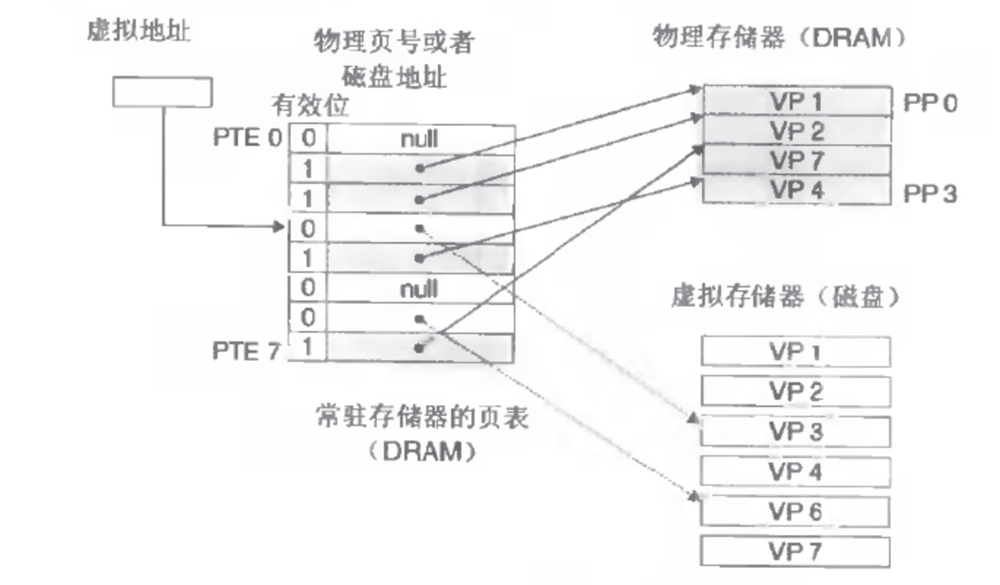

# Linux虛擬內存概述

為什麼需要虛擬內存？

程序是一系列代碼段，數據段的集合，而程序要運行必須是加載到內存裡的，但是物理內存就那麼大，如何能保證很多個程序都裝載進去呢？這裡就引進了虛擬內存的概念，虛擬內存基本思想就是，給每個程序都分配一個4G的虛擬的內存，但這部分內存佔用的不是物理內存，而是磁盤空間，這部分叫做虛擬存儲器，就是安裝Linux系統時候的SWAP空間。而對應的物理內存就是物理存儲器。
有沒有覺得整個過程像開了「空頭支票」一樣？程序要跑起來，操作系統許諾它給你4G的空間，但卻是不能用的，那真要執行的時候怎麼辦呢？操作系統會把磁盤上的程序代碼數據「移」到內存裡，把不需要的還會「移」出去到磁盤上，這樣看上去就好像可以跑很多進程了。

怎麼實現虛擬內存

首先是段機制，程序從程序員看被分成了很多段，鏈接的時候都會把段組織好，各個地址的設置（地址都是虛擬地址），然後加載器加載。接下來就是按需要從虛擬存儲器換入到物理存儲器了，怎麼換合適？一個段一個段換？這個一看就是很笨重的，段可能很大呢？還有段的換出呢？還有導致物理內存碎片很大。於是就引入了頁的概念，頁的實現就是說把虛擬內存和物理內存都分成一個一個頁，就理解成一個線性數組（裡面都是字節）進行切割，每個頁是很多字節的集合。頁不能太大，太大的話內部碎片會很大；也不能太小，太小導致維護成本很高。一般都是4K，結合上面的虛擬內存，所以虛擬存儲器和物理存儲器的進程的換入換出都是以頁為單位進行的，叫做換頁。
什麼時候換頁？

先看何時？首先是換入，CPU執行著發現所需要的頁不在內存裡，這時候就會產生缺頁中斷，對應的中斷程序會把相應的頁換入內存，然後繼續執行原來的指令，整個過程對於程序是完全透明的。再是換出，換出就是內存緊張了，不夠用了就換出。那把什麼頁面換出呢？一般都是採用LRU（Least Recently Used）算法。
怎麼實現換頁？

上面說了，要實現換入換出，起碼操作系統得知道物理存儲器和虛擬存儲器上一個進程對應的頁分配情況吧？還有如何保證A進程的物理頁和B進程的物理頁不重複呢？（先這樣說著，還有很多情況是可以重複的，比如共享庫，fork開始的時候等等）這就是說A的頁映射函數和B的映射函數不一樣了？這裡引進頁表的概念，頁表就相當於是上面的映射函數，進程的虛擬頁到物理頁的映射關係都存儲在這裡。頁表是存在內存裡的，每個進程都有自己的一份頁表，操作系統頁有自己的一份頁表。頁表每項都會有一個標誌位P，指明瞭這張頁是否存在內存裡。
虛擬內存

對於一張頁，每個頁表項可以是下面的，

P : 對應項	==>>  物理意義
0 : NULL  	==>>  請求的頁不在物理內存中，但是對應指針是NULL，代表還沒分配。
0 : 磁盤頁地址	==>>  請求的頁不在物理內存鐘，但是對應指針不是NULL，表示已經分配，比如malloc出來的地址，已經分配虛擬頁，但不是物理頁。
1 : 物理內存地址  ==>>  請求的頁在物理內存中，且這個頁表項還有對應頁在物理內存中的基地址。

總結下，Linux下的頁機制和虛擬內存配合的十分巧妙，虛擬內存也是一個抽象的實現。
