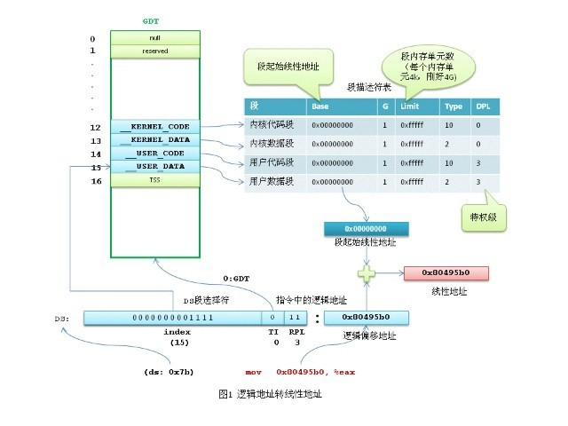

# 邏輯地址，線性地址及物理地址的區別


邏輯地址轉線性地址

機器語言指令中出現的內存地址，都是邏輯地址，需要轉換成線性地址，再經過 MMU (CPU中的內存管理單元)轉換成物理地址才能夠被訪問到。

我們寫個最簡單的 hello world 程序，用 gcc 編譯，再反彙編後會看到以下指令：
```
mov 0x80495b0, %eax
```

這裡的內存地址0x80495b0 就是一個邏輯地址，必須加上隱含的 DS 數據段的基地址，才能構成線性地址。也就是說0x80495b0是當前任務的DS數據段內的偏移。

在x86保護模式下，段的信息（段基線性地址、長度、權限等）即段描述符佔8個字節，段信息無法直接存放在段寄存器中（段寄存器只有2字節）。Intel 的設計是段描述符集中存放在GDT或LDT中，而段寄存器存放的是段描述符在GDT或LDT內的索引值(index)。

Linux中邏輯地址等於線性地址。為什麼這麼說呢？因為Linux所有的段（用戶代碼段、用戶數據段、內核代碼段、內核數據段）的線性地址都是從0×00000000開始，長度4G，這樣線性地址=邏輯地址+ 0×00000000，也就是說邏輯地址等於線性地址了。

這樣的情況下Linux只用到了GDT，不論是用戶任務還是內核任務，都沒有用到LDT。GDT的第12和13項段描述符是__KERNEL_CS和__KERNEL_DS，第14和15項段描述符是__USER_CS和__USER_DS。內核任務使用__KERNEL_CS和__KERNEL_DS，所有的用戶任務共用__USER_CS和__USER_DS，也就是說不需要給每個任務再單獨分配段描述符。內核段描述符和用戶段描述符雖然起始線性地址和長度都一樣，但DPL(描述符特權級)是不一樣的。__KERNEL_CS和__KERNEL_DS 的DPL值為0（最高特權），__USER_CS和__USER_DS的DPL值為3。

用gdb調試程序的時候，用info reg顯示當前寄存器的值：
```
cs 0×73 115

ss 0x7b 123

ds 0x7b 123

es 0x7b 123
```

可以看到ds值為0x7b,轉換成二進制為00000000 01111011，TI字段值為0,表示使用GDT，GDT索引值為01111，即十進制15，對應的就是GDT內的__USER_DS用戶數據段描述符。

從上面可以看到，Linux在x86的分段機制上運行，卻通過一個巧妙的方式繞開了分段。

Linux主要以分頁的方式實現內存管理。



二、線性地址轉物理地址

前面說了Linux中邏輯地址等於線性地址，那麼線性地址怎麼對應到物理地址呢？這個大家都知道，那就是通過分頁機制，具體的說，就是通過頁表查找來對應物理地址。

準確的說分頁是CPU提供的一種機制，Linux只是根據這種機制的規則，利用它實現了內存管理。

在保護模式下，控制寄存器CR0的最高位PG位控制著分頁管理機制是否生效，如果PG=1，分頁機制生效，需通過頁表查找才能把線性地址轉換物理地址。如果PG=0，則分頁機制無效，線性地址就直接做為物理地址。

分頁的基本原理是把內存劃分成大小固定的若干單元，每個單元稱為一頁（page），每頁包含4k字節的地址空間（為簡化分析，我們不考慮擴展分頁的情況）。這樣每一頁的起始地址都是4k字節對齊的。為了能轉換成物理地址，我們需要給CPU提供當前任務的線性地址轉物理地址的查找表，即頁表(page table)。注意，為了實現每個任務的平坦的虛擬內存，每個任務都有自己的頁目錄表和頁表。

為了節約頁表佔用的內存空間，x86將線性地址通過頁目錄表和頁表兩級查找轉換成物理地址。

32位的線性地址被分成3個部分：

最高10位Directory頁目錄表偏移量，中間10位Table是頁表偏移量，最低12位Offset是物理頁內的字節偏移量。

頁目錄表的大小為4k（剛好是一個頁的大小），包含1024項，每個項4字節（32位），項目裡存儲的內容就是頁表的物理地址。如果頁目錄表中的頁表尚未分配，則物理地址填0。

頁表的大小也是4k，同樣包含1024項，每個項4字節，內容為最終物理頁的物理內存起始地址。

每個活動的任務，必須要先分配給它一個頁目錄表，並把頁目錄表的物理地址存入cr3寄存器。頁表可以提前分配好，也可以在用到的時候再分配。

還是以mov 0x80495b0, %eax中的地址為例分析一下線性地址轉物理地址的過程。

前面說到Linux中邏輯地址等於線性地址，那麼我們要轉換的線性地址就是0x80495b0。轉換的過程是由CPU自動完成的，Linux所要做的就是準備好轉換所需的頁目錄表和頁表（假設已經準備好，給頁目錄表和頁表分配物理內存的過程很複雜，後面再分析）。

內核先將當前任務的頁目錄表的物理地址填入cr3寄存器。

線性地址0x80495b0 轉換成二進制後是0000 1000 0000 0100 1001 0101 1011 0000，最高10位0000 1000 00的十進制是32，CPU查看頁目錄表第32項，裡面存放的是頁表的物理地址。線性地址中間10位00 0100 1001

的十進制是73，頁表的第73項存儲的是最終物理頁的物理起始地址。物理頁基地址加上線性地址中最低12位的偏移量，CPU就找到了線性地址最終對應的物理內存單元。

我們知道Linux中用戶進程線性地址能尋址的範圍是0－3G，那麼是不是需要提前先把這3G虛擬內存的頁表都建立好呢？一般情況下，物理內存是遠遠小於3G的，加上同時有很多進程都在運行，根本無法給每個進程提前建立3G的線性地址頁表。Linux利用CPU的一個機制解決了這個問題。進程創建後我們可以給頁目錄表的表項值都填0，CPU在查找頁表時，如果表項的內容為0,則會引發一個缺頁異常，進程暫停執行，Linux內核這時候可以通過一系列複雜的算法給分配一個物理頁，並把物理頁的地址填入表項中，進程再恢復執行。當然進程在這個過程中是被矇蔽的，它自己的感覺還是正常訪問到了物理內存。


參考：
Intel 軟件架構手冊
